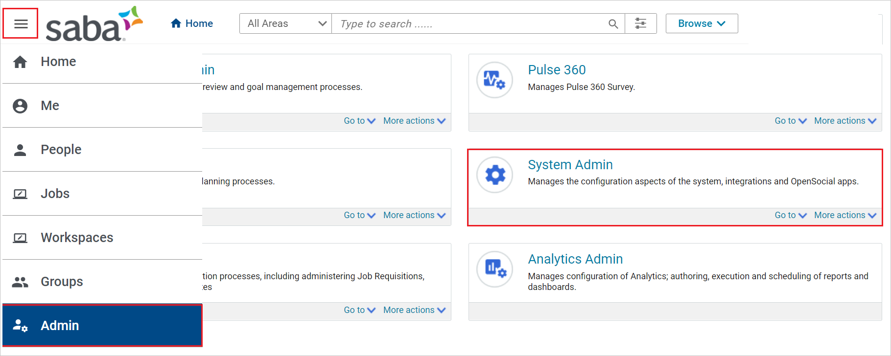
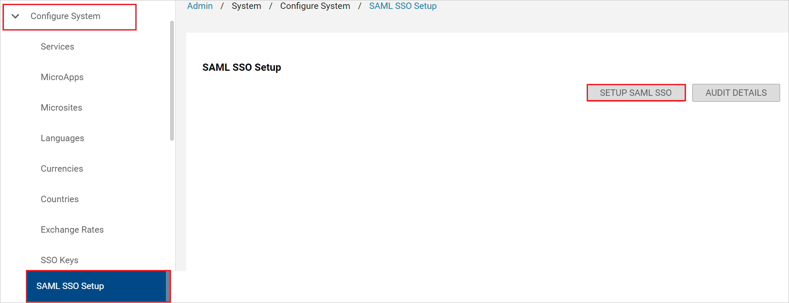
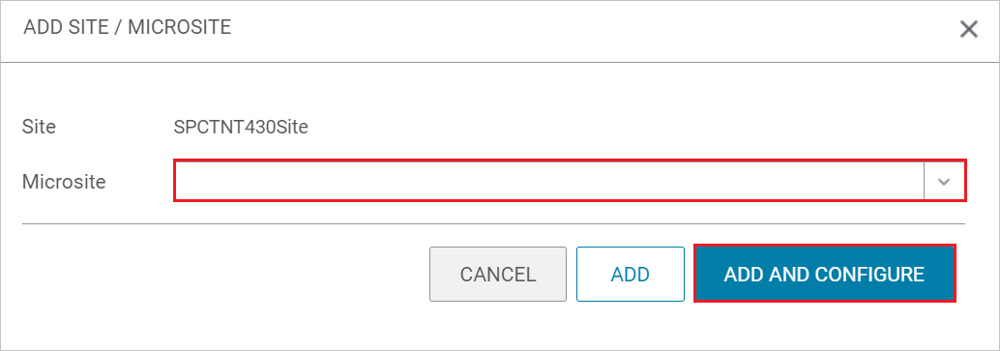
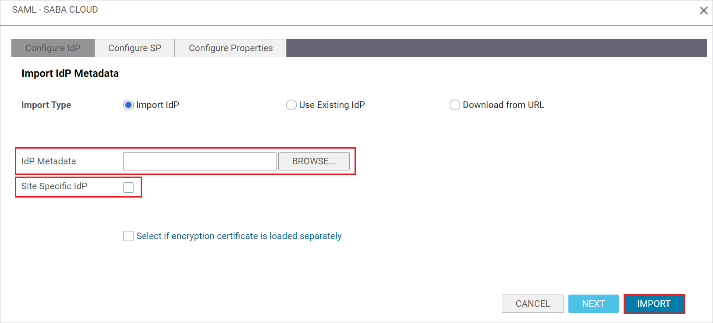
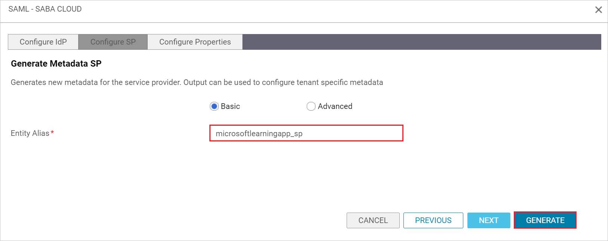
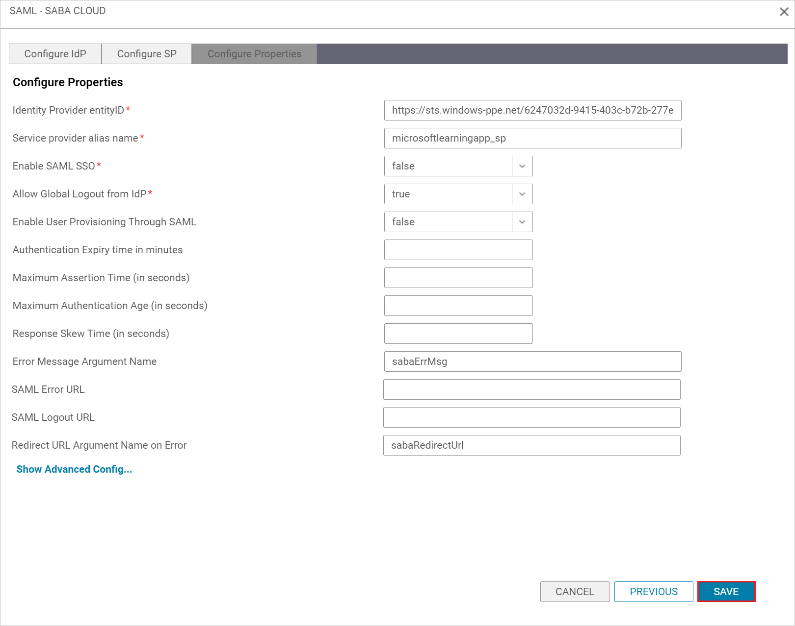
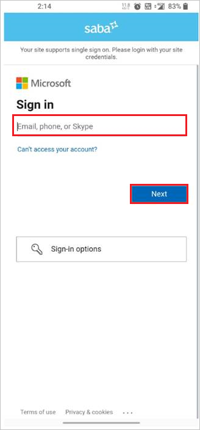
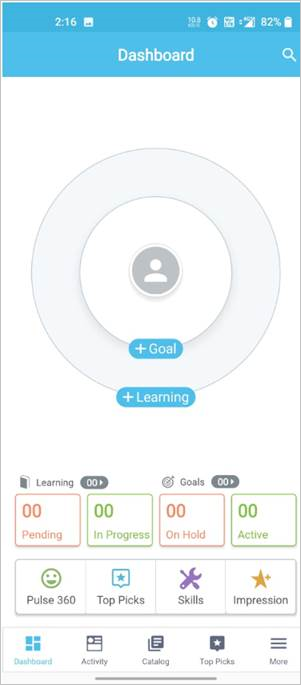

# Tutorial: Microsoft Entra single sign-on (SSO) integration with Saba Cloud

In this tutorial, you'll learn how to integrate Saba Cloud with Microsoft Entra ID. When you integrate Saba Cloud with Microsoft Entra ID, you can:

* Control in Microsoft Entra ID who has access to Saba Cloud.
* Enable your users to be automatically signed-in to Saba Cloud with their Microsoft Entra accounts.
* Manage your accounts in one central location.

## Prerequisites

To get started, you need the following items:

* A Microsoft Entra subscription. If you don't have a subscription, you can get a [free account](https://azure.microsoft.com/free/).
* Saba Cloud single sign-on (SSO) enabled subscription.

## Scenario description

In this tutorial, you configure and test Microsoft Entra SSO in a test environment.

* Saba Cloud supports **SP and IDP** initiated SSO.
* Saba Cloud supports **Just In Time** user provisioning.
* Saba Cloud Mobile application can now be configured with Microsoft Entra ID for enabling SSO. In this tutorial, you configure and test Microsoft Entra SSO in a test environment.

## Adding Saba Cloud from the gallery

To configure the integration of Saba Cloud into Microsoft Entra ID, you need to add Saba Cloud from the gallery to your list of managed SaaS apps.

1. Sign in to the [Microsoft Entra admin center](https://entra.microsoft.com) as at least a [Cloud Application Administrator](../roles/permissions-reference.md#cloud-application-administrator).
1. Browse to **Identity** > **Applications** > **Enterprise applications** > **New application**.
1. In the **Add from the gallery** section, type **Saba Cloud** in the search box.
1. Select **Saba Cloud** from results panel and then add the app. Wait a few seconds while the app is added to your tenant.

 Alternatively, you can also use the [Enterprise App Configuration Wizard](https://portal.office.com/AdminPortal/home?Q=Docs#/azureadappintegration). In this wizard, you can add an application to your tenant, add users/groups to the app, assign roles, as well as walk through the SSO configuration as well. [Learn more about Microsoft 365 wizards.](/microsoft-365/admin/misc/azure-ad-setup-guides)

## Configure and test Microsoft Entra SSO for Saba Cloud

Configure and test Microsoft Entra SSO with Saba Cloud using a test user called **B.Simon**. For SSO to work, you need to establish a link relationship between a Microsoft Entra user and the related user in Saba Cloud.

To configure and test Microsoft Entra SSO with Saba Cloud, perform the following steps:

1. **[Configure Microsoft Entra SSO](#configure-azure-ad-sso)** - to enable your users to use this feature.
    1. **[Create a Microsoft Entra test user](#create-an-azure-ad-test-user)** - to test Microsoft Entra single sign-on with B.Simon.
    1. **[Assign the Microsoft Entra test user](#assign-the-azure-ad-test-user)** - to enable B.Simon to use Microsoft Entra single sign-on.
1. **[Configure Saba Cloud SSO](#configure-saba-cloud-sso)** - to configure the single sign-on settings on application side.
    1. **[Create Saba Cloud test user](#create-saba-cloud-test-user)** - to have a counterpart of B.Simon in Saba Cloud that is linked to the Microsoft Entra representation of user.
1. **[Test SSO](#test-sso)** - to verify whether the configuration works.
1. **[Test SSO for Saba Cloud (mobile)](#test-sso-for-saba-cloud-mobile)** to verify whether the configuration works.

## Configure Microsoft Entra SSO

Follow these steps to enable Microsoft Entra SSO.

1. Sign in to the [Microsoft Entra admin center](https://entra.microsoft.com) as at least a [Cloud Application Administrator](../roles/permissions-reference.md#cloud-application-administrator).
1. Browse to **Identity** > **Applications** > **Enterprise applications** > **Saba Cloud** > **Single sign-on**.
1. On the **Select a single sign-on method** page, select **SAML**.
1. On the **Set up single sign-on with SAML** page, click the pencil icon for **Basic SAML Configuration** to edit the settings.

   

1. On the **Basic SAML Configuration** section, if you wish to configure the application in **IDP** initiated mode, enter the values for the following fields:

    a. In the **Identifier** text box, type a URL using the following pattern (you'll get this value in the Configure Saba Cloud SSO section on step 6, but it usually is in the format of `<CUSTOMER_NAME>_sp`):
    `<CUSTOMER_NAME>_sp`

    b. In the **Reply URL** text box, type a URL using the following pattern (ENTITY_ID refers to the previous step, usually `<CUSTOMER_NAME>_sp`):
    `https://<CUSTOMER_NAME>.sabacloud.com/Saba/saml/SSO/alias/<ENTITY_ID>`
    
    > [!NOTE]
    > If you specify the reply URL incorrectly, you might have to adjust it in the **App Registration** section of Microsoft Entra ID, not in the **Enterprise Application** section. Making changes to the **Basic SAML Configuration** section doesn't always update the Reply URL.

1. Click **Set additional URLs** and perform the following step if you wish to configure the application in **SP** initiated mode:

    a. In the **Sign-on URL** text box, type a URL using the following pattern:
       `https://<CUSTOMER_NAME>.sabacloud.com`

    b. In the **Relay State** text box, type a URL using the following pattern: `IDP_INIT---SAML_SSO_SITE=<SITE_ID> `or in case SAML is configured for a microsite, type a URL using the following pattern:
       `IDP_INIT---SAML_SSO_SITE=<SITE_ID>---SAML_SSO_MICRO_SITE=<MicroSiteId>`

    > [!NOTE]
    > These values are not real. Update these values with the actual Identifier, Reply URL, Sign-on URL and Relay State. Contact [Saba Cloud Client support team](mailto:support@saba.com) to get these values. You can also refer to the patterns shown in the **Basic SAML Configuration** section.
    > 
    > For more information about configuring the RelayState, see [IdP and SP initiated SSO for a microsite](https://help.sabacloud.com/sabacloud/help-system/topics/help-system-idp-and-sp-initiated-sso-for-a-microsite.html).

1. In the **User Attributes & Claims** section, adjust the Unique User Identifier to whatever you organization intends to use as the primary username for Saba users.

   This step is required only if you're attempting to convert from username/password to SSO. If this is a new Saba Cloud deployment that doesn't have existing users, you can skip this step.

1. On the **Set up single sign-on with SAML** page, in the **SAML Signing Certificate** section,  find **Federation Metadata XML** and select **Download** to download the certificate and save it on your computer.

	

1. On the **Set up Saba Cloud** section, copy the appropriate URL(s) based on your requirement.

	

### Create a Microsoft Entra test user

In this section, you'll create a test user called B.Simon.

1. Sign in to the [Microsoft Entra admin center](https://entra.microsoft.com) as at least a [User Administrator](../roles/permissions-reference.md#user-administrator).
1. Browse to **Identity** > **Users** > **All users**.
1. Select **New user** > **Create new user**, at the top of the screen.
1. In the **User** properties, follow these steps:
   1. In the **Display name** field, enter `B.Simon`.  
   1. In the **User principal name** field, enter the username@companydomain.extension. For example, `B.Simon@contoso.com`.
   1. Select the **Show password** check box, and then write down the value that's displayed in the **Password** box.
   1. Select **Review + create**.
1. Select **Create**.

### Assign the Microsoft Entra test user

In this section, you'll enable B.Simon to use single sign-on by granting access to Saba Cloud.

1. Sign in to the [Microsoft Entra admin center](https://entra.microsoft.com) as at least a [Cloud Application Administrator](../roles/permissions-reference.md#cloud-application-administrator).
1. Browse to **Identity** > **Applications** > **Enterprise applications** > **Saba Cloud**.
1. In the app's overview page, select **Users and groups**.
1. Select **Add user/group**, then select **Users and groups** in the **Add Assignment** dialog.
   1. In the **Users and groups** dialog, select **B.Simon** from the Users list, then click the **Select** button at the bottom of the screen.
   1. If you are expecting a role to be assigned to the users, you can select it from the **Select a role** dropdown. If no role has been set up for this app, you see "Default Access" role selected.
   1. In the **Add Assignment** dialog, click the **Assign** button.

## Configure Saba Cloud SSO

1. In a different web browser window, sign in to your Saba Cloud company site as an administrator

1. Click on **Menu** icon and click **Admin**, then select **System Admin** tab.

    

1. In **Configure System**, select **SAML SSO Setup** and click on **SETUP SAML SSO** button. 

    

1. In the pop up window, select **Microsite** from the dropdown and click **ADD AND CONFIGURE**.

    

1. In the **Configure IDP** section, click on **BROWSE** to upload the **Federation Metadata XML** file, which you have downloaded. Enable the **Site Specific IDP** checkbox and click **IMPORT**.

     

1. In the **Configure SP** section, copy the **Entity Alias** value and paste this value into the **Identifier (Entity ID)** text box in the **Basic SAML Configuration** section. Click **GENERATE**.

     

1. In the **Configure Properties** section, verify the populated fields and click **SAVE**. 

     
    
    You might need to set **Max Authentication Age (in seconds)** to **7776000** (90 days) to match the default max rolling age Microsoft Entra ID allows for a login. Failure to do so could result in the error `(109) Login failed. Please contact system administrator.`

### Create Saba Cloud test user

In this section, a user called Britta Simon is created in Saba Cloud. Saba Cloud supports just-in-time user provisioning, which is enabled by default. There is no action item for you in this section. If a user doesn't already exist in Saba Cloud, a new one is created after authentication.

> [!NOTE]
> For enabling SAML just in time user provisioning with Saba cloud, please refer to [this](https://help.sabacloud.com/sabacloud/help-system/topics/help-system-user-provisioning-with-saml.html) documentation.

## Test SSO 

In this section, you test your Microsoft Entra single sign-on configuration with following options. 

#### SP initiated:

* Click on **Test this application**, this will redirect to Saba Cloud Sign on URL where you can initiate the login flow.  

* Go to Saba Cloud Sign-on URL directly and initiate the login flow from there.

#### IDP initiated:

* Click on **Test this application**, and you should be automatically signed in to the Saba Cloud for which you set up the SSO 

You can also use Microsoft My Apps to test the application in any mode. When you click the Saba Cloud tile in the My Apps, if configured in SP mode you would be redirected to the application sign on page for initiating the login flow and if configured in IDP mode, you should be automatically signed in to the Saba Cloud for which you set up the SSO. For more information about the My Apps, see [Introduction to the My Apps](https://support.microsoft.com/account-billing/sign-in-and-start-apps-from-the-my-apps-portal-2f3b1bae-0e5a-4a86-a33e-876fbd2a4510).

> [!NOTE]
> If the sign-on URL is not populated in Microsoft Entra ID then the application is treated as IDP initiated mode and if the sign-on URL is populated then Microsoft Entra ID will always redirect the user to the Saba Cloud application for service provider initiated flow.

## Test SSO for Saba Cloud (mobile)

1. Open Saba Cloud Mobile application, give the **Site Name** in the textbox and click **Enter**.

    

1. Enter your **email address** and click **Next**.

    

1. Finally after successful sign in, the application page will be displayed.

    

## Next steps

Once you configure Saba Cloud you can enforce session control, which protects exfiltration and infiltration of your organization’s sensitive data in real time. Session control extends from Conditional Access. [Learn how to enforce session control with Microsoft Defender for Cloud Apps](/cloud-app-security/proxy-deployment-any-app).
