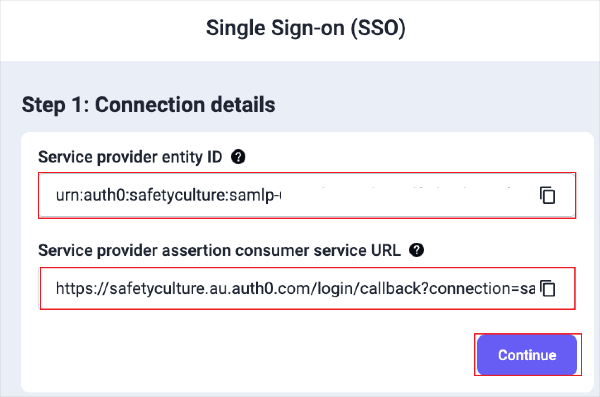
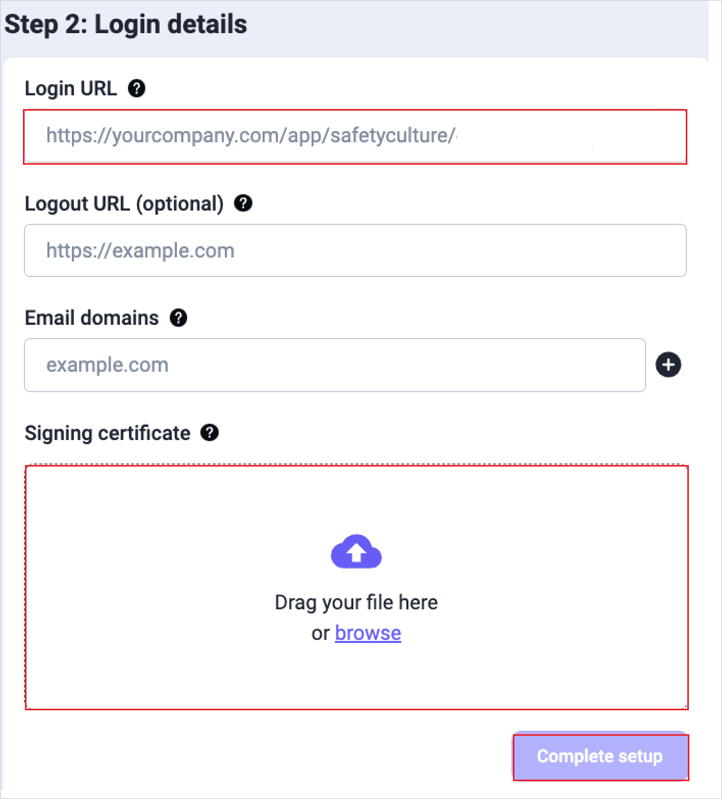
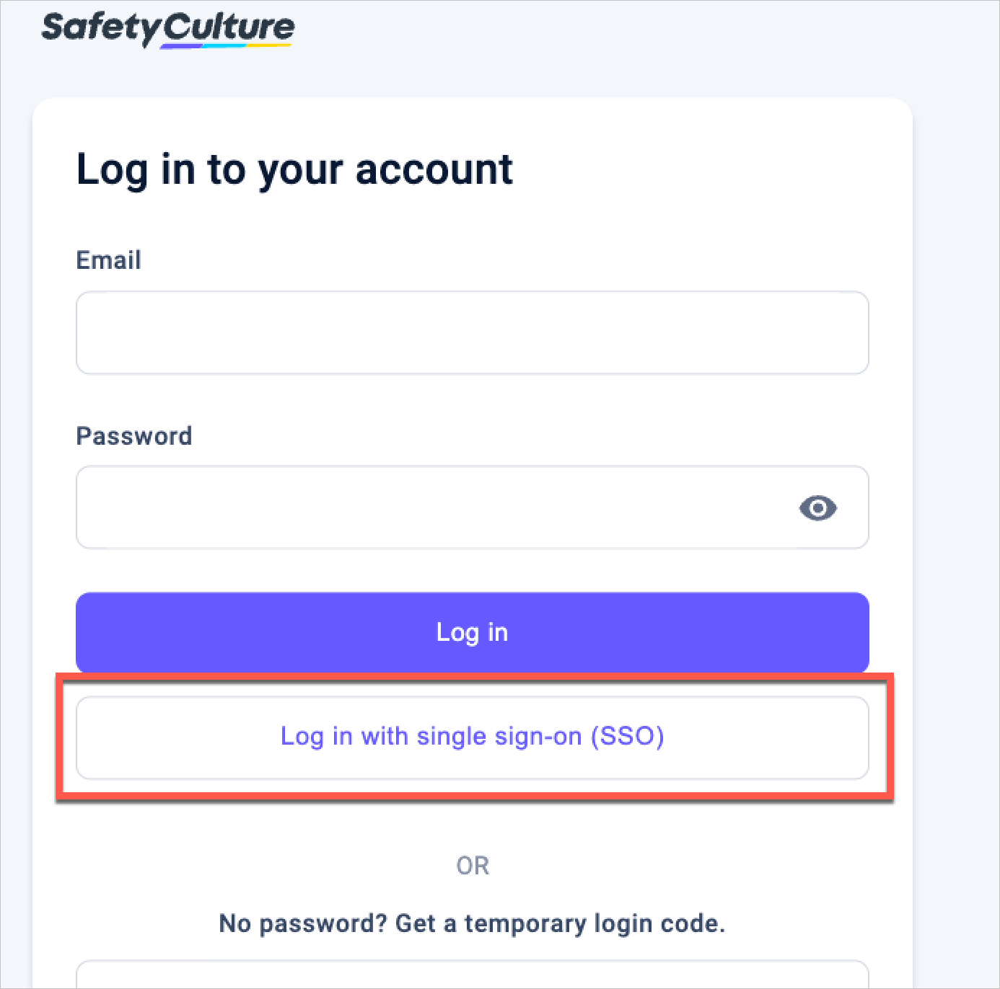

# Tutorial: Azure AD SSO integration with SafetyCulture

In this tutorial, you'll learn how to integrate SafetyCulture (formerly iAuditor) with Azure Active Directory (Azure AD). When you integrate SafetyCulture with Azure AD, you can:

* Control in Azure AD who has access to SafetyCulture.
* Enable your users to be automatically logged in to SafetyCulture with their Azure AD accounts.
* Manage your accounts in one central location - the Azure portal.

## Prerequisites

To get started, you need the following items:

* An Azure AD subscription. If you don't have a subscription, you can get a [free account](https://azure.microsoft.com/free/).
* [SafetyCulture paid plan](https://safetyculture.com/pricing/) - required for single sign-on.
* Along with Cloud Application Administrator, Application Administrator can also add or manage applications in Azure AD.
For more information, see [Azure built-in roles](../roles/permissions-reference.md).

> [!NOTE]
> This integration is also available to use from Azure AD US Government Cloud environment. You can find this application in the Azure AD US Government Cloud Application Gallery and configure it in the same way as you do from public cloud.

## Scenario description

In this tutorial, you configure and test Azure AD SSO in a test environment.

* SafetyCulture supports **SP and IDP** initiated SSO.

## Add SafetyCulture from the gallery

To configure the integration of SafetyCulture into Azure AD, you need to add SafetyCulture from the gallery to your list of managed SaaS apps.

1. Sign in to the Azure portal using either a work or school account, or a personal Microsoft account.
1. On the left navigation pane, select the **Azure Active Directory** service.
1. Navigate to **Enterprise Applications** and then select **All Applications**.
1. To add new application, select **New application**.
1. In the **Add from the gallery** section, type **SafetyCulture** in the search box.
1. Select **SafetyCulture** from results panel and then add the app. Wait a few seconds while the app is added to your tenant.

Alternatively, you can also use the [Enterprise App Configuration Wizard](https://portal.office.com/AdminPortal/home?Q=Docs#/azureadappintegration). In this wizard, you can add an application to your tenant, add users/groups to the app, assign roles and walk through the SSO configuration as well. [Learn more about Microsoft 365 wizards.](/microsoft-365/admin/misc/azure-ad-setup-guides)

## Configure and test Azure AD SSO for SafetyCulture

Configure and test Azure AD SSO with SafetyCulture using a test user called **B.Simon**. For SSO to work, you need to establish a link relationship between an Azure AD user and the related user in SafetyCulture.

To configure and test Azure AD SSO with SafetyCulture, perform the following steps:

1. **[Configure Azure AD SSO](#configure-azure-ad-sso)** - to enable your users to use this feature.
    * **[Create an Azure AD test user](#create-an-azure-ad-test-user)** - to test Azure AD single sign-on with B.Simon.
    * **[Assign the Azure AD test user](#assign-the-azure-ad-test-user)** - to enable B.Simon to use Azure AD single sign-on.]
    * **[Create SafetyCulture test user](#create-safetyculture-test-user)** - to have a counterpart of B.Simon in SafetyCulture that is linked to the Azure AD representation of user.
1. **[Test SSO](#test-sso)** - to verify whether the configuration works.

## Configure Azure AD SSO

Follow these steps to enable Azure AD SSO in the Azure portal.

1. In the Azure portal, on the **SafetyCulture** application integration page, find the **Manage** section and select **single sign-on**.
1. On the **Select a single sign-on method** page, select **SAML**.
1. On the **Set up single sign-on with SAML** page, click the pencil icon for **Basic SAML Configuration** to edit the settings.

   

1. Go to the SafetyCulture web app:

    1. Log in to the [SafetyCulture](https://app.safetyculture.com) web app.
    1. Click your organization name on the lower-left corner of the page and select **Organization settings**.
    1. Select **Security** on the top of the page.
    1. Click **Set up** in the **Single sign-on (SSO)** box.
    1. Select **SAML**, **_not Azure AD_**, as the connection option.
    1. Perform the following steps on the below page.

        

        a. Copy **Service provider entity ID** value, paste this value into the **Identifier** text box in the **Basic SAML Configuration** section in the Azure portal.

        b. Copy **Service provider assertion consumer service URL** value, paste this value into the **Reply URL** text box in the **Basic SAML Configuration** section in the Azure portal.

1. Go back to the Azure portal. On the **Basic SAML Configuration** section, if you wish to configure the application in **IdP** initiated mode, perform the following steps:

    a. In the **Identifier** text box, paste the **Service provider entity ID** from SafetyCulture.
    
    b. In the **Reply URL** text box, paste the **Service provider assertion consumer service URL** from SafetyCulture.

1. If you wish to configure the application in **SP** initiated mode, in the **Sign-on URL(optional)** text box, enter the **Service provider assertion consumer service URL** from SafetyCulture.

1. The SafetyCulture application expects the SAML assertions in a specific format, which requires you to add custom attribute mappings to your SAML token attributes configuration. The following screenshot shows the list of default attributes.

    

1. In addition to above, the SafetyCulture application expects few more attributes to be passed back in SAML response which are shown below. These attributes are also pre-populated but you can review them as per your requirements.

    | Name | Source Attribute |
    | -------| --------- |
    | firstname | user.givenname |
    | lastname | user.surname |
    | email | user.mail |

1. On the **Set up single sign-on with SAML** page, in the **SAML Signing Certificate** section, find **Certificate (PEM)** and select **Download** to download the certificate and save it for the following steps.

    

1. Go back to the SafetyCulture web app and click **Continue** and perform the below steps in the **Step 2: Login details** page.

    

    a. In the **Login URL** textbox, paste the **Login URL** value which you have copied from the Azure portal.

    b. Upload the **Certificate (PEM)** you downloaded from the Azure portal into the **Signing certificate** field.

    c. Click **Complete setup**.

### Create an Azure AD test user

In this section, you'll create a test user in the Azure portal called B.Simon.

1. From the left pane in the Azure portal, select **Azure Active Directory**, select **Users**, and then select **All users**.
1. Select **New user** at the top of the screen.
1. In the **User** properties, follow these steps:
   1. In the **Name** field, enter `B.Simon`.  
   1. In the **User name** field, enter the username@companydomain.extension. For example, `B.Simon@contoso.com`.
   1. Select the **Show password** check box, and then write down the value that's displayed in the **Password** box.
   1. Click **Create**.

### Assign the Azure AD test user

In this section, you'll enable B.Simon to use Azure single sign-on by granting access to SafetyCulture.

1. In the Azure portal, select **Enterprise Applications**, and then select **All applications**.
1. In the applications list, select **SafetyCulture**.
1. In the app's overview page, find the **Manage** section and select **Users and groups**.
1. Select **Add user**, then select **Users and groups** in the **Add Assignment** dialog.
1. In the **Users and groups** dialog, select **B.Simon** from the Users list, then click the **Select** button at the bottom of the screen.
1. If you are expecting a role to be assigned to the users, you can select it from the **Select a role** dropdown. If no role has been set up for this app, you see "Default Access" role selected.
1. In the **Add Assignment** dialog, click the **Assign** button.

### Create SafetyCulture test user

In this section, you create a user called Britta Simon in SafetyCulture. Work with your SafetyCulture organization's admin to add the test user. The user must be created and activated before you use single sign-on.

## Test SSO

In this section, you test your Azure AD single sign-on configuration with following options.

#### SP-initiated

1. Click on **Test this application** in the Azure portal. This will redirect you to the SafetyCulture Sign-on URL where you can initiate the login flow.
1. On the SafetyCulture login page, initiate the SSO login by entering the test user's email address.
1. Click **Log in with single sign-on (SSO)**.

    

#### IDP-initiated

* Click on **Test this application** in Azure portal and you should be automatically logged in to SafetyCulture for which you set up the SSO.

You can also use Microsoft My Apps to test the application in any mode. When you click the SafetyCulture tile in My Apps, if configured in SP mode you would be redirected to the application sign-on page for initiating the login flow and if configured in IdP mode, you should be automatically logged in to SafetyCulture for which you set up the SSO. For more information about the My Apps, see [Introduction to the My Apps](../user-help/my-apps-portal-end-user-access.md).

## Next steps

Once you've configured SafetyCulture, you can enforce session control, which protects exfiltration and infiltration of your organization’s sensitive data in real-time. Session control extends from Conditional Access. [Learn how to enforce session control with Microsoft Defender for Cloud Apps](/cloud-app-security/proxy-deployment-aad).