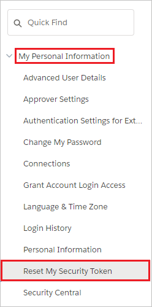

# Tutorial: Configure Salesforce for automatic user provisioning

The objective of this tutorial is to show the steps required to perform in Salesforce and Azure AD to automatically provision and de-provision user accounts from Azure AD to Salesforce.

> [!Note]
> Microsoft uses v28 of the Salesforce API for automatic provisioning. Microsoft is aware of the upcoming deprecation of v21 through v30 and is working with Salesforce to migrate to a supported version prior to the deprecation date. No customer action is required.
> 
## Prerequisites

The scenario outlined in this tutorial assumes that you already have the following items:

* An Azure Active directory tenant
* A Salesforce.com tenant

> [!Note]
> Roles should not be manually edited in Azure Active Directory when doing role imports.

> [!IMPORTANT]
> If you are using a Salesforce.com trial account, then you will be unable to configure automated user provisioning. Trial accounts do not have the necessary API access enabled until they are purchased. You can get around this limitation by using a free [developer account](https://developer.salesforce.com/signup) to complete this tutorial.

If you are using a Salesforce Sandbox environment, please see the [Salesforce Sandbox integration tutorial](./salesforce-sandbox-tutorial.md).

## Assigning users to Salesforce

Azure Active Directory uses a concept called "assignments" to determine which users should receive access to selected apps. In the context of automatic user account provisioning, only the users and groups that have been "assigned" to an application in Azure AD is synchronized.

Before configuring and enabling the provisioning service, you need to decide which users or groups in Azure AD need access to your Salesforce app. After you've made this decision, you can assign these users to your Salesforce app by following the instructions in [Assign a user or group to an enterprise app](../manage-apps/assign-user-or-group-access-portal.md)

### Important tips for assigning users to Salesforce

* It is recommended that a single Azure AD user is assigned to Salesforce to test the provisioning configuration. Additional users and/or groups may be assigned later.

* When assigning a user to Salesforce, you must select a valid user role. The "Default Access" role does not work for provisioning

    > [!NOTE]
    > This app imports profiles from Salesforce as part of the provisioning process, which the customer may want to select when assigning users in Azure AD. Please note that the profiles that get imported from Salesforce appear as Roles in Azure AD.

## Enable automated user provisioning

This section guides you through connecting your Azure AD to [Salesforce's user account provisioning API - v40](https://developer.salesforce.com/docs/atlas.en-us.208.0.api.meta/api/implementation_considerations.htm), and configuring the provisioning service to create, update, and disable assigned user accounts in Salesforce based on user and group assignment in Azure AD.

> [!Tip]
> You may also choose to enabled SAML-based Single Sign-On for Salesforce, following the instructions provided in the [Azure portal](https://portal.azure.com). Single sign-on can be configured independently of automatic provisioning, though these two features compliment each other.

### Configure automatic user account provisioning

The objective of this section is to outline how to enable user provisioning of Active Directory user accounts to Salesforce.

1. In the [Azure portal](https://portal.azure.com), browse to the **Azure Active Directory > Enterprise Apps > All applications** section.

2. If you have already configured Salesforce for single sign-on, search for your instance of Salesforce using the search field. Otherwise, select **Add** and search for **Salesforce** in the application gallery. Select Salesforce from the search results, and add it to your list of applications.

3. Select your instance of Salesforce, then select the **Provisioning** tab.

4. Set the **Provisioning Mode** to **Automatic**.

    

5. Under the **Admin Credentials** section, provide the following configuration settings:

    1. In the **Admin Username** textbox, type a Salesforce account name that has the **System Administrator** profile in Salesforce.com assigned.

    1. In the **Admin Password** textbox, type the password for this account.

6. To get your Salesforce security token, open a new tab and sign into the same Salesforce admin account. On the top right corner of the page, click your name, and then click **Settings**.

    

7. On the left navigation pane, click **My Personal Information** to expand the related section, and then click **Reset My Security Token**.
  
    

8. On the **Reset Security Token** page, click **Reset Security Token** button.

    

9. Check the email inbox associated with this admin account. Look for an email from Salesforce.com that contains the new security token.

10. Copy the token, go to your Azure AD window, and paste it into the **Secret Token** field.

11. The **Tenant URL** should be entered if the instance of Salesforce is on the Salesforce Government Cloud. Otherwise, it is optional. Enter the tenant URL using the format of "https://\<your-instance\>.my.salesforce.com," replacing \<your-instance\> with the name of your Salesforce instance.

12. In the Azure portal, click **Test Connection** to ensure Azure AD can connect to your Salesforce app.

13. In the **Notification Email** field, enter the email address of a person or group who should receive provisioning error notifications, and check the checkbox below.

14. Click **Save.**  

15. Under the Mappings section, select **Synchronize Azure Active Directory Users to Salesforce.**

16. In the **Attribute Mappings** section, review the user attributes that are synchronized from Azure AD to Salesforce. Note that the attributes selected as **Matching** properties are used to match the user accounts in Salesforce for update operations. Select the Save button to commit any changes.

17. To enable the Azure AD provisioning service for Salesforce, change the **Provisioning Status** to **On** in the Settings section

18. Click **Save.**

> [!NOTE]
> Once the users are provisioned in the Salesforce application, administrator need to configure the language specific settings for them. Please see [this](https://help.salesforce.com/articleView?id=setting_your_language.htm&type=5) article for more details on language configuration.

This starts the initial synchronization of any users and/or groups assigned to Salesforce in the Users and Groups section. Note that the initial sync takes longer to perform than subsequent syncs, which occur approximately every 40 minutes as long as the service is running. You can use the **Synchronization Details** section to monitor progress and follow links to provisioning activity logs, which describe all actions performed by the provisioning service on your Salesforce app.

For more information on how to read the Azure AD provisioning logs, see [Reporting on automatic user account provisioning](../app-provisioning/check-status-user-account-provisioning.md).

## Common issues
* If you are having issues authorizing access to Salesforce ensure the following:
    * The credentials used have admin access to Salesforce.
    * The version of Salesforce that you are using supports Web Access (e.g. Developer, Enterprise, Sandbox, and Unlimited editions of Salesforce.)
    * Web API access is enabled for the user.
* The Azure AD provisioning service supports provisioning language, locale, and timeZone for a user. These attributes are in the default attribute mappings but do not have a default source attribute. Ensure that you select the default source attribute and that the source attribute is in the format expected by SalesForce. For example, localeSidKey for english(UnitedStates) is en_US. Review the guidance provided [here](https://help.salesforce.com/articleView?id=faq_getstart_what_languages_does.htm&type=5) to determine the proper localeSidKey format. The languageLocaleKey formats can be found [here](https://help.salesforce.com/articleView?id=faq_getstart_what_languages_does.htm&type=5). In addition to ensuring that the format is correct, you may need to ensure that the language is enabled for your users as described [here](https://help.salesforce.com/articleView?id=faq_getstart_what_languages_does.htm&type=5). 
* **SalesforceLicenseLimitExceeded:** The user could not be created in the target application because there are no available licenses for this user. Either procure additional licenses for the target application, or review your user assignments and attribute mapping configuration to ensure that the correct users are assigned with the correct attributes.
* **SalesforceDuplicateUserName:** The user cannot be provisioned because it has a Salesforce.com 'Username' that is duplicated in another Salesforce.com tenant.  In Salesforce.com, values for the 'Username' attribute must be unique across all Salesforce.com tenants.  By default, a user’s userPrincipalName in Azure Active Directory becomes their 'Username' in Salesforce.com.   You have two options.  One option is to find and rename the user with the duplicate 'Username' in the other Salesforce.com tenant, if you administer that other tenant as well.  The other option is to remove access from the Azure Active Directory user to the Salesforce.com tenant with which your directory is integrated. We will retry this operation on the next synchronization attempt. 
* **SalesforceRequiredFieldMissing:** Salesforce requires certain attributes to be present on the user to successfully create or update the user. This user is missing one of the required attributes. Ensure that attributes such as email and alias are populated on all users that you would like to be provisioned into Salesforce. You can scope users that don't have these attributes out using [attribute based scoping filters](../app-provisioning/define-conditional-rules-for-provisioning-user-accounts.md). 
* The default attribute mapping for provisioning to Salesforce includes the SingleAppRoleAssignments expression to map appRoleAssignments in Azure AD to ProfileName in Salesforce. Ensure that the users do not have multiple app role assignments in Azure AD as the attribute mapping only supports provisioning one role. 
* Salesforce requires that email updates be approved manually before being changed. As a result, you may see multiple entries in the provisioning logs to update the user's email (until the email change has been approved).

## Additional resources

* [Managing user account provisioning for Enterprise Apps](tutorial-list.md)
* [What is application access and single sign-on with Azure Active Directory?](../manage-apps/what-is-single-sign-on.md)
* [Configure Single Sign-on](./salesforce-tutorial.md)
