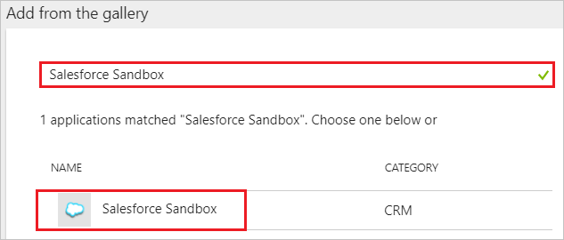
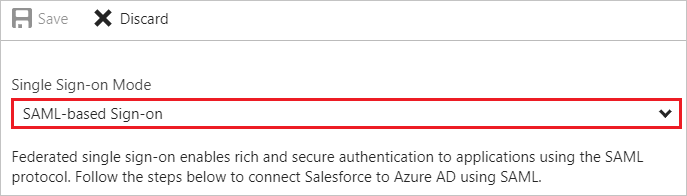
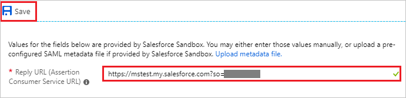
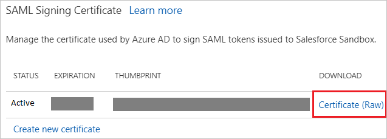
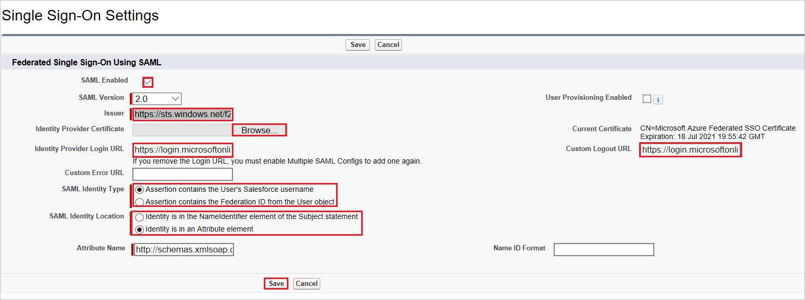
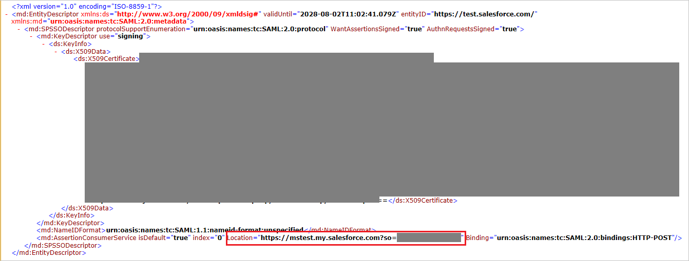
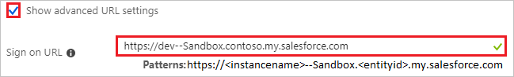
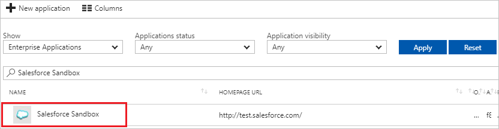

# Tutorial: Azure Active Directory integration with Salesforce Sandbox

In this tutorial, you learn how to integrate Salesforce Sandbox with Azure Active Directory (Azure AD).

Sandboxes give you the ability to create multiple copies of your organization in separate environments for a variety of purposes, such as development, testing, and training, without compromising the data and applications in your Salesforce production organization.
For more details, see [Sandbox Overview](https://help.salesforce.com/articleView?id=create_test_instance.htm&language=en_us&type=5).

Integrating Salesforce Sandbox with Azure AD provides you with the following benefits:

- You can control in Azure AD who has access to Salesforce Sandbox.
- You can enable your users to automatically get signed-on to Salesforce Sandbox (Single Sign-On) with their Azure AD accounts.
- You can manage your accounts in one central location - the Azure portal.

If you want to know more details about SaaS app integration with Azure AD, see [what is application access and single sign-on with Azure Active Directory](../manage-apps/what-is-single-sign-on.md).

## Prerequisites

To configure Azure AD integration with Salesforce Sandbox, you need the following items:

- An Azure AD subscription
- A Salesforce Sandbox single sign-on enabled subscription

> [!NOTE]
> To test the steps in this tutorial, we do not recommend using a production environment.

To test the steps in this tutorial, you should follow these recommendations:

- Do not use your production environment, unless it is necessary.
- If you don't have an Azure AD trial environment, you can [get a one-month trial](https://azure.microsoft.com/pricing/free-trial/).

## Scenario description

In this tutorial, you test Azure AD single sign-on in a test environment. 
The scenario outlined in this tutorial consists of two main building blocks:

1. Adding Salesforce Sandbox from the gallery
2. Configuring and testing Azure AD single sign-on

## Adding Salesforce Sandbox from the gallery

To configure the integration of Salesforce Sandbox into Azure AD, you need to add Salesforce Sandbox from the gallery to your list of managed SaaS apps.

**To add Salesforce Sandbox from the gallery, perform the following steps:**

1. In the **[Azure portal](https://portal.azure.com)**, on the left navigation panel, click **Azure Active Directory** icon. 

	![The Azure Active Directory button][1]

2. Navigate to **Enterprise applications**. Then go to **All applications**.

	![The Enterprise applications blade][2]

3. To add new application, click **New application** button on the top of dialog.

	![The New application button][3]

4. In the search box, type **Salesforce Sandbox**, select **Salesforce Sandbox** from result panel then click **Add** button to add the application.

	

## Configure and test Azure AD single sign-on

In this section, you configure and test Azure AD single sign-on with Salesforce Sandbox based on a test user called "Britta Simon".

For single sign-on to work, Azure AD needs to know what the counterpart user in Salesforce Sandbox is to a user in Azure AD. In other words, a link relationship between an Azure AD user and the related user in Salesforce Sandbox needs to be established.

In Salesforce Sandbox, assign the value of the **user name** in Azure AD as the value of the **Username** to establish the link relationship.

To configure and test Azure AD single sign-on with Salesforce Sandbox, you need to complete the following building blocks:

1. **[Configure Azure AD Single Sign-On](#configure-azure-ad-single-sign-on)** - to enable your users to use this feature.
2. **[Create an Azure AD test user](#create-an-azure-ad-test-user)** - to test Azure AD single sign-on with Britta Simon.
3. **[Create a Salesforce Sandbox test user](#create-a-salesforce-sandbox-test-user)** - to have a counterpart of Britta Simon in Salesforce Sandbox that is linked to the Azure AD representation of user.
4. **[Assign the Azure AD test user](#assign-the-azure-ad-test-user)** - to enable Britta Simon to use Azure AD single sign-on.
5. **[Test single sign-on](#test-single-sign-on)** - to verify whether the configuration works.

### Configure Azure AD single sign-on

In this section, you enable Azure AD single sign-on in the Azure portal and configure single sign-on in your Salesforce Sandbox application.

**To configure Azure AD single sign-on with Salesforce Sandbox, perform the following steps:**

1. In the Azure portal, on the **Salesforce Sandbox** application integration page, click **Single sign-on**.

	![Configure single sign-on link][4]

2. On the **Single sign-on** dialog, select **Mode** as	**SAML-based Sign-on** to enable single sign-on.

	

3. On the **Salesforce Sandbox Domain and URLs** section, perform the following steps if you wish to configure the application in **IDP** initiated mode:

   

   In the **Reply URL** textbox, type your organization specific **Reply URL**.

   > [!NOTE]
   > Update Reply URL value with the actual Reply URL which is explained later in this tutorial.

4. On the **SAML Signing Certificate** section, click **Certificate(RAW)** and then save the certificate file on your computer.

	

5. Click **Save** button.

	

6. On the **Salesforce Sandbox Configuration** section, click **Configure Salesforce Sandbox** to open **Configure sign-on** window. Copy the **SAML Entity ID and SAML Single Sign-On Service URL** from the **Quick Reference section.**

	

7. Open a new tab in your browser and log in to your Salesforce Sandbox administrator account.

8. Click on the **Setup** under **settings icon** on the top right corner of the page.

    

9. Scroll down to the **SETTINGS** in the left navigation pane, click **Identity** to expand the related section. Then click **Single Sign-On Settings**.

    

10. On the **Single Sign-On Settings** page, click the **Edit** button.

    

11. Select **SAML Enabled**, and then click **Save**.

	

12. To configure your SAML single sign-on settings, click **New**.

	

13. On the **Single Sign-On Settings** section, perform the following steps:

    

    a. Select **SAML Enabled** checkbox.

    b. In the **Issuer** field, paste the value of **SAML Entity ID**, which you have copied from Azure portal.

    c. To upload the **Identity Provider Certificate**, click **Browse** to browse and select the certificate file, which you have downloaded from Azure portal.

    d. In **Identity Provider Login URL** textbox, paste the value of **Single Sign-On Service URL**, which you have copied from Azure portal.

    e. As **SAML Identity Type**, choose one of the following options:

      * Select **Assertion contains the User's Salesforce username**, if user's Salesforce Username is being passed in SAML assertion

      * Select **Assertion contains the Federation ID from the User object**, if Federation ID from the User object is being passed in SAML assertion
  
	f. As **SAML Identity Location**, select **Identity is an Attribute element**.

    g. SFDC does not support SAML logout.  As a workaround, paste `https://login.microsoftonline.com/common/wsfederation?wa=wsignout1.0` into the **Custom Logout URL** textbox.

    h. Click **Save**.

14. On the **Single Sign-On Settings** page, click the **Download Metadata** button.

    

15. Open the downloaded Metadata in a different browser window and copy the **Location** value and paste it into the **Reply URL** textbox on the **Salesforce Sandbox Domain and URLs** section in the Azure portal.  

    

16. If you wish to configure the application in **SP** initiated mode, following are the prerequisites for that:

    a. You should have a verified domain.

    b. You need to configure and enable your domain on Salesforce Sandbox, steps for this are explained later in this tutorial.

    c. In the Azure portal, on the **Salesforce Sandbox Domain and URLs** section, check **Show advanced URL settings** and perform the following step:
  
    

    In the **Sign-on URL** textbox, type the value using the following pattern: `https://<instancename>--Sandbox.<entityid>.my.salesforce.com`

    > [!NOTE]
    > This value should be copied from the Salesforce Sandbox portal once you have enabled the domain.

17. On the **SAML Signing Certificate** section, click **Certificate(RAW)** and then save the certificate file on your computer.

	

18. Click **Save** button.

	

19. On the **Salesforce Sandbox Configuration** section, click **Configure Salesforce Sandbox** to open **Configure sign-on** window. Copy the **SAML Entity ID and SAML Single Sign-On Service URL** from the **Quick Reference section.**

	

20. Open a new tab in your browser and log in to your Salesforce Sandbox administrator account.

21. Click on the **Setup** under **settings icon** on the top right corner of the page.

    

22. Scroll down to the **SETTINGS** in the left navigation pane, click **Identity** to expand the related section. Then click **Single Sign-On Settings**.

    

23. On the **Single Sign-On Settings** page, click the **Edit** button.

    

24. Select **SAML Enabled**, and then click **Save**.

	

25. To configure your SAML single sign-on settings, click **New**.

	

26. If you are adding a second instance, you need to enable a domain as we mentioned above (SP initiated case). On the SAML Single Sign-On Settings section, perform the following steps:

    

    a. In the **Name** textbox, type the name of the configuration (for example: *SPSSOWAAD_Test*).

    b. In the **Issuer** field, paste the value of **SAML Entity ID**, which you have copied from Azure portal.

    c. In the **Entity ID** textbox, use `https://test.salesforce.com` value for first instance and from second instance of the application you can use the tenant specific Identifier value.

    d. To upload the **Identity Provider Certificate**, click **Choose File** to browse and select the certificate file, which you have downloaded from Azure portal.

    e. As **SAML Identity Type**, choose one of the following options:

      * Select **Assertion contains the User's Salesforce username**, if user's Salesforce Username is being passed in SAML assertion

      * Select **Assertion contains the Federation ID from the User object**, if Federation ID from the User object is being passed in SAML assertion

      * Select **Assertion contains the Use ID from the User object**, if User ID from the User object is being passed in SAML assertion

	f. As **SAML Identity Location**, select **Identity is in the NameIdentifier element of the Subject statement**.

	g. As **Service Provider Initiated Request Binding**, select **HTTP POST**.

    h. In **Identity Provider Login URL** textbox, paste the value of **Single Sign-On Service URL**, which you have copied from Azure portal.

    i. SFDC does not support SAML logout.  As a workaround, paste `https://login.microsoftonline.com/common/wsfederation?wa=wsignout1.0` it into the **Custom Logout URL** textbox.

    j. Click **Save**.

27. To enable your domain on Salesforce Sandbox, perform the following steps:

    > [!NOTE]
    > Before enabling the domain you need to create the same on Salesforce Sandbox. For more information, see [Defining Your Domain Name](https://help.salesforce.com/HTViewHelpDoc?id=domain_name_define.htm&language=en_US). Once the domain is created, please make sure that it's configured correctly.

    * On the left navigation pane in Salesforce Sandbox, click **Company Settings** to expand the related section, and then click **My Domain**.

         

    * In the **Authentication Configuration** section, click **Edit**.

        

    * In the **Authentication Configuration** section, as **Authentication Service**, select the name of the SAML Single Sign-On Setting which you have set during SSO configuration in Salesforce Sandbox and click **Save**.

        

### Create an Azure AD test user

The objective of this section is to create a test user in the Azure portal called Britta Simon.

   ![Create an Azure AD test user][100]

**To create a test user in Azure AD, perform the following steps:**

1. In the Azure portal, in the left pane, click the **Azure Active Directory** button.

    

2. To display the list of users, go to **Users and groups**, and then click **All users**.

    

3. To open the **User** dialog box, click **Add** at the top of the **All Users** dialog box.

    

4. In the **User** dialog box, perform the following steps:

    

    a. In the **Name** box, type **BrittaSimon**.

    b. In the **User name** box, type the email address of user Britta Simon.

    c. Select the **Show Password** check box, and then write down the value that's displayed in the **Password** box.

    d. Click **Create**.

### Create a Salesforce Sandbox test user

In this section, a user called Britta Simon is created in Salesforce Sandbox. Salesforce Sandbox supports just-in-time provisioning, which is enabled by default. There is no action item for you in this section. If a user doesn't already exist in Salesforce Sandbox, a new one is created when you attempt to access Salesforce Sandbox. Salesforce Sandbox also supports automatic user provisioning, you can find more details [here](salesforce-sandbox-provisioning-tutorial.md) on how to configure automatic user provisioning.

### Assign the Azure AD test user

In this section, you enable Britta Simon to use Azure single sign-on by granting access to Salesforce Sandbox.

![Assign the user role][200]

**To assign Britta Simon to Salesforce Sandbox, perform the following steps:**

1. In the Azure portal, open the applications view, and then navigate to the directory view and go to **Enterprise applications** then click **All applications**.

	![Assign User][201] 

2. In the applications list, select **Salesforce Sandbox**.

	  

3. In the menu on the left, click **Users and groups**.

	![The "Users and groups" link][202]

4. Click **Add** button. Then select **Users and groups** on **Add Assignment** dialog.

	![The Add Assignment pane][203]

5. On **Users and groups** dialog, select **Britta Simon** in the Users list.

6. Click **Select** button on **Users and groups** dialog.

7. Click **Assign** button on **Add Assignment** dialog.
	
### Test single sign-on

In this section, you test your Azure AD single sign-on configuration using the Access Panel.

When you click the Salesforce Sandbox tile in the Access Panel, you should get automatically signed-on to your Salesforce Sandbox application.
For more information about the Access Panel, see [Introduction to the Access Panel](../user-help/active-directory-saas-access-panel-introduction.md).

## Additional resources

* [List of Tutorials on How to Integrate SaaS Apps with Azure Active Directory](tutorial-list.md)
* [What is application access and single sign-on with Azure Active Directory?](../manage-apps/what-is-single-sign-on.md)
* [Configure User Provisioning](salesforce-sandbox-provisioning-tutorial.md)

<!--Image references-->

[1]: ./media/salesforce-sandbox-tutorial/tutorial_general_01.png
[2]: ./media/salesforce-sandbox-tutorial/tutorial_general_02.png
[3]: ./media/salesforce-sandbox-tutorial/tutorial_general_03.png
[4]: ./media/salesforce-sandbox-tutorial/tutorial_general_04.png

[100]: ./media/salesforce-sandbox-tutorial/tutorial_general_100.png

[200]: ./media/salesforce-sandbox-tutorial/tutorial_general_200.png
[201]: ./media/salesforce-sandbox-tutorial/tutorial_general_201.png
[202]: ./media/salesforce-sandbox-tutorial/tutorial_general_202.png
[203]: ./media/salesforce-sandbox-tutorial/tutorial_general_203.png