# Tutorial: Azure Active Directory integration with Salesforce Sandbox

In this tutorial, you learn how to integrate Salesforce Sandbox with Azure Active Directory (Azure AD).

Sandboxes give you the ability to create multiple copies of your organization in separate environments for a variety of purposes, such as development, testing, and training, without compromising the data and applications in your Salesforce production organization.
For more details, see [Sandbox Overview](https://help.salesforce.com/articleView?id=create_test_instance.htm&language=en_us&type=5).

Integrating Salesforce Sandbox with Azure AD provides you with the following benefits:

* You can control in Azure AD who has access to Salesforce Sandbox.
* You can enable your users to be automatically signed-in to Salesforce Sandbox (Single Sign-On) with their Azure AD accounts.
* You can manage your accounts in one central location - the Azure portal.

If you want to know more details about SaaS app integration with Azure AD, see [What is application access and single sign-on with Azure Active Directory](https://docs.microsoft.com/azure/active-directory/active-directory-appssoaccess-whatis).
If you don't have an Azure subscription, [create a free account](https://azure.microsoft.com/free/) before you begin.

## Prerequisites

To configure Azure AD integration with Salesforce Sandbox, you need the following items:

* An Azure AD subscription. If you don't have an Azure AD environment, you can get a [free account](https://azure.microsoft.com/free/)
* Salesforce Sandbox single sign-on enabled subscription

## Scenario description

In this tutorial, you configure and test Azure AD single sign-on in a test environment.

* Salesforce Sandbox supports **SP and IDP** initiated SSO
* Salesforce Sandbox supports **Just In Time** user provisioning
* Salesforce Sandbox supports [**Automated** user provisioning](salesforce-sandbox-provisioning-tutorial.md)

## Adding Salesforce Sandbox from the gallery

To configure the integration of Salesforce Sandbox into Azure AD, you need to add Salesforce Sandbox from the gallery to your list of managed SaaS apps.

**To add Salesforce Sandbox from the gallery, perform the following steps:**

1. In the **[Azure portal](https://portal.azure.com)**, on the left navigation panel, click **Azure Active Directory** icon.

	

2. Navigate to **Enterprise Applications** and then select the **All Applications** option.

	

3. To add new application, click **New application** button on the top of dialog.

	

4. In the search box, type **Salesforce Sandbox**, select **Salesforce Sandbox** from result panel then click **Add** button to add the application.

	

## Configure and test Azure AD single sign-on

In this section, you configure and test Azure AD single sign-on with Salesforce Sandbox based on a test user called **Britta Simon**.

For single sign-on to work, Azure AD needs to know what the counterpart user in Salesforce Sandbox is to a user in Azure AD. In other words, a link relationship between an Azure AD user and the related user in Salesforce Sandbox needs to be established.

To configure and test Azure AD single sign-on with Salesforce Sandbox, you need to complete the following building blocks:

1. **[Configure Azure AD Single Sign-On](#configure-azure-ad-single-sign-on)** - to enable your users to use this feature.
2. **[Configure Salesforce Sandbox Single Sign-On](#configure-salesforce-sandbox-single-sign-on)** - to configure the Single Sign-On settings on application side.
3. **[Create an Azure AD test user](#create-an-azure-ad-test-user)** - to test Azure AD single sign-on with Britta Simon.
4. **[Assign the Azure AD test user](#assign-the-azure-ad-test-user)** - to enable Britta Simon to use Azure AD single sign-on.
5. **[Create Salesforce Sandbox test user](#create-salesforce-sandbox-test-user)** - to have a counterpart of Britta Simon in Salesforce Sandbox that is linked to the Azure AD representation of user.
6. **[Test single sign-on](#test-single-sign-on)** - to verify whether the configuration works.

### Configure Azure AD single sign-on

In this section, you enable Azure AD single sign-on in the Azure portal.

To configure Azure AD single sign-on with Salesforce Sandbox, perform the following steps:

1. In the [Azure portal](https://portal.azure.com/), on the **Salesforce Sandbox** application integration page, select **Single sign-on**.

    

2. On the **Select a Single sign-on method** dialog, select **SAML/WS-Fed** mode to enable single sign-on.

    

3. On the **Set up Single Sign-On with SAML** page, click **Edit** icon to open **Basic SAML Configuration** dialog.

	

4. On the **Basic SAML Configuration** section, if you have **Service Provider metadata file** and wish to configure in **IDP** initiated mode perform the following steps:

	a. Click **Upload metadata file**.

    

	b. Click on **folder logo** to select the metadata file and click **Upload**.

	

	> [!NOTE]
    > You will get the service provider metadata file from the Salesforce Sandbox admin portal which is explained later in the tutorial.

	c. After the metadata file is successfully uploaded, the **Reply URL** value will get auto populated in **Reply URL** textbox.

	

	> [!Note]
	> If the **Reply URL** value do not get auto polulated, then fill in the value manually according to your requirement.

5. On the **Set up Single Sign-On with SAML** page, in the **SAML Signing Certificate** section, click **Download** to download the **Metadata XML** from the given options as per your requirement and save it on your computer.

	

6. On the **Set up Salesforce Sandbox** section, copy the appropriate URL(s) as per your requirement.

	

	a. Login URL

	b. Azure AD Identifier

	c. Logout URL

### Configure Salesforce Sandbox Single Sign-On

1. Open a new tab in your browser and sign in to your Salesforce Sandbox administrator account.

2. Click on the **Setup** under **settings icon** on the top right corner of the page.

    

3. Scroll down to the **SETTINGS** in the left navigation pane, click **Identity** to expand the related section. Then click **Single Sign-On Settings**.

    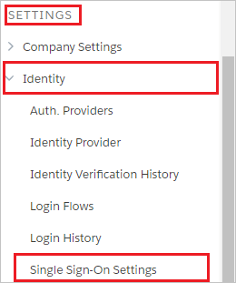

4. On the **Single Sign-On Settings** page, click the **Edit** button.

    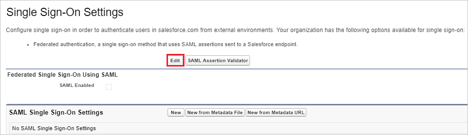

5. Select **SAML Enabled**, and then click **Save**.

	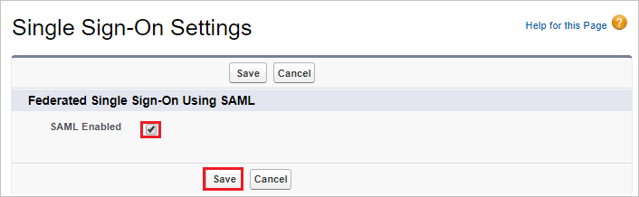

6. To configure your SAML single sign-on settings, click **New from Metadata File**.

	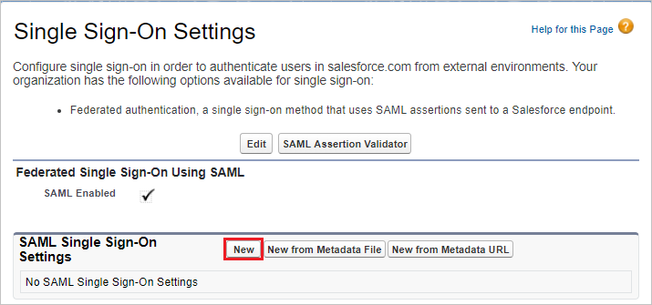

7. Click **Choose File** to upload the metadata XML file which you have downloaded from the Azure portal and click **Create**.

    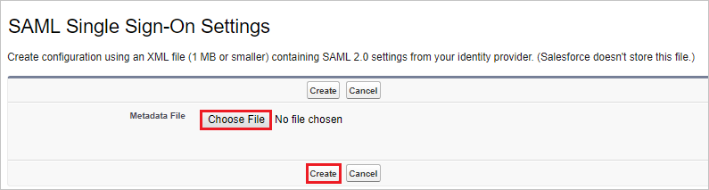

8. On the **SAML Single Sign-On Settings** page, fields populate automatically and click save.

    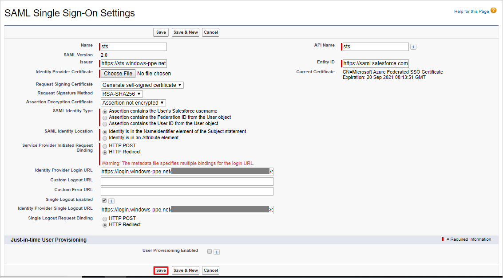

9. On the **Single Sign-On Settings** page, click the **Download Metadata** button to download the service provider metadata file. Use this file in the **Basic SAML Configuration** section in the Azure portal for configuring the necessary URLs as explained above.

    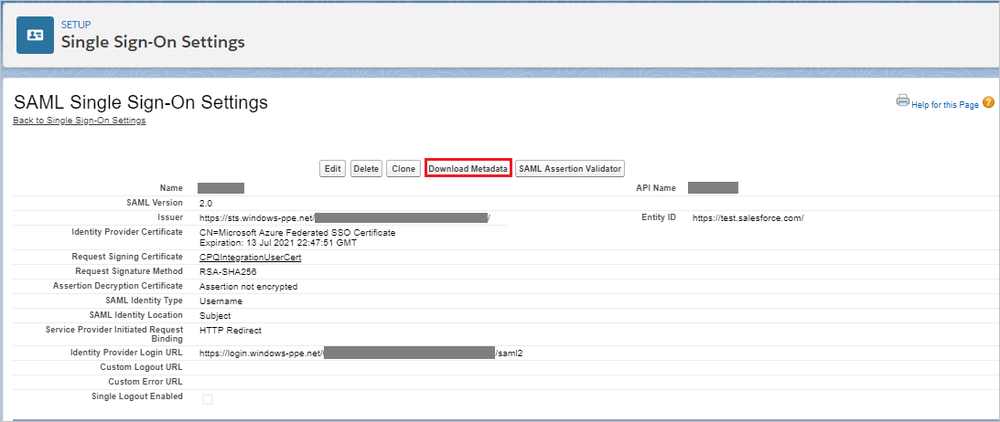

10. If you wish to configure the application in **SP** initiated mode, following are the prerequisites for that:

    a. You should have a verified domain.

    b. You need to configure and enable your domain on Salesforce Sandbox, steps for this are explained later in this tutorial.

    c. In the Azure portal, on the **Basic SAML Configuration** section, click **Set additional URLs** and perform the following step:
  
    

    In the **Sign-on URL** textbox, type the value using the following pattern: `https://<instancename>--Sandbox.<entityid>.my.salesforce.com`

    > [!NOTE]
    > This value should be copied from the Salesforce Sandbox portal once you have enabled the domain.

11. On the **SAML Signing Certificate** section, click **Federation Metadata XML** and then save the xml file on your computer.

	

12. Open a new tab in your browser and sign in to your Salesforce Sandbox administrator account.

13. Click on the **Setup** under **settings icon** on the top right corner of the page.

    

14. Scroll down to the **SETTINGS** in the left navigation pane, click **Identity** to expand the related section. Then click **Single Sign-On Settings**.

    

15. On the **Single Sign-On Settings** page, click the **Edit** button.

    

16. Select **SAML Enabled**, and then click **Save**.

	

17. To configure your SAML single sign-on settings, click **New from Metadata File**.

	

18. Click **Choose File** to upload the metadata XML file and click **Create**.

    

19. On the **SAML Single Sign-On Settings** page, fields populate automatically, type the name of the configuration (for example: *SPSSOWAAD_Test*), in the **Name** textbox and click save.

    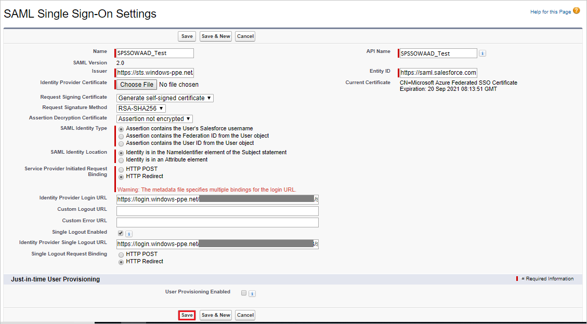

20. To enable your domain on Salesforce Sandbox, perform the following steps:

    > [!NOTE]
    > Before enabling the domain you need to create the same on Salesforce Sandbox. For more information, see [Defining Your Domain Name](https://help.salesforce.com/HTViewHelpDoc?id=domain_name_define.htm&language=en_US). Once the domain is created, please make sure that it's configured correctly.

21. On the left navigation pane in Salesforce Sandbox, click **Company Settings** to expand the related section, and then click **My Domain**.

    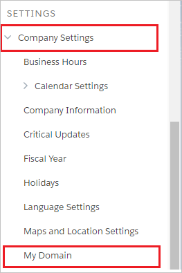

22. In the **Authentication Configuration** section, click **Edit**.

    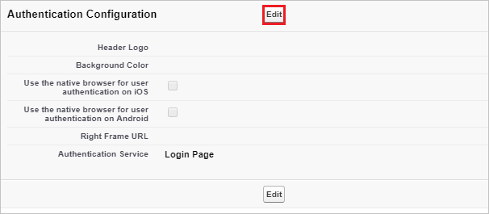

23. In the **Authentication Configuration** section, as **Authentication Service**, select the name of the SAML Single Sign-On Setting which you have set during SSO configuration in Salesforce Sandbox and click **Save**.

    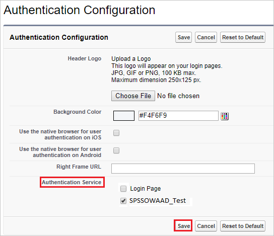

### Create an Azure AD test user

The objective of this section is to create a test user in the Azure portal called Britta Simon.

1. In the Azure portal, in the left pane, select **Azure Active Directory**, select **Users**, and then select **All users**.

    

2. Select **New user** at the top of the screen.

    

3. In the User properties, perform the following steps.

    

    a. In the **Name** field enter **BrittaSimon**.
  
    b. In the **User name** field type `brittasimon@yourcompanydomain.extension`. For example, BrittaSimon@contoso.com.

    c. Select **Show password** check box, and then write down the value that's displayed in the Password box.

    d. Click **Create**.

### Assign the Azure AD test user

In this section, you enable Britta Simon to use Azure single sign-on by granting access to Salesforce Sandbox.

1. In the Azure portal, select **Enterprise Applications**, select **All applications**, then select **Salesforce Sandbox**.

	

2. In the applications list, select **Salesforce Sandbox**.

	

3. In the menu on the left, select **Users and groups**.

    

4. Click the **Add user** button, then select **Users and groups** in the **Add Assignment** dialog.

    

5. In the **Users and groups** dialog select **Britta Simon** in the Users list, then click the **Select** button at the bottom of the screen.

6. If you are expecting any role value in the SAML assertion then in the **Select Role** dialog select the appropriate role for the user from the list, then click the **Select** button at the bottom of the screen.

7. In the **Add Assignment** dialog click the **Assign** button.

### Create Salesforce Sandbox test user

In this section, a user called Britta Simon is created in Salesforce Sandbox. Salesforce Sandbox supports just-in-time provisioning, which is enabled by default. There is no action item for you in this section. If a user doesn't already exist in Salesforce Sandbox, a new one is created when you attempt to access Salesforce Sandbox. Salesforce Sandbox also supports automatic user provisioning, you can find more details [here](salesforce-sandbox-provisioning-tutorial.md) on how to configure automatic user provisioning.

### Test single sign-on

In this section, you test your Azure AD single sign-on configuration using the Access Panel.

When you click the Salesforce Sandbox tile in the Access Panel, you should be automatically signed in to the Salesforce Sandbox for which you set up SSO. For more information about the Access Panel, see [Introduction to the Access Panel](https://docs.microsoft.com/azure/active-directory/active-directory-saas-access-panel-introduction).

## Additional Resources

- [List of Tutorials on How to Integrate SaaS Apps with Azure Active Directory](https://docs.microsoft.com/azure/active-directory/active-directory-saas-tutorial-list)

- [What is application access and single sign-on with Azure Active Directory?](https://docs.microsoft.com/azure/active-directory/active-directory-appssoaccess-whatis)

- [What is Conditional Access in Azure Active Directory?](https://docs.microsoft.com/azure/active-directory/conditional-access/overview)

* [Configure User Provisioning](salesforce-sandbox-provisioning-tutorial.md)
