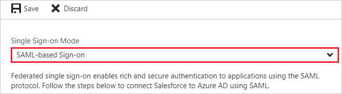
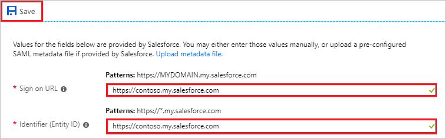
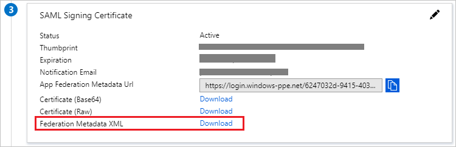
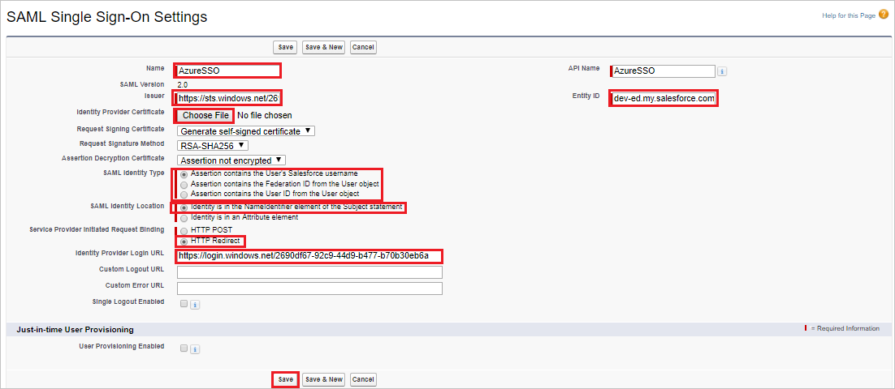
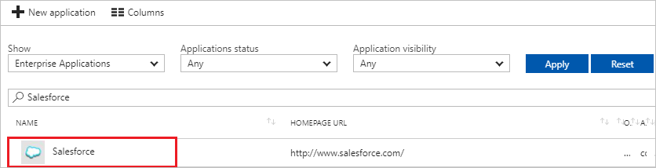

---
title: 'Tutorial: Azure Active Directory integration with Salesforce | Microsoft Docs'
description: Learn how to configure single sign-on between Azure Active Directory and Salesforce.
services: active-directory
documentationCenter: na
author: jeevansd
manager: mtillman
ms.reviewer: joflore

ms.assetid: d2d7d420-dc91-41b8-a6b3-59579e043b35
ms.service: active-directory
ms.component: saas-app-tutorial
ms.workload: identity
ms.tgt_pltfrm: na
ms.devlang: na
ms.topic: article
ms.date: 07/19/2018
ms.author: jeedes

---
# Tutorial: Azure Active Directory integration with Salesforce

In this tutorial, you learn how to integrate Salesforce with Azure Active Directory (Azure AD).

Integrating Salesforce with Azure AD provides you with the following benefits:

- You can control in Azure AD who has access to Salesforce.
- You can enable your users to automatically get signed-on to Salesforce (Single Sign-On) with their Azure AD accounts.
- You can manage your accounts in one central location - the Azure portal.

If you want to know more details about SaaS app integration with Azure AD, see [what is application access and single sign-on with Azure Active Directory](../manage-apps/what-is-single-sign-on.md).

## Prerequisites

To configure Azure AD integration with Salesforce, you need the following items:

- An Azure AD subscription
- A Salesforce single sign-on enabled subscription

> [!NOTE]
> To test the steps in this tutorial, we do not recommend using a production environment.

To test the steps in this tutorial, you should follow these recommendations:

- Do not use your production environment, unless it is necessary.
- If you don't have an Azure AD trial environment, you can [get a one-month trial](https://azure.microsoft.com/pricing/free-trial/).

## Scenario description
In this tutorial, you test Azure AD single sign-on in a test environment. 
The scenario outlined in this tutorial consists of two main building blocks:

1. Adding Salesforce from the gallery
1. Configuring and testing Azure AD single sign-on

## Adding Salesforce from the gallery
To configure the integration of Salesforce into Azure AD, you need to add Salesforce from the gallery to your list of managed SaaS apps.

**To add Salesforce from the gallery, perform the following steps:**

1. In the **[Azure portal](https://portal.azure.com)**, on the left navigation panel, click **Azure Active Directory** icon.

	![The Azure Active Directory button][1]

1. Navigate to **Enterprise applications**. Then go to **All applications**.

	![The Enterprise applications blade][2]

1. To add new application, click **New application** button on the top of dialog.

	![The New application button][3]

1. In the search box, type **Salesforce**, select **Salesforce** from result panel then click **Add** button to add the application.

	

## Configure and test Azure AD single sign-on

In this section, you configure and test Azure AD single sign-on with Salesforce based on a test user called "Britta Simon".

For single sign-on to work, Azure AD needs to know what the counterpart user in Salesforce is to a user in Azure AD. In other words, a link relationship between an Azure AD user and the related user in Salesforce needs to be established.

In Salesforce, assign the value of the **user name** in Azure AD as the value of the **Username** to establish the link relationship.

To configure and test Azure AD single sign-on with Salesforce, you need to complete the following building blocks:

1. **[Configure Azure AD Single Sign-On](#configure-azure-ad-single-sign-on)** - to enable your users to use this feature.
1. **[Create an Azure AD test user](#create-an-azure-ad-test-user)** - to test Azure AD single sign-on with Britta Simon.
1. **[Create a Salesforce test user](#create-a-salesforce-test-user)** - to have a counterpart of Britta Simon in Salesforce that is linked to the Azure AD representation of user.
1. **[Assign the Azure AD test user](#assign-the-azure-ad-test-user)** - to enable Britta Simon to use Azure AD single sign-on.
1. **[Test single sign-on](#test-single-sign-on)** - to verify whether the configuration works.

### Configure Azure AD single sign-on

In this section, you enable Azure AD single sign-on in the Azure portal and configure single sign-on in your Salesforce application.

**To configure Azure AD single sign-on with Salesforce, perform the following steps:**

1. In the Azure portal, on the **Salesforce** application integration page, click **Single sign-on**.

	![Configure single sign-on link][4]

1. On the **Single sign-on** dialog, select **Mode** as **SAML-based Sign-on** to enable single sign-on.

	

1. On the **Salesforce Domain and URLs** section, perform the following steps:

    

    a. In the **Sign-on URL** textbox, type the value using the following pattern:

    Enterprise account: `https://<subdomain>.my.salesforce.com`

    Developer account: `https://<subdomain>-dev-ed.my.salesforce.com`

    b. In the **Identifier** textbox, type the value using the following pattern:

    Enterprise account: `https://<subdomain>.my.salesforce.com`

    Developer account: `https://<subdomain>-dev-ed.my.salesforce.com`

    > [!NOTE]
	> These values are not real. Update these values with the actual Sign-on URL and Identifier. Contact [Salesforce Client support team](https://help.salesforce.com/support) to get these values.

1. On the **SAML Signing Certificate** section, click **Certificate** and then save the certificate file on your computer.

	 

1. Click **Save** button.

	

1. On the **Salesforce Configuration** section, click **Configure Salesforce** to open **Configure sign-on** window. Copy the **SAML Entity ID and SAML Single Sign-On Service URL** from the **Quick Reference section.**

	 

1. Open a new tab in your browser and log in to your Salesforce administrator account.

1. Click on the **Setup** under **settings icon** on the top right corner of the page.

	

1. Scroll down to the **SETTINGS** in the navigation pane, click **Identity** to expand the related section. Then click **Single Sign-On Settings**.

    

1. On the **Single Sign-On Settings** page, click the **Edit** button.

    
    
    > [!NOTE]
    > If you are unable to enable Single Sign-On settings for your Salesforce account, you may need to contact [Salesforce Client support team](https://help.salesforce.com/support). 

1. Select **SAML Enabled**, and then click **Save**.

      
1. To configure your SAML single sign-on settings, click **New**.

    

1. On the **SAML Single Sign-On Setting Edit** page, make the following configurations:

    

    a. For the **Name** field, type in a friendly name for this configuration. Providing a value for **Name** automatically populate the **API Name** textbox.

    b. In the **Issuer** field, paste the value of **SAML Entity ID**, which you have copied from Azure portal.

    c. In the **Entity Id textbox**, type your Salesforce domain name using the following pattern:

      * Enterprise account: `https://<subdomain>.my.salesforce.com`
      * Developer account: `https://<subdomain>-dev-ed.my.salesforce.com`

    d. To upload the **Identity Provider Certificate**, click **Choose File** to browse and select the certificate file, which you have downloaded from Azure portal.

    e. As **SAML Identity Type**, choose one of the following options:

      * Select **Assertion contains the User's Salesforce username**, if user's Salesforce Username is being passed in SAML assertion

      * Select **Assertion contains the Federation ID from the User object**, if Federation ID from the User object is being passed in SAML assertion

      * Select **Assertion contains the Use ID from the User object**, if User ID from the User object is being passed in SAML assertion

    f. For **SAML Identity Location**, select **Identity is in the NameIdentifier element of the Subject statement**.

    g. For **Service Provider Initiated Request Binding**, select **HTTP Redirect**.

    h. In **Identity Provider Login URL** textbox, paste the value of **Single Sign-On Service URL**, which you have copied from Azure portal

    i. Finally, click **Save** to apply your SAML single sign-on settings.

1. On the left navigation pane in Salesforce, click **Company Settings** to expand the related section, and then click **My Domain**.

    

1. Scroll down to the **Authentication Configuration** section, and click the **Edit** button.

    

1. In the **Authentication Configuration** section, Check the **AzureSSO** as **Authentication Servie** of your SAML SSO configuration, and then click **Save**.

    

    > [!NOTE]
    > If more than one authentication service is selected, users are prompted to select which authentication service they like to sign in with while initiating single sign-on to your Salesforce environment. If you don’t want it to happen, then you should **leave all other authentication services unchecked**.

### Create an Azure AD test user

The objective of this section is to create a test user in the Azure portal called Britta Simon.

   ![Create an Azure AD test user][100]

**To create a test user in Azure AD, perform the following steps:**

1. In the Azure portal, in the left pane, click the **Azure Active Directory** button.

    

1. To display the list of users, go to **Users and groups**, and then click **All users**.

    

1. To open the **User** dialog box, click **Add** at the top of the **All Users** dialog box.

    

1. In the **User** dialog box, perform the following steps:

    

    a. In the **Name** box, type **BrittaSimon**.

    b. In the **User name** box, type the email address of user Britta Simon.

    c. Select the **Show Password** check box, and then write down the value that's displayed in the **Password** box.

    d. Click **Create**.

### Create a Salesforce test user

In this section, a user called Britta Simon is created in Salesforce. Salesforce supports just-in-time provisioning, which is enabled by default. There is no action item for you in this section. If a user doesn't already exist in Salesforce, a new one is created when you attempt to access Salesforce. Salesforce also supports automatic user provisioning, you can find more details [here](salesforce-provisioning-tutorial.md) on how to configure automatic user provisioning.

### Assign the Azure AD test user

In this section, you enable Britta Simon to use Azure single sign-on by granting access to Salesforce.

![Assign the user role][200]

**To assign Britta Simon to Salesforce, perform the following steps:**

1. In the Azure portal, open the applications view, and then navigate to the directory view and go to **Enterprise applications** then click **All applications**.

	![Assign User][201]

1. In the applications list, select **Salesforce**.

	

1. In the menu on the left, click **Users and groups**.

	![The "Users and groups" link][202]

1. Click **Add** button. Then select **Users and groups** on **Add Assignment** dialog.

	![The Add Assignment pane][203]

1. On **Users and groups** dialog, select **Britta Simon** in the Users list.

1. Click **Select** button on **Users and groups** dialog.

1. Click **Assign** button on **Add Assignment** dialog.

### Test single sign-on

In this section, you test your Azure AD single sign-on configuration using the Access Panel.

When you click the Salesforce tile in the Access Panel, you should get automatically signed-on to your Salesforce application.
For more information about the Access Panel, see [Introduction to the Access Panel](../user-help/active-directory-saas-access-panel-introduction.md). 

## Additional resources

* [List of Tutorials on How to Integrate SaaS Apps with Azure Active Directory](tutorial-list.md)
* [What is application access and single sign-on with Azure Active Directory?](../manage-apps/what-is-single-sign-on.md)
* [Configure User Provisioning](salesforce-provisioning-tutorial.md)

<!--Image references-->

[1]: ./media/salesforce-tutorial/tutorial_general_01.png
[2]: ./media/salesforce-tutorial/tutorial_general_02.png
[3]: ./media/salesforce-tutorial/tutorial_general_03.png
[4]: ./media/salesforce-tutorial/tutorial_general_04.png

[100]: ./media/salesforce-tutorial/tutorial_general_100.png

[200]: ./media/salesforce-tutorial/tutorial_general_200.png
[201]: ./media/salesforce-tutorial/tutorial_general_201.png
[202]: ./media/salesforce-tutorial/tutorial_general_202.png
[203]: ./media/salesforce-tutorial/tutorial_general_203.png
