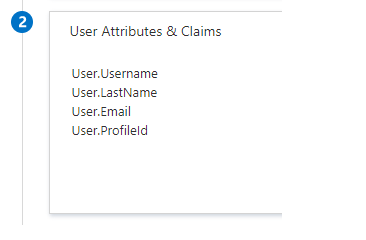
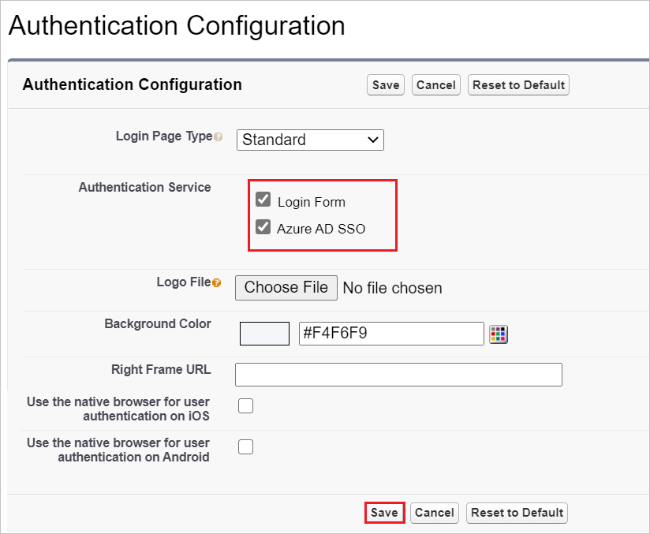

# Tutorial: Microsoft Entra single sign-on (SSO) integration with Salesforce

In this tutorial, you'll learn how to integrate Salesforce with Microsoft Entra ID. When you integrate Salesforce with Microsoft Entra ID, you can:

* Control in Microsoft Entra ID who has access to Salesforce.
* Enable your users to be automatically signed-in to Salesforce with their Microsoft Entra accounts.
* Manage your accounts in one central location.

## Prerequisites

To get started, you need the following items:

* A Microsoft Entra subscription. If you don't have a subscription, you can get a [free account](https://azure.microsoft.com/free/).
* Salesforce single sign-on (SSO) enabled subscription.

## Scenario description

In this tutorial, you configure and test Microsoft Entra SSO in a test environment.

* Salesforce supports **SP** initiated SSO.

* Salesforce supports [**Automated** user provisioning and deprovisioning](salesforce-provisioning-tutorial.md) (recommended).

* Salesforce supports **Just In Time** user provisioning.

* Salesforce Mobile application can now be configured with Microsoft Entra ID for enabling SSO. In this tutorial, you configure and test Microsoft Entra SSO in a test environment.

## Adding Salesforce from the gallery

To configure the integration of Salesforce into Microsoft Entra ID, you need to add Salesforce from the gallery to your list of managed SaaS apps.

1. Sign in to the [Microsoft Entra admin center](https://entra.microsoft.com) as at least a [Cloud Application Administrator](../roles/permissions-reference.md#cloud-application-administrator).
1. Browse to **Identity** > **Applications** > **Enterprise applications** > **New application**.
1. In the **Add from the gallery** section, type **Salesforce** in the search box.
1. Select **Salesforce** from results panel and then add the app. Wait a few seconds while the app is added to your tenant.

 Alternatively, you can also use the [Enterprise App Configuration Wizard](https://portal.office.com/AdminPortal/home?Q=Docs#/azureadappintegration). In this wizard, you can add an application to your tenant, add users/groups to the app, assign roles, as well as walk through the SSO configuration as well. [Learn more about Microsoft 365 wizards.](/microsoft-365/admin/misc/azure-ad-setup-guides)

## Configure and test Microsoft Entra SSO for Salesforce

Configure and test Microsoft Entra SSO with Salesforce using a test user called **B.Simon**. For SSO to work, you need to establish a link relationship between a Microsoft Entra user and the related user in Salesforce.

To configure and test Microsoft Entra SSO with Salesforce, perform the following steps:

1. **[Configure Microsoft Entra SSO](#configure-azure-ad-sso)** - to enable your users to use this feature.
    * **[Create a Microsoft Entra test user](#create-an-azure-ad-test-user)** - to test Microsoft Entra single sign-on with B.Simon.
    * **[Assign the Microsoft Entra test user](#assign-the-azure-ad-test-user)** - to enable B.Simon to use Microsoft Entra single sign-on.
1. **[Configure Salesforce SSO](#configure-salesforce-sso)** - to configure the single sign-on settings on application side.
    * **[Create Salesforce test user](#create-salesforce-test-user)** - to have a counterpart of B.Simon in Salesforce that is linked to the Microsoft Entra representation of user.
1. **[Test SSO](#test-sso)** - to verify whether the configuration works.

## Configure Microsoft Entra SSO

Follow these steps to enable Microsoft Entra SSO.

1. Sign in to the [Microsoft Entra admin center](https://entra.microsoft.com) as at least a [Cloud Application Administrator](../roles/permissions-reference.md#cloud-application-administrator).
1. Browse to **Identity** > **Applications** > **Enterprise applications** > **Salesforce** > **Single sign-on**.
1. On the **Select a single sign-on method** page, select **SAML**.
1. On the **Set up single sign-on with SAML** page, click the edit/pen icon for **Basic SAML Configuration** to edit the settings.

   

1. On the **Basic SAML Configuration** section, enter the values for the following fields:
    
    a. In the **Identifier** textbox, type the value using the following pattern:

    Enterprise account: `https://<subdomain>.my.salesforce.com`

    Developer account: `https://<subdomain>-dev-ed.my.salesforce.com`

    b. In the **Reply URL** textbox, type the value using the following pattern:

    Enterprise account: `https://<subdomain>.my.salesforce.com`

    Developer account: `https://<subdomain>-dev-ed.my.salesforce.com`

    c. In the **Sign-on URL** textbox, type the value using the following pattern:

    Enterprise account: `https://<subdomain>.my.salesforce.com`

    Developer account: `https://<subdomain>-dev-ed.my.salesforce.com`

    > [!NOTE]
	> These values are not real. Update these values with the actual Identifier, Reply URL and Sign-on URL. Contact [Salesforce Client support team](https://help.salesforce.com/support) to get these values.

1. On the **Set up single sign-on with SAML** page, in the **SAML Signing Certificate** section,  find **Federation Metadata XML** and select **Download** to download the certificate and save it on your computer.

	

1. On the **Set up Salesforce** section, copy the appropriate URL(s) based on your requirement.

	

### Create a Microsoft Entra test user

In this section, you'll create a test user called B.Simon.

1. Sign in to the [Microsoft Entra admin center](https://entra.microsoft.com) as at least a [User Administrator](../roles/permissions-reference.md#user-administrator).
1. Browse to **Identity** > **Users** > **All users**.
1. Select **New user** > **Create new user**, at the top of the screen.
1. In the **User** properties, follow these steps:
   1. In the **Display name** field, enter `B.Simon`.  
   1. In the **User principal name** field, enter the username@companydomain.extension. For example, `B.Simon@contoso.com`.
   1. Select the **Show password** check box, and then write down the value that's displayed in the **Password** box.
   1. Select **Review + create**.
1. Select **Create**.

### Assign the Microsoft Entra test user

In this section, you'll enable B.Simon to use single sign-on by granting access to Salesforce.

1. Sign in to the [Microsoft Entra admin center](https://entra.microsoft.com) as at least a [Cloud Application Administrator](../roles/permissions-reference.md#cloud-application-administrator).
1. Browse to **Identity** > **Applications** > **Enterprise applications** > **Salesforce**.
1. In the app's overview page, select **Users and groups**.
1. Select **Add user/group**, then select **Users and groups** in the **Add Assignment** dialog.
   1. In the **Users and groups** dialog, select **B.Simon** from the Users list, then click the **Select** button at the bottom of the screen.
   1. If you are expecting a role to be assigned to the users, you can select it from the **Select a role** dropdown. If no role has been set up for this app, you see "Default Access" role selected.
   1. In the **Add Assignment** dialog, click the **Assign** button.

## Configure Salesforce SSO

1. In a different web browser window, sign in to your up Salesforce company site as an administrator

1. Click on the **Setup** under **settings icon** on the top right corner of the page.

	

1. Scroll down to the **SETTINGS** in the navigation pane, click **Identity** to expand the related section. Then click **Single Sign-On Settings**.

    

1. On the **Single Sign-On Settings** page, click the **Edit** button.

    

    > [!NOTE]
    > If you are unable to enable Single Sign-On settings for your Salesforce account, you may need to contact [Salesforce Client support team](https://help.salesforce.com/support).

1. Select **SAML Enabled**, and then click **Save**.

    

1. To configure your SAML single sign-on settings, click **New from Metadata File**.

    

1. Click **Choose File** to upload the metadata XML file which you have downloaded and click **Create**.

    

1. On the **SAML Single Sign-On Settings** page, fields populate automatically, if you want to use SAML JIT, select the **User Provisioning Enabled** and select **SAML Identity Type** as **Assertion contains the Federation ID from the User object** otherwise, unselect the **User Provisioning Enabled** and select **SAML Identity Type** as **Assertion contains the User's Salesforce username**. Click **Save**.

    

    > [!NOTE]
    > If you configured SAML JIT, you must complete an additional step in the **[Configure Microsoft Entra SSO](#configure-azure-ad-sso)** section. The Salesforce application expects specific SAML assertions, which requires you to have specific attributes in your SAML token attributes configuration. The following screenshot shows the list of required attributes by Salesforce.
    
    
    
    If you still have issues with getting users provisioned with SAML JIT, see [Just-in-time provisioning requirements and SAML assertion fields](https://help.salesforce.com/s/articleView?id=sf.sso_jit_requirements.htm&type=5). Generally, when JIT fails, you might see an error like `We can't log you in because of an issue with single sign-on. Contact your Salesforce admin for help.`

1. On the left navigation pane in Salesforce, click **Company Settings** to expand the related section, and then click **My Domain**.

    

1. Scroll down to the **Authentication Configuration** section, and click the **Edit** button.

    

1. In the **Authentication Configuration** section, Check the **Login Page** and  **AzureSSO** as **Authentication Service** of your SAML SSO configuration, and then click **Save**.

    

    > [!NOTE]
    > If more than one authentication service is selected, users are prompted to select which authentication service they like to sign in with while initiating single sign-on to your Salesforce environment. If you don’t want it to happen, then you should **leave all other authentication services unchecked**.

### Create Salesforce test user

In this section, a user called B.Simon is created in Salesforce. Salesforce supports just-in-time provisioning, which is enabled by default. There is no action item for you in this section. If a user doesn't already exist in Salesforce, a new one is created when you attempt to access Salesforce. Salesforce also supports automatic user provisioning, you can find more details [here](salesforce-provisioning-tutorial.md) on how to configure automatic user provisioning.

## Test SSO

In this section, you test your Microsoft Entra single sign-on configuration with following options. 

* Click on **Test this application**, this will redirect to Salesforce Sign-on URL where you can initiate the login flow. 

* Go to Salesforce Sign-on URL directly and initiate the login flow from there.

* You can use Microsoft My Apps. When you click the Salesforce tile in the My Apps portal, you should be automatically signed in to the Salesforce for which you set up the SSO. For more information about the My Apps portal, see [Introduction to the My Apps portal](https://support.microsoft.com/account-billing/sign-in-and-start-apps-from-the-my-apps-portal-2f3b1bae-0e5a-4a86-a33e-876fbd2a4510).

## Test SSO for Salesforce (Mobile)

1. Open Salesforce mobile application. On the sign-in page, click **Use Custom Domain**.

    

1. In the **Custom Domain** textbox, enter your registered custom domain name and click **Continue**.

    

1. Enter your Microsoft Entra credentials to sign in to the Salesforce application and click **Next**.

    

1. On the **Allow Access** page as shown below, click **Allow** to give access to the Salesforce application.

    

1. Finally after successful sign-in, the application homepage will be displayed.

    
    

## Next steps

After you configure Salesforce, you can enforce Session Control, which protects exfiltration and infiltration of your organization’s sensitive data in real time. Session Control extends from Conditional Access. [Learn how to enforce session control with Microsoft Defender for Cloud Apps](/cloud-app-security/proxy-deployment-aad).
