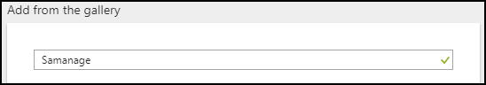
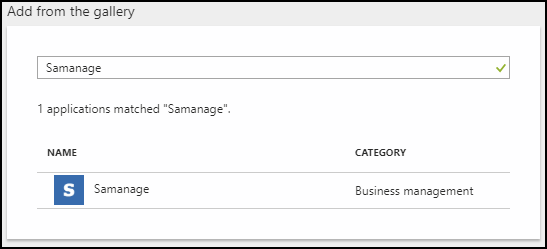
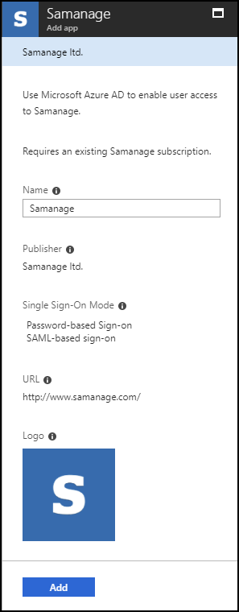
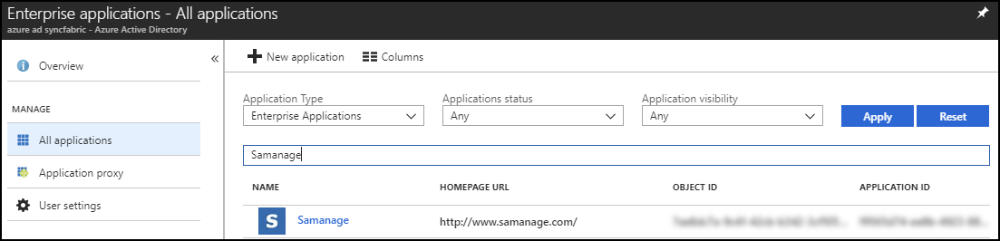
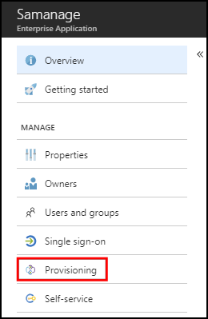
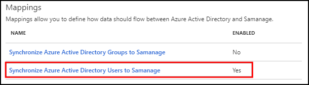
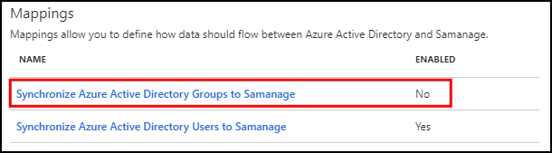
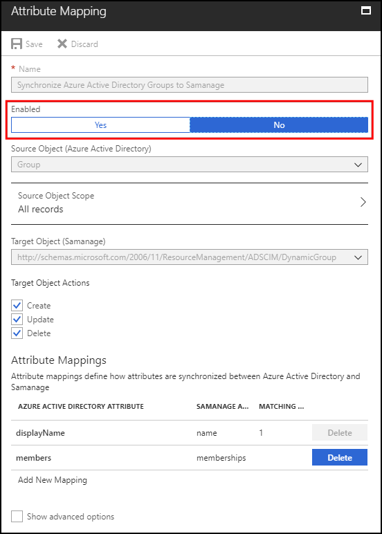
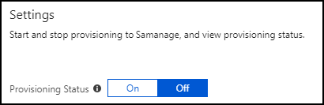

# Tutorial: Configure Samanage for automatic user provisioning

The objective of this tutorial is to demonstrate the steps to be performed in Samanage and Azure Active Directory (Azure AD) to configure Azure AD to automatically provision and de-provision users and/or groups to Samanage.

> [!NOTE]
> This tutorial describes a connector built on top of the Azure AD User Provisioning Service. For important details on what this service does, how it works, and frequently asked questions, see [Automate user provisioning and deprovisioning to SaaS applications with Azure Active Directory](../manage-apps/user-provisioning.md).

## Prerequisites

The scenario outlined in this tutorial assumes that you already have the following:

*   An Azure AD tenant
*   A [Samanage tenant](https://www.samanage.com/pricing/) with the Professional package
*   A user account in Samanage with Admin permissions

> [!NOTE]
> The Azure AD provisioning integration relies on the [Samanage Rest API](https://www.samanage.com/api/), which is available to Samanage developers for accounts with the Professional package.

## Adding Samanage from the gallery
Before configuring Samanage for automatic user provisioning with Azure AD, you need to add Samanage from the Azure AD application gallery to your list of managed SaaS applications.

**To add Samanage from the Azure AD application gallery, perform the following steps:**

1. In the **[Azure portal](https://portal.azure.com)**, on the left navigation panel, click on the **Azure Active Directory** icon.

	![The Azure Active Directory button][1]

2. Navigate to **Enterprise applications** > **All applications**.

	![The Enterprise applications Section][2]

3. To add Samanage, click the **New application** button on the top of the dialog.

	![The New application button][3]

4. In the search box, type **Samanage**.

	

5. In the results panel, select **Samanage**, and then click the **Add** button to add Samanage to your list of SaaS applications.

	

	

## Assigning users to Samanage

Azure Active Directory uses a concept called "assignments" to determine which users should receive access to selected apps. In the context of automatic user provisioning, only the users and/or groups that have been "assigned" to an application in Azure AD are synchronized.

Before configuring and enabling automatic user provisioning, you should decide which users and/or groups in Azure AD need access to Samanage. Once decided, you can assign these users and/or groups to Samanage by following the instructions here:

*   [Assign a user or group to an enterprise app](https://docs.microsoft.com/azure/active-directory/active-directory-coreapps-assign-user-azure-portal)

### Important tips for assigning users to Samanage

*	It is recommended that a single Azure AD user is assigned to Samanage to test the automatic user provisioning configuration. Additional users and/or groups may be assigned later.

*	When assigning a user to Samanage, you must select any valid application-specific role (if available) in the assignment dialog. Users with the **Default Access** role are excluded from provisioning.

## Configuring automatic user provisioning to Samanage

This section guides you through the steps to configure the Azure AD provisioning service to create, update, and disable users and/or groups in Samanage based on user and/or group assignments in Azure AD.

> [!TIP]
> You may also choose to enable SAML-based single sign-on for Samanage, following the instructions provided in the [Samanage single sign-on tutorial](samanage-tutorial.md). Single sign-on can be configured independently of automatic user provisioning, though these two features compliment each other.

### To configure automatic user provisioning for Samanage in Azure AD:

1. Sign in to the [Azure portal](https://portal.azure.com) and browse to **Azure Active Directory > Enterprise applications > All applications**.

2. Select Samanage from your list of SaaS applications.

	

3. Select the **Provisioning** tab.

	

4. Set the **Provisioning Mode** to **Automatic**.

	

5. Under the **Admin Credentials** section, input the **Admin Username** and **Admin Password** of your Samanage account. Examples of these values are:

	*   In the **Admin Username** field, populate the username of the admin account on your Samanage tenant. Example: admin@contoso.com.

	*   In the **Admin Password** field, populate the password of the admin account corresponding to the admin username.

6. Upon populating the fields shown in Step 5, click **Test Connection** to ensure Azure AD can connect to Samanage. If the connection fails, ensure your Samanage account has Admin permissions and try again.

	

7. In the **Notification Email** field, enter the email address of a person or group who should receive the provisioning error notifications and check the checkbox **Send an email notification when a failure occurs**.

	

8. Click **Save**.

9. Under the **Mappings** section, select **Synchronize Azure Active Directory Users to Samanage**.

	

10. Review the user attributes that are synchronized from Azure AD to Samanage in the **Attribute Mappings** section. The attributes selected as **Matching** properties are used to match the user accounts in Samanage for update operations. Select the **Save** button to commit any changes.

	

11. To enable group mappings, under the **Mappings** section, select **Synchronize Azure Active Directory Groups to Samanage**.

	

12. Set **Enabled** to **Yes** to synchronize groups. Review the group attributes that are synchronized from Azure AD to Samanage in the **Attribute Mappings** section. The attributes selected as **Matching** properties are used to match the user accounts in Samanage for update operations. Select the **Save** button to commit any changes.

	

13. To configure scoping filters, refer to the following instructions provided in the [Scoping filter tutorial](../manage-apps/define-conditional-rules-for-provisioning-user-accounts.md).

14. To enable the Azure AD provisioning service for Samanage, change the **Provisioning Status** to **On** in the **Settings** section.

	

15. Define the users and/or groups that you would like to provision to Samanage by choosing the desired values in **Scope** in the **Settings** section.

	

16. When you are ready to provision, click **Save**.

	

This operation starts the initial synchronization of all users and/or groups defined in **Scope** in the **Settings** section. The initial sync takes longer to perform than subsequent syncs, which occur approximately every 40 minutes as long as the Azure AD provisioning service is running. You can use the **Synchronization Details** section to monitor progress and follow links to provisioning activity report, which describes all actions performed by the Azure AD provisioning service on Samanage.

For more information on how to read the Azure AD provisioning logs, see [Reporting on automatic user account provisioning](../manage-apps/check-status-user-account-provisioning.md).

## Additional resources

* [Managing user account provisioning for Enterprise Apps](../manage-apps/configure-automatic-user-provisioning-portal.md)
* [What is application access and single sign-on with Azure Active Directory?](../manage-apps/what-is-single-sign-on.md)

## Next steps

* [Learn how to review logs and get reports on provisioning activity](../manage-apps/check-status-user-account-provisioning.md)

<!--Image references-->
[1]: ./media/samanage-provisioning-tutorial/tutorial_general_01.png
[2]: ./media/samanage-provisioning-tutorial/tutorial_general_02.png
[3]: ./media/samanage-provisioning-tutorial/tutorial_general_03.png
