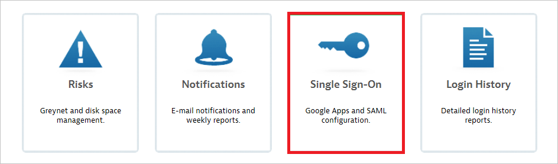
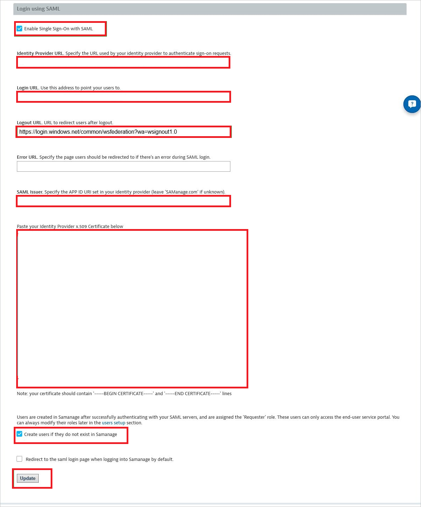
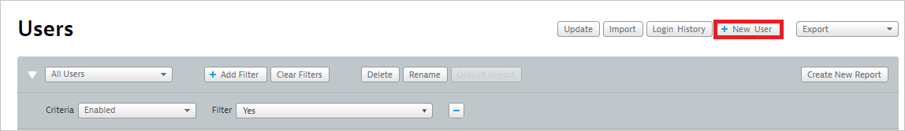

# Tutorial: Azure Active Directory integration with SolarWinds Service Desk (previously Samanage)

In this tutorial, you'll learn how to integrate SolarWinds with Azure Active Directory (Azure AD). When you integrate SolarWinds with Azure AD, you can:

* Control in Azure AD who has access to SolarWinds.
* Enable your users to be automatically signed-in to SolarWinds with their Azure AD accounts.
* Manage your accounts in one central location - the Azure portal.

## Prerequisites

To get started, you need the following items:

* An Azure AD subscription. If you don't have a subscription, you can get a [free account](https://azure.microsoft.com/free/).
* SolarWinds single sign-on (SSO) enabled subscription.

## Scenario description

In this tutorial, you configure and test Azure AD single sign-on in a test environment.

* SolarWinds supports **SP** initiated SSO.

## Add SolarWinds from the gallery

To configure the integration of SolarWinds into Azure AD, you need to add SolarWinds from the gallery to your list of managed SaaS apps.

1. Sign in to the Azure portal using either a work or school account, or a personal Microsoft account.
1. On the left navigation pane, select the **Azure Active Directory** service.
1. Navigate to **Enterprise Applications** and then select **All Applications**.
1. To add new application, select **New application**.
1. In the **Add from the gallery** section, type **SolarWinds** in the search box.
1. Select **SolarWinds** from results panel and then add the app. Wait a few seconds while the app is added to your tenant.

## Configure and test Azure AD SSO for SolarWinds

Configure and test Azure AD SSO with SolarWinds using a test user called **B.Simon**. For SSO to work, you need to establish a link relationship between an Azure AD user and the related user in SolarWinds.

To configure and test Azure AD SSO with SolarWinds, perform the following steps:

1. **[Configure Azure AD SSO](#configure-azure-ad-sso)** - to enable your users to use this feature.
    1. **[Create an Azure AD test user](#create-an-azure-ad-test-user)** - to test Azure AD single sign-on with B.Simon.
    1. **[Assign the Azure AD test user](#assign-the-azure-ad-test-user)** - to enable B.Simon to use Azure AD single sign-on.
1. **[Configure SolarWinds SSO](#configure-solarwinds-sso)** - to configure the single sign-on settings on application side.
    1. **[Create SolarWinds test user](#create-solarwinds-test-user)** - to have a counterpart of B.Simon in SolarWinds that is linked to the Azure AD representation of user.
1. **[Test SSO](#test-sso)** - to verify whether the configuration works.

## Configure Azure AD SSO

Follow these steps to enable Azure AD SSO in the Azure portal.

1. In the Azure portal, on the **SolarWinds** application integration page, find the **Manage** section and select **single sign-on**.
1. On the **Select a single sign-on method** page, select **SAML**.
1. On the **Set up single sign-on with SAML** page, click the pencil icon for **Basic SAML Configuration** to edit the settings.

   

4. On the **Basic SAML Configuration** section, perform the following steps:

	a. In the **Sign on URL** text box, type a URL using the following pattern:
    `https://<Company Name>.samanage.com/saml_login/<Company Name>`

    b. In the **Identifier (Entity ID)** text box, type a URL using the following pattern:
    `https://<Company Name>.samanage.com`

	> [!NOTE] 
	> These values are not real. Update these values with the actual Sign-on URL and Identifier, which is explained later in the tutorial. For more details contact [Samanage Client support team](https://www.samanage.com/support). You can also refer to the patterns shown in the **Basic SAML Configuration** section in the Azure portal.

4. On the **Set up Single Sign-On with SAML** page, in the **SAML Signing Certificate** section, click **Download** to download the **Certificate (Base64)** from the given options as per your requirement and save it on your computer.

	

6. On the **Set up SolarWinds** section, copy the appropriate URL(s) as per your requirement.

	

### Create an Azure AD test user 

In this section, you'll create a test user in the Azure portal called B.Simon.

1. From the left pane in the Azure portal, select **Azure Active Directory**, select **Users**, and then select **All users**.
1. Select **New user** at the top of the screen.
1. In the **User** properties, follow these steps:
   1. In the **Name** field, enter `B.Simon`.  
   1. In the **User name** field, enter the username@companydomain.extension. For example, `B.Simon@contoso.com`.
   1. Select the **Show password** check box, and then write down the value that's displayed in the **Password** box.
   1. Click **Create**.

### Assign the Azure AD test user

In this section, you'll enable B.Simon to use Azure single sign-on by granting access to SolarWinds.

1. In the Azure portal, select **Enterprise Applications**, and then select **All applications**.
1. In the applications list, select **SolarWinds**.
1. In the app's overview page, find the **Manage** section and select **Users and groups**.
1. Select **Add user**, then select **Users and groups** in the **Add Assignment** dialog.
1. In the **Users and groups** dialog, select **B.Simon** from the Users list, then click the **Select** button at the bottom of the screen.
1. If you are expecting a role to be assigned to the users, you can select it from the **Select a role** dropdown. If no role has been set up for this app, you see "Default Access" role selected.
1. In the **Add Assignment** dialog, click the **Assign** button.

## Configure SolarWinds SSO

1. In a different web browser window, log into your SolarWinds company site as an administrator.

2. Click **Dashboard** and select **Setup** in left navigation pane.
   
    

3. Click **Single Sign-On**.
   
    

4. Navigate to **Login using SAML** section, perform the following steps:
   
    
 
    a. Click **Enable Single Sign-On with SAML**.  
 
    b. In the **Identity Provider URL** textbox, paste the value of **Azure Ad Identifier** which you have copied from Azure portal.    
 
    c. Confirm the **Login URL** matches the **Sign On URL** of **Basic SAML Configuration** section in Azure portal.
 
    d. In the **Logout URL** textbox, enter the value of **Logout URL** which you have copied from Azure portal.
 
    e. In the **SAML Issuer** textbox, type the app id URI set in your identity provider.
 
    f. Open your base-64 encoded certificate downloaded from Azure portal in notepad, copy the content of it into your clipboard, and then paste it to the **Paste your Identity Provider x.509 Certificate below** textbox.
 
    g. Click **Create users if they do not exist in SolarWinds**.
 
    h. Click **Update**.

### Create SolarWinds test user

To enable Azure AD users to log in to SolarWinds, they must be provisioned into SolarWinds.  
In the case of SolarWinds, provisioning is a manual task.

**To provision a user account, perform the following steps:**

1. Log into your SolarWinds company site as an administrator.

2. Click **Dashboard** and select **Setup** in left navigation pan.
   
    

3. Click the **Users** tab
   
    

4. Click **New User**.
   
    

5. Type the **Name** and the **Email Address** of an Azure Active Directory account you want to provision and click **Create user**.
   
    
   
   >[!NOTE]
   >The Azure Active Directory account holder will receive an email and follow a link to confirm their account before it becomes active. You can use any other SolarWinds user account creation tools or APIs provided by SolarWinds to provision Azure Active Directory user accounts.

## Test SSO

In this section, you test your Azure AD single sign-on configuration with following options. 

* Click on **Test this application** in Azure portal. This will redirect to SolarWinds Sign-on URL where you can initiate the login flow. 

* Go to SolarWinds Sign-on URL directly and initiate the login flow from there.

* You can use Microsoft My Apps. When you click the SolarWinds tile in the My Apps, this will redirect to SolarWinds Sign-on URL. For more information about the My Apps, see [Introduction to the My Apps](../user-help/my-apps-portal-end-user-access.md).

## Next steps

Once you configure SolarWinds you can enforce session control, which protects exfiltration and infiltration of your organization’s sensitive data in real time. Session control extends from Conditional Access. [Learn how to enforce session control with Microsoft Cloud App Security](/cloud-app-security/proxy-deployment-any-app).