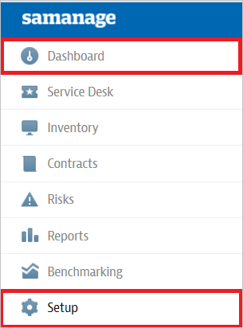
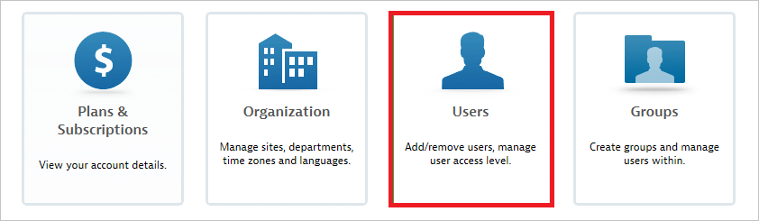
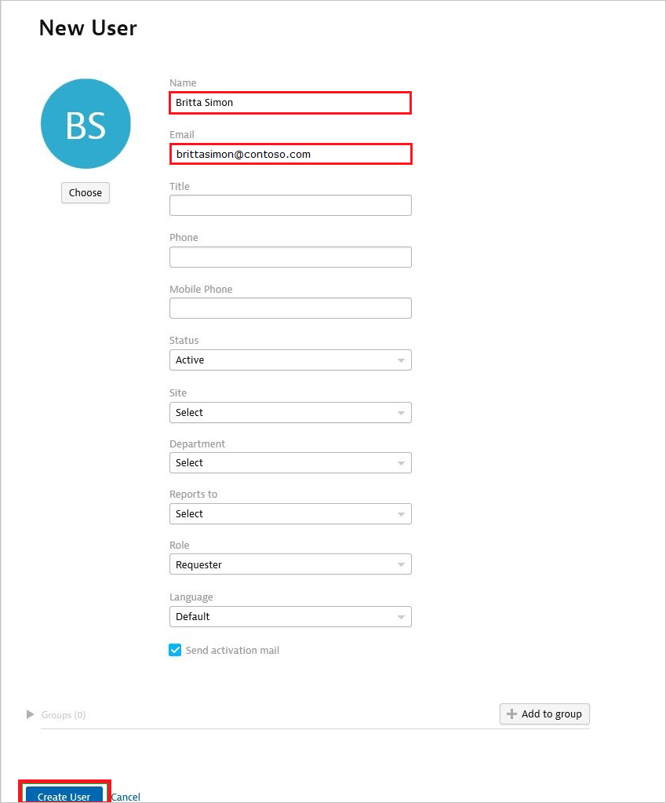

# Tutorial: Azure Active Directory integration with Samanage

In this tutorial, you learn how to integrate Samanage with Azure Active Directory (Azure AD).
Integrating Samanage with Azure AD provides you with the following benefits:

* You can control in Azure AD who has access to Samanage.
* You can enable your users to be automatically signed-in to Samanage (Single Sign-On) with their Azure AD accounts.
* You can manage your accounts in one central location - the Azure portal.

If you want to know more details about SaaS app integration with Azure AD, see [What is application access and single sign-on with Azure Active Directory](https://docs.microsoft.com/azure/active-directory/active-directory-appssoaccess-whatis).
If you don't have an Azure subscription, [create a free account](https://azure.microsoft.com/free/) before you begin.

## Prerequisites

To configure Azure AD integration with Samanage, you need the following items:

* An Azure AD subscription. If you don't have an Azure AD environment, you can get one-month trial [here](https://azure.microsoft.com/pricing/free-trial/)
* Samanage single sign-on enabled subscription

## Scenario description

In this tutorial, you configure and test Azure AD single sign-on in a test environment.

* Samanage supports **SP** initiated SSO

## Adding Samanage from the gallery

To configure the integration of Samanage into Azure AD, you need to add Samanage from the gallery to your list of managed SaaS apps.

**To add Samanage from the gallery, perform the following steps:**

1. In the **[Azure portal](https://portal.azure.com)**, on the left navigation panel, click **Azure Active Directory** icon.

	

2. Navigate to **Enterprise Applications** and then select the **All Applications** option.

	

3. To add new application, click **New application** button on the top of dialog.

	

4. In the search box, type **Samanage**, select **Samanage** from result panel then click **Add** button to add the application.

	 

## Configure and test Azure AD single sign-on

In this section, you configure and test Azure AD single sign-on with Samanage based on a test user called **Britta Simon**.
For single sign-on to work, a link relationship between an Azure AD user and the related user in Samanage needs to be established.

To configure and test Azure AD single sign-on with Samanage, you need to complete the following building blocks:

1. **[Configure Azure AD Single Sign-On](#configure-azure-ad-single-sign-on)** - to enable your users to use this feature.
2. **[Configure Samanage Single Sign-On](#configure-samanage-single-sign-on)** - to configure the Single Sign-On settings on application side.
3. **[Create an Azure AD test user](#create-an-azure-ad-test-user)** - to test Azure AD single sign-on with Britta Simon.
4. **[Assign the Azure AD test user](#assign-the-azure-ad-test-user)** - to enable Britta Simon to use Azure AD single sign-on.
5. **[Create Samanage test user](#create-samanage-test-user)** - to have a counterpart of Britta Simon in Samanage that is linked to the Azure AD representation of user.
6. **[Test single sign-on](#test-single-sign-on)** - to verify whether the configuration works.

### Configure Azure AD single sign-on

In this section, you enable Azure AD single sign-on in the Azure portal.

To configure Azure AD single sign-on with Samanage, perform the following steps:

1. In the [Azure portal](https://portal.azure.com/), on the **Samanage** application integration page, select **Single sign-on**.

    

2. On the **Select a Single sign-on method** dialog, select **SAML/WS-Fed** mode to enable single sign-on.

    

3. On the **Set up Single Sign-On with SAML** page, click **Edit** icon to open **Basic SAML Configuration** dialog.

	

4. On the **Basic SAML Configuration** section, perform the following steps:

    

	a. In the **Sign on URL** text box, type a URL using the following pattern:
    `https://<Company Name>.samanage.com/saml_login/<Company Name>`

    b. In the **Identifier (Entity ID)** text box, type a URL using the following pattern:
    `https://<Company Name>.samanage.com`

	> [!NOTE] 
	> These values are not real. Update these values with the actual Sign-on URL and Identifier, which is explained later in the tutorial. For more details contact [Samanage Client support team](https://www.samanage.com/support). You can also refer to the patterns shown in the **Basic SAML Configuration** section in the Azure portal.

4. On the **Set up Single Sign-On with SAML** page, in the **SAML Signing Certificate** section, click **Download** to download the **Certificate (Base64)** from the given options as per your requirement and save it on your computer.

	

6. On the **Set up Samanage** section, copy the appropriate URL(s) as per your requirement.

	

	a. Login URL

	b. Azure Ad Identifier

	c. Logout URL

### Configure Samanage Single Sign-On

1. In a different web browser window, log into your Samanage company site as an administrator.

2. Click **Dashboard** and select **Setup** in left navigation pane.
   
    

3. Click **Single Sign-On**.
   
    

4. Navigate to **Login using SAML** section, perform the following steps:
   
    
 
    a. Click **Enable Single Sign-On with SAML**.  
 
    b. In the **Identity Provider URL** textbox, paste the value of **Azure Ad Identifier** which you have copied from Azure portal.    
 
    c. Confirm the **Login URL** matches the **Sign On URL** of **Basic SAML Configuration** section in Azure portal.
 
    d. In the **Logout URL** textbox, enter the value of **Logout URL** which you have copied from Azure portal.
 
    e. In the **SAML Issuer** textbox, type the app id URI set in your identity provider.
 
    f. Open your base-64 encoded certificate downloaded from Azure portal in notepad, copy the content of it into your clipboard, and then paste it to the **Paste your Identity Provider x.509 Certificate below** textbox.
 
    g. Click **Create users if they do not exist in Samanage**.
 
    h. Click **Update**.

### Create an Azure AD test user 

The objective of this section is to create a test user in the Azure portal called Britta Simon.

1. In the Azure portal, in the left pane, select **Azure Active Directory**, select **Users**, and then select **All users**.

    

2. Select **New user** at the top of the screen.

    

3. In the User properties, perform the following steps.

    

    a. In the **Name** field enter **BrittaSimon**.
  
    b. In the **User name** field type **brittasimon\@yourcompanydomain.extension**  
    For example, BrittaSimon@contoso.com

    c. Select **Show password** check box, and then write down the value that's displayed in the Password box.

    d. Click **Create**.

### Assign the Azure AD test user

In this section, you enable Britta Simon to use Azure single sign-on by granting access to Samanage.

1. In the Azure portal, select **Enterprise Applications**, select **All applications**, then select **Samanage**.

	

2. In the applications list, select **Samanage**.

	

3. In the menu on the left, select **Users and groups**.

    

4. Click the **Add user** button, then select **Users and groups** in the **Add Assignment** dialog.

    

5. In the **Users and groups** dialog select **Britta Simon** in the Users list, then click the **Select** button at the bottom of the screen.

6. If you are expecting any role value in the SAML assertion then in the **Select Role** dialog select the appropriate role for the user from the list, then click the **Select** button at the bottom of the screen.

7. In the **Add Assignment** dialog click the **Assign** button.

### Create Samanage test user

To enable Azure AD users to log in to Samanage, they must be provisioned into Samanage.  
In the case of Samanage, provisioning is a manual task.

**To provision a user account, perform the following steps:**

1. Log into your Samanage company site as an administrator.

2. Click **Dashboard** and select **Setup** in left navigation pan.
   
    

3. Click the **Users** tab
   
    

4. Click **New User**.
   
    

5. Type the **Name** and the **Email Address** of an Azure Active Directory account you want to provision and click **Create user**.
   
    
   
   >[!NOTE]
   >The Azure Active Directory account holder will receive an email and follow a link to confirm their account before it becomes active. You can use any other Samanage user account creation tools or APIs provided by Samanage to provision Azure Active Directory user accounts.

### Test single sign-on 

In this section, you test your Azure AD single sign-on configuration using the Access Panel.

When you click the Samanage tile in the Access Panel, you should be automatically signed in to the Samanage for which you set up SSO. For more information about the Access Panel, see [Introduction to the Access Panel](https://docs.microsoft.com/azure/active-directory/active-directory-saas-access-panel-introduction).

## Additional Resources

- [List of Tutorials on How to Integrate SaaS Apps with Azure Active Directory](https://docs.microsoft.com/azure/active-directory/active-directory-saas-tutorial-list)

- [What is application access and single sign-on with Azure Active Directory?](https://docs.microsoft.com/azure/active-directory/active-directory-appssoaccess-whatis)

- [What is Conditional Access in Azure Active Directory?](https://docs.microsoft.com/azure/active-directory/conditional-access/overview)

