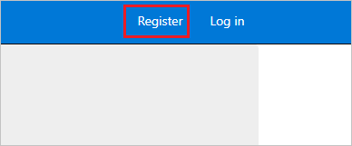
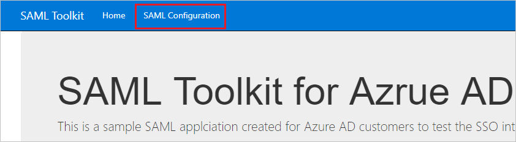
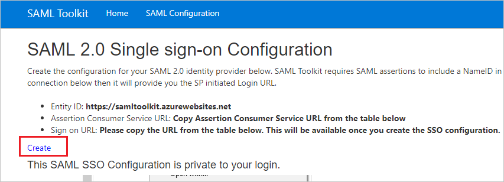
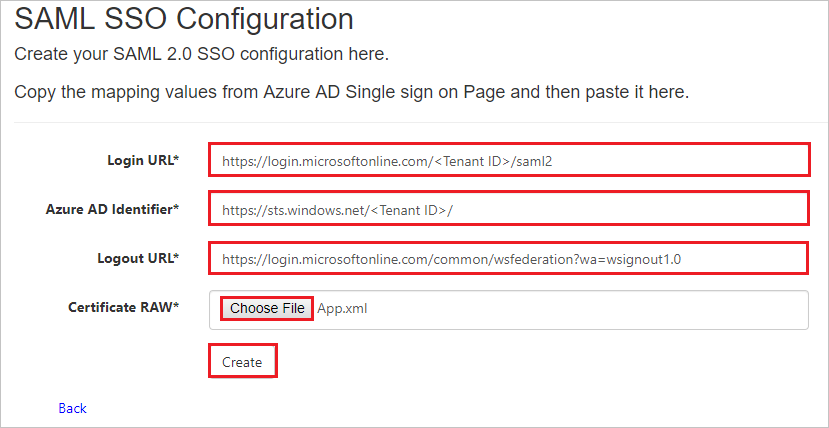

# Tutorial: Azure Active Directory single sign-on (SSO) integration with Azure AD SAML Toolkit

In this tutorial, you'll learn how to integrate Azure AD SAML Toolkit with Azure Active Directory (Azure AD). When you integrate Azure AD SAML Toolkit with Azure AD, you can:

* Control in Azure AD who has access to Azure AD SAML Toolkit.
* Enable your users to be automatically signed-in to Azure AD SAML Toolkit with their Azure AD accounts.
* Manage your accounts in one central location - the Azure portal.

To learn more about SaaS app integration with Azure AD, see [What is application access and single sign-on with Azure Active Directory](https://docs.microsoft.com/azure/active-directory/active-directory-appssoaccess-whatis).

## Prerequisites

To get started, you need the following items:

* An Azure AD subscription. If you don't have a subscription, you can get a [free account](https://azure.microsoft.com/free/).
* Azure AD SAML Toolkit single sign-on (SSO) enabled subscription.

## Scenario description

In this tutorial, you configure and test Azure AD SSO in a test environment.

* Azure AD SAML Toolkit supports **SP** initiated SSO
* Once you configure Azure AD SAML Toolkit you can enforce Session Control, which protect exfiltration and infiltration of your organization’s sensitive data in real-time. Session Control extend from Conditional Access. [Learn how to enforce session control with Microsoft Cloud App Security](https://docs.microsoft.com/cloud-app-security/proxy-deployment-aad)

## Adding Azure AD SAML Toolkit from the gallery

To configure the integration of Azure AD SAML Toolkit into Azure AD, you need to add Azure AD SAML Toolkit from the gallery to your list of managed SaaS apps.

1. Sign in to the [Azure portal](https://portal.azure.com) using either a work or school account, or a personal Microsoft account.
1. On the left navigation pane, select the **Azure Active Directory** service.
1. Navigate to **Enterprise Applications** and then select **All Applications**.
1. To add new application, select **New application**.
1. In the **Add from the gallery** section, type **Azure AD SAML Toolkit** in the search box.
1. Select **Azure AD SAML Toolkit** from results panel and then add the app. Wait a few seconds while the app is added to your tenant.

## Configure and test Azure AD single sign-on for Azure AD SAML Toolkit

Configure and test Azure AD SSO with Azure AD SAML Toolkit using a test user called **B.Simon**. For SSO to work, you need to establish a link relationship between an Azure AD user and the related user in Azure AD SAML Toolkit.

To configure and test Azure AD SSO with Azure AD SAML Toolkit, complete the following building blocks:

1. **[Configure Azure AD SSO](#configure-azure-ad-sso)** - to enable your users to use this feature.
    1. **[Create an Azure AD test user](#create-an-azure-ad-test-user)** - to test Azure AD single sign-on with B.Simon.
    1. **[Assign the Azure AD test user](#assign-the-azure-ad-test-user)** - to enable B.Simon to use Azure AD single sign-on.
1. **[Configure Azure AD SAML Toolkit SSO](#configure-azure-ad-saml-toolkit-sso)** - to configure the single sign-on settings on application side.
    1. **[Create Azure AD SAML Toolkit test user](#create-azure-ad-saml-toolkit-test-user)** - to have a counterpart of B.Simon in Azure AD SAML Toolkit that is linked to the Azure AD representation of user.
1. **[Test SSO](#test-sso)** - to verify whether the configuration works.

## Configure Azure AD SSO

Follow these steps to enable Azure AD SSO in the Azure portal.

1. In the [Azure portal](https://portal.azure.com/), on the **Azure AD SAML Toolkit** application integration page, find the **Manage** section and select **single sign-on**.
1. On the **Select a single sign-on method** page, select **SAML**.
1. On the **Set up single sign-on with SAML** page, click the edit/pen icon for **Basic SAML Configuration** to edit the settings.

   

1. On the **Basic SAML Configuration** page, enter the values for the following fields:

    a. In the **Sign on URL** text box, type a URL:
    `https://samltoolkit.azurewebsites.net/`

    b. In the **Identifier (Entity ID)** text box, type a URL:
    `https://samltoolkit.azurewebsites.net`

	c. In the **Reply URL** text box, type a URL:
    `https://samltoolkit.azurewebsites.net/SAML/Consume`

    > [!NOTE]
    > These values are not real values. Update these values with the actual Sign on URL, Identifier and Reply URL values, which is explained later in the tutorial.

1. On the **Set up single sign-on with SAML** page, in the **SAML Signing Certificate** section,  find **Certificate (Raw)** and select **Download** to download the certificate and save it on your computer.

	

1. On the **Set up Azure AD SAML Toolkit** section, copy the appropriate URL(s) based on your requirement.

	

### Create an Azure AD test user

In this section, you'll create a test user in the Azure portal called B.Simon.

1. From the left pane in the Azure portal, select **Azure Active Directory**, select **Users**, and then select **All users**.
1. Select **New user** at the top of the screen.
1. In the **User** properties, follow these steps:
   1. In the **Name** field, enter `B.Simon`.  
   1. In the **User name** field, enter the username@companydomain.extension. For example, `B.Simon@contoso.com`.
   1. Select the **Show password** check box, and then write down the value that's displayed in the **Password** box.
   1. Click **Create**.

### Assign the Azure AD test user

In this section, you'll enable B.Simon to use Azure single sign-on by granting access to Azure AD SAML Toolkit.

1. In the Azure portal, select **Enterprise Applications**, and then select **All applications**.
1. In the applications list, select **Azure AD SAML Toolkit**.
1. In the app's overview page, find the **Manage** section and select **Users and groups**.

   

1. Select **Add user**, then select **Users and groups** in the **Add Assignment** dialog.

	

1. In the **Users and groups** dialog, select **B.Simon** from the Users list, then click the **Select** button at the bottom of the screen.
1. If you're expecting any role value in the SAML assertion, in the **Select Role** dialog, select the appropriate role for the user from the list and then click the **Select** button at the bottom of the screen.
1. In the **Add Assignment** dialog, click the **Assign** button.

## Configure Azure AD SAML Toolkit SSO

1. Open a new web browser window, if you have not registered in the Azure AD SAML Toolkit website, first register by clicking on the **Register**. If you have registered already, sign into your Azure AD SAML Toolkit company site using the registered sign in credentials.

	

1. Click on the **SAML Configuration**.

	

1. Click **Create**.

	

1. On the **SAML SSO Configuration** page, perform the following steps:

	

	1. In the **Login URL** textbox, paste the **Login URL** value, which you have copied from the Azure portal.

	1. In the **Azure AD Identifier** textbox, paste the **Azure AD Identifier** value, which you have copied from the Azure portal.

	1. In the **Logout URL** textbox, paste the **Logout URL** value, which you have copied from the Azure portal.

	1. Click **Choose File** and upload the **Certificate (Raw)** file which you have downloaded from the Azure portal.

	1. Click **Create**.

    1. Copy Sign-on URL, Identifier and ACS URL values on SAML Toolkit SSO configuration page and paste into respected textboxes in the **Basic SAML Configuration section** in the Azure portal.

### Create Azure AD SAML Toolkit test user

In this section, a user called B.Simon is created in Azure AD SAML Toolkit. Azure AD SAML Toolkit supports just-in-time user provisioning, which is enabled by default. There is no action item for you in this section. If a user doesn't already exist in Azure AD SAML Toolkit, a new one is created after authentication.

## Test SSO 

In this section, you test your Azure AD single sign-on configuration using the Access Panel.

When you click the Azure AD SAML Toolkit tile in the Access Panel, you should be automatically signed in to the Azure AD SAML Toolkit for which you set up SSO. For more information about the Access Panel, see [Introduction to the Access Panel](https://docs.microsoft.com/azure/active-directory/active-directory-saas-access-panel-introduction).

## Additional resources

- [ List of Tutorials on How to Integrate SaaS Apps with Azure Active Directory ](https://docs.microsoft.com/azure/active-directory/active-directory-saas-tutorial-list)

- [What is application access and single sign-on with Azure Active Directory? ](https://docs.microsoft.com/azure/active-directory/active-directory-appssoaccess-whatis)

- [What is conditional access in Azure Active Directory?](https://docs.microsoft.com/azure/active-directory/conditional-access/overview)

- [Try Azure AD SAML Toolkit with Azure AD](https://aad.portal.azure.com/)

- [What is session control in Microsoft Cloud App Security?](https://docs.microsoft.com/cloud-app-security/proxy-intro-aad)

- [How to protect Azure AD SAML Toolkit with advanced visibility and controls](https://docs.microsoft.com/cloud-app-security/protect-azure)