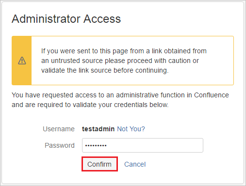
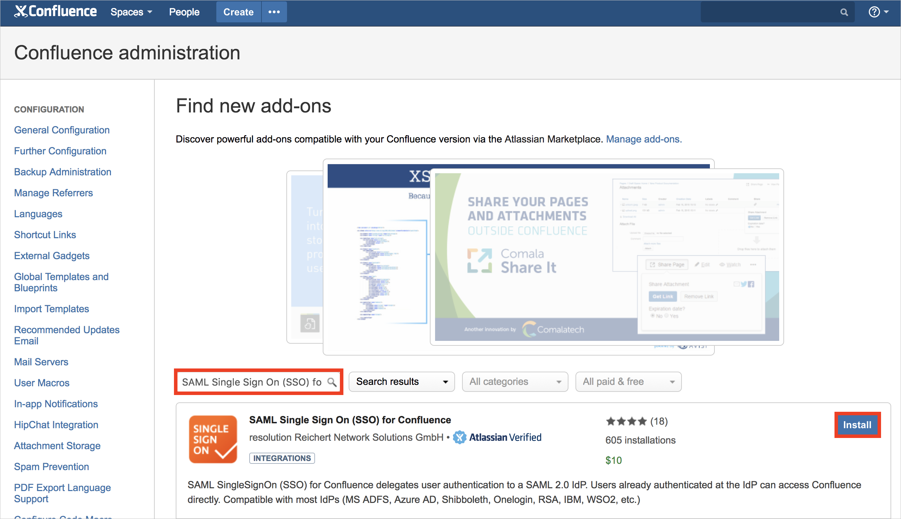
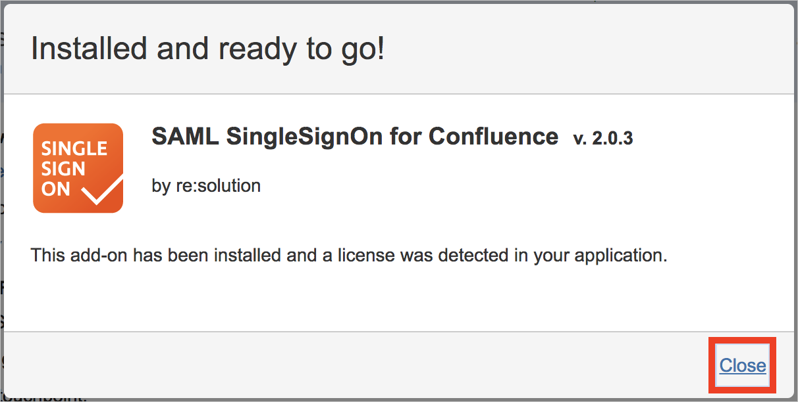
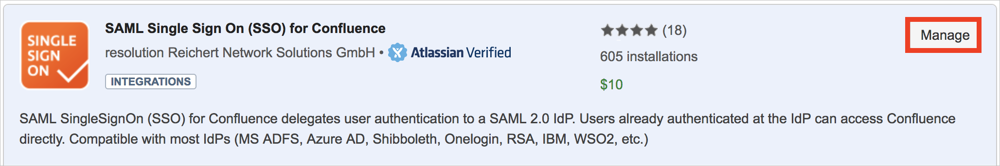
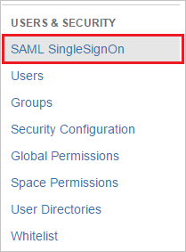
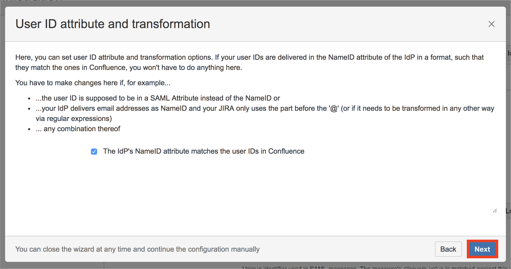
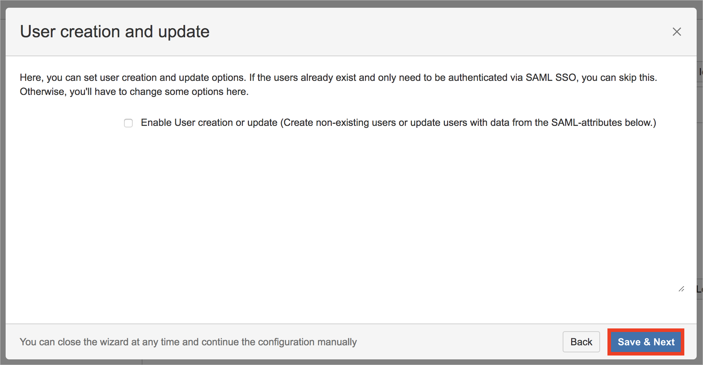
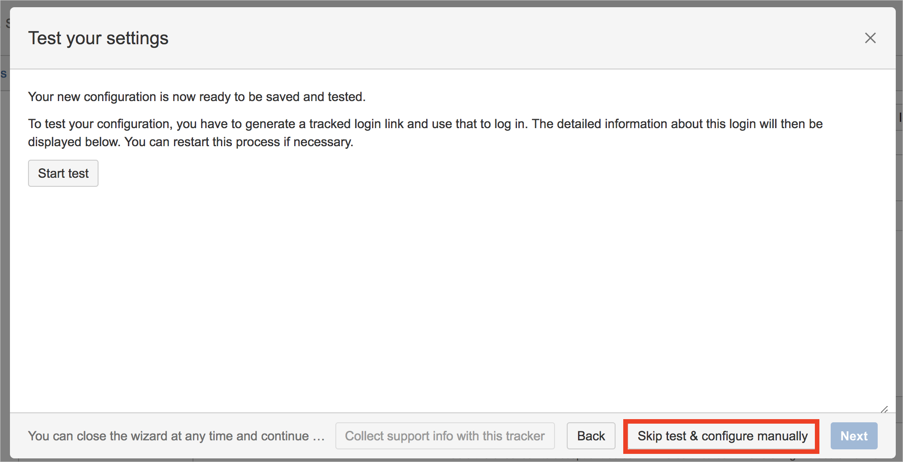

# Tutorial: Microsoft Entra integration with SAML SSO for Confluence by resolution GmbH

In this tutorial, you'll learn how to integrate SAML SSO for Confluence by resolution GmbH with Microsoft Entra ID. When you integrate SAML SSO for Confluence by resolution GmbH with Microsoft Entra ID, you can:

* Control in Microsoft Entra ID who has access to SAML SSO for Confluence by resolution GmbH.
* Enable your users to be automatically signed-in to SAML SSO for Confluence by resolution GmbH with their Microsoft Entra accounts.
* Manage your accounts in one central location.

## Prerequisites

To get started, you need the following items:

* A Microsoft Entra subscription. If you don't have a subscription, you can get a [free account](https://azure.microsoft.com/free/).
* SAML SSO for Confluence by resolution GmbH single sign-on (SSO) enabled subscription.

## Scenario description

In this tutorial, you configure and test Microsoft Entra SSO in a test environment.

* SAML SSO for Confluence by resolution GmbH supports **SP and IDP** initiated SSO

## Add SAML SSO for Confluence by resolution GmbH from the gallery

To configure the integration of SAML SSO for Confluence by resolution GmbH into Microsoft Entra ID, you need to add SAML SSO for Confluence by resolution GmbH from the gallery to your list of managed SaaS apps.

1. Sign in to the [Microsoft Entra admin center](https://entra.microsoft.com) as at least a [Cloud Application Administrator](../roles/permissions-reference.md#cloud-application-administrator).
1. Browse to **Identity** > **Applications** > **Enterprise applications** > **New application**.
1. In the **Add from the gallery** section, type **SAML SSO for Confluence by resolution GmbH** in the search box.
1. Select **SAML SSO for Confluence by resolution GmbH** from results panel and then add the app. Wait a few seconds while the app is added to your tenant.

 Alternatively, you can also use the [Enterprise App Configuration Wizard](https://portal.office.com/AdminPortal/home?Q=Docs#/azureadappintegration). In this wizard, you can add an application to your tenant, add users/groups to the app, assign roles, as well as walk through the SSO configuration as well. [Learn more about Microsoft 365 wizards.](/microsoft-365/admin/misc/azure-ad-setup-guides)

## Configure and test Microsoft Entra SSO for SAML SSO for Confluence by resolution GmbH

Configure and test Microsoft Entra SSO with SAML SSO for Confluence by resolution GmbH using a test user called **B.Simon**. For SSO to work, you need to establish a link relationship between a Microsoft Entra user and the related user in SAML SSO for Confluence by resolution GmbH.

To configure and test Microsoft Entra SSO with SAML SSO for Confluence by resolution GmbH, perform the following steps:

1. **[Configure Microsoft Entra SSO](#configure-azure-ad-sso)** - to enable your users to use this feature.
    1. **[Create a Microsoft Entra test user](#create-an-azure-ad-test-user)** - to test Microsoft Entra single sign-on with B.Simon.
    1. **[Assign the Microsoft Entra test user](#assign-the-azure-ad-test-user)** - to enable B.Simon to use Microsoft Entra single sign-on.
2. **[Configure SAML SSO for Confluence by resolution GmbH SSO](#configure-saml-sso-for-confluence-by-resolution-gmbh-sso)** - to configure the Single Sign-On settings on application side.
	1. **[Create SAML SSO for Confluence by resolution GmbH test user](#create-saml-sso-for-confluence-by-resolution-gmbh-test-user)** - to have a counterpart of Britta Simon in SAML SSO for Confluence by resolution GmbH that is linked to the Microsoft Entra representation of user.
6. **[Test SSO](#test-sso)** - to verify whether the configuration works.

## Configure Microsoft Entra SSO

Follow these steps to enable Microsoft Entra SSO.

1. Sign in to the [Microsoft Entra admin center](https://entra.microsoft.com) as at least a [Cloud Application Administrator](../roles/permissions-reference.md#cloud-application-administrator).
1. Browse to **Identity** > **Applications** > **Enterprise applications** > **SAML SSO for Confluence by resolution GmbH** > **Single sign-on**.
1. On the **Select a single sign-on method** page, select **SAML**.
1. On the **Set up single sign-on with SAML** page, click the pencil icon for **Basic SAML Configuration** to edit the settings.

   

1. On the **Basic SAML Configuration** section, if you wish to configure the application in **IDP** initiated mode, enter the values for the following fields:

    a. In the **Identifier** text box, type a URL using the following pattern:
    `https://<server-base-url>/plugins/servlet/samlsso`

    b. In the **Reply URL** text box, type a URL using the following pattern:
    `https://<server-base-url>/plugins/servlet/samlsso`

1. Click **Set additional URLs** and perform the following step if you wish to configure the application in **SP** initiated mode:

    In the **Sign-on URL** text box, type a URL using the following pattern:
    `https://<server-base-url>/plugins/servlet/samlsso`

	> [!NOTE]
	> These values are not real. Update these values with the actual Identifier, Reply URL and Sign-on URL. Contact [SAML SSO for Confluence by resolution GmbH Client support team](https://www.resolution.de/go/support) to get these values. You can also refer to the patterns shown in the **Basic SAML Configuration** section.

4. On the **Set up Single Sign-On with SAML** page, in the **SAML Signing Certificate** section, click **Download** to download the **Federation Metadata XML** from the given options as per your requirement and save it on your computer.

	

### Create a Microsoft Entra test user 

In this section, you'll create a test user called B.Simon.

1. Sign in to the [Microsoft Entra admin center](https://entra.microsoft.com) as at least a [User Administrator](../roles/permissions-reference.md#user-administrator).
1. Browse to **Identity** > **Users** > **All users**.
1. Select **New user** > **Create new user**, at the top of the screen.
1. In the **User** properties, follow these steps:
   1. In the **Display name** field, enter `B.Simon`.  
   1. In the **User principal name** field, enter the username@companydomain.extension. For example, `B.Simon@contoso.com`.
   1. Select the **Show password** check box, and then write down the value that's displayed in the **Password** box.
   1. Select **Review + create**.
1. Select **Create**.

### Assign the Microsoft Entra test user

In this section, you'll enable B.Simon to use single sign-on by granting access to SAML SSO for Confluence by resolution GmbH.

1. Sign in to the [Microsoft Entra admin center](https://entra.microsoft.com) as at least a [Cloud Application Administrator](../roles/permissions-reference.md#cloud-application-administrator).
1. Browse to **Identity** > **Applications** > **Enterprise applications** > **SAML SSO for Confluence by resolution GmbH**.
1. In the app's overview page, select **Users and groups**.
1. Select **Add user/group**, then select **Users and groups** in the **Add Assignment** dialog.
   1. In the **Users and groups** dialog, select **B.Simon** from the Users list, then click the **Select** button at the bottom of the screen.
   1. If you are expecting a role to be assigned to the users, you can select it from the **Select a role** dropdown. If no role has been set up for this app, you see "Default Access" role selected.
   1. In the **Add Assignment** dialog, click the **Assign** button.

## Configure SAML SSO for Confluence by resolution GmbH SSO

1. In a different web browser window, log in to your **SAML SSO for Confluence by resolution GmbH admin portal** as an administrator.

2. Hover on cog and click the **Add-ons**.
    
	

3. You are redirected to Administrator Access page. Enter the password and click **Confirm** button.

	

4. Under **ATLASSIAN MARKETPLACE** tab, click **Find new add-ons**. 

	

5. Search **SAML Single Sign On (SSO) for Confluence** and click **Install** button to install the new SAML plugin.

	

6. The plugin installation will start. Click **Close**.

	

	

7.	Click **Manage**.

	
    
8. Click **Configure** to configure the new plugin.

	

9. This new plugin can also be found under **USERS & SECURITY** tab.

	
    
10. On **SAML SingleSignOn Plugin Configuration** page, click **Add new IdP** button to configure the settings of Identity Provider.

	

11. On **Choose your SAML Identity Provider** page, perform the following steps:

	
 
	a. Set **Microsoft Entra ID** as the IdP type.
	
	b. Add **Name** of the Identity Provider (e.g Microsoft Entra ID).
	
	c. Add **Description** of the Identity Provider (e.g Microsoft Entra ID).
	
	d. Click **Next**.
	
12. On **Identity provider configuration** page, click **Next** button.

	

13. On **Import SAML IdP Metadata** page, perform the following steps:

	

    a. Click **Load File** button and pick Metadata XML file you downloaded in Step 5.

    b. Click **Import** button.
    
    c. Wait briefly until import succeeds.
    
    d. Click **Next** button.
    
14. On **User ID attribute and transformation** page, click **Next** button.

	
	
15. On **User creation and update** page, click **Save & Next** to save settings.	
	
	
	
16. On **Test your settings** page, click **Skip test & configure manually** to skip the user test for now. This will be performed in the next section and requires some settings in Azure portal. 
	
	
	
17. In the appearing dialog reading **Skipping the test means...**, click **OK**.
	
	

### Create SAML SSO for Confluence by resolution GmbH test user

To enable Microsoft Entra users to log in to SAML SSO for Confluence by resolution GmbH, they must be provisioned into SAML SSO for Confluence by resolution GmbH.  
In SAML SSO for Confluence by resolution GmbH, provisioning is a manual task.

**To provision a user account, perform the following steps:**

1. Log in to your SAML SSO for Confluence by resolution GmbH company site as an administrator.

2. Hover on cog and click the **User management**.

     

3. Under Users section, click **Add users** tab. On the **“Add a User”** dialog page, perform the following steps:

	 

	a. In the **Username** textbox, type the email of user like Britta Simon.

	b. In the **Full Name** textbox, type the full name of user like Britta Simon.

	c. In the **Email** textbox, type the email address of user like Brittasimon@contoso.com.

	d. In the **Password** textbox, type the password for Britta Simon.

	e. Click **Confirm Password** reenter the password.
	
	f. Click **Add** button.

## Test SSO 

In this section, you test your Microsoft Entra single sign-on configuration with following options. 

#### SP initiated:

* Click on **Test this application**, this will redirect to SAML SSO for Confluence by resolution GmbH Sign on URL where you can initiate the login flow.  

* Go to SAML SSO for Confluence by resolution GmbH Sign-on URL directly and initiate the login flow from there.

#### IDP initiated:

* Click on **Test this application**, and you should be automatically signed in to the SAML SSO for Confluence by resolution GmbH for which you set up the SSO 

You can also use Microsoft My Apps to test the application in any mode. When you click the SAML SSO for Confluence by resolution GmbH tile in the My Apps, if configured in SP mode you would be redirected to the application sign-on page for initiating the login flow and if configured in IDP mode, you should be automatically signed in to the SAML SSO for Confluence by resolution GmbH for which you set up the SSO. For more information about the My Apps, see [Introduction to the My Apps](https://support.microsoft.com/account-billing/sign-in-and-start-apps-from-the-my-apps-portal-2f3b1bae-0e5a-4a86-a33e-876fbd2a4510).

## Next steps

Once you configure SAML SSO for Confluence by resolution GmbH you can enforce session control, which protects exfiltration and infiltration of your organization’s sensitive data in real time. Session control extends from Conditional Access. [Learn how to enforce session control with Microsoft Defender for Cloud Apps](/cloud-app-security/proxy-deployment-any-app).
