# Tutorial: Azure Active Directory integration with SAML SSO for Jira by resolution GmbH

In this tutorial, you learn how to set up SAML SSO for Jira by resolution GmbH with Azure Active Directory (Azure AD).
Integrating SAML SSO for Jira by resolution GmbH with Azure AD provides you with the following benefits:

* You can control in Azure AD who can sign in to Jira with the SAML SSO plugin by resolution GmbH.
* You can enable your users to be automatically signed-in to Jira with their Azure AD accounts by using SAML SSO for Jira by resolution GmbH (Single Sign-On).
* You can manage your accounts in one central location - the Azure portal.

If you want to know more details about SaaS app integration with Azure AD, see [What is application access and single sign-on with Azure Active Directory](https://docs.microsoft.com/azure/active-directory/active-directory-appssoaccess-whatis).
If you don't have an Azure subscription, [create a free account](https://azure.microsoft.com/free/) before you begin.

## Prerequisites

To configure Azure AD integration and SAML SSO for Jira by resolution GmbH, you need the following items:

* An Azure AD subscription. If you don't have an Azure AD environment, you can get a one-month trial [here](https://azure.microsoft.com/pricing/free-trial/)
* SAML SSO for Jira by resolution GmbH single sign-on enabled subscription

## Scenario description

In this tutorial, you configure and test Azure AD single sign-on in a test environment.

* SAML SSO for Jira by resolution GmbH supports **SP** and **IDP** initiated SSO

## Adding an enterprise application for single sign-on

In order to set up single sign-on in Azure AD, you need to add a new enterprise application. In the gallery, there is a pre-configured application preset for this, **SAML SSO for Jira by resolution GmbH**.

**To add SAML SSO for Jira by resolution GmbH from the gallery, perform the following steps:**

1. In the **[Azure portal](https://portal.azure.com)**, on the left navigation panel, click **Azure Active Directory** icon.

	

2. Navigate to **Enterprise Applications**, and then click **All Applications**.

	

3. To add new application, click the **New application** button on the top of dialog.

	

4. In the search box, type **SAML SSO for Jira by resolution GmbH**, select **SAML SSO for Jira by resolution GmbH** from the result panel, and then click the **Add** button to add the application. You can also change the name of the enterprise app.

	 

## Configure and test single sign-on with the SAML SSO plugin and Azure AD

In this section, you will test and configure single sign-on to Jira for an Azure AD user. This will be done for a test user called **Britta Simon**.
For single sign-on to work, a link relationship between an Azure AD user and the related user in SAML SSO for Jira by resolution GmbH needs to be established.

To configure and test single sign-on, you need to complete the following steps:

1. **[Configure the Azure AD enterprise application for single sign-on](#configure-the-azure-ad-enterprise-application-for-single-sign-on)** - Configure the Azure AD enterprise application for the single sign-on
2. **[Configure the SAML SSO plugin of your Jira instance](#configure-the-saml-sso-plugin-of-your-jira-instance)** - Configure the Single Sign-On settings on application side.
3. **[Create an Azure AD test user](#create-an-azure-ad-test-user)** - Create a test user in Azure AD.
1. **[Assign the Azure AD test user](#assign-the-azure-ad-test-user)** - Enabling the test user to use the single sign-on the Azure side.
1. **[Create the test user in Jira](#create-the-test-user-also-in-jira)** - Create a counterpart test user in Jira for the Azure AD test user.
1. **[Test single sign-on](#test-single-sign-on)** - Verify whether the configuration works.

### Configure the Azure AD enterprise application for single sign-on

In this section, you set up the single sign-on in the Azure portal.

To configure the single sign-on with SAML SSO for Jira by resolution GmbH, perform the following steps:

1. In the [Azure portal](https://portal.azure.com/), in the just created **SAML SSO for Jira by resolution GmbH** enterprise application, select **Single sign-on** in the left panel.

    

2. For **Select a Single sign-on method**, select the **SAML** mode to enable single sign-on.

    

3. Afterwards, click the **Edit** icon to open the **Basic SAML Configuration** dialog.

	

4. In the **Basic SAML Configuration** section, if you wish to configure the application in the **IDP** initiated mode, then perform the following steps:

    

    a. In the **Identifier** text box, type a URL using the following pattern:
    `https://<server-base-url>/plugins/servlet/samlsso`

    b. In the **Reply URL** text box, type a URL using the following pattern:
    `https://<server-base-url>/plugins/servlet/samlsso`

    c. Click **Set additional URLs** and perform the following step, if you wish to configure the application in the **SP** initiated mode:

	

    In the **Sign-on URL** text box, type a URL using the following pattern:
    `https://<server-base-url>/plugins/servlet/samlsso`

    > [!NOTE]
	> For the Identifier, Reply URL and Sign-on URL,  substitute **\<server-base-url>** with the base URL of your Jira instance. You can also refer to the patterns shown in the **Basic SAML Configuration** section in the Azure portal. If you have a problem, contact us at [SAML SSO for Jira by resolution GmbH Client support team](https://www.resolution.de/go/support).

4. On the **Set up Single Sign-On with SAML** page, in the **SAML Signing Certificate** section, download the **Federation Metadata XML** and save it to your computer.

	

### Configure the SAML SSO plugin of your Jira instance 

1. In a different web browser window, sign in to your Jira instance as an administrator.

2. Hover over the cog at the right side and click **Manage apps**.
    
	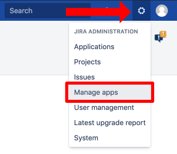

3. If you are redirected to Administrator Access page, enter the **Password** and click the **Confirm** button.

	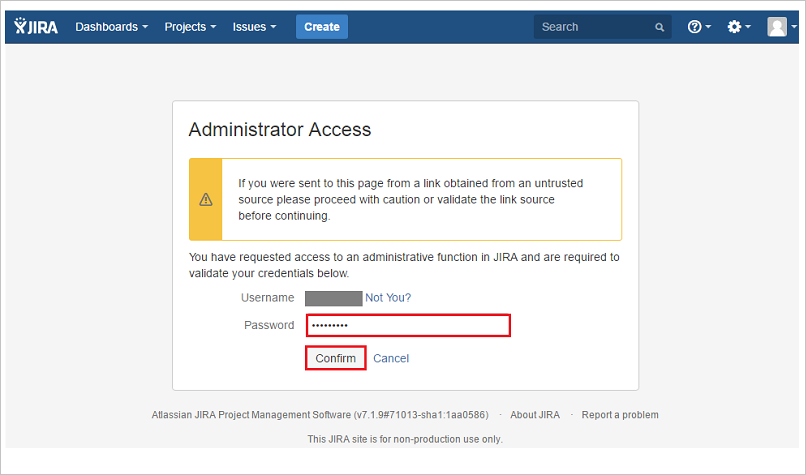

4. Jira normally redirects you to the Atlassian marketplace. If not, click on **Find new apps** in the left panel. Search for **SAML Single Sign On (SSO) for JIRA** and click the **Install** button to install the SAML plugin.

	

5. The plugin installation will start. When it's done, click the **Close** button.

	

	

6. Then, click **Manage**.

	
    
8. Afterwards, click **Configure** to configure the just installed plugin.

	

9. In the **SAML SingleSignOn Plugin Configuration** wizard, click **Add new IdP** to configure Azure AD as a new Identity Provider.

	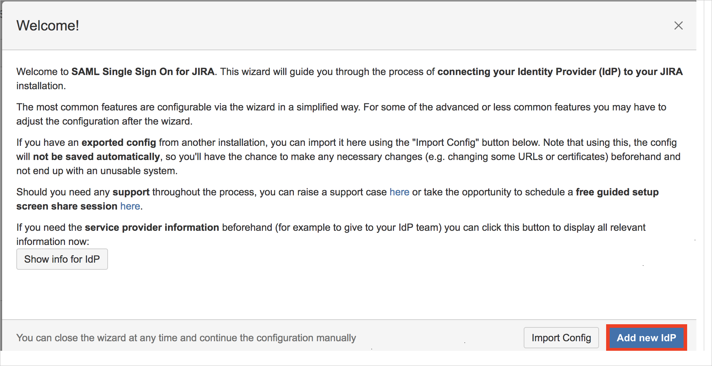 

10. On the **Choose your SAML Identity Provider** page, perform the following steps:

	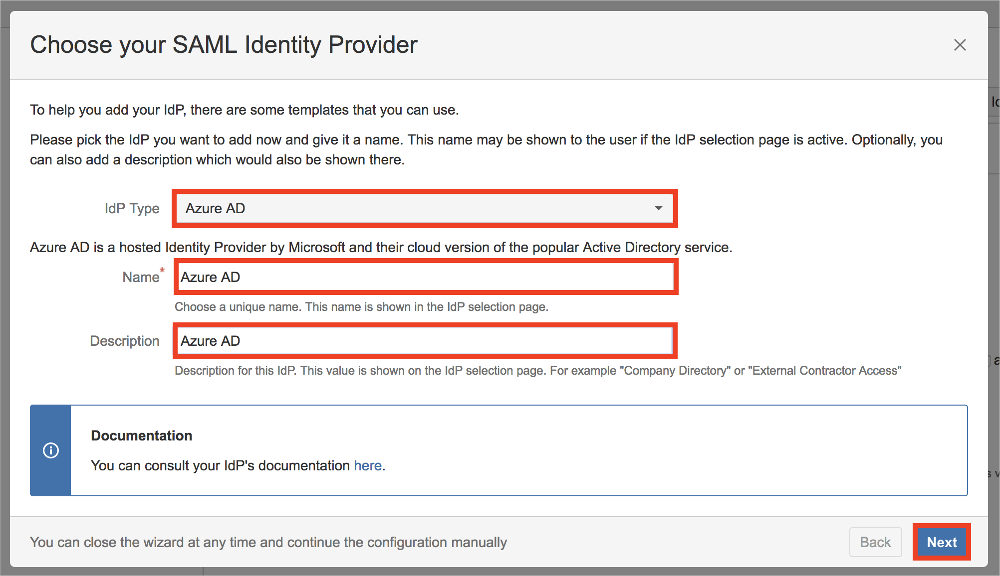
 
	a. Set **Azure AD** as the IdP type.
	
	b. Add the **Name** of the Identity Provider (e.g Azure AD).
	
	c. Add an (optional) **Description** of the Identity Provider (e.g Azure AD).
	
	d. Click **Next**.
	
11. On the **Identity provider configuration** page, click **Next**.
 
	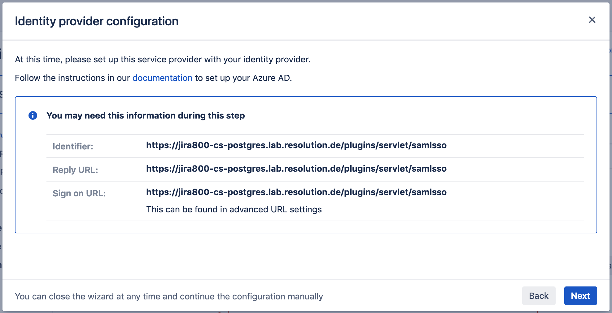

12. On **Import SAML IdP Metadata** page, perform the following steps:

	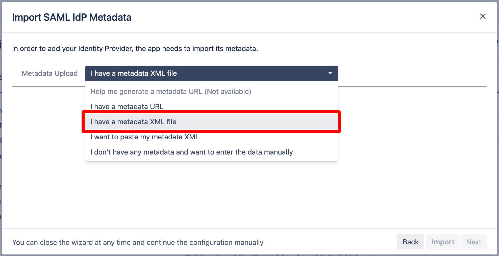

    a. Click the **Select Metadata XML File** button and pick the **Federation Metadata XML** file you downloaded before.

    b. Click the **Import** button.
     
    c. Wait briefly until the import succeeds.  
     
    d. Click the **Next** button.
    
13. On **User ID attribute and transformation** page, click the **Next** button.

	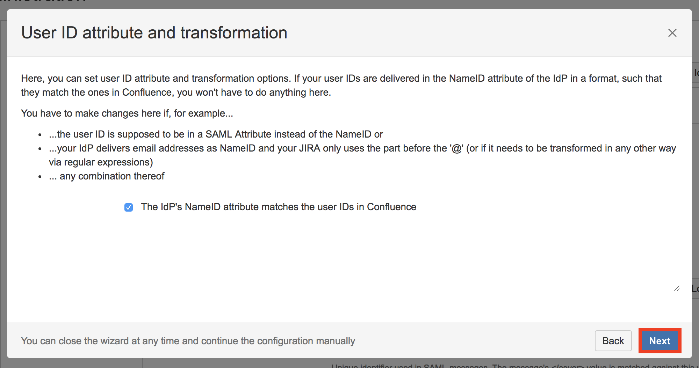
	
14. On the **User creation and update** page, click **Save & Next** to save the settings.
	
	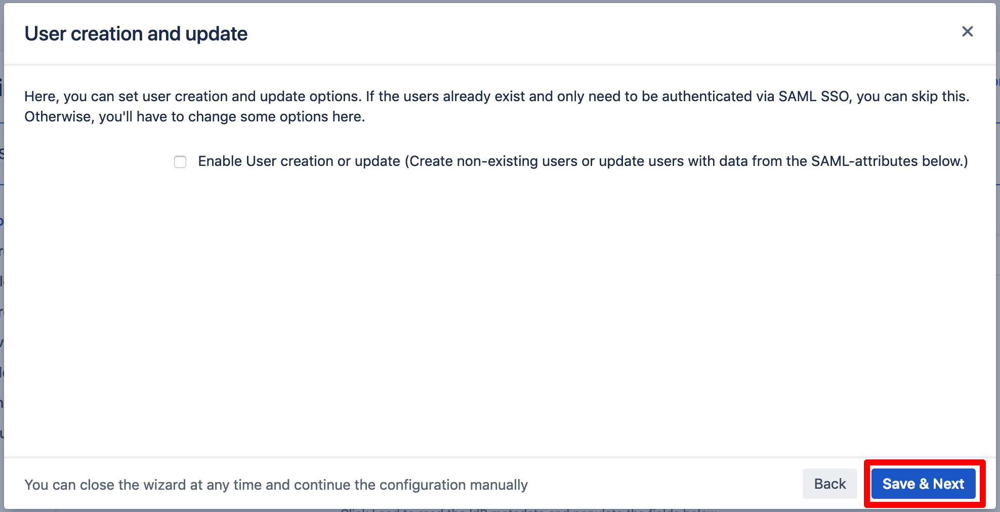
	
15. On the **Test your settings** page, click **Skip test & configure manually** to skip the user test for now. This will be performed in the next section and requires some settings in the Azure portal.
	
	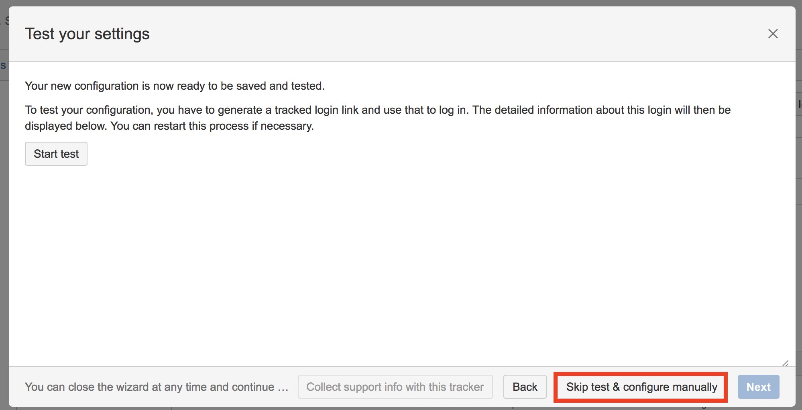
	
16. Click **OK** to skip the warning.
	
	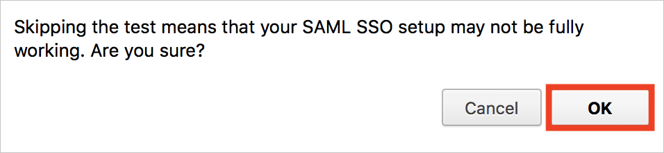

### Create an Azure AD test user

The objective of this section is to create a test user in the Azure portal called Britta Simon. With the user, you will test single sign-on.

1. In the Azure portal, in the left pane, select **Azure Active Directory**, select **Users**, and then select **All users**.

    

2. Choose **New user** at the top of the screen.

    

3. In the **User properties**, perform the following steps:

    

    a. In the **Name** field, enter **Britta Simon**.
  
    b. In the **User name** field, enter <b>BrittaSimon@contoso.com</b>.

    c. Select the **Show password** check box, and then write down the value that's displayed in the Password box.

    d. Click **Create**.

### Assign the Azure AD test user

In this section, you add Britta Simon to the enterprise application, which allows her to use single sign-on.

1. In the Azure portal, select **Enterprise Applications**, and then select **All applications**. 

	

2. In the applications list, search for the enterprise application you've created in the beginning of this tutorial. If you are following the steps of the tutorial, it's called **SAML SSO for Jira by resolution GmbH**. If you've given it a another name, search for that name.

	

3. In the left panel, click **Users and groups**.

    

4. Select **Add user**, and then select  **Users and groups** in the **Add Assignment** dialog.

    

5. In the **Users and groups** dialog, select **Britta Simon** from the Users list, and then click the **Select** button at the bottom of the screen.

6. If you're expecting any role value in the SAML assertion, then in the **Select Role** dialog, select the appropriate role for the user from the list, and then click the **Select** button at the bottom of the screen.

7. In the **Add Assignment** dialog, click the **Assign** button.

### Create the test user also in Jira

To enable Azure AD users to sign in to SAML SSO for Jira by resolution GmbH, they must be provisioned into SAML SSO for Jira by resolution GmbH. For the case of this tutorial, you have to do the provisioning by hand. However, there are also other provisioning models available for the SAML SSO plugin by resolution, for example **Just In Time** provisioning. Refer to their documentation at [SAML SSO by resolution GmbH](https://wiki.resolution.de/doc/saml-sso/latest/all). If you have a question about it, contact support at [resolution support](https://www.resolution.de/go/support).

**To manually provision a user account, perform the following steps:**

1. Sign in to Jira instance as an administrator.

2. Hover over the cog and select **User management**.

   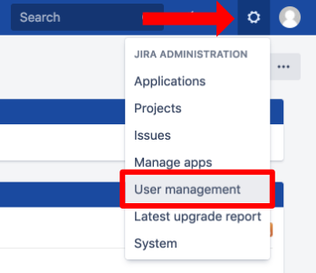

3. If you are redirected to the Administrator Access page, then enter the **Password** and click the **Confirm** button.

	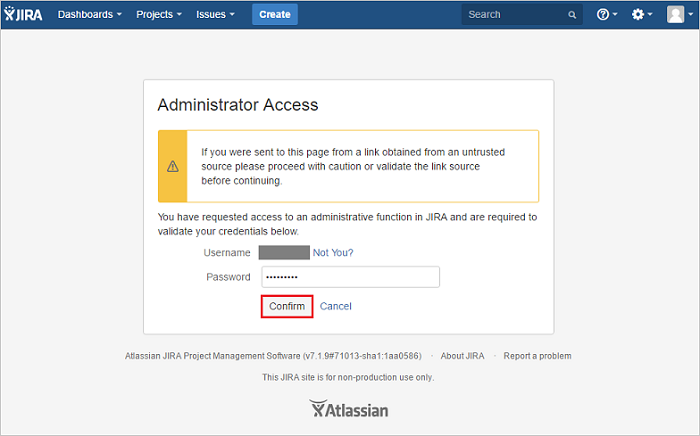 

4. Under the **User management** tab section, click **create user**.

	 

5. On the **“Create new user”** dialog page, perform the following steps. You have to create the user exactly like in Azure AD:

	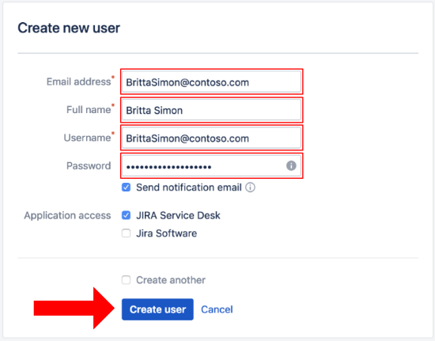 

	a. In the **Email address** textbox, type the email address of the user:  <b>BrittaSimon@contoso.com</b>.

	b. In the **Full Name** textbox, type full name of the user: **Britta Simon**.

	c. In the **Username** textbox, type the email address of the user: <b>BrittaSimon@contoso.com</b>. 

	d. In the **Password** textbox, enter the password of the user.

	e. Click **Create user** to finish the user creation.

### Test single sign-on

In this section, you test your Azure AD single sign-on configuration using the Access Panel.

When you click the SAML SSO for Jira by resolution GmbH tile in the Access Panel, you should be automatically signed in to the SAML SSO for Jira by resolution GmbH for which you set up SSO. For more information about the Access Panel, see [Introduction to the Access Panel](https://docs.microsoft.com/azure/active-directory/active-directory-saas-access-panel-introduction).

You can also test single sign-on, if you navigate to `https://<server-base-url>/plugins/servlet/samlsso`. Substitute **\<server-base-url>** with the base URL of your Jira instance.

## Enable single sign-on redirection for Jira

As noted in the section before, there are currently two ways to trigger the single sign-on. Either by using the **Azure portal** or using **a special link to your Jira instance**. The SAML SSO plugin by resolution GmbH also allows you to trigger single sign-on by simply **accessing any URL pointing to your Jira instance**.

In essence, all users accessing Jira will be redirected to the single sign-on after activating an option in the plugin.

To activate SSO redirect, do the following in **your Jira instance**:

1. Access the configuration page of the SAML SSO plugin in Jira.
1. Click on **Redirection** in the left panel.
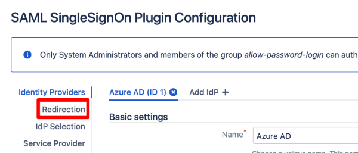

1. Tick **Enable SSO Redirect**.
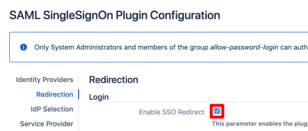 

1. Press the **Save Settings** button in the top right corner.

After activating the option, you can still reach the username/password prompt if the **Enable nosso** option is ticked by navigating to `https://\<server-base-url>/login.jsp?nosso`. As always, substitute **\<server-base-url>** with your base URL.

## Additional resources

- [List of Tutorials on How to Integrate SaaS Apps with Azure Active Directory](https://docs.microsoft.com/azure/active-directory/active-directory-saas-tutorial-list)

- [What is application access and single sign-on with Azure Active Directory?](https://docs.microsoft.com/azure/active-directory/active-directory-appssoaccess-whatis)

- [What is Conditional Access in Azure Active Directory?](https://docs.microsoft.com/azure/active-directory/conditional-access/overview)

