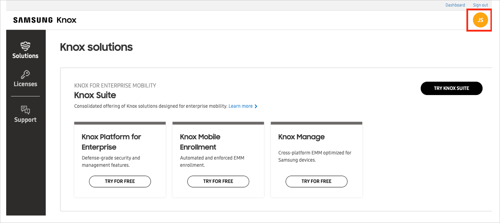

# Tutorial: Azure Active Directory single sign-on (SSO) integration with Samsung Knox and Business Services

In this tutorial, you'll learn how to integrate Samsung Knox and Business Services with Azure Active Directory (Azure AD). When you integrate Samsung Knox and Business Services with Azure AD, you can:

* Control in Azure AD who has access to Samsung Knox and Business Services.
* Enable your users to be automatically signed-in to Samsung Knox and Business Services with their Azure AD accounts.
* Manage your accounts in one central location - the Azure portal.

## Prerequisites

To get started, you need the following items:

* An Azure AD subscription. If you don't have a subscription, you can get a [free account](https://azure.microsoft.com/free/).
* A Samsung Knox account.

## Scenario description

In this tutorial, you configure and test Azure AD SSO in a test environment.

* Samsung Knox and Business Services supports **SP** initiated SSO.

> [!NOTE]
> Identifier of this application is a fixed string value so only one instance can be configured in one tenant.

## Adding Samsung Knox and Business Services from the gallery

To configure the integration of Samsung Knox and Business Services into Azure AD, you need to add Samsung Knox and Business Services from the gallery to your list of managed SaaS apps.

1. Sign in to the Azure portal using either a work or school account, or a personal Microsoft account.
1. On the left navigation pane, select the **Azure Active Directory** service.
1. Navigate to **Enterprise Applications** and then select **All Applications**.
1. To add new application, select **New application**.
1. In the **Add from the gallery** section, type **Samsung Knox and Business Services** in the search box.
1. Select **Samsung Knox and Business Services** from results panel and then add the app. Wait a few seconds while the app is added to your tenant.

## Configure and test Azure AD SSO for Samsung Knox and Business Services

Configure and test Azure AD SSO with Samsung Knox and Business Services using a test user called **B.Simon**. For SSO to work, you need to establish a link relationship between an Azure AD user and the related user in [SamsungKnox.com](https://samsungknox.com/).

To configure and test Azure AD SSO with Samsung Knox and Business Services, perform the following steps:

1. **[Configure Azure AD SSO](#configure-azure-ad-sso)** - to enable your users to use this feature.
    1. **[Create an Azure AD test user](#create-an-azure-ad-test-user)** - to test Azure AD single sign-on with B.Simon.
    1. **[Assign the Azure AD test user](#assign-the-azure-ad-test-user)** - to enable B.Simon to use Azure AD single sign-on.
1. **[Configure Samsung Knox and Business Services SSO](#configure-samsung-knox-and-business-services-sso)** - to configure the single sign-on settings on application side.
    1. **[Create Samsung Knox and Business Services test user](#create-samsung-knox-and-business-services-test-user)** - to have a counterpart of B.Simon in Samsung Knox and Business Services that is linked to the Azure AD representation of user.
1. **[Test SSO](#test-sso)** - to verify whether the configuration works.

## Configure Azure AD SSO

Follow these steps to enable Azure AD SSO in the Azure portal.

1. In the Azure portal, on the **Samsung Knox and Business Services** application integration page, find the **Manage** section and select **single sign-on**.
1. On the **Select a single sign-on method** page, select **SAML**.
1. On the **Set up single sign-on with SAML** page, click the pencil icon for **Basic SAML Configuration** to edit the settings.

   

1. On the **Basic SAML Configuration** section, enter the values for the following fields:

	* In the **Sign on URL** text box, type the URL:
	`https://www2.samsungknox.com/en/sso/login/ad`
	* In the **Reply URL (assertion consumer service URL)** text box, type the URL: 
	`https://central.samsungknox.com/ams/ad/saml/acs`
	
	

1. On the **Set up single sign-on with SAML** page, In the **SAML Signing Certificate** section, click copy button to copy **App Federation Metadata Url** and save it on your computer.

	

### Create an Azure AD test user

In this section, you'll create a test user in the Azure portal called B.Simon.

1. From the left pane in the Azure portal, select **Azure Active Directory**, select **Users**, and then select **All users**.
1. Select **New user** at the top of the screen.
1. In the **User** properties, follow these steps:
   1. In the **Name** field, enter `B.Simon`.  
   1. In the **User name** field, enter the username@companydomain.extension. For example, `B.Simon@contoso.com`.
   1. Select the **Show password** check box, and then write down the value that's displayed in the **Password** box.
   1. Click **Create**.

### Assign the Azure AD test user

In this section, you'll enable B.Simon to use Azure single sign-on by granting access to Samsung Knox and Business Services.

1. In the Azure portal, select **Enterprise Applications**, and then select **All applications**.
1. In the applications list, select **Samsung Knox and Business Services**.
1. In the app's overview page, find the **Manage** section and select **Users and groups**.
1. Select **Add user**, then select **Users and groups** in the **Add Assignment** dialog.
1. In the **Users and groups** dialog, select **B.Simon** from the Users list, then click the **Select** button at the bottom of the screen.
1. If you are expecting a role to be assigned to the users, you can select it from the **Select a role** dropdown. If no role has been set up for this app, you see "Default Access" role selected.
1. In the **Add Assignment** dialog, click the **Assign** button.

## Configure Samsung Knox and Business Services SSO

1. In a different web browser window, sign in to [SamsungKnox.com](https://samsungknox.com/) as an administrator.

1. Click on the **Avatar** on the top right corner.

    

1. In the left sidebar, click **ACTIVE DIRECTORY SETTINGS** and perform the following steps.

    

    a. In the **Identifier(entity ID)** textbox, paste the **Identifier** value which you have entered in the Azure portal.

    b. In the **App federation metadata URL** textbox, paste the **App Federation Metadata Url** value which you have copied from the Azure portal.

    c. Click on **CONNECT TO AD SSO**.

### Create Samsung Knox and Business Services test user

In this section, you create a user called Britta Simon in Samsung Knox and Business Services. Refer to the [Knox Configure](https://docs.samsungknox.com/admin/knox-configure/Administrators.htm) or [Knox Mobile Enrollment](https://docs.samsungknox.com/admin/knox-mobile-enrollment/kme-add-an-admin.htm) admin guides for instructions on how to invite a sub-administrator, or test user, to your Samsung Knox organization. Users must be created and activated before you use single sign-on.

## Test SSO 

In this section, you test your Azure AD single sign-on configuration with following options. 

* Click on **Test this application** in Azure portal. This will redirect to [SamsungKnox.com](https://samsungknox.com/), where you can initiate the login flow. 

* Go to [SamsungKnox.com](https://samsungknox.com/) directly and initiate the login flow from there.

* You can use Microsoft My Apps. When you click the Samsung Knox and Business Services tile in the My Apps, this will redirect to [SamsungKnox.com](https://samsungknox.com/). For more information about the My Apps, see [Introduction to the My Apps](../user-help/my-apps-portal-end-user-access.md).

## Next steps

Once you configure Samsung Knox and Business Services you can enforce session control, which protects exfiltration and infiltration of your organization’s sensitive data in real time. Session control extends from Conditional Access. [Learn how to enforce session control with Microsoft Cloud App Security](/cloud-app-security/proxy-deployment-any-app).