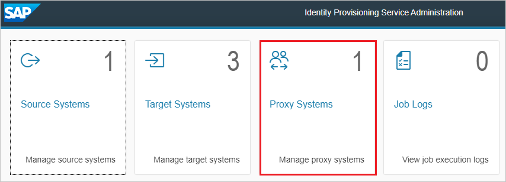
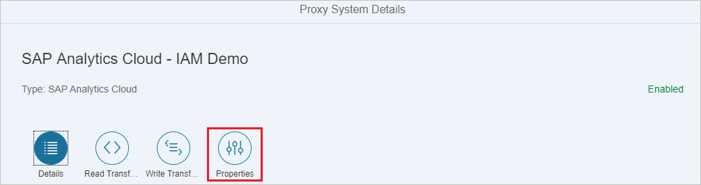
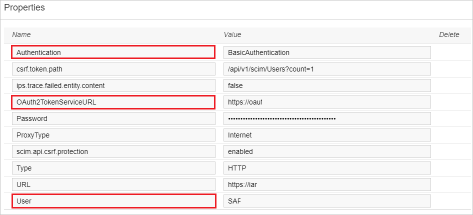
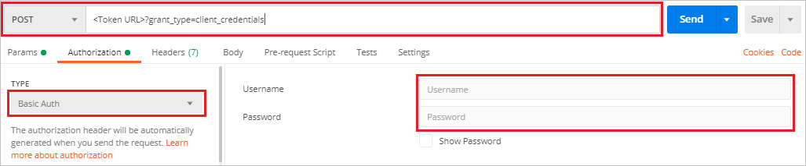
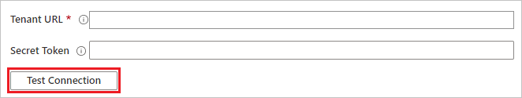

# Tutorial: Configure SAP Analytics Cloud for automatic user provisioning

This tutorial describes the steps you need to perform in both SAP Analytics Cloud and Azure Active Directory (Azure AD) to configure automatic user provisioning. When configured, Azure AD automatically provisions and de-provisions users and groups to [SAP Analytics Cloud](https://www.sapanalytics.cloud/) using the Azure AD Provisioning service. For important details on what this service does, how it works, and frequently asked questions, see [Automate user provisioning and deprovisioning to SaaS applications with Azure Active Directory](../app-provisioning/user-provisioning.md). 

## Capabilities supported
> [!div class="checklist"]
> * Create users in SAP Analytics Cloud
> * Remove users in SAP Analytics Cloud when they do not require access anymore
> * Keep user attributes synchronized between Azure AD and SAP Analytics Cloud
> * [Single sign-on](sapboc-tutorial.md) to SAP Analytics Cloud (recommended)

## Prerequisites

The scenario outlined in this tutorial assumes that you already have the following prerequisites:

* [An Azure AD tenant](../develop/quickstart-create-new-tenant.md) 
* A user account in Azure AD with [permission](../roles/permissions-reference.md) to configure provisioning (e.g. Application Administrator, Cloud Application administrator, Application Owner, or Global Administrator). 
* A SAP Analytics Cloud tenant
* A user account on SAP Identity Provisioning admin console with Admin permissions. Make sure you have access to the proxy systems in the Identity Provisioning admin console. If you don't see the **Proxy Systems** tile, create an incident for component **BC-IAM-IPS** to request access to this tile.
* An OAuth client with authorization grant Client Credentials in SAP Analytics Cloud. To learn how, see: [Managing OAuth Clients and Trusted Identity Providers](https://help.sap.com/viewer/00f68c2e08b941f081002fd3691d86a7/release/en-US/4f43b54398fc4acaa5efa32badfe3df6.html)

## Step 1. Plan your provisioning deployment

1. Learn about [how the provisioning service works](../app-provisioning/user-provisioning.md).
2. Determine who will be in [scope for provisioning](../app-provisioning/define-conditional-rules-for-provisioning-user-accounts.md).
3. Determine what data to [map between Azure AD and SAP Analytics Cloud](../app-provisioning/customize-application-attributes.md). 

## Step 2. Configure SAP Analytics Cloud to support provisioning with Azure AD

1. Sign into [SAP Identity Provisioning admin console](https://ips-xlnk9v890j.dispatcher.us1.hana.ondemand.com/) with your administrator account and then select **Proxy Systems**.

   

2. Select **Properties**.

   

3. Copy the **URL** and append `/api/v1/scim` to the URL. Save this for later to use in the **Tenant URL** field.

   

4. Use [POSTMAN](https://www.postman.com/) to perform a POST HTTPS call to the address: `<Token URL>?grant_type=client_credentials` where `Token URL` is the URL in the **OAuth2TokenServiceURL** field. This step is needed to generate an access token to be used in the Secret Token field when configuring automatic provisioning.

   

5. In Postman, use **Basic Authentication**, and set the OAuth client ID as the user and the secret as the password. This call returns an access token. Keep this copied for later to use in the **Secret Token** field.

   

## Step 3. Add SAP Analytics Cloud from the Azure AD application gallery

Add SAP Analytics Cloud from the Azure AD application gallery to start managing provisioning to SAP Analytics Cloud. If you have previously setup SAP Analytics Cloud for SSO you can use the same application. However it is recommended that you create a separate app when testing out the integration initially. Learn more about adding an application from the gallery [here](../manage-apps/add-application-portal.md). 

## Step 4. Define who will be in scope for provisioning 

The Azure AD provisioning service allows you to scope who will be provisioned based on assignment to the application and or based on attributes of the user / group. If you choose to scope who will be provisioned to your app based on assignment, you can use the following [steps](../manage-apps/assign-user-or-group-access-portal.md) to assign users and groups to the application. If you choose to scope who will be provisioned based solely on attributes of the user or group, you can use a scoping filter as described [here](../app-provisioning/define-conditional-rules-for-provisioning-user-accounts.md). 

* When assigning users and groups to SAP Analytics Cloud, you must select a role other than **Default Access**. Users with the Default Access role are excluded from provisioning and will be marked as not effectively entitled in the provisioning logs. If the only role available on the application is the default access role, you can [update the application manifest](../develop/howto-add-app-roles-in-azure-ad-apps.md) to add additional roles. 

* Start small. Test with a small set of users and groups before rolling out to everyone. When scope for provisioning is set to assigned users and groups, you can control this by assigning one or two users or groups to the app. When scope is set to all users and groups, you can specify an [attribute based scoping filter](../app-provisioning/define-conditional-rules-for-provisioning-user-accounts.md). 

## Step 5. Configure automatic user provisioning to SAP Analytics Cloud 

This section guides you through the steps to configure the Azure AD provisioning service to create, update, and disable users and/or groups in TestApp based on user and/or group assignments in Azure AD.

### To configure automatic user provisioning for SAP Analytics Cloud in Azure AD:

1. Sign in to the [Azure portal](https://portal.azure.com). Select **Enterprise Applications**, then select **All applications**.

	

2. In the applications list, select **SAP Analytics Cloud**.

	

3. Select the **Provisioning** tab.

	

4. Set the **Provisioning Mode** to **Automatic**.

	

5. Under the **Admin Credentials** section, input the tenant URL value retrieved earlier in **Tenant URL**. Input the access token value retrieved earlier in **Secret Token**. Click **Test Connection** to ensure Azure AD can connect to InVision. If the connection fails, ensure your SAP Analytics Cloud account has Admin permissions and try again.

 	

6. In the **Notification Email** field, enter the email address of a person or group who should receive the provisioning error notifications and select the **Send an email notification when a failure occurs** check box.

	

7. Select **Save**.

8. Under the **Mappings** section, select **Provision Azure Active Directory Users**.

9. Review the user attributes that are synchronized from Azure AD to SAP Analytics Cloud in the **Attribute-Mapping** section. The attributes selected as **Matching** properties are used to match the user accounts in SAP Analytics Cloud for update operations. If you choose to change the [matching target attribute](../app-provisioning/customize-application-attributes.md), you will need to ensure that the SAP Analytics Cloud API supports filtering users based on that attribute. Select the **Save** button to commit any changes.

   |Attribute|Type|Supported for filtering|
   |---|---|---|
   |userName|String|&check;|
   |name.givenName|String|
   |name.familyName|String|
   |active|Boolean|
   |emails[type eq "work"].value|String|
   |urn:ietf:params:scim:schemas:extension:enterprise:2.0:User:manager|String|

10. To configure scoping filters, refer to the following instructions provided in the [Scoping filter tutorial](../app-provisioning/define-conditional-rules-for-provisioning-user-accounts.md).

11. To enable the Azure AD provisioning service for SAP Analytics Cloud, change the **Provisioning Status** to **On** in the **Settings** section.

	

12. Define the users and/or groups that you would like to provision to SAP Analytics Cloud by choosing the desired values in **Scope** in the **Settings** section.

	

13. When you are ready to provision, click **Save**.

	

This operation starts the initial synchronization cycle of all users and groups defined in **Scope** in the **Settings** section. The initial cycle takes longer to perform than subsequent cycles, which occur approximately every 40 minutes as long as the Azure AD provisioning service is running. 

## Step 6. Monitor your deployment
Once you've configured provisioning, use the following resources to monitor your deployment:

1. Use the [provisioning logs](../reports-monitoring/concept-provisioning-logs.md) to determine which users have been provisioned successfully or unsuccessfully
2. Check the [progress bar](../app-provisioning/application-provisioning-when-will-provisioning-finish-specific-user.md) to see the status of the provisioning cycle and how close it is to completion
3. If the provisioning configuration seems to be in an unhealthy state, the application will go into quarantine. Learn more about quarantine states [here](../app-provisioning/application-provisioning-quarantine-status.md).

## Additional resources

* [Managing user account provisioning for Enterprise Apps](../app-provisioning/configure-automatic-user-provisioning-portal.md)
* [What is application access and single sign-on with Azure Active Directory?](../manage-apps/what-is-single-sign-on.md)

## Next steps

* [Learn how to review logs and get reports on provisioning activity](../app-provisioning/check-status-user-account-provisioning.md)