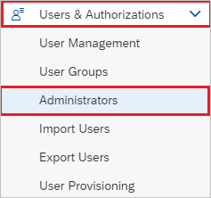
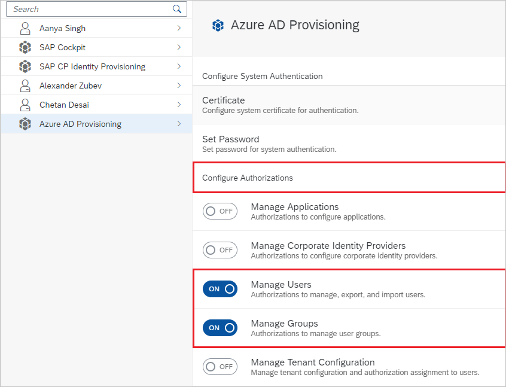
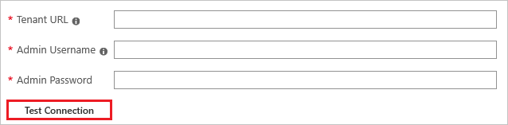
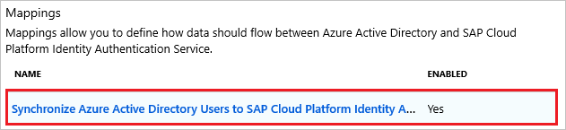
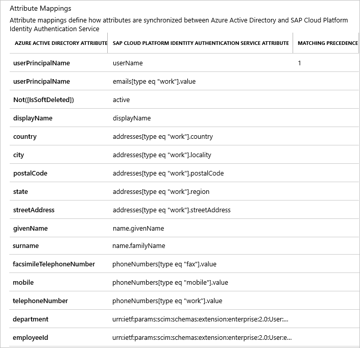

# Tutorial: Configure SAP Cloud Platform Identity Authentication for automatic user provisioning

The objective of this tutorial is to demonstrate the steps to be performed in SAP Cloud Platform Identity Authentication and Azure Active Directory (Azure AD) to configure Azure AD to automatically provision and de-provision users and/or groups to SAP Cloud Platform Identity Authentication.

> [!NOTE]
> This tutorial describes a connector built on top of the Azure AD User Provisioning Service. For important details on what this service does, how it works, and frequently asked questions, see [Automate user provisioning and deprovisioning to SaaS applications with Azure Active Directory](../app-provisioning/user-provisioning.md).
>
> This connector is currently in Public Preview. For more information on the general Microsoft Azure terms of use for Preview features, see [Supplemental Terms of Use for Microsoft Azure Previews](https://azure.microsoft.com/support/legal/preview-supplemental-terms/).

## Prerequisites

The scenario outlined in this tutorial assumes that you already have the following prerequisites:

* An Azure AD tenant
* [A SAP Cloud Platform Identity Authentication tenant](https://cloudplatform.sap.com/pricing.html)
* A user account in SAP Cloud Platform Identity Authentication with Admin permissions.

## Assigning users to SAP Cloud Platform Identity Authentication

Azure Active Directory uses a concept called *assignments* to determine which users should receive access to selected apps. In the context of automatic user provisioning, only the users and/or groups that have been assigned to an application in Azure AD are synchronized.

Before configuring and enabling automatic user provisioning, you should decide which users and/or groups in Azure AD need access to SAP Cloud Platform Identity Authentication. Once decided, you can assign these users and/or groups to SAP Cloud Platform Identity Authentication by following the instructions here:
* [Assign a user or group to an enterprise app](../manage-apps/assign-user-or-group-access-portal.md)

## Important tips for assigning users to SAP Cloud Platform Identity Authentication

* It is recommended that a single Azure AD user is assigned to SAP Cloud Platform Identity Authentication to test the automatic user provisioning configuration. Additional users and/or groups may be assigned later.

* When assigning a user to SAP Cloud Platform Identity Authentication, you must select any valid application-specific role (if available) in the assignment dialog. Users with the **Default Access** role are excluded from provisioning.

## Setup SAP Cloud Platform Identity Authentication for provisioning

1. Sign in to your [SAP Cloud Platform Identity Authentication Admin Console](https://sapmsftintegration.accounts.ondemand.com/admin). Navigate to **Users & Authorizations > Administrators**.

	

2. 	Press the **+Add** button on the left hand panel in order to add a new administrator to the list. Choose **Add System** and enter the name of the system.   

> [!NOTE]
> The admininistrator user in SAP Cloud Platform Identity Authentication must be of type **System**. Creating a normal administrator user can lead to *unauthorized* errors while provisioning.   

3.	Under Configure Authorizations, switch on the toggle button against **Manage Users** and **Manage Groups**.

	

4. You will receive an email to activate your account and set a password for **SAP Cloud Platform Identity Authentication Service**.

4.	Copy the **User ID** and **Password**. These values will be entered in the Admin Username and Admin Password fields respectively in the Provisioning tab of your SAP Cloud Platform Identity Authentication application in the Azure portal.

## Add SAP Cloud Platform Identity Authentication from the gallery

Before configuring SAP Cloud Platform Identity Authentication for automatic user provisioning with Azure AD, you need to add SAP Cloud Platform Identity Authentication from the Azure AD application gallery to your list of managed SaaS applications.

**To add SAP Cloud Platform Identity Authentication from the Azure AD application gallery, perform the following steps:**

1. In the **[Azure portal](https://portal.azure.com)**, in the left navigation panel, select **Azure Active Directory**.

	

2. Go to **Enterprise applications**, and then select **All applications**.

	

3. To add a new application, select the **New application** button at the top of the pane.

	

4. In the search box, enter **SAP Cloud Platform Identity Authentication**, select **SAP Cloud Platform Identity Authentication** in the results panel, and then click the **Add** button to add the application.

	

## Configuring automatic user provisioning to SAP Cloud Platform Identity Authentication 

This section guides you through the steps to configure the Azure AD provisioning service to create, update, and disable users and/or groups in SAP Cloud Platform Identity Authentication based on user and/or group assignments in Azure AD.

> [!TIP]
> You may also choose to enable SAML-based single sign-on for SAP Cloud Platform Identity Authentication , following the instructions provided in the [SAP Cloud Platform Identity Authentication Single sign-on tutorial](https://docs.microsoft.com/azure/active-directory/saas-apps/sap-hana-cloud-platform-identity-authentication-tutorial). Single sign-on can be configured independently of automatic user provisioning, though these two features compliment each other

### To configure automatic user provisioning for SAP Cloud Platform Identity Authentication in Azure AD:

1. Sign in to the [Azure portal](https://portal.azure.com). Select **Enterprise Applications**, then select **All applications**.

	

2. In the applications list, select **SAP Cloud Platform Identity Authentication**.

	

3. Select the **Provisioning** tab.

	

4. Set the **Provisioning Mode** to **Automatic**.

	

5. Under the **Admin Credentials** section, input `https://<tenantID>.accounts.ondemand.com/service/scim ` in **Tenant URL**. Input the **User ID** and **Password** values retrieved earlier in **Admin Username** and **Admin Password** respectively. Click **Test Connection** to ensure Azure AD can connect to SAP Cloud Platform Identity Authentication. If the connection fails, ensure your SAP Cloud Platform Identity Authentication account has Admin permissions and try again.

	

6. In the **Notification Email** field, enter the email address of a person or group who should receive the provisioning error notifications and check the checkbox - **Send an email notification when a failure occurs**.

	

7. Click **Save**.

8. Under the **Mappings** section, select **Synchronize Azure Active Directory Users to SAP Cloud Platform Identity Authentication**.

	

9. Review the user attributes that are synchronized from Azure AD to SAP Cloud Platform Identity Authentication in the **Attribute Mapping** section. The attributes selected as **Matching** properties are used to match the user accounts in SAP Cloud Platform Identity Authentication for update operations. Select the **Save** button to commit any changes.

	

10. To configure scoping filters, refer to the following instructions provided in the [Scoping filter tutorial](../app-provisioning/define-conditional-rules-for-provisioning-user-accounts.md).

11. To enable the Azure AD provisioning service for SAP Cloud Platform Identity Authentication, change the **Provisioning Status** to **On** in the **Settings** section.

	

12. Define the users and/or groups that you would like to provision to SAP Cloud Platform Identity Authentication by choosing the desired values in **Scope** in the **Settings** section.

	

13. When you are ready to provision, click **Save**.

	

This operation starts the initial synchronization of all users and/or groups defined in **Scope** in the **Settings** section. The initial sync takes longer to perform than subsequent syncs, which occur approximately every 40 minutes as long as the Azure AD provisioning service is running. You can use the **Synchronization Details** section to monitor progress and follow links to provisioning activity report, which describes all actions performed by the Azure AD provisioning service on SAP Cloud Platform Identity Authentication.

For more information on how to read the Azure AD provisioning logs, see [Reporting on automatic user account provisioning](../app-provisioning/check-status-user-account-provisioning.md).

## Connector limitations

* SAP Cloud Platform Identity Authentication's SCIM endpoint requires certain attributes to be of specific format. You can know more about these attributes and their specific format [here](https://help.sap.com/viewer/6d6d63354d1242d185ab4830fc04feb1/Cloud/en-US/b10fc6a9a37c488a82ce7489b1fab64c.html#).

## Additional resources

* [Managing user account provisioning for Enterprise Apps](../app-provisioning/configure-automatic-user-provisioning-portal.md)
* [What is application access and single sign-on with Azure Active Directory?](../manage-apps/what-is-single-sign-on.md)

## Next steps

* [Learn how to review logs and get reports on provisioning activity](../app-provisioning/check-status-user-account-provisioning.md)

