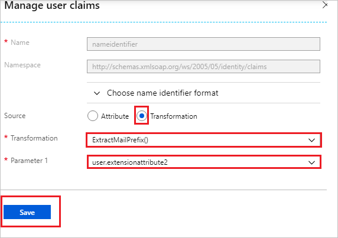
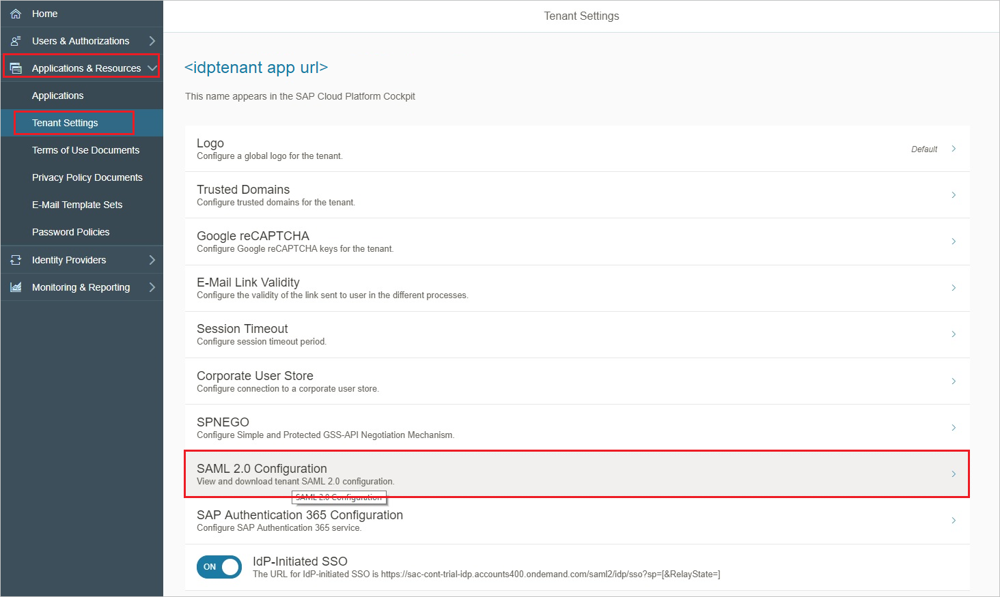
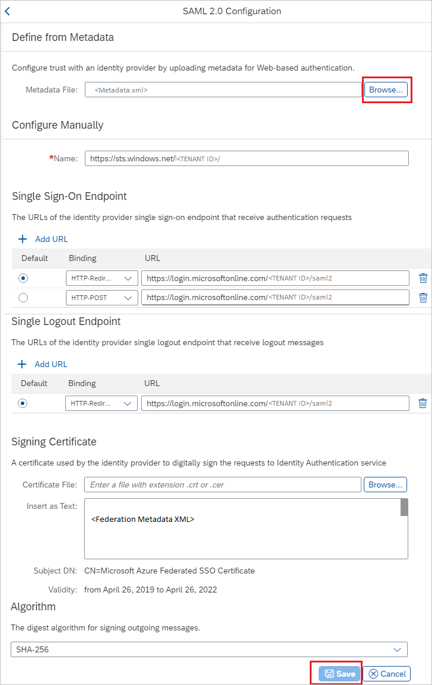
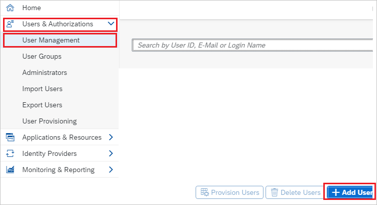
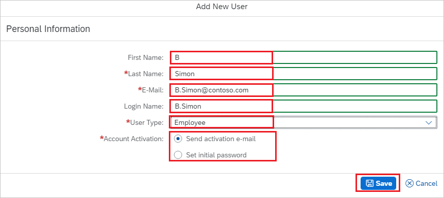

# Tutorial: Microsoft Entra SSO integration with SAP Cloud for Customer

In this tutorial, you learn how to integrate SAP Cloud for Customer with Microsoft Entra ID. When you integrate SAP Cloud for Customer with Microsoft Entra ID, you can:

* Control in Microsoft Entra ID who has access to SAP Cloud for Customer.
* Enable your users to be automatically signed-in to SAP Cloud for Customer with their Microsoft Entra accounts.
* Manage your accounts in one central location.

## Prerequisites

To get started, you need the following items:

* A Microsoft Entra subscription. If you don't have a subscription, you can get a [free account](https://azure.microsoft.com/free/).
* SAP Cloud for Customer single sign-on (SSO) enabled subscription.

## Scenario description

In this tutorial, you configure and test Microsoft Entra SSO in a test environment.

* SAP Cloud for Customer supports **SP** initiated SSO.

## Add SAP Cloud for Customer from the gallery

To configure the integration of SAP Cloud for Customer into Microsoft Entra ID, you need to add SAP Cloud for Customer from the gallery to your list of managed SaaS apps.

1. Sign in to the [Microsoft Entra admin center](https://entra.microsoft.com) as at least a [Cloud Application Administrator](../roles/permissions-reference.md#cloud-application-administrator).
1. Browse to **Identity** > **Applications** > **Enterprise applications** > **New application**.
1. In the **Add from the gallery** section, type **SAP Cloud for Customer** in the search box.
1. Select **SAP Cloud for Customer** from results panel and then add the app. Wait a few seconds while the app is added to your tenant.

 Alternatively, you can also use the [Enterprise App Configuration Wizard](https://portal.office.com/AdminPortal/home?Q=Docs#/azureadappintegration). In this wizard, you can add an application to your tenant, add users/groups to the app, assign roles, and walk through the SSO configuration as well. [Learn more about Microsoft 365 wizards.](/microsoft-365/admin/misc/azure-ad-setup-guides)

## Configure and test Microsoft Entra SSO for SAP Cloud for Customer

Configure and test Microsoft Entra SSO with SAP Cloud for Customer using a test user called **B.Simon**. For SSO to work, you need to establish a link relationship between a Microsoft Entra user and the related user in SAP Cloud for Customer.

To configure and test Microsoft Entra SSO with SAP Cloud for Customer, complete the following building blocks:

1. **[Configure Microsoft Entra SSO](#configure-azure-ad-sso)** - to enable your users to use this feature.
    1. **[Create a Microsoft Entra test user](#create-an-azure-ad-test-user)** - to test Microsoft Entra single sign-on with B.Simon.
    1. **[Assign the Microsoft Entra test user](#assign-the-azure-ad-test-user)** - to enable B.Simon to use Microsoft Entra single sign-on.
1. **[Configure SAP Cloud for Customer SSO](#configure-sap-cloud-for-customer-sso)** - to configure the single sign-on settings on application side.
    1. **[Create SAP Cloud for Customer test user](#create-sap-cloud-for-customer-test-user)** - to have a counterpart of B.Simon in SAP Cloud for Customer that is linked to the Microsoft Entra representation of user.
1. **[Test SSO](#test-sso)** - to verify whether the configuration works.

## Configure Microsoft Entra SSO

Follow these steps to enable Microsoft Entra SSO.

1. Sign in to the [Microsoft Entra admin center](https://entra.microsoft.com) as at least a [Cloud Application Administrator](../roles/permissions-reference.md#cloud-application-administrator).
1. Browse to **Identity** > **Applications** > **Enterprise applications** > **SAP Cloud for Customer** > **Single sign-on**.
1. On the **Select a single sign-on method** page, select **SAML**.
1. On the **Set up single sign-on with SAML** page, click the pencil icon for **Basic SAML Configuration** to edit the settings.

   

1. On the **Basic SAML Configuration** section, enter the values for the following fields:

	a. In the **Sign on URL** text box, type a URL using the following pattern:
    `https://<server name>.crm.ondemand.com`

    b. In the **Identifier (Entity ID)** text box, type a URL using the following pattern:
    `https://<server name>.crm.ondemand.com`

	> [!NOTE]
	> These values are not real. Update these values with the actual Sign on URL and Identifier. Contact [SAP Cloud for Customer Client support team](https://www.sap.com/about/agreements.sap-cloud-services-customers.html) to get these values. You can also refer to the patterns shown in the **Basic SAML Configuration** section.

1. SAP Cloud for Customer application expects the SAML assertions in a specific format, which requires you to add custom attribute mappings to your SAML token attributes configuration. The following screenshot shows the list of default attributes. Click **Edit** icon to open User Attributes dialog.

	

1. In the **User Attributes** section on the **User Attributes & Claims** dialog, perform the following steps:

	a. Click **Edit icon** to open the **Manage user claims** dialog.

	

	

	b. Select **Transformation** as **source**.

	c. From the **Transformation** list, select **ExtractMailPrefix()**.

	d. From the **Parameter 1** list, select the user attribute you want to use for your implementation.
    For example, if you want to use the EmployeeID as unique user identifier and you have stored the attribute value in the ExtensionAttribute2, then select user.extensionattribute2.

	e. Click **Save**.

1. On the **Set up single sign-on with SAML** page, in the **SAML Signing Certificate** section,  find **Federation Metadata XML** and select **Download** to download the certificate and save it on your computer.

	

1. On the **Set up SAP Cloud for Customer** section, copy the appropriate URL(s) based on your requirement.

	

### Create a Microsoft Entra test user

In this section, you create a test user called B.Simon.

1. Sign in to the [Microsoft Entra admin center](https://entra.microsoft.com) as at least a [User Administrator](../roles/permissions-reference.md#user-administrator).
1. Browse to **Identity** > **Users** > **All users**.
1. Select **New user** > **Create new user**, at the top of the screen.
1. In the **User** properties, follow these steps:
   1. In the **Display name** field, enter `B.Simon`.  
   1. In the **User principal name** field, enter the username@companydomain.extension. For example, `B.Simon@contoso.com`.
   1. Select the **Show password** check box, and then write down the value that's displayed in the **Password** box.
   1. Select **Review + create**.
1. Select **Create**.

### Assign the Microsoft Entra test user

In this section, you enable B.Simon to use Azure single sign-on by granting access to SAP Cloud for Customer.

1. Sign in to the [Microsoft Entra admin center](https://entra.microsoft.com) as at least a [Cloud Application Administrator](../roles/permissions-reference.md#cloud-application-administrator).
1. Browse to **Identity** > **Applications** > **Enterprise applications** > **SAP Cloud for Customer**.
1. In the app's overview page, select **Users and groups**.
1. Select **Add user/group**, then select **Users and groups** in the **Add Assignment** dialog.
   1. In the **Users and groups** dialog, select **B.Simon** from the Users list, then click the **Select** button at the bottom of the screen.
   1. If you are expecting a role to be assigned to the users, you can select it from the **Select a role** dropdown. If no role has been set up for this app, you see "Default Access" role selected.
   1. In the **Add Assignment** dialog, click the **Assign** button.

## Configure SAP Cloud for Customer SSO

1. Open a new web browser window and sign into your SAP Cloud for Customer company site as an administrator.

2. Go to **Applications & Resources** > **Tenant Settings** and select **SAML 2.0 Configuration**.

	

3. On the **SAML 2.0 Configuration** section, perform the following steps:

	

	a. Click **Browse** to upload the Federation Metadata XML file, which you have downloaded previously.

	b. Once the XML file is successfully uploaded, the below values get auto populated automatically then click **Save**.

### Create SAP Cloud for Customer test user

To enable Microsoft Entra users to sign in to SAP Cloud for Customer, they must be provisioned into SAP Cloud for Customer. In SAP Cloud for Customer, provisioning is a manual task.

**To provision a user account, perform the following steps:**

1. Sign in to SAP Cloud for Customer as a Security Administrator.

2. From the left side of the menu, click on **Users & Authorizations** > **User Management** > **Add User**.

	

3. On the **Add New User** section, perform the following steps:

	

	a. In the **First Name** text box, enter the name of user like **B**.

	b. In the **Last Name** text box, enter the name of user like **Simon**.

	c. In **E-Mail** text box, enter the email of user like `B.Simon@contoso.com`.

	d. In the **Login Name** text box, enter the name of user like **B.Simon**.

	e. Select **User Type** as per your requirement.

	f. Select **Account Activation** option as per your requirement.

## Test SSO 

In this section, you test your Microsoft Entra single sign-on configuration with following options. 

* Click on **Test this application**, this will redirect to SAP Cloud for Customer Sign-on URL where you can initiate the login flow. 

* Go to SAP Cloud for Customer Sign-on URL directly and initiate the login flow from there.

* You can use Microsoft My Apps. When you click the SAP Cloud for Customer tile in the My Apps, this will redirect to SAP Cloud for Customer Sign-on URL. For more information about the My Apps, see [Introduction to the My Apps](https://support.microsoft.com/account-billing/sign-in-and-start-apps-from-the-my-apps-portal-2f3b1bae-0e5a-4a86-a33e-876fbd2a4510).

## Next steps

Once you configure the SAP Cloud for Customer you can enforce session controls, which protect exfiltration and infiltration of your organization’s sensitive data in real time. Session controls extend from Conditional Access. [Learn how to enforce session control with Microsoft Defender for Cloud Apps](/cloud-app-security/proxy-deployment-aad).
