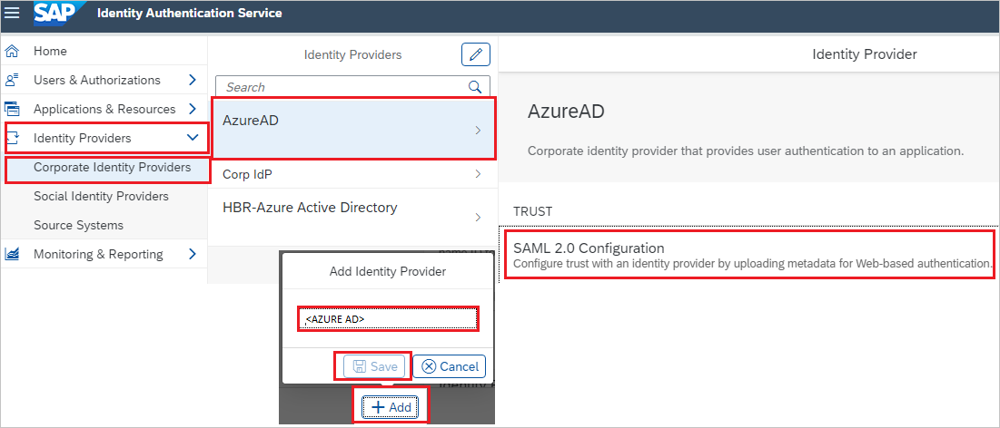

# Tutorial: Azure Active Directory single sign-on (SSO) integration with SAP Cloud for Customer

In this tutorial, you'll learn how to integrate SAP Cloud for Customer with Azure Active Directory (Azure AD). When you integrate SAP Cloud for Customer with Azure AD, you can:

* Control in Azure AD who has access to SAP Cloud for Customer.
* Enable your users to be automatically signed-in to SAP Cloud for Customer with their Azure AD accounts.
* Manage your accounts in one central location - the Azure portal.

To learn more about SaaS app integration with Azure AD, see [What is application access and single sign-on with Azure Active Directory](../manage-apps/what-is-single-sign-on.md).

## Prerequisites

To get started, you need the following items:

* An Azure AD subscription. If you don't have a subscription, you can get a [free account](https://azure.microsoft.com/free/).
* SAP Cloud for Customer single sign-on (SSO) enabled subscription.

## Scenario description

In this tutorial, you configure and test Azure AD SSO in a test environment.

* SAP Cloud for Customer supports **SP** initiated SSO

## Adding SAP Cloud for Customer from the gallery

To configure the integration of SAP Cloud for Customer into Azure AD, you need to add SAP Cloud for Customer from the gallery to your list of managed SaaS apps.

1. Sign in to the [Azure portal](https://portal.azure.com) using either a work or school account, or a personal Microsoft account.
1. On the left navigation pane, select the **Azure Active Directory** service.
1. Navigate to **Enterprise Applications** and then select **All Applications**.
1. To add new application, select **New application**.
1. In the **Add from the gallery** section, type **SAP Cloud for Customer** in the search box.
1. Select **SAP Cloud for Customer** from results panel and then add the app. Wait a few seconds while the app is added to your tenant.

## Configure and test Azure AD single sign-on for SAP Cloud for Customer

Configure and test Azure AD SSO with SAP Cloud for Customer using a test user called **B.Simon**. For SSO to work, you need to establish a link relationship between an Azure AD user and the related user in SAP Cloud for Customer.

To configure and test Azure AD SSO with SAP Cloud for Customer, complete the following building blocks:

1. **[Configure Azure AD SSO](#configure-azure-ad-sso)** - to enable your users to use this feature.
    1. **[Create an Azure AD test user](#create-an-azure-ad-test-user)** - to test Azure AD single sign-on with B.Simon.
    1. **[Assign the Azure AD test user](#assign-the-azure-ad-test-user)** - to enable B.Simon to use Azure AD single sign-on.
1. **[Configure SAP Cloud for Customer SSO](#configure-sap-cloud-for-customer-sso)** - to configure the single sign-on settings on application side.
    1. **[Create SAP Cloud for Customer test user](#create-sap-cloud-for-customer-test-user)** - to have a counterpart of B.Simon in SAP Cloud for Customer that is linked to the Azure AD representation of user.
1. **[Test SSO](#test-sso)** - to verify whether the configuration works.

## Configure Azure AD SSO

Follow these steps to enable Azure AD SSO in the Azure portal.

1. In the [Azure portal](https://portal.azure.com/), on the **SAP Cloud for Customer** application integration page, find the **Manage** section and select **single sign-on**.
1. On the **Select a single sign-on method** page, select **SAML**.
1. On the **Set up single sign-on with SAML** page, click the edit/pen icon for **Basic SAML Configuration** to edit the settings.

   

1. On the **Basic SAML Configuration** section, enter the values for the following fields:

	a. In the **Sign on URL** text box, type a URL using the following pattern:
    `https://<server name>.crm.ondemand.com`

    b. In the **Identifier (Entity ID)** text box, type a URL using the following pattern:
    `https://<server name>.crm.ondemand.com`

	> [!NOTE]
	> These values are not real. Update these values with the actual Sign on URL and Identifier. Contact [SAP Cloud for Customer Client support team](https://www.sap.com/about/agreements.sap-cloud-services-customers.html) to get these values. You can also refer to the patterns shown in the **Basic SAML Configuration** section in the Azure portal.

1. SAP Cloud for Customer application expects the SAML assertions in a specific format, which requires you to add custom attribute mappings to your SAML token attributes configuration. The following screenshot shows the list of default attributes. Click **Edit** icon to open User Attributes dialog.

	

1. In the **User Attributes** section on the **User Attributes & Claims** dialog, perform the following steps:

	a. Click **Edit icon** to open the **Manage user claims** dialog.

	

	

	b. Select **Transformation** as **source**.

	c. From the **Transformation** list, select **ExtractMailPrefix()**.

	d. From the **Parameter 1** list, select the user attribute you want to use for your implementation.
    For example, if you want to use the EmployeeID as unique user identifier and you have stored the attribute value in the ExtensionAttribute2, then select user.extensionattribute2.

	e. Click **Save**.

1. On the **Set up single sign-on with SAML** page, in the **SAML Signing Certificate** section,  find **Federation Metadata XML** and select **Download** to download the certificate and save it on your computer.

	

1. On the **Set up SAP Cloud for Customer** section, copy the appropriate URL(s) based on your requirement.

	

### Create an Azure AD test user

In this section, you'll create a test user in the Azure portal called B.Simon.

1. From the left pane in the Azure portal, select **Azure Active Directory**, select **Users**, and then select **All users**.
1. Select **New user** at the top of the screen.
1. In the **User** properties, follow these steps:
   1. In the **Name** field, enter `B.Simon`.  
   1. In the **User name** field, enter the username@companydomain.extension. For example, `B.Simon@contoso.com`.
   1. Select the **Show password** check box, and then write down the value that's displayed in the **Password** box.
   1. Click **Create**.

### Assign the Azure AD test user

In this section, you'll enable B.Simon to use Azure single sign-on by granting access to SAP Cloud for Customer.

1. In the Azure portal, select **Enterprise Applications**, and then select **All applications**.
1. In the applications list, select **SAP Cloud for Customer**.
1. In the app's overview page, find the **Manage** section and select **Users and groups**.

   

1. Select **Add user**, then select **Users and groups** in the **Add Assignment** dialog.

	

1. In the **Users and groups** dialog, select **B.Simon** from the Users list, then click the **Select** button at the bottom of the screen.
1. If you're expecting any role value in the SAML assertion, in the **Select Role** dialog, select the appropriate role for the user from the list and then click the **Select** button at the bottom of the screen.
1. In the **Add Assignment** dialog, click the **Assign** button.

## Configure SAP Cloud for Customer SSO

1. Open a new web browser window and sign into your SAP Cloud for Customer company site as an administrator.

2. From the left side of menu, click on **Identity Providers** > **Corporate Identity Providers** > **Add** and on the pop-up add the Identity provider name like **Azure AD**, click **Save** then click on **SAML 2.0 Configuration**.

	

3. On the **SAML 2.0 Configuration** section, perform the following steps:

	

	a. Click **Browse** to upload the Federation Metadata XML file, which you have downloaded from Azure portal.

	b. Once the XML file is successfully uploaded, the below values will get auto populated automatically then click **Save**.

### Create SAP Cloud for Customer test user

To enable Azure AD users to sign in to SAP Cloud for Customer, they must be provisioned into SAP Cloud for Customer. In SAP Cloud for Customer, provisioning is a manual task.

**To provision a user account, perform the following steps:**

1. Sign in to SAP Cloud for Customer as a Security Administrator.

2. From the left side of the menu, click on **Users & Authorizations** > **User Management** > **Add User**.

	

3. On the **Add New User** section, perform the following steps:

	

	a. In the **First Name** text box, enter the name of user like **B**.

	b. In the **Last Name** text box, enter the name of user like **Simon**.

	c. In **E-Mail** text box, enter the email of user like `B.Simon@contoso.com`.

	d. In the **Login Name** text box, enter the name of user like **B.Simon**.

	e. Select **User Type** as per your requirement.

	f. Select **Account Activation** option as per your requirement.

## Test SSO 

In this section, you test your Azure AD single sign-on configuration using the Access Panel.

When you click the SAP Cloud for Customer tile in the Access Panel, you should be automatically signed in to the SAP Cloud for Customer for which you set up SSO. For more information about the Access Panel, see [Introduction to the Access Panel](../user-help/my-apps-portal-end-user-access.md).

## Additional resources

- [ List of Tutorials on How to Integrate SaaS Apps with Azure Active Directory ](./tutorial-list.md)

- [What is application access and single sign-on with Azure Active Directory? ](../manage-apps/what-is-single-sign-on.md)

- [What is conditional access in Azure Active Directory?](../conditional-access/overview.md)

- [Try SAP Cloud for Customer with Azure AD](https://aad.portal.azure.com/)