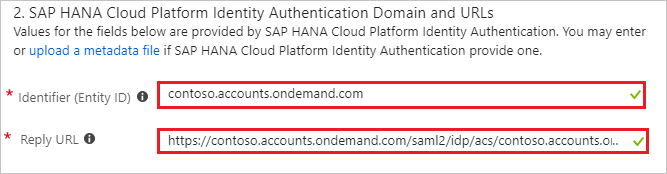
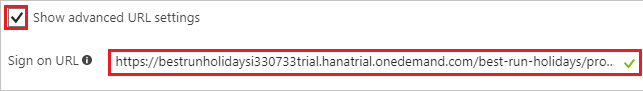
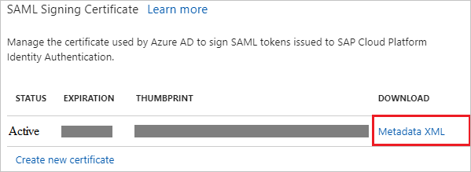
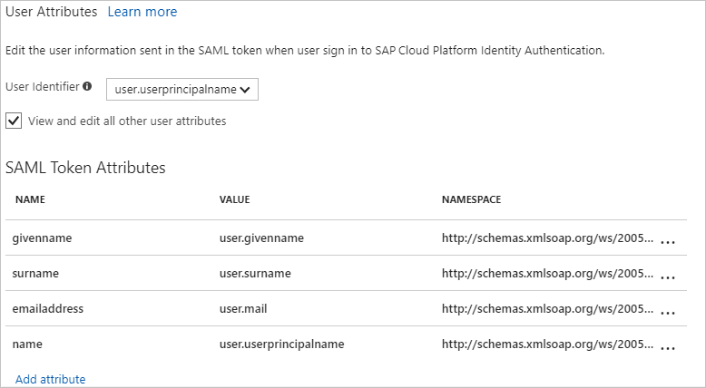
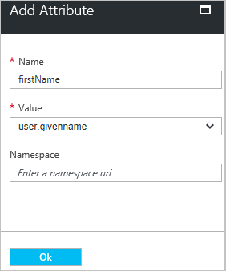
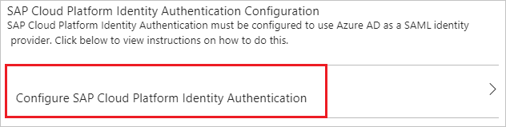

# Tutorial: Azure Active Directory integration with SAP Cloud Platform Identity Authentication

In this tutorial, you learn how to integrate SAP Cloud Platform Identity Authentication with Azure Active Directory (Azure AD). SAP Cloud Platform Identity Authentication is used as a proxy IdP to access SAP applications that use Azure AD as the main IdP.

When you integrate SAP Cloud Platform Identity Authentication with Azure AD, you get the following benefits:

- You can control in Azure AD who has access to the SAP applications.
- You can enable your users to automatically sign in to SAP applications with their Azure AD accounts.
- You can manage your accounts in one central location--the Azure portal.

For more information about SaaS app integration with Azure AD, see the article [What is application access and single sign-on with Azure Active Directory](../manage-apps/what-is-single-sign-on.md).

## Prerequisites

To configure Azure AD integration with SAP Cloud Platform Identity Authentication, you need the following items:

- An Azure AD subscription.
- A single sign-on-enabled subscription for SAP Cloud Platform Identity Authentication.

> [!NOTE]
> We don't recommend using a production environment to test the steps in this tutorial.

To test the steps in this tutorial, follow these recommendations:

- Don't use your production environment unless it's necessary.
- If you don't have an Azure AD trial environment, [get a one-month free trial](https://azure.microsoft.com/pricing/free-trial/).

## Scenario description
In this tutorial, you test Azure AD single sign-on in a test environment. 
The scenario that's outlined in this tutorial consists of two main building blocks:

1. Adding SAP Cloud Platform Identity Authentication from the gallery
1. Configuring and testing Azure AD single sign-on

Before you dive into the technical details, it's vital to understand the concepts you're going to look at. The SAP Cloud Platform Identity Authentication and Active Directory Federation Services enable you to implement SSO across applications or services that are protected by Azure AD (as an IdP) with SAP applications and services that are protected by SAP Cloud Platform Identity Authentication.

Currently, SAP Cloud Platform Identity Authentication acts as a Proxy Identity Provider to SAP applications. Azure Active Directory in turn acts as the leading Identity Provider in this setup. 

The following diagram illustrates this relationship:

With this setup, your SAP Cloud Platform Identity Authentication tenant is configured as a trusted application in Azure Active Directory. 

All SAP applications and services that you want to protect this way are subsequently configured in the SAP Cloud Platform Identity Authentication management console.

Therefore, the authorization for granting access to SAP applications and services needs to take place in SAP Cloud Platform Identity Authentication (as opposed to Azure Active Directory).

By configuring SAP Cloud Platform Identity Authentication as an application through the Azure Active Directory Marketplace, you don't need to configure individual claims or SAML assertions.

>[!NOTE] 
>Currently only Web SSO has been tested by both parties. The flows that are necessary for App-to-API or API-to-API communication should work but have not been tested yet. They will be tested during subsequent activities.
>

## Add SAP Cloud Platform Identity Authentication from the gallery
To configure the integration of SAP Cloud Platform Identity Authentication in Azure AD, you need to add SAP Cloud Platform Identity Authentication from the gallery to your list of managed SaaS apps.

**To add SAP Cloud Platform Identity Authentication from the gallery, take the following steps:**

1. In the [Azure portal](https://portal.azure.com), on the left navigation panel, select the **Azure Active Directory** icon. 

	![The Azure Active Directory button][1]

1. Go to **Enterprise applications**. Then go to **All applications**.

	![The Enterprise applications blade][2]
	
1. To add new the new application, select the **New application** button at the top of the dialog box.

	![The New application button][3]

1. In the search box, type **SAP Cloud Platform Identity Authentication**. 

1. Select **SAP Cloud Platform Identity Authentication** from the results panel, and then select the **Add** button.

	

## Configure and test Azure AD single sign-on

In this section, you configure and test Azure AD single sign-on with SAP Cloud Platform Identity Authentication. You configure and test it with a test user called "Britta Simon."

For single sign-on to work, Azure AD needs to know who the counterpart user in SAP Cloud Platform Identity Authentication is. In other words, you need to establish a link between an Azure AD user and the related user in SAP Cloud Platform Identity Authentication.

In SAP Cloud Platform Identity Authentication, give the value **Username** the same value as **user name** in Azure AD. Now you have established the link between the two users.

To configure and test Azure AD single sign-on with SAP Cloud Platform Identity Authentication, complete the following building blocks:

1. [Configure Azure AD single sign-on](#configure-azure-ad-single-sign-on) to enable your users to use this feature.
1. [Create an Azure AD test user](#create-an-azure-ad-test-user) to test Azure AD single sign-on with Britta Simon.
1. [Create an SAP Cloud Platform Identity Authentication test user](#create-an-sap-cloud-platform-identity-authentication-test-user) to have a counterpart of Britta Simon in SAP Cloud Platform Identity Authentication that is linked to the Azure AD representation of user.
1. [Assign the Azure AD test user](#assign-the-azure-ad-test-user) to enable Britta Simon to use Azure AD single sign-on.
1. [Test single sign-on](#test-single-sign-on) to verify that the configuration works.

### Configure Azure AD single sign-on

In this section, you enable Azure AD single sign-on in the Azure portal and configure single sign-on in your SAP Cloud Platform Identity Authentication application.

**To configure Azure AD single sign-on with SAP Cloud Platform Identity Authentication, take the following steps:**

1. In the Azure portal, on the **SAP Cloud Platform Identity Authentication** application integration page, select **Single sign-on**.

	![Configure single sign-on link][4]

1. In the **Single sign-on** dialog box, under **SAML-based Sign-on**, select **Mode** to enable single sign-on.
 
	

1. If you want to configure the application in **IDP** initiated mode, in the **SAP Cloud Platform Identity Authentication Domain and URLs** section, perform the following steps:  

	

	a. In the **Identifier** box, type a URL with the following pattern: `<IAS-tenant-id>.accounts.ondemand.com`

	b. In the **Reply URL** box, type a URL with the following pattern: `https://<IAS-tenant-id>.accounts.ondemand.com/saml2/idp/acs/<IAS-tenant-id>.accounts.ondemand.com`

	> [!NOTE]
	> These values are not real. Update these values with the actual identifier and Reply URL. Contact the [SAP Cloud Platform Identity Authentication Client support team](https://cloudplatform.sap.com/capabilities/security/trustcenter.html) to get these values. If you don't understand Identifier value, read the SAP Cloud Platform Identity Authentication documentation about [Tenant SAML 2.0 configuration](https://help.hana.ondemand.com/cloud_identity/frameset.htm?e81a19b0067f4646982d7200a8dab3ca.html).

1. If you want to configure the application in **SP** initiated mode, select **Show advanced URL settings**.

	

	In the **Sign On URL** box, type a URL with the following pattern: `{YOUR BUSINESS APPLICATION URL}`.

	> [!NOTE]
	> This value is not real. Update this value with the actual sign-on URL. Please use your specific business application Sign-on URL. Contact the [SAP Cloud Platform Identity Authentication Client support team](https://cloudplatform.sap.com/capabilities/security/trustcenter.html) if you have any doubt.

1. In the **SAML Signing Certificate** section, select **Metadata XML**. Then save the metadata file on your computer.

	

1. SAP Cloud Platform Identity Authentication application expects the SAML assertions in a specific format. Manage the values of these attributes from the **User Attributes** section on the application integration page. The following screenshot shows an example of the format. 

	

1. If your SAP application expects an attribute such as **firstName**, add the **firstName** attribute in the **User Attributes** section. This option is available in the **Single sign-on** dialog box of the **SAML token attributes** dialog box..

	a. To open the **Add Attribute** dialog box, select **Add attribute**. 
	
	
	
	
	
	b. In the **Name** box, type the attribute name **firstName**.
	
	c. From the **Value** list, select the attribute value **user.givenname**.
	
	d. Select **Ok**.

1. Select the **Save** button.

	

1. In the **SAP Cloud Platform Identity Authentication Configuration** section, select **Configure SAP Cloud Platform Identity Authentication** to open the **Configure sign-on** window. Copy the **Sign-Out URL, SAML Entity ID, and SAML Single Sign-On Service URL** from the **Quick Reference section.**

	 

1. To get SSO configured for your application, go to the SAP Cloud Platform Identity Authentication administration console. The URL has the following pattern: `https://<tenant-id>.accounts.ondemand.com/admin`. Then read the documentation about SAP Cloud Platform Identity Authentication at [Integration with Microsoft Azure AD](https://help.hana.ondemand.com/cloud_identity/frameset.htm?626b17331b4d4014b8790d3aea70b240.html). 

1. In the Azure portal, select the **Save** button.

1. Continue with the following only if you want to add and enable SSO for another SAP application. Repeat the steps under the section **Adding SAP Cloud Platform Identity Authentication from the gallery**.

1. In the Azure portal, on the **SAP Cloud Platform Identity Authentication** application integration page, select **Linked Sign-on**.

 	

1. Save the configuration.

>[!NOTE] 
>The new application leverages the single sign-on configuration of the previous SAP application. Make sure you use the same Corporate Identity Providers in the SAP Cloud Platform Identity Authentication administration console.

> [!TIP]
> You can now read a concise version of these instructions inside the [Azure portal](https://portal.azure.com) while you are setting up the app!  After adding this app from the **Active Directory** > **Enterprise Applications** section,  select  the **Single Sign-On** tab and access the embedded documentation through the **Configuration** section at the bottom. You can read more about the embedded documentation feature at [Azure AD embedded documentation]( https://go.microsoft.com/fwlink/?linkid=845985).
> 

### Create an Azure AD test user

The objective of this section is to create a test user in the Azure portal called Britta Simon.

   ![Create an Azure AD test user][100]

**To create a test user in Azure AD, take the following steps:**

1. In the Azure portal, in the left pane, select the **Azure Active Directory** button.

    

1. To display the list of users, go to **Users and groups**, and then select **All users**.

    

1. To open the **User** dialog box, select **Add** at the top of the **All Users** dialog box.

    

1. In the **User** dialog box, take the following steps:

    

    a. In the **Name** box, type **BrittaSimon**.

    b. In the **User name** box, type the email address of user Britta Simon.

    c. Select the **Show Password** check box, and then write down the value that's displayed in the **Password** box.

    d. Select **Create**.
 
### Create an SAP Cloud Platform Identity Authentication test user

You don't need to create a user in SAP Cloud Platform Identity Authentication. Users who are in the Azure AD user store can use the SSO functionality.

SAP Cloud Platform Identity Authentication supports the Identity Federation option. This option allows the application to check whether users who are authenticated by the corporate identity provider exist in the user store of SAP Cloud Platform Identity Authentication. 

The Identity Federation option is disabled by default. If Identity Federation is enabled, only the users that are imported in SAP Cloud Platform Identity Authentication can access the application. 

For more information about how to enable or disable Identity Federation with SAP Cloud Platform Identity Authentication, see "Enable Identity Federation with SAP Cloud Platform Identity Authentication" in [Configure Identity Federation with the User Store of SAP Cloud Platform Identity Authentication](https://help.hana.ondemand.com/cloud_identity/frameset.htm?c029bbbaefbf4350af15115396ba14e2.html).

### Assign the Azure AD test user

In this section, you enable Britta Simon to use Azure single sign-on by granting access to SAP Cloud Platform Identity Authentication.

![Assign the user role][200] 

**To assign Britta Simon to SAP Cloud Platform Identity Authentication, take the following steps:**

1. In the Azure portal, open the applications view, and then go to the directory view. Next, go to **Enterprise applications**, and then select **All applications**.

	![Assign User][201] 

1. In the applications list, select **SAP Cloud Platform Identity Authentication**.

	  

1. In the menu on the left, select **Users and groups**.

	![The "Users and groups" link][202]

1. Select the **Add** button. Then select **Users and groups** in the **Add Assignment** dialog box.

	![The Add Assignment pane][203]

1. In the **Users and groups** dialog box, select **Britta Simon** in the users list.

1. Click the **Select** button in the **Users and groups** dialog box.

1. Select the **Assign** button in the **Add Assignment** dialog box.
	
### Test single sign-on

In this section, you test your Azure AD single sign-on configuration by using the access panel.

When you select the SAP Cloud Platform Identity Authentication tile in the access panel, you get automatically signed into your SAP Cloud Platform Identity Authentication application.

For more information about the access panel, see [Introduction to the access panel](../user-help/active-directory-saas-access-panel-introduction.md). 

## Additional resources

* [List of tutorials on how to integrate SaaS Apps with Azure Active Directory](tutorial-list.md)
* [What is application access and single sign-on with Azure Active Directory?](../manage-apps/what-is-single-sign-on.md)

<!--Image references-->

[1]: ./media/sapcloudauth-tutorial/tutorial_general_01.png
[2]: ./media/sapcloudauth-tutorial/tutorial_general_02.png
[3]: ./media/sapcloudauth-tutorial/tutorial_general_03.png
[4]: ./media/sapcloudauth-tutorial/tutorial_general_04.png

[100]: ./media/sapcloudauth-tutorial/tutorial_general_100.png

[200]: ./media/sapcloudauth-tutorial/tutorial_general_200.png
[201]: ./media/sapcloudauth-tutorial/tutorial_general_201.png
[202]: ./media/sapcloudauth-tutorial/tutorial_general_202.png
[203]: ./media/sapcloudauth-tutorial/tutorial_general_203.png
