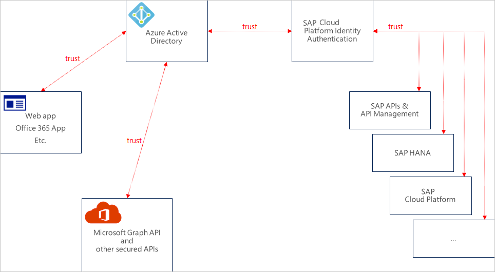
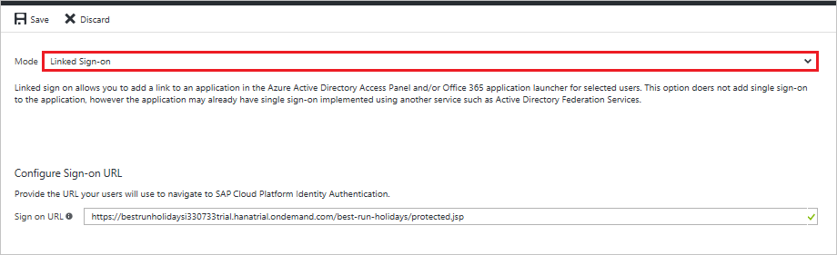

# Tutorial: Azure Active Directory single sign-on (SSO) integration with SAP Cloud Platform Identity Authentication

In this tutorial, you'll learn how to integrate SAP Cloud Platform Identity Authentication with Azure Active Directory (Azure AD). When you integrate SAP Cloud Platform Identity Authentication with Azure AD, you can:

* Control in Azure AD who has access to SAP Cloud Platform Identity Authentication.
* Enable your users to be automatically signed-in to SAP Cloud Platform Identity Authentication with their Azure AD accounts.
* Manage your accounts in one central location - the Azure portal.

To learn more about SaaS app integration with Azure AD, see [What is application access and single sign-on with Azure Active Directory](https://docs.microsoft.com/azure/active-directory/active-directory-appssoaccess-whatis).

## Prerequisites

To get started, you need the following items:

* An Azure AD subscription. If you don't have a subscription, you can get a [free account](https://azure.microsoft.com/free/).
* SAP Cloud Platform Identity Authentication single sign-on (SSO) enabled subscription.

## Scenario description

In this tutorial, you configure and test Azure AD single sign-on in a test environment.

* SAP Cloud Platform Identity Authentication supports **SP** and **IDP** initiated SSO
* Once you configure the SAP Cloud Platform Identity Authentication you can enforce session controls, which protect exfiltration and infiltration of your organization’s sensitive data in real-time. Session controls extend from Conditional Access. [Learn how to enforce session control with Microsoft Cloud App Security](https://docs.microsoft.com/cloud-app-security/proxy-deployment-aad)

Before you dive into the technical details, it's vital to understand the concepts you're going to look at. The SAP Cloud Platform Identity Authentication and Active Directory Federation Services enable you to implement SSO across applications or services that are protected by Azure AD (as an IdP) with SAP applications and services that are protected by SAP Cloud Platform Identity Authentication.

Currently, SAP Cloud Platform Identity Authentication acts as a Proxy Identity Provider to SAP applications. Azure Active Directory in turn acts as the leading Identity Provider in this setup. 

The following diagram illustrates this relationship:

With this setup, your SAP Cloud Platform Identity Authentication tenant is configured as a trusted application in Azure Active Directory.

All SAP applications and services that you want to protect this way are subsequently configured in the SAP Cloud Platform Identity Authentication management console.

Therefore, the authorization for granting access to SAP applications and services needs to take place in SAP Cloud Platform Identity Authentication (as opposed to Azure Active Directory).

By configuring SAP Cloud Platform Identity Authentication as an application through the Azure Active Directory Marketplace, you don't need to configure individual claims or SAML assertions.

> [!NOTE]
> Currently only Web SSO has been tested by both parties. The flows that are necessary for App-to-API or API-to-API communication should work but have not been tested yet. They will be tested during subsequent activities.

## Adding SAP Cloud Platform Identity Authentication from the gallery

To configure the integration of SAP Cloud Platform Identity Authentication into Azure AD, you need to add SAP Cloud Platform Identity Authentication from the gallery to your list of managed SaaS apps.

1. Sign in to the [Azure portal](https://portal.azure.com) using either a work or school account, or a personal Microsoft account.
1. On the left navigation pane, select the **Azure Active Directory** service.
1. Navigate to **Enterprise Applications** and then select **All Applications**.
1. To add new application, select **New application**.
1. In the **Add from the gallery** section, type **SAP Cloud Platform Identity Authentication** in the search box.
1. Select **SAP Cloud Platform Identity Authentication** from results panel and then add the app. Wait a few seconds while the app is added to your tenant.

## Configure and test Azure AD single sign-on for SAP Cloud Platform Identity Authentication

Configure and test Azure AD SSO with SAP Cloud Platform Identity Authentication using a test user called **B.Simon**. For SSO to work, you need to establish a link relationship between an Azure AD user and the related user in SAP Cloud Platform Identity Authentication.

To configure and test Azure AD SSO with SAP Cloud Platform Identity Authentication, complete the following building blocks:

1. **[Configure Azure AD SSO](#configure-azure-ad-sso)** - to enable your users to use this feature.
    * **[Create an Azure AD test user](#create-an-azure-ad-test-user)** - to test Azure AD single sign-on with B.Simon.
    * **[Assign the Azure AD test user](#assign-the-azure-ad-test-user)** - to enable B.Simon to use Azure AD single sign-on.
1. **[Configure SAP Cloud Platform Identity Authentication SSO](#configure-sap-cloud-platform-identity-authentication-sso)** - to configure the single sign-on settings on application side.
    * **[Create SAP Cloud Platform Identity Authentication test user](#create-sap-cloud-platform-identity-authentication-test-user)** - to have a counterpart of B.Simon in SAP Cloud Platform Identity Authentication that is linked to the Azure AD representation of user.
1. **[Test SSO](#test-sso)** - to verify whether the configuration works.

## Configure Azure AD SSO

Follow these steps to enable Azure AD SSO in the Azure portal.

1. In the [Azure portal](https://portal.azure.com/), on the **SAP Cloud Platform Identity Authentication** application integration page, find the **Manage** section and select **single sign-on**.
1. On the **Select a single sign-on method** page, select **SAML**.
1. On the **Set up single sign-on with SAML** page, click the edit/pen icon for **Basic SAML Configuration** to edit the settings.

   

4. On the **Basic SAML Configuration** section, if you wish to configure in **IDP**-initiated mode, perform the following steps:

    

    a. In the **Identifier** text box, type a URL using the following pattern:
	`<IAS-tenant-id>.accounts.ondemand.com`

    b. In the **Reply URL** text box, type a URL using the following pattern:
	`https://<IAS-tenant-id>.accounts.ondemand.com/saml2/idp/acs/<IAS-tenant-id>.accounts.ondemand.com`

	> [!NOTE]
	> These values are not real. Update these values with the actual identifier and Reply URL. Contact the [SAP Cloud Platform Identity Authentication Client support team](https://cloudplatform.sap.com/capabilities/security/trustcenter.html) to get these values. If you don't understand Identifier value, read the SAP Cloud Platform Identity Authentication documentation about [Tenant SAML 2.0 configuration](https://help.hana.ondemand.com/cloud_identity/frameset.htm?e81a19b0067f4646982d7200a8dab3ca.html).

5. Click **Set additional URLs** and perform the following step if you wish to configure the application in **SP**-initiated mode:

    

	In the **Sign-on URL** text box, type a URL using the following pattern:
    `{YOUR BUSINESS APPLICATION URL}`

	> [!NOTE]
	> This value is not real. Update this value with the actual sign-on URL. Please use your specific business application Sign-on URL. Contact the [SAP Cloud Platform Identity Authentication Client support team](https://cloudplatform.sap.com/capabilities/security/trustcenter.html) if you have any doubt.

1. SAP Cloud Platform Identity Authentication application expects the SAML assertions in a specific format, which requires you to add custom attribute mappings to your SAML token attributes configuration. The following screenshot shows the list of default attributes.

	

1. In addition to above, SAP Cloud Platform Identity Authentication application expects few more attributes to be passed back in SAML response which are shown below. These attributes are also pre populated but you can review them as per your requirements.

    | Name | Source Attribute|
	| ---------------| --------------- |
    | firstName | user.givenname |

8. On the **Set up Single Sign-On with SAML** page, in the **SAML Signing Certificate** section, click **Download** to download the **Metadata XML** from the given options as per your requirement and save it on your computer.

	

9. On the **Set up SAP Cloud Platform Identity Authentication** section, copy the appropriate URL(s) as per your requirement.

	

	a. Login URL

	b. Azure Ad Identifier

	c. Logout URL

### Create an Azure AD test user

In this section, you'll create a test user in the Azure portal called B.Simon.

1. From the left pane in the Azure portal, select **Azure Active Directory**, select **Users**, and then select **All users**.
1. Select **New user** at the top of the screen.
1. In the **User** properties, follow these steps:
   1. In the **Name** field, enter `B.Simon`.  
   1. In the **User name** field, enter the username@companydomain.extension. For example, `B.Simon@contoso.com`.
   1. Select the **Show password** check box, and then write down the value that's displayed in the **Password** box.
   1. Click **Create**.

### Assign the Azure AD test user

In this section, you'll enable B.Simon to use Azure single sign-on by granting access to SAP Cloud Platform Identity Authentication.

1. In the Azure portal, select **Enterprise Applications**, and then select **All applications**.
1. In the applications list, select **SAP Cloud Platform Identity Authentication**.
1. In the app's overview page, find the **Manage** section and select **Users and groups**.

   

1. Select **Add user**, then select **Users and groups** in the **Add Assignment** dialog.

	

1. In the **Users and groups** dialog, select **B.Simon** from the Users list, then click the **Select** button at the bottom of the screen.
1. If you're expecting any role value in the SAML assertion, in the **Select Role** dialog, select the appropriate role for the user from the list and then click the **Select** button at the bottom of the screen.
1. In the **Add Assignment** dialog, click the **Assign** button.

## Configure SAP Cloud Platform Identity Authentication SSO

1. To get SSO configured for your application, go to the SAP Cloud Platform Identity Authentication administration console. The URL has the following pattern: `https://<tenant-id>.accounts.ondemand.com/admin`. Then read the documentation about SAP Cloud Platform Identity Authentication at [Integration with Microsoft Azure AD](https://developers.sap.com/tutorials/cp-ias-azure-ad.html).

2. In the Azure portal, select the **Save** button.

3. Continue with the following only if you want to add and enable SSO for another SAP application. Repeat the steps under the section **Adding SAP Cloud Platform Identity Authentication from the gallery**.

4. In the Azure portal, on the **SAP Cloud Platform Identity Authentication** application integration page, select **Linked Sign-on**.

	

5. Save the configuration.

> [!NOTE]
> The new application leverages the single sign-on configuration of the previous SAP application. Make sure you use the same Corporate Identity Providers in the SAP Cloud Platform Identity Authentication administration console.

### Create SAP Cloud Platform Identity Authentication test user

You don't need to create a user in SAP Cloud Platform Identity Authentication. Users who are in the Azure AD user store can use the SSO functionality.

SAP Cloud Platform Identity Authentication supports the Identity Federation option. This option allows the application to check whether users who are authenticated by the corporate identity provider exist in the user store of SAP Cloud Platform Identity Authentication.

The Identity Federation option is disabled by default. If Identity Federation is enabled, only the users that are imported in SAP Cloud Platform Identity Authentication can access the application.

For more information about how to enable or disable Identity Federation with SAP Cloud Platform Identity Authentication, see "Enable Identity Federation with SAP Cloud Platform Identity Authentication" in [Configure Identity Federation with the User Store of SAP Cloud Platform Identity Authentication](https://help.sap.com/viewer/6d6d63354d1242d185ab4830fc04feb1/Cloud/c029bbbaefbf4350af15115396ba14e2.html).

## Test SSO 

In this section, you test your Azure AD single sign-on configuration using the Access Panel.

When you click the SAP Cloud Platform Identity Authentication tile in the Access Panel, you should be automatically signed in to the SAP Cloud Platform Identity Authentication for which you set up SSO. For more information about the Access Panel, see [Introduction to the Access Panel](https://docs.microsoft.com/azure/active-directory/active-directory-saas-access-panel-introduction).

## Additional resources

- [ List of Tutorials on How to Integrate SaaS Apps with Azure Active Directory ](https://docs.microsoft.com/azure/active-directory/active-directory-saas-tutorial-list)

- [What is application access and single sign-on with Azure Active Directory? ](https://docs.microsoft.com/azure/active-directory/active-directory-appssoaccess-whatis)

- [What is conditional access in Azure Active Directory?](https://docs.microsoft.com/azure/active-directory/conditional-access/overview)

- [Try SAP Cloud Platform Identity Authentication with Azure AD](https://aad.portal.azure.com/)

- [What is session control in Microsoft Cloud App Security?](https://docs.microsoft.com/cloud-app-security/proxy-intro-aad)

- [How to protect SAP Cloud Platform Identity Authentication with advanced visibility and controls](https://docs.microsoft.com/cloud-app-security/proxy-intro-aad)