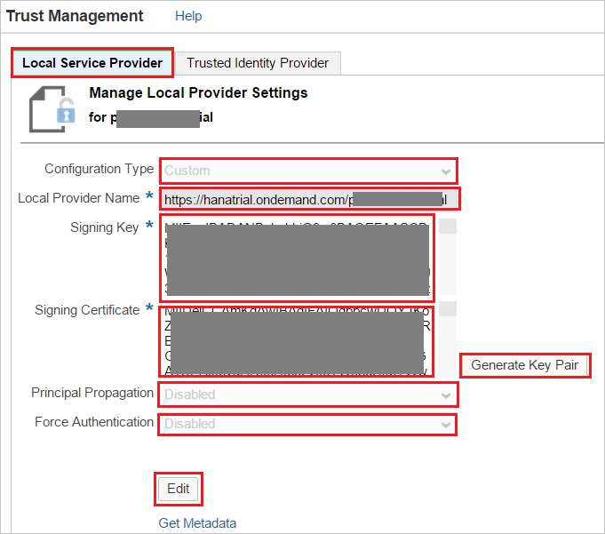
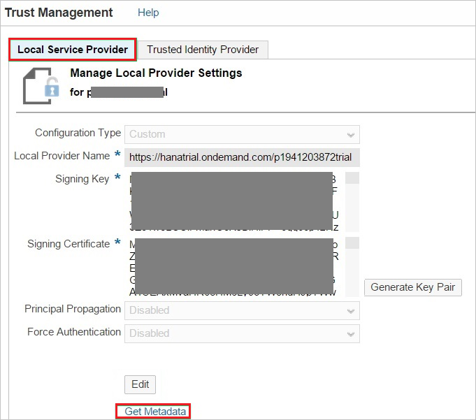
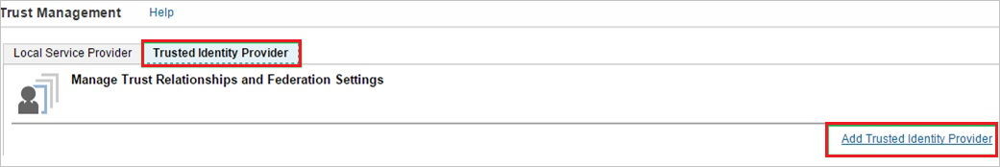
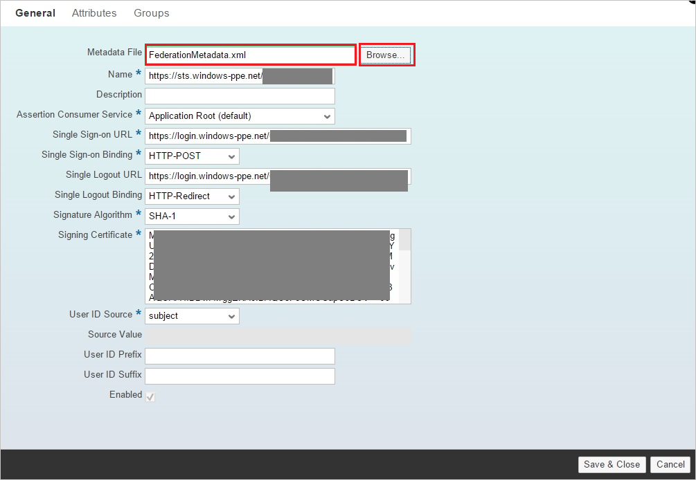
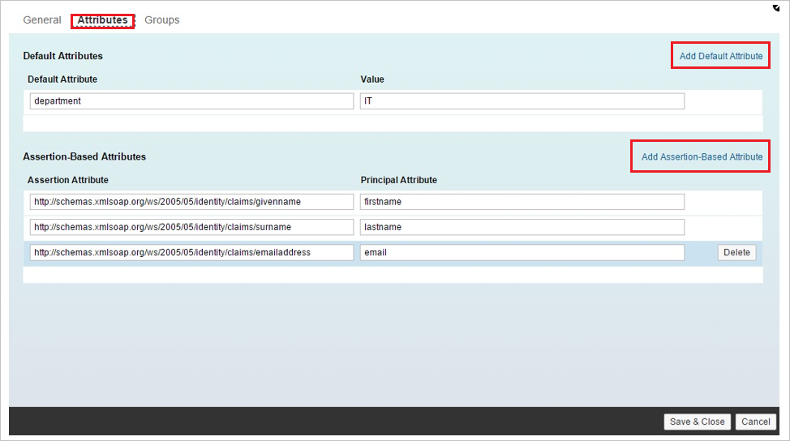
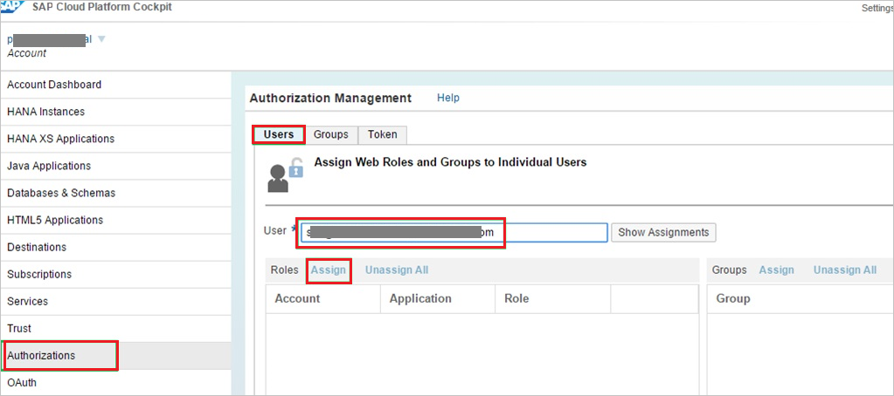

# Tutorial: Azure Active Directory integration with SAP Cloud Platform

In this tutorial, you learn how to integrate SAP Cloud Platform with Azure Active Directory (Azure AD).
Integrating SAP Cloud Platform with Azure AD provides you with the following benefits:

* You can control in Azure AD who has access to SAP Cloud Platform.
* You can enable your users to be automatically signed-in to SAP Cloud Platform (Single Sign-On) with their Azure AD accounts.
* You can manage your accounts in one central location - the Azure portal.

If you want to know more details about SaaS app integration with Azure AD, see [What is application access and single sign-on with Azure Active Directory](https://docs.microsoft.com/azure/active-directory/active-directory-appssoaccess-whatis).
If you don't have an Azure subscription, [create a free account](https://azure.microsoft.com/free/) before you begin.

## Prerequisites

To configure Azure AD integration with SAP Cloud Platform, you need the following items:

* An Azure AD subscription. If you don't have an Azure AD environment, you can get one-month trial [here](https://azure.microsoft.com/pricing/free-trial/)
* SAP Cloud Platform single sign-on enabled subscription

After completing this tutorial, the Azure AD users you have assigned to SAP Cloud Platform will be able to single sign into the application using the [Introduction to the Access Panel](../user-help/active-directory-saas-access-panel-introduction.md).

>[!IMPORTANT]
>You need to deploy your own application or subscribe to an application on your SAP Cloud Platform account to test single sign on. In this tutorial, an application is deployed in the account.
> 

## Scenario description

In this tutorial, you configure and test Azure AD single sign-on in a test environment.

* SAP Cloud Platform supports **SP** initiated SSO

## Adding SAP Cloud Platform from the gallery

To configure the integration of SAP Cloud Platform into Azure AD, you need to add SAP Cloud Platform from the gallery to your list of managed SaaS apps.

**To add SAP Cloud Platform from the gallery, perform the following steps:**

1. In the **[Azure portal](https://portal.azure.com)**, on the left navigation panel, click **Azure Active Directory** icon.

	

2. Navigate to **Enterprise Applications** and then select the **All Applications** option.

	

3. To add new application, click **New application** button on the top of dialog.

	

4. In the search box, type **SAP Cloud Platform**, select **SAP Cloud Platform** from result panel then click **Add** button to add the application.

	 

## Configure and test Azure AD single sign-on

In this section, you configure and test Azure AD single sign-on with SAP Cloud Platform based on a test user called **Britta Simon**.
For single sign-on to work, a link relationship between an Azure AD user and the related user in SAP Cloud Platform needs to be established.

To configure and test Azure AD single sign-on with SAP Cloud Platform, you need to complete the following building blocks:

1. **[Configure Azure AD Single Sign-On](#configure-azure-ad-single-sign-on)** - to enable your users to use this feature.
2. **[Configure SAP Cloud Platform Single Sign-On](#configure-sap-cloud-platform-single-sign-on)** - to configure the Single Sign-On settings on application side.
3. **[Create an Azure AD test user](#create-an-azure-ad-test-user)** - to test Azure AD single sign-on with Britta Simon.
4. **[Assign the Azure AD test user](#assign-the-azure-ad-test-user)** - to enable Britta Simon to use Azure AD single sign-on.
5. **[Create SAP Cloud Platform test user](#create-sap-cloud-platform-test-user)** - to have a counterpart of Britta Simon in SAP Cloud Platform that is linked to the Azure AD representation of user.
6. **[Test single sign-on](#test-single-sign-on)** - to verify whether the configuration works.

### Configure Azure AD single sign-on

In this section, you enable Azure AD single sign-on in the Azure portal.

To configure Azure AD single sign-on with SAP Cloud Platform, perform the following steps:

1. In the [Azure portal](https://portal.azure.com/), on the **SAP Cloud Platform** application integration page, select **Single sign-on**.

    

2. On the **Select a Single sign-on method** dialog, select **SAML/WS-Fed** mode to enable single sign-on.

    

3. On the **Set up Single Sign-On with SAML** page, click **Edit** icon to open **Basic SAML Configuration** dialog.

	

4. On the **Basic SAML Configuration** section, perform the following steps:

    

    a. In the **Sign On URL** textbox, type the URL used by your users to sign into your **SAP Cloud Platform** application. This is the account-specific URL of a protected resource in your SAP Cloud Platform application. The URL is based on the following pattern: `https://<applicationName><accountName>.<landscape host>.ondemand.com/<path_to_protected_resource>`
      
     >[!NOTE]
     >This is the URL in your SAP Cloud Platform application that requires the user to authenticate.
     > 

    | |
    |--|
    | `https://<subdomain>.hanatrial.ondemand.com/<instancename>` |
    | `https://<subdomain>.hana.ondemand.com/<instancename>` |

	b. In the **Identifier** textbox you will provide your SAP Cloud Platform's type a URL using one of the following patterns: 

	| |
	|--|
	| `https://hanatrial.ondemand.com/<instancename>` |
	| `https://hana.ondemand.com/<instancename>` |
	| `https://us1.hana.ondemand.com/<instancename>` |
	| `https://ap1.hana.ondemand.com/<instancename>` |

	c. In the **Reply URL** textbox, type a URL using the following pattern:

	| |
	|--|
	| `https://<subdomain>.hanatrial.ondemand.com/<instancename>` |
	| `https://<subdomain>.hana.ondemand.com/<instancename>` |
	| `https://<subdomain>.us1.hana.ondemand.com/<instancename>` |
	| `https://<subdomain>.dispatcher.us1.hana.ondemand.com/<instancename>` |
	| `https://<subdomain>.ap1.hana.ondemand.com/<instancename>` |
	| `https://<subdomain>.dispatcher.ap1.hana.ondemand.com/<instancename>` |
	| `https://<subdomain>.dispatcher.hana.ondemand.com/<instancename>` |

	> [!NOTE] 
	> These values are not real. Update these values with the actual Sign-On URL, Identifier, and Reply URL. Contact [SAP Cloud Platform Client support team](https://help.sap.com/viewer/65de2977205c403bbc107264b8eccf4b/Cloud/5dd739823b824b539eee47b7860a00be.html) to get Sign-On URL and Identifier. Reply URL you can get from trust management section which is explained later in the tutorial.
	> 
4. On the **Set up Single Sign-On with SAML** page, in the **SAML Signing Certificate** section, click **Download** to download the **Federation Metadata XML** from the given options as per your requirement and save it on your computer.

	

### Configure SAP Cloud Platform Single Sign-On

1. In a different web browser window, sign on to the SAP Cloud Platform Cockpit at `https://account.<landscape host>.ondemand.com/cockpit`(for example: https://account.hanatrial.ondemand.com/cockpit).

2. Click the **Trust** tab.
   
    

3. In the Trust Management section, under **Local Service Provider**, perform the following steps:

    
   
    a. Click **Edit**.

    b. As **Configuration Type**, select **Custom**.

    c. As **Local Provider Name**, leave the default value. Copy this value and paste it into the **Identifier** field in the Azure AD configuration for SAP Cloud Platform.

    d. To generate a **Signing Key** and a **Signing Certificate** key pair, click **Generate Key Pair**.

    e. As **Principal Propagation**, select **Disabled**.

    f. As **Force Authentication**, select **Disabled**.

    g. Click **Save**.

4. After saving the **Local Service Provider** settings, perform the following to obtain the Reply URL:
   
    

    a. Download the SAP Cloud Platform metadata file by clicking **Get Metadata**.

    b. Open the downloaded SAP Cloud Platform metadata XML file, and then locate the **ns3:AssertionConsumerService** tag.
 
    c. Copy the value of the **Location** attribute, and then paste it into the **Reply URL** field in the Azure AD configuration for SAP Cloud Platform.

5. Click the **Trusted Identity Provider** tab, and then click **Add Trusted Identity Provider**.
   
    
   
    >[!NOTE]
    >To manage the list of trusted identity providers, you need to have chosen the Custom configuration type in the Local Service Provider section. For Default configuration type, you have a non-editable and implicit trust to the SAP ID Service. For None, you don't have any trust settings.
    > 
    > 

6. Click the **General** tab, and then click **Browse** to upload the downloaded metadata file.
    
    
    
    >[!NOTE]
    >After uploading the metadata file, the values for **Single Sign-on URL**, **Single Logout URL**, and **Signing Certificate** are populated automatically.
    > 
     
7. Click the **Attributes** tab.

8. On the **Attributes** tab, perform the following step:
    
     

    a. Click **Add Assertion-Based Attribute**, and then add the following assertion-based attributes:
       
    | Assertion Attribute | Principal Attribute |
    | --- | --- |
    | `http://schemas.xmlsoap.org/ws/2005/05/identity/claims/givenname` |firstname |
    | `http://schemas.xmlsoap.org/ws/2005/05/identity/claims/surname` |lastname |
    | `http://schemas.xmlsoap.org/ws/2005/05/identity/claims/emailaddress` |email |
   
     >[!NOTE]
     >The configuration of the Attributes depends on how the application(s) on SCP are developed, that is, which attribute(s) they expect in the SAML response and under which name (Principal Attribute) they access this attribute in the code.
     > 
    
    b. The **Default Attribute** in the screenshot is just for illustration purposes. It is not required to make the scenario work.  
 
    c. The names and values for **Principal Attribute** shown in the screenshot depend on how the application is developed. It is possible that your application requires different mappings.

### Assertion-based groups

As an optional step, you can configure assertion-based groups for your Azure Active Directory Identity Provider.

Using groups on SAP Cloud Platform allows you to dynamically assign one or more users to one or more roles in your SAP Cloud Platform applications, determined by values of attributes in the SAML 2.0 assertion. 

For example, if the assertion contains the attribute "*contract=temporary*", you may want all affected users to be added to the group "*TEMPORARY*". The group "*TEMPORARY*" may contain one or more roles from one or more applications deployed in your SAP Cloud Platform account.
 
Use assertion-based groups when you want to simultaneously assign many users to one or more roles of applications in your SAP Cloud Platform account. If you want to assign only a single or small number of users to specific roles, we recommend assigning them directly in the “**Authorizations**” tab of the SAP Cloud Platform cockpit.

### Create an Azure AD test user 

The objective of this section is to create a test user in the Azure portal called Britta Simon.

1. In the Azure portal, in the left pane, select **Azure Active Directory**, select **Users**, and then select **All users**.

    

2. Select **New user** at the top of the screen.

    

3. In the User properties, perform the following steps.

    

    a. In the **Name** field enter **BrittaSimon**.
  
    b. In the **User name** field type **brittasimon\@yourcompanydomain.extension**  
    For example, BrittaSimon@contoso.com

    c. Select **Show password** check box, and then write down the value that's displayed in the Password box.

    d. Click **Create**.

### Assign the Azure AD test user

In this section, you enable Britta Simon to use Azure single sign-on by granting access to SAP Cloud Platform.

1. In the Azure portal, select **Enterprise Applications**, select **All applications**, then select **SAP Cloud Platform**.

	

2. In the applications list, type and select **SAP Cloud Platform**.

	

3. In the menu on the left, select **Users and groups**.

    

4. Click the **Add user** button, then select **Users and groups** in the **Add Assignment** dialog.

    

5. In the **Users and groups** dialog select **Britta Simon** in the Users list, then click the **Select** button at the bottom of the screen.

6. If you are expecting any role value in the SAML assertion then in the **Select Role** dialog select the appropriate role for the user from the list, then click the **Select** button at the bottom of the screen.

7. In the **Add Assignment** dialog click the **Assign** button.

### Create SAP Cloud Platform test user

In order to enable Azure AD users to log in to SAP Cloud Platform, you must assign roles in the SAP Cloud Platform to them.

**To assign a role to a user, perform the following steps:**

1. Log in to your **SAP Cloud Platform** cockpit.

2. Perform the following:
   
    
   
    a. Click **Authorization**.

    b. Click the **Users** tab.

    c. In the **User** textbox, type the user’s email address.

    d. Click **Assign** to assign the user to a role.

    e. Click **Save**.

### Test single sign-on 

In this section, you test your Azure AD single sign-on configuration using the Access Panel.

When you click the SAP Cloud Platform tile in the Access Panel, you should be automatically signed in to the SAP Cloud Platform for which you set up SSO. For more information about the Access Panel, see [Introduction to the Access Panel](https://docs.microsoft.com/azure/active-directory/active-directory-saas-access-panel-introduction).

## Additional Resources

- [List of Tutorials on How to Integrate SaaS Apps with Azure Active Directory](https://docs.microsoft.com/azure/active-directory/active-directory-saas-tutorial-list)

- [What is application access and single sign-on with Azure Active Directory?](https://docs.microsoft.com/azure/active-directory/active-directory-appssoaccess-whatis)

- [What is Conditional Access in Azure Active Directory?](https://docs.microsoft.com/azure/active-directory/conditional-access/overview)

