# Tutorial: Configure attribute write-back from Azure AD to SAP SuccessFactors
The objective of this tutorial is to show the steps to write-back attributes from Azure AD to SAP SuccessFactors Employee Central. 

## Overview

You can configure the SAP SuccessFactors Writeback app to write specific attributes from Azure Active Directory to SAP SuccessFactors Employee Central. The SuccessFactors writeback provisioning app supports assigning values to the following Employee Central attributes:

* Work Email
* Username
* Business phone number (including country code, area code, number, and extension)
* Business phone number primary flag
* Cell phone number (including country code, area code, number)
* Cell phone primary flag 
* User custom01-custom15 attributes
* loginMethod attribute

> [!NOTE]
> This app does not have any dependency on the SuccessFactors inbound user provisioning integration apps. You can configure it independent of [SuccessFactors to on-premises AD](sap-successfactors-inbound-provisioning-tutorial.md) provisioning app or [SuccessFactors to Azure AD](sap-successfactors-inbound-provisioning-cloud-only-tutorial.md) provisioning app.

### Who is this user provisioning solution best suited for?

This SuccessFactors Writeback user provisioning solution is ideally suited for:

* Organizations using Microsoft 365 that desire to write-back authoritative attributes managed by IT (such as email address, phone, username) back to SuccessFactors Employee Central.

## Configuring SuccessFactors for the integration

All SuccessFactors provisioning connectors require credentials of a SuccessFactors account with the right permissions to invoke the Employee Central OData APIs. This section describes steps to create the service account in SuccessFactors and grant appropriate permissions. 

* [Create/identify API user account in SuccessFactors](#createidentify-api-user-account-in-successfactors)
* [Create an API permissions role](#create-an-api-permissions-role)
* [Create a Permission Group for the API user](#create-a-permission-group-for-the-api-user)
* [Grant Permission Role to the Permission Group](#grant-permission-role-to-the-permission-group)

### Create/identify API user account in SuccessFactors
Work with your SuccessFactors admin team or implementation partner to create or identify a user account in SuccessFactors that will be used to invoke the OData APIs. The username and password credentials of this account will be required when configuring the provisioning apps in Azure AD. 

### Create an API permissions role

1. Log in to SAP SuccessFactors with a user account that has access to the Admin Center.
1. Search for *Manage Permission Roles*, then select **Manage Permission Roles** from the search results.

   

1. From the Permission Role List, click **Create New**.

   > [!div class="mx-imgBorder"]
   > 

1. Add a **Role Name** and **Description** for the new permission role. The name and description should indicate that the role is for API usage permissions.

   > [!div class="mx-imgBorder"]
   > 

1. Under Permission settings, click **Permission...**, then scroll down the permission list and click **Manage Integration Tools**. Check the box for **Allow Admin to Access to OData API through Basic Authentication**.

   > [!div class="mx-imgBorder"]
   > 

1. Scroll down in the same box and select **Employee Central API**. Add permissions as shown below to read using ODATA API and edit using ODATA API. Select the edit option if you plan to use the same account for the write-back to SuccessFactors scenario. 

   > [!div class="mx-imgBorder"]
   > 

1. Click on **Done**. Click **Save Changes**.

### Create a Permission Group for the API user

1. In the SuccessFactors Admin Center, search for *Manage Permission Groups*, then select **Manage Permission Groups** from the search results.

   > [!div class="mx-imgBorder"]
   > 

1. From the Manage Permission Groups window, click **Create New**.

   > [!div class="mx-imgBorder"]
   > 

1. Add a Group Name for the new group. The group name should indicate that the group is for API users.

   > [!div class="mx-imgBorder"]
   > 

1. Add members to the group. For example, you could select **Username** from the People Pool drop-down menu and then enter the username of the API account that will be used for the integration. 

   > [!div class="mx-imgBorder"]
   > 

1. Click **Done** to finish creating the Permission Group.

### Grant Permission Role to the Permission Group

1. In SuccessFactors Admin Center, search for *Manage Permission Roles*, then select **Manage Permission Roles** from the search results.
1. From the **Permission Role List**, select the role that you created for API usage permissions.
1. Under **Grant this role to...**, click **Add...** Button.
1. Select **Permission Group...** from the drop-down menu, then click **Select...** to open the Groups window to search and select the group created above.

   > [!div class="mx-imgBorder"]
   > 

1. Review the Permission Role grant to the Permission Group. 
   > [!div class="mx-imgBorder"]
   > 

1. Click **Save Changes**.

## Preparing for SuccessFactors Writeback

The SuccessFactors Writeback provisioning app uses certain *code* values for setting email and phone numbers in Employee Central. These *code* values are set as constant values in the attribute-mapping table and are different for each SuccessFactors instance. This section provides steps to capture these *code* values.

   > [!NOTE]
   > Please involve your SuccessFactors Admin to complete the steps in this section. 

### Identify Email and Phone Number picklist names 

In SAP SuccessFactors, a *picklist* is a configurable set of options from which a user can make a selection. The different types of email and phone number (such as business, personal, and other) are represented using a picklist. In this step, we will identify the picklists configured in your SuccessFactors tenant to store email and phone number values. 
 
1. In SuccessFactors Admin Center, search for *Manage business configuration*. 

   > [!div class="mx-imgBorder"]
   > 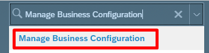

1. Under **HRIS Elements**, select **emailInfo** and click on the *Details* for the **email-type** field.

   > [!div class="mx-imgBorder"]
   > 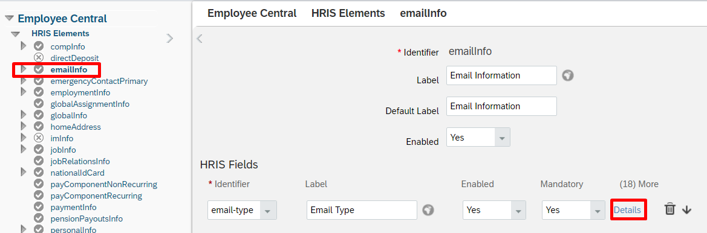

1. On the **email-type** details page, note down the name of the picklist associated with this field. By default, it is **ecEmailType**. However it may be different in your tenant. 

   > [!div class="mx-imgBorder"]
   > 

1. Under **HRIS Elements**, select **phoneInfo** and click on the *Details* for the **phone-type** field.

   > [!div class="mx-imgBorder"]
   > 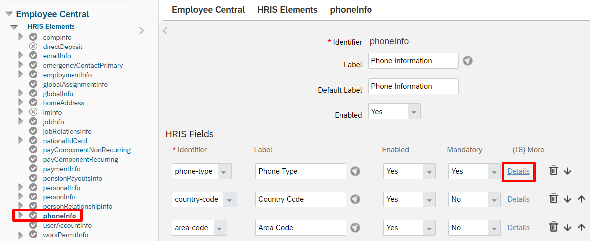

1. On the **phone-type** details page, note down the name of the picklist associated with this field. By default, it is **ecPhoneType**. However it may be different in your tenant. 

   > [!div class="mx-imgBorder"]
   > 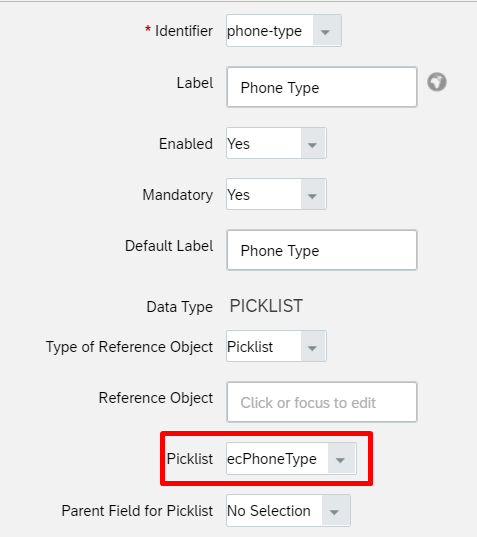

### Retrieve constant value for emailType

1. In SuccessFactors Admin Center, search and open *Picklist Center*. 
1. Use the name of the email picklist captured from the previous section (such as ecEmailType) to find the email picklist.

   > [!div class="mx-imgBorder"]
   > 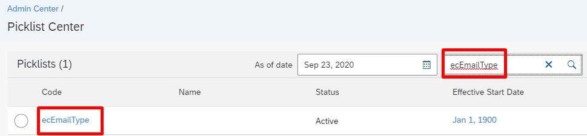

1. Open the active email picklist. 

   > [!div class="mx-imgBorder"]
   > 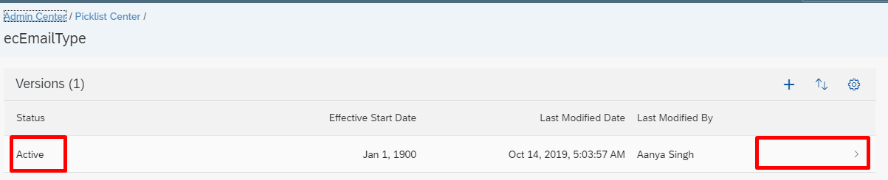

1. On the email type picklist page, select the *Business* email type.

   > [!div class="mx-imgBorder"]
   > 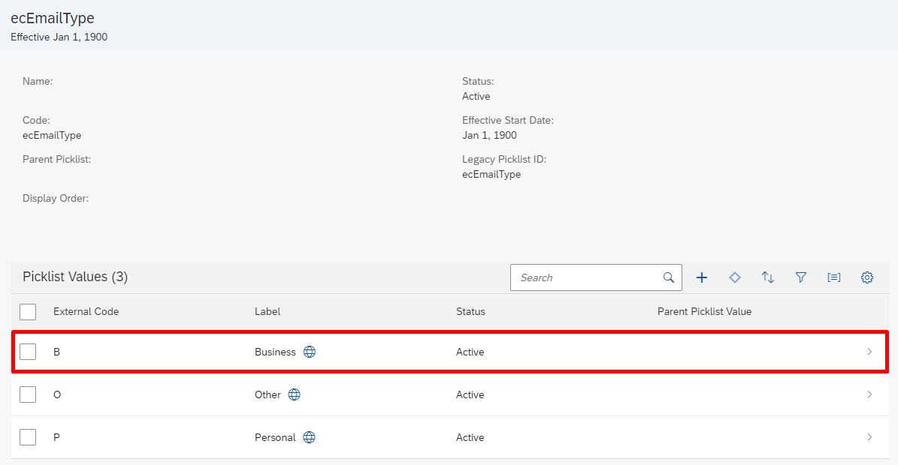

1. Note down the **Option ID** associated with the *Business* email. This is the code that we will use with *emailType* in the attribute-mapping table.

   > [!div class="mx-imgBorder"]
   > 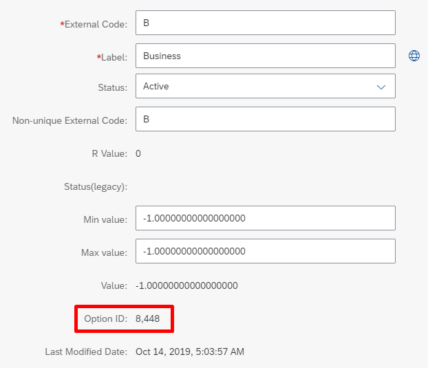

   > [!NOTE]
   > Drop the comma character when you copy over the value. For example, if the **Option ID** value is *8,448*, then set the *emailType* in Azure AD to the constant number *8448* (without the comma character). 

### Retrieve constant value for phoneType

1. In SuccessFactors Admin Center, search and open *Picklist Center*. 
1. Use the name of the phone picklist captured from the previous section to find the phone picklist. 

   > [!div class="mx-imgBorder"]
   > 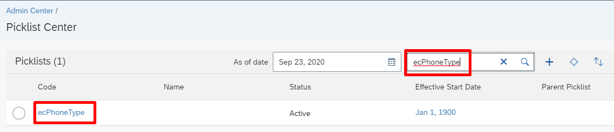

1. Open the active phone picklist. 

   > [!div class="mx-imgBorder"]
   > 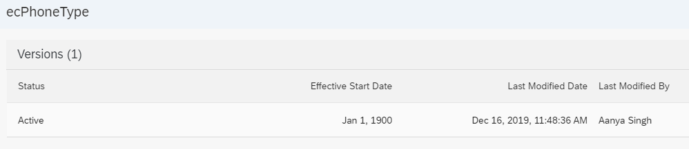

1. On the phone type picklist page, review the different phone types listed under **Picklist Values**.

   > [!div class="mx-imgBorder"]
   > 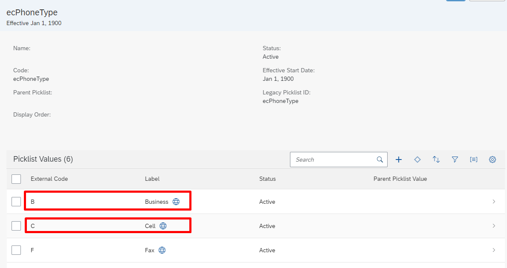

1. Note down the **Option ID** associated with the *Business* phone. This is the code that we will use with *businessPhoneType* in the attribute-mapping table.

   > [!div class="mx-imgBorder"]
   > 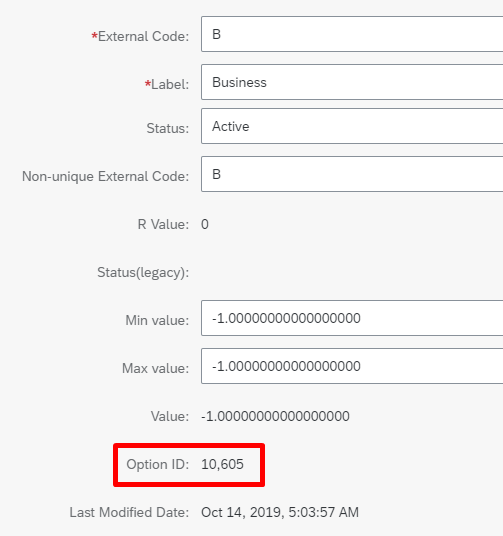

1. Note down the **Option ID** associated with the *Cell* phone. This is the code that we will use with *cellPhoneType* in the attribute-mapping table.

   > [!div class="mx-imgBorder"]
   > 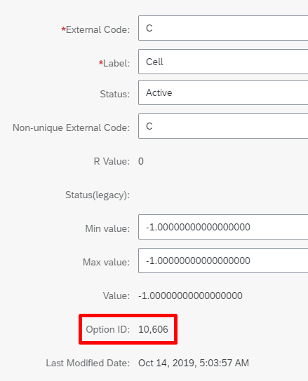

   > [!NOTE]
   > Drop the comma character when you copy over the value. For example, if the **Option ID** value is *10,606*, then set the *cellPhoneType* in Azure AD to the constant number *10606* (without the comma character).

## Configuring SuccessFactors Writeback App

This section provides steps for 

* [Add the provisioning connector app and configure connectivity to SuccessFactors](#part-1-add-the-provisioning-connector-app-and-configure-connectivity-to-successfactors)
* [Configure attribute mappings](#part-2-configure-attribute-mappings)
* [Enable and launch user provisioning](#enable-and-launch-user-provisioning)

### Part 1: Add the provisioning connector app and configure connectivity to SuccessFactors

**To configure SuccessFactors Writeback:**

1. Sign in to the [Azure portal](https://portal.azure.com).

2. In the left navigation bar, select **Azure Active Directory**

3. Select **Enterprise Applications**, then **All Applications**.

4. Select **Add an application**, and select the **All** category.

5. Search for **SuccessFactors Writeback**, and add that app from the gallery.

6. After the app is added and the app details screen is shown, select **Provisioning**

7. Change the **Provisioning** **Mode** to **Automatic**

8. Complete the **Admin Credentials** section as follows:

   * **Admin Username** – Enter the username of the SuccessFactors API user account, with the company ID appended. It has the format: **username\@companyID**

   * **Admin password –** Enter the password of the SuccessFactors API user account. 

   * **Tenant URL –** Enter the name of the SuccessFactors OData API services endpoint. Only enter the host name of server without http or https. This value should look like: `api4.successfactors.com`.

   * **Notification Email –** Enter your email address, and check the "send email if failure occurs" checkbox.
    > [!NOTE]
    > The Azure AD Provisioning Service sends email notification if the provisioning job goes into a [quarantine](../app-provisioning/application-provisioning-quarantine-status.md) state.

   * Click the **Test Connection** button. If the connection test succeeds, click the **Save** button at  the top. If it fails, double-check that the SuccessFactors credentials and URL are valid.
    >[!div class="mx-imgBorder"]
    >

   * Once the credentials are saved successfully, the **Mappings** section will display the default mapping. Refresh the page, if the attribute mappings are not visible.  

### Part 2: Configure attribute mappings

In this section, you will configure how user data flows from SuccessFactors to Active Directory.

1. On the Provisioning tab under **Mappings**, click **Provision Azure Active Directory Users**.

1. In the **Source Object Scope** field, you can select which sets of  users in Azure AD should be considered for write-back, by defining a set of attribute-based filters. The default scope is "all users in Azure AD". 
   > [!TIP]
   > When you are configuring the provisioning app for the first time, you will need to test and verify your attribute mappings and expressions to make sure that it is giving you the desired result. Microsoft recommends using the scoping filters under **Source Object Scope** to test your mappings with a few test users from Azure AD. Once you have verified that the mappings work, then you can either remove the filter or gradually expand it to include more users.

1. The **Target Object Actions** field only supports the **Update** operation.

1. In the mapping table under **Attribute mappings** section, you can map the following Azure Active Directory attributes to SuccessFactors. The table below provides guidance on how to map the write-back attributes. 

   | \# | Azure AD attribute | SuccessFactors Attribute | Remarks |
   |--|--|--|--|
   | 1 | employeeId | personIdExternal | By default, this attribute is the matching identifier. Instead of employeeId you can use any other Azure AD attribute that may store the value equal to personIdExternal in SuccessFactors.    |
   | 2 | mail | email | Map email attribute source. For testing purposes, you can map userPrincipalName to email. |
   | 3 | 8448 | emailType | This constant value is the SuccessFactors ID value associated with business email. Update this value to match your SuccessFactors environment. See the section [Retrieve constant value for emailType](#retrieve-constant-value-for-emailtype) for steps to set this value. |
   | 4 | true | emailIsPrimary | Use this attribute to set business email as primary in SuccessFactors. If business email is not primary, set this flag to false. |
   | 5 | userPrincipalName | [custom01 – custom15] | Using **Add New Mapping**, you can optionally write userPrincipalName or any Azure AD attribute to a custom attribute available in the SuccessFactors User object.  |
   | 6 | On Prem SamAccountName | username | Using **Add New Mapping**, you can optionally map on-premises samAccountName to SuccessFactors username attribute. Use [Azure AD Connect sync: Directory extensions](../hybrid/how-to-connect-sync-feature-directory-extensions.md) to sync samAccountName to Azure AD. It will appear in the source drop down as *extension_yourTenantGUID_samAccountName* |
   | 7 | SSO | loginMethod | If SuccessFactors tenant is setup for [partial SSO](https://apps.support.sap.com/sap/support/knowledge/en/2320766), then using Add New Mapping, you can optionally set loginMethod to a    constant value of "SSO" or "PWD". |
   | 8 | telephoneNumber | businessPhoneNumber | Use this mapping to flow *telephoneNumber* from Azure AD to SuccessFactors business / work phone number. |
   | 9 | 10605 | businessPhoneType | This constant value is the SuccessFactors ID value associated with business phone. Update this value to match your SuccessFactors environment. See the section [Retrieve constant value for phoneType](#retrieve-constant-value-for-phonetype) for steps to set this value. |
   | 10 | true | businessPhoneIsPrimary | Use this attribute to set the primary flag for business phone number. Valid values are true or false. |
   | 11 | mobile | cellPhoneNumber | Use this mapping to flow *telephoneNumber* from Azure AD to SuccessFactors business / work phone number. |
   | 12 | 10606 | cellPhoneType | This constant value is the SuccessFactors ID value associated with cell phone. Update this value to match your SuccessFactors environment. See the section [Retrieve constant value for phoneType](#retrieve-constant-value-for-phonetype) for steps to set this value. |
   | 13 | false | cellPhoneIsPrimary | Use this attribute to set the primary flag for cell phone number. Valid values are true or false. |
   | 14 | [extensionAttribute1-15] | userId | Use this mapping to ensure that the active record in SuccessFactors is updated when there are multiple employment records for the same user. For more details refer to [Enabling writeback with UserID](../app-provisioning/sap-successfactors-integration-reference.md#enabling-writeback-with-userid) |
 
1. Validate and review your attribute mappings. 
 
    >[!div class="mx-imgBorder"]
    >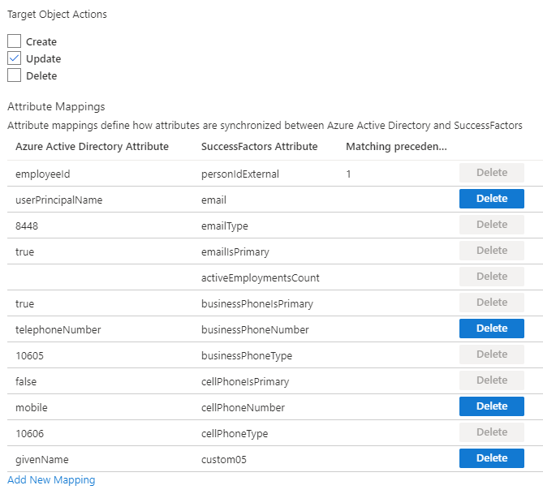

1. Click **Save** to save the mappings. Next, we will update the JSON Path API expressions to use the phoneType codes in your SuccessFactors instance. 
1. Select **Show advanced options**. 

    >[!div class="mx-imgBorder"]
    >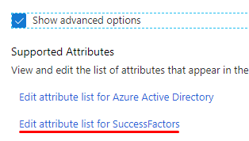

1. Click on **Edit attribute list for SuccessFactors**. 

   > [!NOTE] 
   > If the **Edit attribute list for SuccessFactors** option does not show in the Azure portal, use the URL *https://portal.azure.com/?Microsoft_AAD_IAM_forceSchemaEditorEnabled=true* to access the page. 

1. The **API expression** column in this view displays the JSON Path expressions used by the connector. 
1. Update the JSON Path expressions for business phone and cell phone to use the ID value (*businessPhoneType* and *cellPhoneType*) corresponding to your environment. 

    >[!div class="mx-imgBorder"]
    >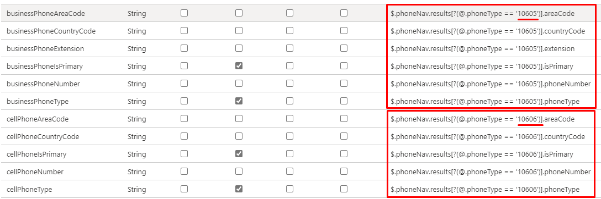

1. Click **Save** to save the mappings.

## Enable and launch user provisioning

Once the SuccessFactors provisioning app configurations have been completed, you can turn on the provisioning service in the Azure portal.

> [!TIP]
> By default when you turn on the provisioning service, it will initiate provisioning operations for all users in scope. If there are errors in the mapping or data issues, then the provisioning job might fail and go into the quarantine state. To avoid this, as a best practice, we recommend configuring **Source Object Scope** filter and testing  your attribute mappings with a few test users before launching the full sync for all users. Once you have verified that the mappings work and are giving you the desired results, then you can either remove the filter or gradually expand it to include more users.

1. In the **Provisioning** tab, set the **Provisioning Status** to **On**.

1. Select **Scope**. You can select from one of the following options: 
   * **Sync all users and groups**: Select this option if you plan to write back mapped attributes of all users from Azure AD to SuccessFactors, subject to the scoping rules defined under **Mappings** -> **Source Object Scope**. 
   * **Sync only assigned users and groups**: Select this option if you plan to write back mapped attributes of only users that you have assigned to this application in the **Application** -> **Manage** -> **Users and groups** menu option. These users are also subject to the scoping rules defined under **Mappings** -> **Source Object Scope**.

   > [!div class="mx-imgBorder"]
   > 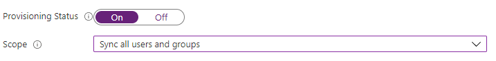

   > [!NOTE]
   > SuccessFactors Writeback provisioning apps created after 12-Oct-2022 support the "group assignment" feature. If you created the app prior to 12-Oct-2022, it will only have "user assignment" support. To use the "group assignment" feature, create a new instance of the SuccessFactors Writeback application and move your existing mapping configurations to this app. 

1. Click **Save**.

1. This operation will start the initial sync, which can take a variable number of hours depending on how many users are in the Azure AD tenant and the scope defined for the operation. You can check the progress bar to the track the progress of the sync cycle. 

1. At any time, check the **Provisioning logs** tab in the Azure portal to see what actions the provisioning service has performed. The provisioning logs lists all individual sync events performed by the provisioning service. 

1. Once the initial sync is completed, it will write an audit summary report in the **Provisioning** tab, as shown below.

   > [!div class="mx-imgBorder"]
   > 

## Supported scenarios, known issues and limitations

Refer to the [Writeback scenarios section](../app-provisioning/sap-successfactors-integration-reference.md#writeback-scenarios) of the SAP SuccessFactors integration reference guide. 

## Next steps

* [Deep dive into Azure AD and SAP SuccessFactors integration reference](../app-provisioning/sap-successfactors-integration-reference.md)
* [Learn how to review logs and get reports on provisioning activity](../app-provisioning/check-status-user-account-provisioning.md)
* [Learn how to configure single sign-on between SuccessFactors and Azure Active Directory](successfactors-tutorial.md)
* [Learn how to integrate other SaaS applications with Azure Active Directory](tutorial-list.md)
* [Learn how to export and import your provisioning configurations](../app-provisioning/export-import-provisioning-configuration.md)
