# Tutorial: Configure attribute writeback from Azure AD to SAP SuccessFactors (Preview)
The objective of this tutorial is to show the steps you need to perform to writeback attributes from Azure AD to SuccessFactors Employee Central. The only attribute currently supported for writeback is the email attribute. 

## Overview

After you setup inbound provisioning integration using either [SuccessFactors to on-premises AD](sap-successfactors-inbound-provisioning-tutorial.md) provisioning app or [SuccessFactors to Azure AD](sap-successfactors-inbound-provisioning-cloud-only-tutorial.md) provisioning app, you can optionally configure the SuccessFactors Writeback app to write email address back to SuccessFactors. 

### Who is this user provisioning solution best suited for?

This SuccessFactors Writeback user provisioning solution is ideally suited for:

* Organizations using Office 365 that desire to writeback authoritative attributes managed by IT (such as email address) back to SuccessFactors

## Configuring SuccessFactors for the integration

A common requirement of all the SuccessFactors provisioning connectors is that they require credentials of a SuccessFactors account with the right permissions to invoke the SuccessFactors OData APIs. This section describes steps to create the service account in SuccessFactors and grant appropriate permissions. 

* [Create/identify API user account in SuccessFactors](#createidentify-api-user-account-in-successfactors)
* [Create an API permissions role](#create-an-api-permissions-role)
* [Create a Permission Group for the API user](#create-a-permission-group-for-the-api-user)
* [Grant Permission Role to the Permission Group](#grant-permission-role-to-the-permission-group)

### Create/identify API user account in SuccessFactors
Work with your SuccessFactors admin team or implementation partner to create or identify a user account in SuccessFactors that will be used to invoke the OData APIs. The username and password credentials of this account will be required when configuring the provisioning apps in Azure AD. 

### Create an API permissions role

* Log in to SAP SuccessFactors with a user account that has access to the Admin Center.
* Search for *Manage Permission Roles*, then select **Manage Permission Roles** from the search results.
  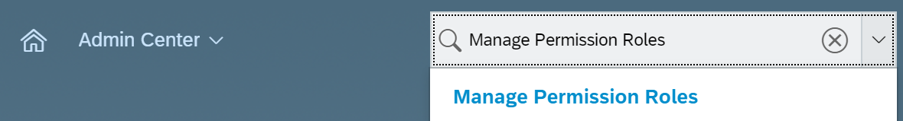
* From the Permission Role List, click **Create New**.
  > [!div class="mx-imgBorder"]
  > 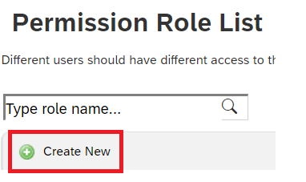
* Add a **Role Name** and **Description** for the new permission role. The name and description should indicate that the role is for API usage permissions.
  > [!div class="mx-imgBorder"]
  > 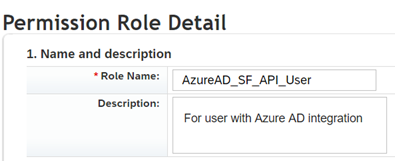
* Under Permission settings, click **Permission...**, then scroll down the permission list and click **Manage Integration Tools**. Check the box for **Allow Admin to Access to OData API through Basic Authentication**.
  > [!div class="mx-imgBorder"]
  > 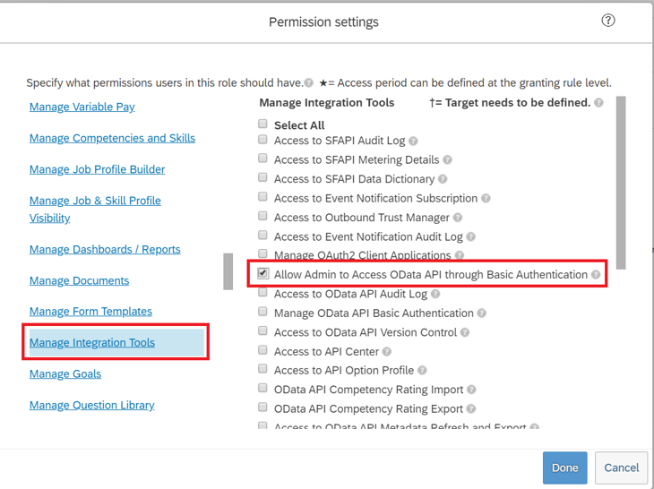
* Scroll down in the same box and select **Employee Central API**. Add permissions as shown below to read using ODATA API and edit using ODATA API. Select the edit option if you plan to use the same account for the Writeback to SuccessFactors scenario. 
  > [!div class="mx-imgBorder"]
  > 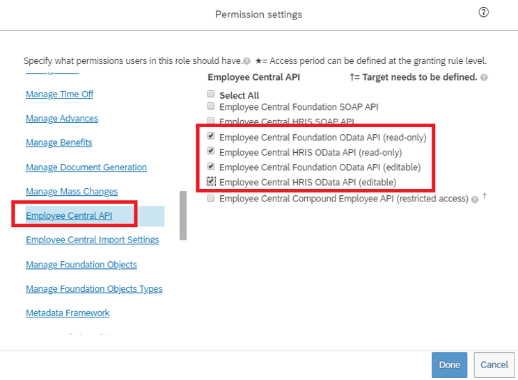
* Click on **Done**. Click **Save Changes**.

### Create a Permission Group for the API user

* In the SuccessFactors Admin Center, search for *Manage Permission Groups*, then select **Manage Permission Groups** from the search results.
  > [!div class="mx-imgBorder"]
  > 
* From the Manage Permission Groups window, click **Create New**.
  > [!div class="mx-imgBorder"]
  > 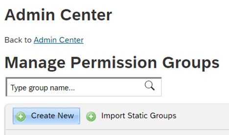
* Add a Group Name for the new group. The group name should indicate that the group is for API users.
  > [!div class="mx-imgBorder"]
  > 
* Add members to the group. For example, you could select **Username** from the People Pool drop-down menu and then enter the username of the API account that will be used for the integration. 
  > [!div class="mx-imgBorder"]
  > 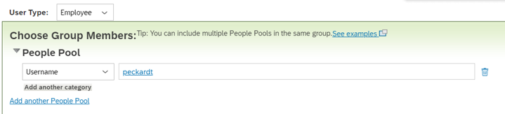
* Click **Done** to finish creating the Permission Group.

### Grant Permission Role to the Permission Group

* In SuccessFactors Admin Center, search for *Manage Permission Roles*, then select **Manage Permission Roles** from the search results.
* From the **Permission Role List**, select the role that you created for API usage permissions.
* Under **Grant this role to...**, click **Add...** button.
* Select **Permission Group...** from the drop-down menu, then click **Select...** to open the Groups window to search and select the group created above. 
  > [!div class="mx-imgBorder"]
  > 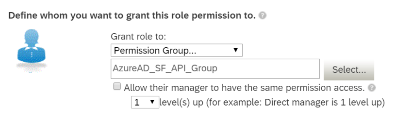
* Review the Permission Role grant to the Permission Group. 
  > [!div class="mx-imgBorder"]
  > 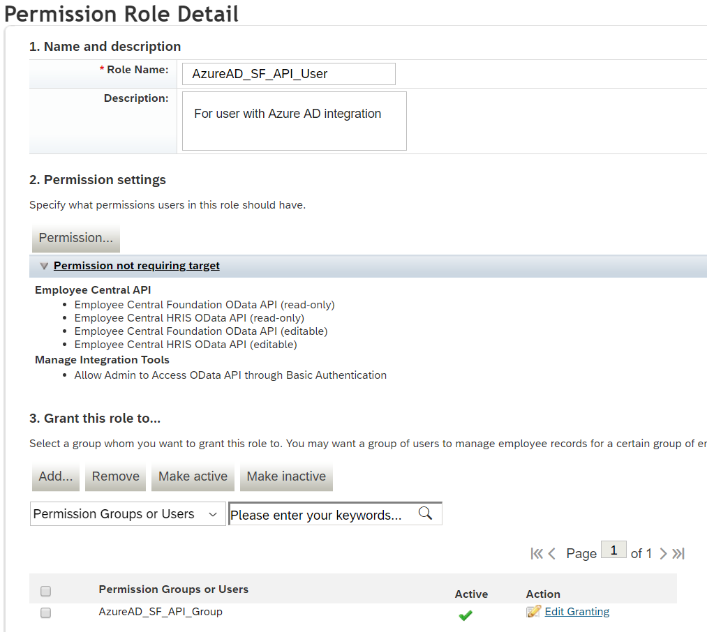
* Click **Save Changes**.

## Configuring SuccessFactors Writeback

This section provides steps for 

* [Add the provisioning connector app and configure connectivity to SuccessFactors](#part-1-add-the-provisioning-connector-app-and-configure-connectivity-to-successfactors)
* [Configure attribute mappings](#part-2-configure-attribute-mappings)
* [Enable and launch user provisioning](#enable-and-launch-user-provisioning)

### Part 1: Add the provisioning connector app and configure connectivity to SuccessFactors

**To configure SuccessFactors Writeback:**

1. Go to <https://portal.azure.com>

2. In the left navigation bar, select **Azure Active Directory**

3. Select **Enterprise Applications**, then **All Applications**.

4. Select **Add an application**, and select the **All** category.

5. Search for **SuccessFactors Writeback**, and add that app from the gallery.

6. After the app is added and the app details screen is shown, select **Provisioning**

7. Change the **Provisioning** **Mode** to **Automatic**

8. Complete the **Admin Credentials** section as follows:

   * **Admin Username** – Enter the username of the SuccessFactors API user account, with the company ID appended. It has the format: **username\@companyID**

   * **Admin password –** Enter the password of the SuccessFactors API user account. 

   * **Tenant URL –** Enter the name of the SuccessFactors OData API services endpoint. Only enter the host name of server without http or https. This value should look like: **api-server-name.successfactors.com**.

   * **Notification Email –** Enter your email address, and check the “send email if failure occurs” checkbox.
    > [!NOTE]
    > The Azure AD Provisioning Service sends email notification if the provisioning job goes into a [quarantine](/azure/active-directory/manage-apps/application-provisioning-quarantine-status) state.

   * Click the **Test Connection** button. If the connection test succeeds, click the **Save** button at  the top. If it fails, double-check that the SuccessFactors credentials and URL are valid.
    >[!div class="mx-imgBorder"]
    >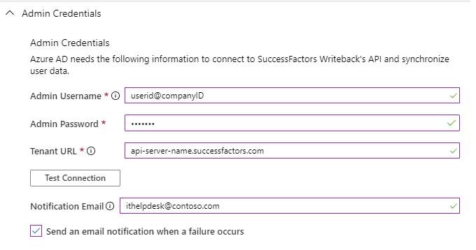

   * Once the credentials are saved successfully, the **Mappings** section will display the default mapping **Synchronize Azure Active Directory Users to SuccessFactors**

### Part 2: Configure attribute mappings

In this section, you will configure how user data flows from SuccessFactors to Active Directory.

1. On the Provisioning tab under **Mappings**, click **Synchronize Azure Active Directory Users to SuccessFactors**.

1. In the **Source Object Scope** field, you can select which sets of  users in Azure AD should be considered for Writeback, by defining a set of attribute-based filters. The default scope is “all users in Azure AD”. 
   > [!TIP]
   > When you are configuring the provisioning app for the first time, you will need to test and verify your attribute mappings and expressions to make sure that it is giving you the desired result. Microsoft recommends using the scoping filters under **Source Object Scope** to test your mappings with a few test users from Azure AD. Once you have verified that the mappings work, then you can either remove the filter or gradually expand it to include more users.

1. The **Target Object Actions** field only supports the **Update** operation.

1. In the **Attribute mappings** section, you can only change the matching ID that is used to link a SuccessFactors user profile with Azure AD user and which attribute in Azure AD serves as the source of email. 
    >[!div class="mx-imgBorder"]
    >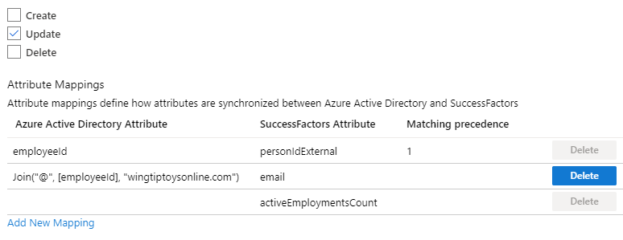

   >[!NOTE]
   >The SuccessFactors writeback only supports the email attribute. Please do not use **Add New Mapping** to add new attributes. 

1. To save your mappings, click **Save** at the top of the  Attribute-Mapping section.

Once your attribute mapping configuration is complete, you can now [enable and launch the user provisioning service](#enable-and-launch-user-provisioning).

## Enable and launch user provisioning

Once the SuccessFactors provisioning app configurations have been completed, you can turn on the provisioning service in the Azure portal.

> [!TIP]
> By default when you turn on the provisioning service, it will initiate provisioning operations for all users in scope. If there are errors in the mapping or Workday data issues, then the provisioning job might fail and go into the quarantine state. To avoid this, as a best practice, we recommend configuring **Source Object Scope** filter and testing  your attribute mappings with a few test users before launching the full sync for all users. Once you have verified that the mappings work and are giving you the desired results, then you can either remove the filter or gradually expand it to include more users.

1. In the **Provisioning** tab, set the **Provisioning Status** to **On**.

2. Click **Save**.

3. This operation will start the initial sync, which can take a variable number of hours depending on how many users are in the SuccessFactors tenant. You can check the progress bar to the track the progress of the sync cycle. 

4. At any time, check the **Audit logs** tab in the Azure portal to see what actions the provisioning service has performed. The audit logs lists all individual sync events performed by the provisioning service, such as which users are being read out of Workday and then subsequently added or updated to Active Directory. 

5. Once the initial sync is completed, it will write an audit summary report in the **Provisioning** tab, as shown below.

   > [!div class="mx-imgBorder"]
   > 

## Next steps

* [Learn how to review logs and get reports on provisioning activity](../app-provisioning/check-status-user-account-provisioning.md)
* [Learn how to configure single sign-on between SuccessFactors and Azure Active Directory](successfactors-tutorial.md)
* [Learn how to integrate other SaaS applications with Azure Active Directory](tutorial-list.md)
* [Learn how to export and import your provisioning configurations](../app-provisioning/export-import-provisioning-configuration.md)

