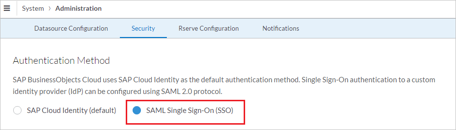
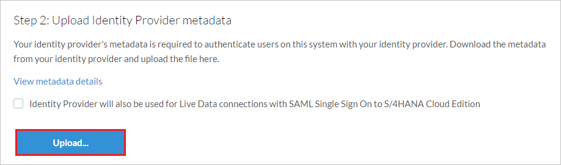
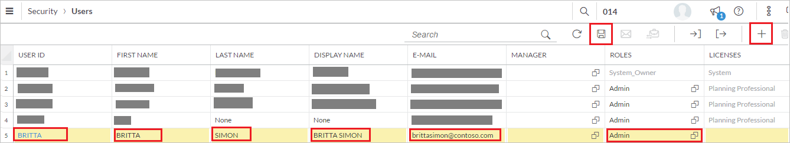
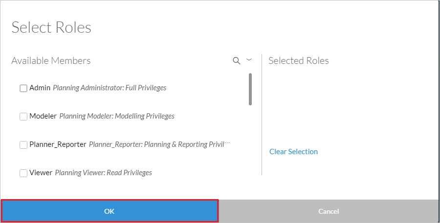

# Tutorial: Azure Active Directory integration with SAP Business Object Cloud

In this tutorial, you learn how to integrate SAP Business Object Cloud with Azure Active Directory (Azure AD).
Integrating SAP Business Object Cloud with Azure AD provides you with the following benefits:

* You can control in Azure AD who has access to SAP Business Object Cloud.
* You can enable your users to be automatically signed-in to SAP Business Object Cloud (Single Sign-On) with their Azure AD accounts.
* You can manage your accounts in one central location - the Azure portal.

If you want to know more details about SaaS app integration with Azure AD, see [What is application access and single sign-on with Azure Active Directory](https://docs.microsoft.com/azure/active-directory/active-directory-appssoaccess-whatis).
If you don't have an Azure subscription, [create a free account](https://azure.microsoft.com/free/) before you begin.

## Prerequisites

To configure Azure AD integration with SAP Business Object Cloud, you need the following items:

* An Azure AD subscription. If you don't have an Azure AD environment, you can get one-month trial [here](https://azure.microsoft.com/pricing/free-trial/)
* SAP Business Object Cloud single sign-on enabled subscription

## Scenario description

In this tutorial, you configure and test Azure AD single sign-on in a test environment.

* SAP Business Object Cloud supports **SP** initiated SSO

## Adding SAP Business Object Cloud from the gallery

To configure the integration of SAP Business Object Cloud into Azure AD, you need to add SAP Business Object Cloud from the gallery to your list of managed SaaS apps.

**To add SAP Business Object Cloud from the gallery, perform the following steps:**

1. In the **[Azure portal](https://portal.azure.com)**, on the left navigation panel, click **Azure Active Directory** icon.

	

2. Navigate to **Enterprise Applications** and then select the **All Applications** option.

	

3. To add new application, click **New application** button on the top of dialog.

	

4. In the search box, type **SAP Business Object Cloud**, select **SAP Business Object Cloud** from result panel then click **Add** button to add the application.

	 

## Configure and test Azure AD single sign-on

In this section, you configure and test Azure AD single sign-on with SAP Business Object Cloud based on a test user called **Britta Simon**.
For single sign-on to work, a link relationship between an Azure AD user and the related user in SAP Business Object Cloud needs to be established.

To configure and test Azure AD single sign-on with SAP Business Object Cloud, you need to complete the following building blocks:

1. **[Configure Azure AD Single Sign-On](#configure-azure-ad-single-sign-on)** - to enable your users to use this feature.
2. **[Configure SAP Business Object Cloud Single Sign-On](#configure-sap-business-object-cloud-single-sign-on)** - to configure the Single Sign-On settings on application side.
3. **[Create an Azure AD test user](#create-an-azure-ad-test-user)** - to test Azure AD single sign-on with Britta Simon.
4. **[Assign the Azure AD test user](#assign-the-azure-ad-test-user)** - to enable Britta Simon to use Azure AD single sign-on.
5. **[Create SAP Business Object Cloud test user](#create-sap-business-object-cloud-test-user)** - to have a counterpart of Britta Simon in SAP Business Object Cloud that is linked to the Azure AD representation of user.
6. **[Test single sign-on](#test-single-sign-on)** - to verify whether the configuration works.

### Configure Azure AD single sign-on

In this section, you enable Azure AD single sign-on in the Azure portal.

To configure Azure AD single sign-on with SAP Business Object Cloud, perform the following steps:

1. In the [Azure portal](https://portal.azure.com/), on the **SAP Business Object Cloud** application integration page, select **Single sign-on**.

    

2. On the **Select a Single sign-on method** dialog, select **SAML/WS-Fed** mode to enable single sign-on.

    

3. On the **Set up Single Sign-On with SAML** page, click **Edit** icon to open **Basic SAML Configuration** dialog.

	

4. On the **Basic SAML Configuration** section, perform the following steps:

    

	a. In the **Sign on URL** text box, type a URL using the following pattern:

    | |
	|-|-|
	| `https://<sub-domain>.sapanalytics.cloud/` |
	| `https://<sub-domain>.sapbusinessobjects.cloud/` |

    b. In the **Identifier (Entity ID)** text box, type a URL using the following pattern:
	
    | |
	|-|-|
	| `<sub-domain>.sapbusinessobjects.cloud` |
	| `<sub-domain>.sapanalytics.cloud` |

	> [!NOTE] 
	> The values in these URLs are for demonstration only. Update the values with the actual sign-on URL and identifier URL. To get the sign-on URL, contact the [SAP Business Object Cloud Client support team](https://help.sap.com/viewer/product/SAP_BusinessObjects_Cloud/release/). You can get the identifier URL by downloading the SAP Business Object Cloud metadata from the admin console. This is explained later in the tutorial.

4. On the **Set up Single Sign-On with SAML** page, in the **SAML Signing Certificate** section, click **Download** to download the **Federation Metadata XML** from the given options as per your requirement and save it on your computer.

	

### Configure SAP Business Object Cloud Single Sign-On

1. In a different web browser window, sign in to your SAP Business Object Cloud company site as an administrator.

2. Select **Menu** > **System** > **Administration**.
    
	

3. On the **Security** tab, select the **Edit** (pen) icon.
    
	  

4. For **Authentication Method**, select **SAML Single Sign-On (SSO)**.

	  

5. To download the service provider metadata (Step 1), select **Download**. In the metadata file, find and copy the **entityID** value. In the Azure portal, on the **Basic SAML Configuration** dialog, paste the value in the **Identifier** box.

	  

6. To upload the service provider metadata (Step 2) in the file that you downloaded from the Azure portal, under **Upload Identity Provider metadata**, select **Upload**.  

	

7. In the **User Attribute** list, select the user attribute (Step 3) that you want to use for your implementation. This user attribute maps to the identity provider. To enter a custom attribute on the user's page, use the **Custom SAML Mapping** option. Or, you can select either **Email** or **USER ID** as the user attribute. In our example, we selected **Email** because we mapped the user identifier claim with the **userprincipalname** attribute in the **User Attributes & Claims** section in the Azure portal. This provides a unique user email, which is sent to the SAP Business Object Cloud application in every successful SAML response.

	

8. To verify the account with the identity provider (Step 4), in the **Login Credential (Email)** box, enter the user's email address. Then, select **Verify Account**. The system adds sign-in credentials to the user account.

    

9. Select the **Save** icon.

	

### Create an Azure AD test user 

The objective of this section is to create a test user in the Azure portal called Britta Simon.

1. In the Azure portal, in the left pane, select **Azure Active Directory**, select **Users**, and then select **All users**.

    

2. Select **New user** at the top of the screen.

    

3. In the User properties, perform the following steps.

    

    a. In the **Name** field enter **BrittaSimon**.
  
    b. In the **User name** field type **brittasimon\@yourcompanydomain.extension**  
    For example, BrittaSimon@contoso.com

    c. Select **Show password** check box, and then write down the value that's displayed in the Password box.

    d. Click **Create**.

### Assign the Azure AD test user

In this section, you enable Britta Simon to use Azure single sign-on by granting access to SAP Business Object Cloud.

1. In the Azure portal, select **Enterprise Applications**, select **All applications**, then select **SAP Business Object Cloud**.

	

2. In the applications list, select **SAP Business Object Cloud**.

	

3. In the menu on the left, select **Users and groups**.

    

4. Click the **Add user** button, then select **Users and groups** in the **Add Assignment** dialog.

    

5. In the **Users and groups** dialog select **Britta Simon** in the Users list, then click the **Select** button at the bottom of the screen.

6. If you are expecting any role value in the SAML assertion then in the **Select Role** dialog select the appropriate role for the user from the list, then click the **Select** button at the bottom of the screen.

7. In the **Add Assignment** dialog click the **Assign** button.

### Create SAP Business Object Cloud test user

Azure AD users must be provisioned in SAP Business Object Cloud before they can sign in to SAP Business Object Cloud. In SAP Business Object Cloud, provisioning is a manual task.

To provision a user account:

1. Sign in to your SAP Business Object Cloud company site as an administrator.

2. Select **Menu** > **Security** > **Users**.

    

3. On the **Users** page, to add new user details, select **+**. 

	

	Then, complete the following steps:

	a. In the **USER ID** box, enter the user ID of the user, like **Britta**.

	b. In the **FIRST NAME** box, enter the first name of the user, like **Britta**.

	c. In the **LAST NAME** box, enter the last name of the user, like **Simon**.

	d. In the **DISPLAY NAME** box, enter the full name of the user, like **Britta Simon**.

	e. In the **E-MAIL** box, enter the email address of the user, like **brittasimon\@contoso.com**.

	f. On the **Select Roles** page, select the appropriate role for the user, and then select **OK**.

	  

	g. Select the **Save** icon.	

### Test single sign-on 

In this section, you test your Azure AD single sign-on configuration using the Access Panel.

When you click the SAP Business Object Cloud tile in the Access Panel, you should be automatically signed in to the SAP Business Object Cloud for which you set up SSO. For more information about the Access Panel, see [Introduction to the Access Panel](https://docs.microsoft.com/azure/active-directory/active-directory-saas-access-panel-introduction).

## Additional Resources

- [List of Tutorials on How to Integrate SaaS Apps with Azure Active Directory](https://docs.microsoft.com/azure/active-directory/active-directory-saas-tutorial-list)

- [What is application access and single sign-on with Azure Active Directory?](https://docs.microsoft.com/azure/active-directory/active-directory-appssoaccess-whatis)

- [What is Conditional Access in Azure Active Directory?](https://docs.microsoft.com/azure/active-directory/conditional-access/overview)

