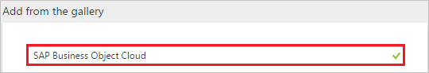
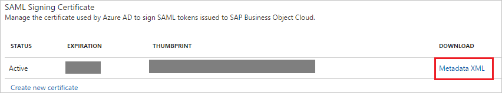

# Tutorial: Azure Active Directory integration with SAP Business Object Cloud

In this tutorial, you learn how to integrate SAP Business Object Cloud with Azure Active Directory (Azure AD).

You get the following benefits when you integrate SAP Business Object Cloud with Azure AD:

- In Azure AD, you can control who has access to SAP Business Object Cloud.
- You can automatically sign in your users to SAP Business Object Cloud by using single sign-on and a user's Azure AD account.
- You can manage your accounts in one, central location, the Azure portal.

To learn more about software as a service (SaaS) app integration with Azure AD, see [What is application access and single sign-on with Azure Active Directory?](../manage-apps/what-is-single-sign-on.md).

## Prerequisites

To set up Azure AD integration with SAP Business Object Cloud, you need the following items:

- An Azure AD subscription
- An SAP Business Object Cloud, with single sign-on turned on

> [!NOTE]
> If you test the steps in this tutorial, we recommend that you don't test them in a production environment.

Recommendations for testing the steps in this tutorial:

- Do not use your production environment, unless it's necessary.
- If you don't have an Azure AD trial environment, you can [get a one-month free trial](https://azure.microsoft.com/pricing/free-trial/).

## Scenario description
In this tutorial, you test Azure AD single sign-on in a test environment. 

The scenario outlined in this tutorial consists of two main building blocks:

1. Add SAP Business Object Cloud from the gallery.
2. Set up and test Azure AD single sign-on.

## Add SAP Business Object Cloud from the gallery
To set up the integration of SAP Business Object Cloud with Azure AD, in the gallery, add SAP Business Object Cloud to your list of managed SaaS apps.

To add SAP Business Object Cloud from the gallery:

1. In the [Azure portal](https://portal.azure.com), in the left menu, select **Azure Active Directory**. 

	![The Azure Active Directory button][1]

2. Select **Enterprise applications**, and then select **All applications**.

	![The Enterprise applications page][2]
	
3. To add a new application, select **New application**.

	![The New application button][3]

4. In the search box, enter **SAP Business Object Cloud**.

	

5. In the results panel, select **SAP Business Object Cloud**, and then select **Add**.

	

##  Set up and test Azure AD single sign-on

In this section, you set up and test Azure AD single sign-on with SAP Business Object Cloud based on a test user named *Britta Simon*.

For single sign-on to work, Azure AD needs to know the Azure AD counterpart user in SAP Business Object Cloud. A link relationship between an Azure AD user and the related user in SAP Business Object Cloud must be established.

To establish the link relationship, in SAP Business Object Cloud, for **Username**, assign the value of the **user name** in Azure AD.

To configure and test Azure AD single sign-on with SAP Business Object Cloud, complete the following tasks:

1. [Set up Azure AD single sign-on](#set-up-azure-ad-single-sign-on). Sets up a user to use this feature.
2. [Create an Azure AD test user](#create-an-azure-ad-test-user). Tests Azure AD single sign-on with the user Britta Simon.
3. [Create an SAP Business Object Cloud test user](#create-an-sap-business-object-cloud-test-user). Creates a counterpart of Britta Simon in SAP Business Object Cloud that is linked to the Azure AD representation of the user.
4. [Assign the Azure AD test user](#assign-the-azure-ad-test-user). Sets up Britta Simon to use Azure AD single sign-on.
5. [Test single sign-on](#test-single-sign-on). Verifies that the configuration works.

### Set up Azure AD single sign-on

In this section, you turn on Azure AD single sign-on in the Azure portal. Then, you set up single sign-on in your SAP Business Object Cloud application.

To set up Azure AD single sign-on with SAP Business Object Cloud:

1. In the Azure portal, on the **SAP Business Object Cloud** application integration page, select **Single sign-on**.

	![Select Single Sign-On][4]

2. On the **Single sign-on** page, for **Mode**, select **SAML-based Sign-on**.
 
	

3. Under **SAP Business Object Cloud Domain and URLs**, complete the following steps:

    1. In the **Sign-on URL** box, enter a URL that has the following pattern: 
	| |
	|-|-|
	| `https://<sub-domain>.sapanalytics.cloud/` |
	| `https://<sub-domain>.sapbusinessobjects.cloud/` |

	2. In the **Identifier** box, enter a URL that has the following pattern:
	| |
	|-|-|
	| `<sub-domain>.sapbusinessobjects.cloud` |
	| `<sub-domain>.sapanalytics.cloud` |

	
 
	> [!NOTE] 
	> The values in these URLs are for demonstration only. Update the values with the actual sign-on URL and identifier URL. To get the sign-on URL, contact the [SAP Business Object Cloud Client support team](https://help.sap.com/viewer/product/SAP_BusinessObjects_Cloud/release/en-US). You can get the identifier URL by downloading the SAP Business Object Cloud metadata from the admin console. This is explained later in the tutorial. 

4. Under **SAML Signing Certificate**, select **Metadata XML**. Then, save the metadata file on your computer.

	 

5. Select **Save**.

	

6. In a different web browser window, sign in to your SAP Business Object Cloud company site as an administrator.

7. Select **Menu** > **System** > **Administration**.
    
	

8. On the **Security** tab, select the **Edit** (pen) icon.
    
	  

9. For **Authentication Method**, select **SAML Single Sign-On (SSO)**.

	  

10. To download the service provider metadata (Step 1), select **Download**. In the metadata file, find and copy the **entityID** value. In the Azure portal, under **SAP Business Object Cloud Domain and URLs**, paste the value in the **Identifier** box.

	  

11. To upload the service provider metadata (Step 2) in the file that you downloaded from the Azure portal, under **Upload Identity Provider metadata**, select **Upload**.  

	

12. In the **User Attribute** list, select the user attribute (Step 3) that you want to use for your implementation. This user attribute maps to the identity provider. To enter a custom attribute on the user's page, use the **Custom SAML Mapping** option. Or, you can select either **Email** or **USER ID** as the user attribute. In our example, we selected **Email** because we mapped the user identifier claim with the **userprincipalname** attribute in the **User Attributes** section in the Azure portal. This provides a unique user email, which is sent to the SAP Business Object Cloud application in every successful SAML response.

	

13. To verify the account with the identity provider (Step 4), in the **Login Credential (Email)** box, enter the user's email address. Then, select **Verify Account**. The system adds sign-in credentials to the user account.

    

14. Select the **Save** icon.

	

> [!TIP]
> You can read a concise version of these instructions in the [Azure portal](https://portal.azure.com), while you are setting up your app! After you add the app by selecting **Active Directory** > **Enterprise Applications**, select the **Single Sign-On** tab. You can access the embedded documentation in the **Configuration** section, at the bottom of the page. For more information, see [Azure AD embedded documentation]( https://go.microsoft.com/fwlink/?linkid=845985).

### Create an Azure AD test user
In this section, you create a test user named Britta Simon in the Azure portal.

To create a test user in Azure AD:

1. In the Azure portal, in the left menu, select **Azure Active Directory**.

	 

2. To display the list of users, select **Users and groups**, and then select **All users**.
	
	 

3. To open the **User** dialog box, select **Add**.
 
	 

4. In the **User** dialog box, complete the following steps:
 
    1. In the **Name** box, enter **BrittaSimon**.

    2. In the **User name** box, enter the email address of the user Britta Simon.

	3. Select the **Show Password** check box, and then write down the value that's displayed in the **Password** box.

    4. Select **Create**.

		 

	![Create Azure AD User][100]

### Create an SAP Business Object Cloud test user

Azure AD users must be provisioned in SAP Business Object Cloud before they can sign in to SAP Business Object Cloud. In SAP Business Object Cloud, provisioning is a manual task.

To provision a user account:

1. Sign in to your SAP Business Object Cloud company site as an administrator.

2. Select **Menu** > **Security** > **Users**.

    

3. On the **Users** page, to add new user details, select **+**. 

	

	Then, complete the following steps:

	1. In the **USER ID** box, enter the user ID of the user, like **Britta**.

	2. In the **FIRST NAME** box, enter the first name of the user, like **Britta**.

	3. In the **LAST NAME** box, enter the last name of the user, like **Simon**.

	4. In the **DISPLAY NAME** box, enter the full name of the user, like **Britta Simon**.

	5. In the **E-MAIL** box, enter the email address of the user, like **brittasimon@contoso.com**.

	6. On the **Select Roles** page, select the appropriate role for the user, and then select **OK**.

	  

	7. Select the **Save** icon.	

### Assign the Azure AD test user

In this section, you allow the user Britta Simon to use Azure AD single sign-on by granting the user account access to SAP Business Object Cloud.

To assign Britta Simon to SAP Business Object Cloud:

1. In the Azure portal, open the applications view, and then go to the directory view. Select **Enterprise applications**, and then select **All applications**.

	![Assign User][201] 

2. In the applications list, select **SAP Business Object Cloud**.

	 

3. In the left menu, select **Users and groups**.

	![Select Users and groups][202] 

4. Select **Add**. Then, on the **Add Assignment** page, select **Users and groups**.

	![The Add Assignment page][203]

5. On the **Users and groups** page, in the list of users, select **Britta Simon**.

6. On the **Users and groups** page, select **Select**.

7. On the **Add Assignment** page, select **Assign**.

![Assign the user role][200] 
	
### Test single sign-on

In this section, you test your Azure AD single sign-on configuration by using the access panel.

When you select the SAP Business Object Cloud tile in the access panel, you should be automatically signed in to your SAP Business Object Cloud application.

For more information about the access panel, see [Introduction to the access panel](../user-help/active-directory-saas-access-panel-introduction.md).

## Additional resources

* [List of tutorials on how to integrate SaaS apps with Azure Active Directory](tutorial-list.md)
* [What is application access and single sign-on with Azure Active Directory?](../manage-apps/what-is-single-sign-on.md)

<!--Image references-->

[1]: ./media/sapboc-tutorial/tutorial_general_01.png
[2]: ./media/sapboc-tutorial/tutorial_general_02.png
[3]: ./media/sapboc-tutorial/tutorial_general_03.png
[4]: ./media/sapboc-tutorial/tutorial_general_04.png

[100]: ./media/sapboc-tutorial/tutorial_general_100.png

[200]: ./media/sapboc-tutorial/tutorial_general_200.png
[201]: ./media/sapboc-tutorial/tutorial_general_201.png
[202]: ./media/sapboc-tutorial/tutorial_general_202.png
[203]: ./media/sapboc-tutorial/tutorial_general_203.png

