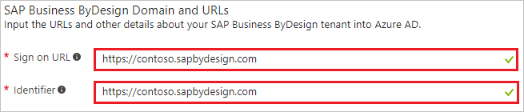
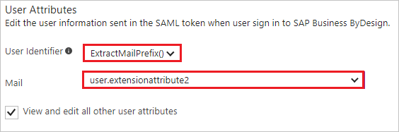
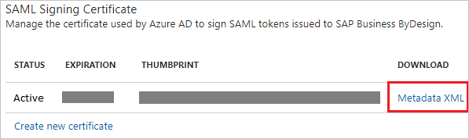
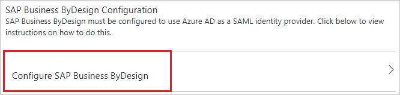
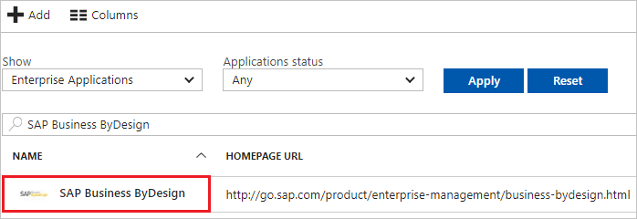

# Tutorial: Azure Active Directory integration with SAP Business ByDesign

In this tutorial, you learn how to integrate SAP Business ByDesign with Azure Active Directory (Azure AD).

Integrating SAP Business ByDesign with Azure AD provides you with the following benefits:

- You can control in Azure AD who has access to SAP Business ByDesign.
- You can enable your users to automatically get signed-on to SAP Business ByDesign (Single Sign-On) with their Azure AD accounts.
- You can manage your accounts in one central location - the Azure portal.

If you want to know more details about SaaS app integration with Azure AD, see [what is application access and single sign-on with Azure Active Directory](../manage-apps/what-is-single-sign-on.md).

## Prerequisites

To configure Azure AD integration with SAP Business ByDesign, you need the following items:

- An Azure AD subscription
- An SAP Business ByDesign single sign-on enabled subscription

> [!NOTE]
> To test the steps in this tutorial, we do not recommend using a production environment.

To test the steps in this tutorial, you should follow these recommendations:

- Do not use your production environment, unless it is necessary.
- If you don't have an Azure AD trial environment, you can [get a one-month trial](https://azure.microsoft.com/pricing/free-trial/).

## Scenario description
In this tutorial, you test Azure AD single sign-on in a test environment. 
The scenario outlined in this tutorial consists of two main building blocks:

1. Adding SAP Business ByDesign from the gallery
1. Configuring and testing Azure AD single sign-on

## Adding SAP Business ByDesign from the gallery
To configure the integration of SAP Business ByDesign into Azure AD, you need to add SAP Business ByDesign from the gallery to your list of managed SaaS apps.

**To add SAP Business ByDesign from the gallery, perform the following steps:**

1. In the **[Azure portal](https://portal.azure.com)**, on the left navigation panel, click **Azure Active Directory** icon. 

	![The Azure Active Directory button][1]

1. Navigate to **Enterprise applications**. Then go to **All applications**.

	![The Enterprise applications blade][2]
	
1. To add new application, click **New application** button on the top of dialog.

	![The New application button][3]

1. In the search box, type **SAP Business ByDesign**, select **SAP Business ByDesign** from result panel then click **Add** button to add the application.

	

## Configure and test Azure AD single sign-on

In this section, you configure and test Azure AD single sign-on with SAP Business ByDesign based on a test user called "Britta Simon".

For single sign-on to work, Azure AD needs to know what the counterpart user in SAP Business ByDesign is to a user in Azure AD. In other words, a link relationship between an Azure AD user and the related user in SAP Business ByDesign needs to be established.

In SAP Business ByDesign, assign the value of the **user name** in Azure AD as the value of the **Username** to establish the link relationship.

To configure and test Azure AD single sign-on with SAP Business ByDesign, you need to complete the following building blocks:

1. **[Configure Azure AD Single Sign-On](#configure-azure-ad-single-sign-on)** - to enable your users to use this feature.
1. **[Create an Azure AD test user](#create-an-azure-ad-test-user)** - to test Azure AD single sign-on with Britta Simon.
1. **[Create an SAP Business ByDesign test user](#create-an-sap-business-bydesign-test-user)** - to have a counterpart of Britta Simon in SAP Business ByDesign that is linked to the Azure AD representation of user.
1. **[Assign the Azure AD test user](#assign-the-azure-ad-test-user)** - to enable Britta Simon to use Azure AD single sign-on.
1. **[Test single sign-on](#test-single-sign-on)** - to verify whether the configuration works.

### Configure Azure AD single sign-on

In this section, you enable Azure AD single sign-on in the Azure portal and configure single sign-on in your SAP Business ByDesign application.

**To configure Azure AD single sign-on with SAP Business ByDesign, perform the following steps:**

1. In the Azure portal, on the **SAP Business ByDesign** application integration page, click **Single sign-on**.

	![Configure single sign-on link][4]

1. On the **Single sign-on** dialog, select **Mode** as	**SAML-based Sign-on** to enable single sign-on.
 
	

1. On the **SAP Business ByDesign Domain and URLs** section, perform the following steps:

	

    a. In the **Sign-on URL** textbox, type a URL using the following pattern: `https://<servername>.sapbydesign.com`

	b. In the **Identifier** textbox, type a URL using the following pattern: `https://<servername>.sapbydesign.com`

	> [!NOTE] 
	> These values are not real. Update these values with the actual Sign-On URL and Identifier. Contact [SAP Business ByDesign Client support team](https://www.sap.com/products/cloud-analytics.support.html) to get these values.

1. On the **User Attributes** section, perform the following steps:

	
	
	a. In **User Identifier** list, select the **ExtractMailPrefix()** function.
	
	b. From the **Mail** list, select the user attribute you want to use for your implementation. For example, if you want to use the EmployeeID as unique user identifier and you have stored the attribute value in the ExtensionAttribute2, then select user.extensionattribute2.	 

1. On the **SAML Signing Certificate** section, click **Metadata XML** and then save the metadata file on your computer.

	 

1. Click **Save** button.

	

1. On the **SAP Business ByDesign Configuration** section, click **Configure SAP Business ByDesign** to open **Configure sign-on** window. Copy the **SAML Single Sign-On Service URL** from the **Quick Reference section.**

	 

1. To get SSO configured for your application, perform the following steps:
   
    a. Sign on to your SAP Business ByDesign portal with administrator rights.
   
    b. Navigate to **Application and User Management Common Task** and click the **Identity Provider** tab.
   
    c. Click **New Identity Provider** and select the metadata XML file that you have downloaded from the Azure portal. By importing the metadata, the system automatically uploads the required signature certificate and encryption certificate.
   
    
   
    d. To include the **Assertion Consumer Service URL** into the SAML request, select **Include Assertion Consumer Service URL**.
   
    e. Click **Activate Single Sign-On**.
   
    f. Save your changes.
   
    g. Click the **My System** tab.
   
    
   
    h. Paste **SAML Single Sign-On Service URL**, which you have copied from the Azure portal it into the **Azure AD Sign On URL** textbox.
   
    
   
    i. Specify whether the employee can manually choose between logging on with user ID and password or SSO by selecting **Manual Identity Provider Selection**.
   
    j. In the **SSO URL** section, specify the URL that should be used by the employee to logon to the system. 
    In the URL Sent to Employee dropdown list, you can choose between the following options:
   
    **Non-SSO URL**
   
    The system sends only the normal system URL to the employee. The employee cannot log on using SSO, and must use password or certificate instead.
   
    **SSO URL** 
   
    The system sends only the SSO URL to the employee. The employee can log on using SSO. Authentication request is redirected through the IdP.
   
    **Automatic Selection**
   
    If SSO is not active, the system sends the normal system URL to the employee. If SSO is active, the system checks whether the employee has a password. If a password is available, both SSO URL and Non-SSO URL are sent to the employee. However, if the employee has no password, only the SSO URL is sent to the employee.
   
    k. Save your changes.

> [!TIP]
> You can now read a concise version of these instructions inside the [Azure portal](https://portal.azure.com), while you are setting up the app!  After adding this app from the **Active Directory > Enterprise Applications** section, simply click the **Single Sign-On** tab and access the embedded documentation through the **Configuration** section at the bottom. You can read more about the embedded documentation feature here: [Azure AD embedded documentation]( https://go.microsoft.com/fwlink/?linkid=845985)
> 

### Create an Azure AD test user

The objective of this section is to create a test user in the Azure portal called Britta Simon.

   ![Create an Azure AD test user][100]

**To create a test user in Azure AD, perform the following steps:**

1. In the Azure portal, in the left pane, click the **Azure Active Directory** button.

    

1. To display the list of users, go to **Users and groups**, and then click **All users**.

    

1. To open the **User** dialog box, click **Add** at the top of the **All Users** dialog box.

    

1. In the **User** dialog box, perform the following steps:

    

    a. In the **Name** box, type **BrittaSimon**.

    b. In the **User name** box, type the email address of user Britta Simon.

    c. Select the **Show Password** check box, and then write down the value that's displayed in the **Password** box.

    d. Click **Create**.
 
### Create an SAP Business ByDesign test user

In this section, you create a user called Britta Simon in SAP Business ByDesign. Please work with [SAP Business ByDesign Client support team](https://www.sap.com/products/cloud-analytics.support.html) to add the users in the SAP Business ByDesign platform. 

> [!NOTE]
> Please make sure that NameID value should match with the username field in the SAP Business ByDesign platform.

### Assign the Azure AD test user

In this section, you enable Britta Simon to use Azure single sign-on by granting access to SAP Business ByDesign.

![Assign the user role][200] 

**To assign Britta Simon to SAP Business ByDesign, perform the following steps:**

1. In the Azure portal, open the applications view, and then navigate to the directory view and go to **Enterprise applications** then click **All applications**.

	![Assign User][201] 

1. In the applications list, select **SAP Business ByDesign**.

	  

1. In the menu on the left, click **Users and groups**.

	![The "Users and groups" link][202]

1. Click **Add** button. Then select **Users and groups** on **Add Assignment** dialog.

	![The Add Assignment pane][203]

1. On **Users and groups** dialog, select **Britta Simon** in the Users list.

1. Click **Select** button on **Users and groups** dialog.

1. Click **Assign** button on **Add Assignment** dialog.
	
### Test single sign-on

In this section, you test your Azure AD single sign-on configuration using the Access Panel.

When you click the SAP Business ByDesign tile in the Access Panel, you should get automatically signed-on to your SAP Business ByDesign application.

## Additional resources

* [List of Tutorials on How to Integrate SaaS Apps with Azure Active Directory](tutorial-list.md)
* [What is application access and single sign-on with Azure Active Directory?](../manage-apps/what-is-single-sign-on.md)

<!--Image references-->

[1]: ./media/sapbusinessbydesign-tutorial/tutorial_general_01.png
[2]: ./media/sapbusinessbydesign-tutorial/tutorial_general_02.png
[3]: ./media/sapbusinessbydesign-tutorial/tutorial_general_03.png
[4]: ./media/sapbusinessbydesign-tutorial/tutorial_general_04.png

[100]: ./media/sapbusinessbydesign-tutorial/tutorial_general_100.png

[200]: ./media/sapbusinessbydesign-tutorial/tutorial_general_200.png
[201]: ./media/sapbusinessbydesign-tutorial/tutorial_general_201.png
[202]: ./media/sapbusinessbydesign-tutorial/tutorial_general_202.png
[203]: ./media/sapbusinessbydesign-tutorial/tutorial_general_203.png

