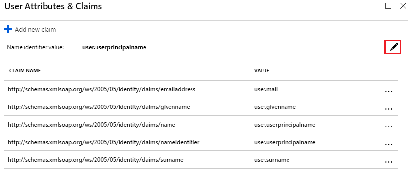
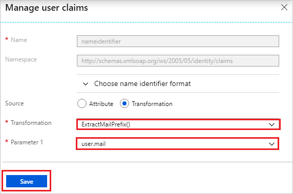
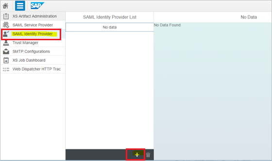
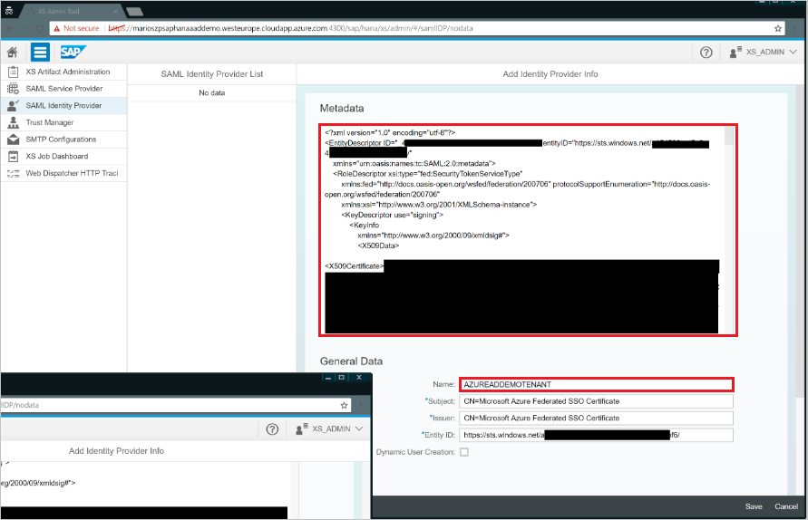
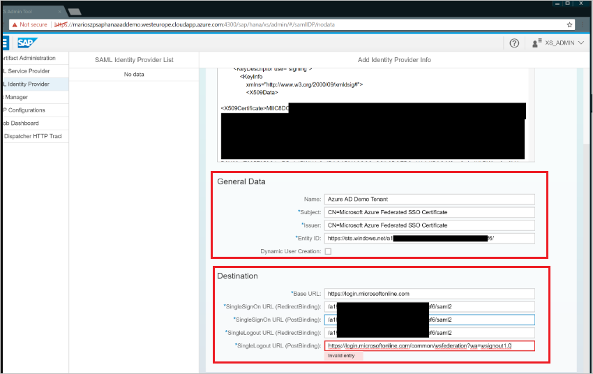
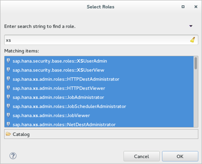

# Tutorial: Microsoft Entra integration with SAP HANA

In this tutorial, you'll learn how to integrate SAP HANA with Microsoft Entra ID. When you integrate SAP HANA with Microsoft Entra ID, you can:

* Control in Microsoft Entra ID who has access to SAP HANA.
* Enable your users to be automatically signed-in to SAP HANA with their Microsoft Entra accounts.
* Manage your accounts in one central location.

## Prerequisites

To configure Microsoft Entra integration with SAP HANA, you need the following items:

- A Microsoft Entra subscription
- A SAP HANA subscription that's single sign-on (SSO) enabled
- A HANA instance that's running on any public IaaS, on-premises, Azure VM, or SAP large instances in Azure
- The XSA Administration web interface, as well as HANA Studio installed on the HANA instance

> [!NOTE]
> We do not recommend using a production environment of SAP HANA to test the steps in this tutorial. Test the integration first in the development or staging environment of the application, and then use the production environment.

To test the steps in this tutorial, follow these recommendations:

* A Microsoft Entra subscription. If you don't have a Microsoft Entra environment, you can get one-month trial [here](https://azure.microsoft.com/pricing/free-trial/)
* SAP HANA single sign-on enabled subscription

## Scenario description

In this tutorial, you configure and test Microsoft Entra single sign-on in a test environment.

* SAP HANA supports **IDP** initiated SSO.
* SAP HANA supports **just-in-time** user provisioning.

> [!NOTE]
> Identifier of this application is a fixed string value so only one instance can be configured in one tenant.

## Adding SAP HANA from the gallery

To configure the integration of SAP HANA into Microsoft Entra ID, you need to add SAP HANA from the gallery to your list of managed SaaS apps.

1. Sign in to the [Microsoft Entra admin center](https://entra.microsoft.com) as at least a [Cloud Application Administrator](../roles/permissions-reference.md#cloud-application-administrator).
1. Browse to **Identity** > **Applications** > **Enterprise applications** > **New application**.
1. In the **Add from the gallery** section, type **SAP HANA** in the search box.
1. Select **SAP HANA** from results panel and then add the app. Wait a few seconds while the app is added to your tenant.

 Alternatively, you can also use the [Enterprise App Configuration Wizard](https://portal.office.com/AdminPortal/home?Q=Docs#/azureadappintegration). In this wizard, you can add an application to your tenant, add users/groups to the app, assign roles, as well as walk through the SSO configuration as well. [Learn more about Microsoft 365 wizards.](/microsoft-365/admin/misc/azure-ad-setup-guides)

## Configure and test Microsoft Entra SSO for SAP HANA

Configure and test Microsoft Entra SSO with SAP HANA using a test user called **B.Simon**. For SSO to work, you need to establish a link relationship between a Microsoft Entra user and the related user in SAP HANA.

To configure and test Microsoft Entra SSO with SAP HANA, perform the following steps:

1. **[Configure Microsoft Entra SSO](#configure-azure-ad-sso)** - to enable your users to use this feature.
	1. **[Create a Microsoft Entra test user](#create-an-azure-ad-test-user)** - to test Microsoft Entra single sign-on with Britta Simon.
	1. **[Assign the Microsoft Entra test user](#assign-the-azure-ad-test-user)** - to enable Britta Simon to use Microsoft Entra single sign-on.
2. **[Configure SAP HANA SSO](#configure-sap-hana-sso)** - to configure the Single Sign-On settings on application side.
	1. **[Create SAP HANA test user](#create-sap-hana-test-user)** - to have a counterpart of Britta Simon in SAP HANA that is linked to the Microsoft Entra representation of user.
1. **[Test SSO](#test-sso)** - to verify whether the configuration works.

### Configure Microsoft Entra SSO

Follow these steps to enable Microsoft Entra SSO.

1. Sign in to the [Microsoft Entra admin center](https://entra.microsoft.com) as at least a [Cloud Application Administrator](../roles/permissions-reference.md#cloud-application-administrator).
1. Browse to **Identity** > **Applications** > **Enterprise applications** > **SAP HANA** > **Single sign-on**.
1. On the **Select a single sign-on method** page, select **SAML**.
1. On the **Set up single sign-on with SAML** page, click the pencil icon for **Basic SAML Configuration** to edit the settings.

   

1. On the **Basic SAML Configuration** section, enter the values for the following fields:

    In the **Reply URL** text box, type a URL using the following pattern:
    `https://<Customer-SAP-instance-url>/sap/hana/xs/saml/login.xscfunc`

	> [!NOTE]
	> The Reply URL value is not real. Update the value with the actual Reply URL. Contact [SAP HANA Client support team](https://cloudplatform.sap.com/contact.html) to get the values. You can also refer to the patterns shown in the **Basic SAML Configuration** section.

5. SAP HANA application expects the SAML assertions in a specific format. Configure the following claims for this application. You can manage the values of these attributes from the **User Attributes** section on application integration page. On the **Set up Single Sign-On with SAML** page, click **Edit** button to open **User Attributes** dialog.

	

6. In the **User attributes** section on the **User Attributes & Claims** dialog, perform the following steps:
 
	a. Click **Edit icon** to open the **Manage user claims** dialog.

	

	

	b. From the **Transformation** list, select **ExtractMailPrefix()**.

	c. From the **Parameter 1** list, select **user.mail**.

	d. Click **Save**.

7. On the **Set up Single Sign-On with SAML** page, in the **SAML Signing Certificate** section, click **Download** to download the **Federation Metadata XML** from the given options as per your requirement and save it on your computer.

	

### Create a Microsoft Entra test user

In this section, you'll create a test user called B.Simon.

1. Sign in to the [Microsoft Entra admin center](https://entra.microsoft.com) as at least a [User Administrator](../roles/permissions-reference.md#user-administrator).
1. Browse to **Identity** > **Users** > **All users**.
1. Select **New user** > **Create new user**, at the top of the screen.
1. In the **User** properties, follow these steps:
   1. In the **Display name** field, enter `B.Simon`.  
   1. In the **User principal name** field, enter the username@companydomain.extension. For example, `B.Simon@contoso.com`.
   1. Select the **Show password** check box, and then write down the value that's displayed in the **Password** box.
   1. Select **Review + create**.
1. Select **Create**.

### Assign the Microsoft Entra test user

In this section, you'll enable B.Simon to use single sign-on by granting access to SAP HANA.

1. Sign in to the [Microsoft Entra admin center](https://entra.microsoft.com) as at least a [Cloud Application Administrator](../roles/permissions-reference.md#cloud-application-administrator).
1. Browse to **Identity** > **Applications** > **Enterprise applications** > **SAP HANA**.
1. In the app's overview page, select **Users and groups**.
1. Select **Add user/group**, then select **Users and groups** in the **Add Assignment** dialog.
   1. In the **Users and groups** dialog, select **B.Simon** from the Users list, then click the **Select** button at the bottom of the screen.
   1. If you are expecting a role to be assigned to the users, you can select it from the **Select a role** dropdown. If no role has been set up for this app, you see "Default Access" role selected.
   1. In the **Add Assignment** dialog, click the **Assign** button.

## Configure SAP HANA SSO

1. To configure single sign-on on the SAP HANA side, sign in to your **HANA XSA Web Console**  by going to the respective HTTPS endpoint.

	> [!NOTE]
	> In the default configuration, the URL redirects the request to a sign-in screen, which requires the credentials of an authenticated SAP HANA database user. The user who signs in must have permissions to perform SAML administration tasks.

2. In the XSA Web Interface, go to **SAML Identity Provider**. From there, select the **+** button on the bottom of the screen to display the **Add Identity Provider Info** pane. Then take the following steps:

	

	a. In the **Add Identity Provider Info** pane, paste the contents of the Metadata XML (which you downloaded) into the **Metadata** box.

	

	b. If the contents of the XML document are valid, the parsing process extracts the information that's required for the **Subject, Entity ID, and Issuer** fields in the **General data** screen area. It also extracts the information that's necessary for the URL fields in the **Destination** screen area, for example, the **Base URL and SingleSignOn URL (*)** fields.

	

	c. In the **Name** box of the **General Data** screen area, enter a name for the new SAML SSO identity provider.

	> [!NOTE]
	> The name of the SAML IDP is mandatory and must be unique. It appears in the list of available SAML IDPs that is displayed when you select SAML as the authentication method for SAP HANA XS applications to use. For example, you can do this in the **Authentication** screen area of the XS Artifact Administration tool.

3. Select **Save** to save the details of the SAML identity provider and to add the new SAML IDP to the list of known SAML IDPs.

	

4. In HANA Studio, within the system properties of the **Configuration** tab,  filter the settings by **saml**. Then adjust the **assertion_timeout** from **10 sec** to **120 sec**.

	

### Create SAP HANA test user

To enable Microsoft Entra users to sign in to SAP HANA, you must provision them in SAP HANA.
SAP HANA supports **just-in-time provisioning**, which is by enabled by default.

If you need to create a user manually, take the following steps:

>[!NOTE]
>You can change the external authentication that the user uses. They can authenticate with an external system such as Kerberos. For detailed information about external identities, contact your [domain administrator](https://cloudplatform.sap.com/contact.html).

1. Open the [SAP HANA Studio](https://help.sap.com/viewer/a2a49126a5c546a9864aae22c05c3d0e/2.0.01/en-us) as an administrator, and then enable the DB-User for SAML SSO.

	

2. Select the invisible check box to the left of **SAML**, and then select the **Configure** link.

3. Select **Add** to add the SAML IDP.  Select the appropriate SAML IDP, and then select **OK**.

4. Add the **External Identity** (in this case, BrittaSimon). Then select **OK**.

   > [!Note]
   > You have to populate the **External Identity** field for the user and that has to match the **NameID** field in the SAML token from Microsoft Entra ID. **Any** checkbox should not be checked as this option requires the IDP to send SPProvderID property in the NameID Field which is right now not supported by Microsoft Entra ID. Plese refer [this](https://help.sap.com/viewer/b3ee5778bc2e4a089d3299b82ec762a7/2.0.05/en-US/db6db355bb571014b56eb25057daec5f.html) document for more details.

5. For testing purposes, assign all **XS** roles to the user.

	

 	> [!TIP]
  	> You should give permissions that are appropriate for your use cases only.

6. Save the user.

### Test SSO 

In this section, you test your Microsoft Entra single sign-on configuration with following options.

* Click on **Test this application**, and you should be automatically signed in to the SAP HANA for which you set up the SSO

* You can use Microsoft My Apps. When you click the SAP HANA tile in the My Apps, you should be automatically signed in to the SAP HANA for which you set up the SSO. For more information about the My Apps, see [Introduction to the My Apps](https://support.microsoft.com/account-billing/sign-in-and-start-apps-from-the-my-apps-portal-2f3b1bae-0e5a-4a86-a33e-876fbd2a4510).

## Next steps

Once you configure SAP HANA you can enforce session control, which protects exfiltration and infiltration of your organization’s sensitive data in real time. Session control extends from Conditional Access. [Learn how to enforce session control with Microsoft Defender for Cloud Apps](/cloud-app-security/proxy-deployment-any-app).
