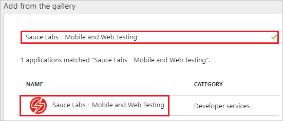
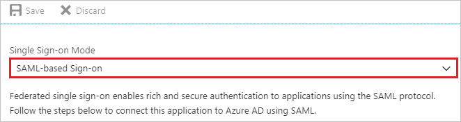
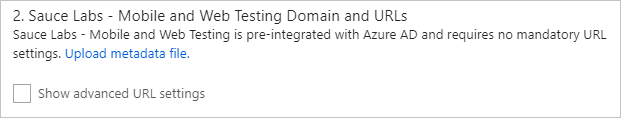
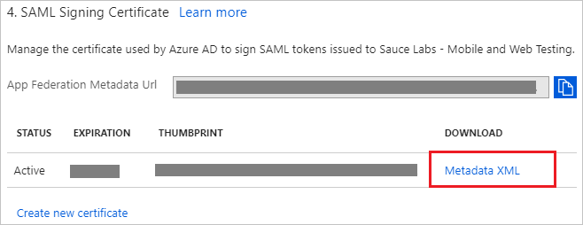
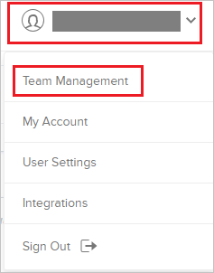
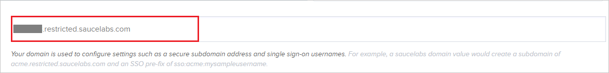
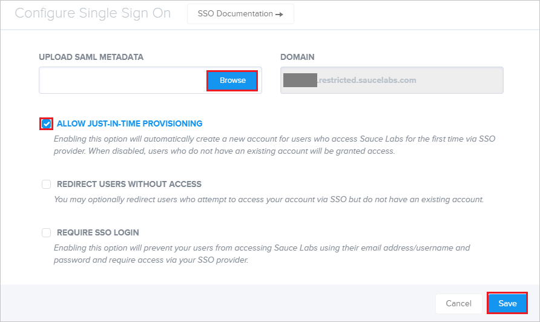
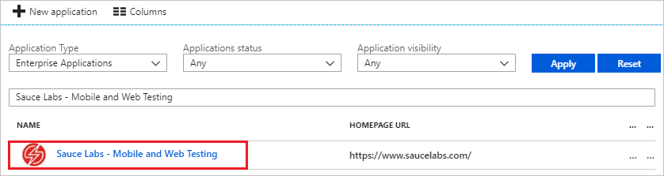

# Tutorial: Azure Active Directory integration with Sauce Labs - Mobile and Web Testing

In this tutorial, you learn how to integrate Sauce Labs - Mobile and Web Testing with Azure Active Directory (Azure AD).

Integrating Sauce Labs - Mobile and Web Testing with Azure AD provides you with the following benefits:

- You can control in Azure AD who has access to Sauce Labs - Mobile and Web Testing.
- You can enable your users to automatically get signed-on to Sauce Labs - Mobile and Web Testing (Single Sign-On) with their Azure AD accounts.
- You can manage your accounts in one central location - the Azure portal.

If you want to know more details about SaaS app integration with Azure AD, see [what is application access and single sign-on with Azure Active Directory](../manage-apps/what-is-single-sign-on.md).

## Prerequisites

To configure Azure AD integration with Sauce Labs - Mobile and Web Testing, you need the following items:

- An Azure AD subscription
- A Sauce Labs - Mobile and Web Testing single sign-on enabled subscription

> [!NOTE]
> To test the steps in this tutorial, we do not recommend using a production environment.

To test the steps in this tutorial, you should follow these recommendations:

- Do not use your production environment, unless it is necessary.
- If you don't have an Azure AD trial environment, you can [get a one-month trial](https://azure.microsoft.com/pricing/free-trial/).

## Scenario description
In this tutorial, you test Azure AD single sign-on in a test environment. 
The scenario outlined in this tutorial consists of two main building blocks:

1. Adding Sauce Labs - Mobile and Web Testing from the gallery
2. Configuring and testing Azure AD single sign-on

## Adding Sauce Labs - Mobile and Web Testing from the gallery
To configure the integration of Sauce Labs - Mobile and Web Testing into Azure AD, you need to add Sauce Labs - Mobile and Web Testing from the gallery to your list of managed SaaS apps.

**To add Sauce Labs - Mobile and Web Testing from the gallery, perform the following steps:**

1. In the **[Azure portal](https://portal.azure.com)**, on the left navigation panel, click **Azure Active Directory** icon. 

	![The Azure Active Directory button][1]

2. Navigate to **Enterprise applications**. Then go to **All applications**.

	![The Enterprise applications blade][2]

3. To add new application, click **New application** button on the top of dialog.

	![The New application button][3]

4. In the search box, type **Sauce Labs - Mobile and Web Testing**, select **Sauce Labs - Mobile and Web Testing** from result panel then click **Add** button to add the application.

	

## Configure and test Azure AD single sign-on

In this section, you configure and test Azure AD single sign-on with Sauce Labs - Mobile and Web Testing based on a test user called "Britta Simon".

For single sign-on to work, Azure AD needs to know what the counterpart user in Sauce Labs - Mobile and Web Testing is to a user in Azure AD. In other words, a link relationship between an Azure AD user and the related user in Sauce Labs - Mobile and Web Testing needs to be established.

To configure and test Azure AD single sign-on with Sauce Labs - Mobile and Web Testing, you need to complete the following building blocks:

1. **[Configure Azure AD Single Sign-On](#configure-azure-ad-single-sign-on)** - to enable your users to use this feature.
2. **[Create an Azure AD test user](#create-an-azure-ad-test-user)** - to test Azure AD single sign-on with Britta Simon.
3. **[Create a Sauce Labs - Mobile and Web Testing test user](#create-a-sauce-labs---mobile-and-web-testing-test-user)** - to have a counterpart of Britta Simon in Sauce Labs - Mobile and Web Testing that is linked to the Azure AD representation of user.
4. **[Assign the Azure AD test user](#assign-the-azure-ad-test-user)** - to enable Britta Simon to use Azure AD single sign-on.
5. **[Test single sign-on](#test-single-sign-on)** - to verify whether the configuration works.

### Configure Azure AD single sign-on

In this section, you enable Azure AD single sign-on in the Azure portal and configure single sign-on in your Sauce Labs - Mobile and Web Testing application.

**To configure Azure AD single sign-on with Sauce Labs - Mobile and Web Testing, perform the following steps:**

1. In the Azure portal, on the **Sauce Labs - Mobile and Web Testing** application integration page, click **Single sign-on**.

	![Configure single sign-on link][4]

2. On the **Single sign-on** dialog, select **Mode** as **SAML-based Sign-on** to enable single sign-on.

	

3. On the **Sauce Labs - Mobile and Web Testing Domain and URLs** section, the user does not have to perform any steps as the app is already pre-integrated with Azure.

	

4. On the **SAML Signing Certificate** section, click **Metadata XML** and then save the metadata file on your computer.

	

5. Click **Save** button.

	

6. In a different web browser window, sign in to your Sauce Labs - Mobile and Web Testing company site as an administrator.

7. Click on the **User icon** and select **Team Management** tab.

	

8. Enter your **Domain name** in the textbox.

	

9. Click **Configure** tab.

	

10. In the **Configure Single Sign On** section, perform the following steps.

	

	a. Click **Browse** and upload the downloaded metadata file from the Azure AD.

	b. Select the **ALLOW JUST-IN-TIME PROVISIONING** checkbox.

	c. Clcik **Save**.

### Create an Azure AD test user

The objective of this section is to create a test user in the Azure portal called Britta Simon.

   ![Create an Azure AD test user][100]

**To create a test user in Azure AD, perform the following steps:**

1. In the Azure portal, in the left pane, click the **Azure Active Directory** button.

    

2. To display the list of users, go to **Users and groups**, and then click **All users**.

    

3. To open the **User** dialog box, click **Add** at the top of the **All Users** dialog box.

    

4. In the **User** dialog box, perform the following steps:

    

    a. In the **Name** box, type **BrittaSimon**.

    b. In the **User name** box, type the email address of user Britta Simon.

    c. Select the **Show Password** check box, and then write down the value that's displayed in the **Password** box.

    d. Click **Create**.
  
### Create a Sauce Labs - Mobile and Web Testing test user

The objective of this section is to create a user called Britta Simon in Sauce Labs - Mobile and Web Testing. Sauce Labs - Mobile and Web Testing supports just-in-time provisioning, which is by default enabled. There is no action item for you in this section. A new user is created during an attempt to access Sauce Labs - Mobile and Web Testing if it doesn't exist yet.
>[!Note]
>If you need to create a user manually, contact [Sauce Labs - Mobile and Web Testing support team](mailto:support@saucelabs.com).

### Assign the Azure AD test user

In this section, you enable Britta Simon to use Azure single sign-on by granting access to Sauce Labs - Mobile and Web Testing.

![Assign the user role][200]

**To assign Britta Simon to Sauce Labs - Mobile and Web Testing, perform the following steps:**

1. In the Azure portal, open the applications view, and then navigate to the directory view and go to **Enterprise applications** then click **All applications**.

	![Assign User][201]

2. In the applications list, select **Sauce Labs - Mobile and Web Testing**.

	  

3. In the menu on the left, click **Users and groups**.

	![The "Users and groups" link][202]

4. Click **Add** button. Then select **Users and groups** on **Add Assignment** dialog.

	![The Add Assignment pane][203]

5. On **Users and groups** dialog, select **Britta Simon** in the Users list.

6. Click **Select** button on **Users and groups** dialog.

7. Click **Assign** button on **Add Assignment** dialog.

### Test single sign-on

In this section, you test your Azure AD single sign-on configuration using the Access Panel.

When you click the Sauce Labs - Mobile and Web Testing tile in the Access Panel, you should get automatically signed-on to your Sauce Labs - Mobile and Web Testing application.
For more information about the Access Panel, see [Introduction to the Access Panel](../active-directory-saas-access-panel-introduction.md).

## Additional resources

* [List of Tutorials on How to Integrate SaaS Apps with Azure Active Directory](tutorial-list.md)
* [What is application access and single sign-on with Azure Active Directory?](../manage-apps/what-is-single-sign-on.md)

<!--Image references-->

[1]: ./media/saucelabs-mobileandwebtesting-tutorial/tutorial_general_01.png
[2]: ./media/saucelabs-mobileandwebtesting-tutorial/tutorial_general_02.png
[3]: ./media/saucelabs-mobileandwebtesting-tutorial/tutorial_general_03.png
[4]: ./media/saucelabs-mobileandwebtesting-tutorial/tutorial_general_04.png

[100]: ./media/saucelabs-mobileandwebtesting-tutorial/tutorial_general_100.png

[200]: ./media/saucelabs-mobileandwebtesting-tutorial/tutorial_general_200.png
[201]: ./media/saucelabs-mobileandwebtesting-tutorial/tutorial_general_201.png
[202]: ./media/saucelabs-mobileandwebtesting-tutorial/tutorial_general_202.png
[203]: ./media/saucelabs-mobileandwebtesting-tutorial/tutorial_general_203.png