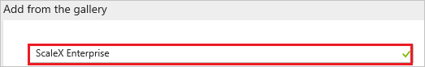
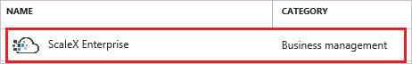
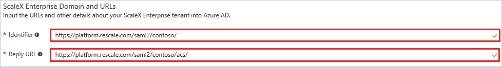
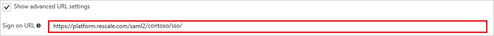
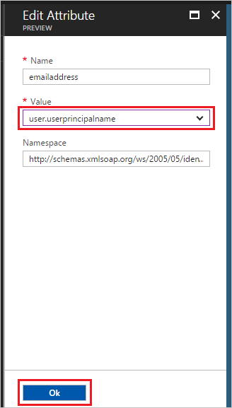
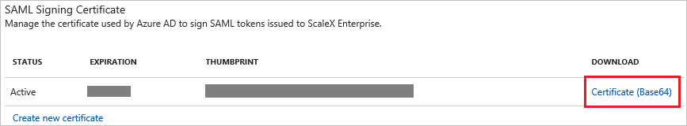
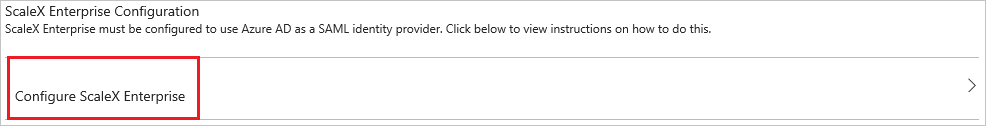
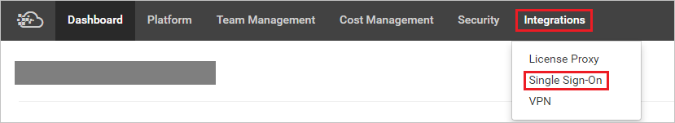
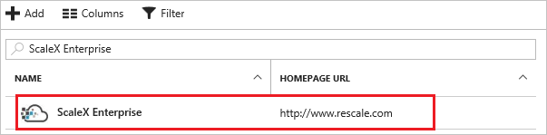

# Tutorial: Azure Active Directory integration with ScaleX Enterprise

In this tutorial, you learn how to integrate ScaleX Enterprise with Azure Active Directory (Azure AD).

Integrating ScaleX Enterprise with Azure AD provides you with the following benefits:

- You can control in Azure AD who has access to ScaleX Enterprise
- You can enable your users to automatically get signed-on to ScaleX Enterprise (Single Sign-On) with their Azure AD accounts
- You can manage your accounts in one central location - the Azure portal

If you want to know more details about SaaS app integration with Azure AD, see. What is application access and single sign-on with [Azure Active Directory](../manage-apps/what-is-single-sign-on.md).

## Prerequisites

To configure Azure AD integration with ScaleX Enterprise, you need the following items:

- An Azure AD subscription
- A ScaleX Enterprise single-sign on enabled subscription

> [!NOTE]
> To test the steps in this tutorial, we do not recommend using a production environment.

To test the steps in this tutorial, you should follow these recommendations:

- Do not use your production environment, unless this is necessary.
- If you don't have an Azure AD trial environment, you can get a one-month trial [here](https://azure.microsoft.com/pricing/free-trial/).

## Scenario description
In this tutorial, you test Azure AD single sign-on in a test environment. 
The scenario outlined in this tutorial consists of two main building blocks:

1. Adding ScaleX Enterprise from the gallery
1. Configuring and testing Azure AD single sign-on

## Adding ScaleX Enterprise from the gallery
To configure the integration of ScaleX Enterprise in to Azure AD, you need to add ScaleX Enterprise from the gallery to your list of managed SaaS apps.

**To add ScaleX Enterprise from the gallery, perform the following steps:**

1. In the **[Azure portal](https://portal.azure.com)**, on the left navigation panel, click **Azure Active Directory** icon. 

	![Active Directory][1]

1. Navigate to **Enterprise applications**. Then go to **All applications**.

	![Applications][2]
	
1. Click **Add** button on the top of the dialog.

	![Applications][3]

1. In the search box, type **ScaleX Enterprise**.

	

1. In the results panel, select **ScaleX Enterprise**, and then click **Add** button to add the application.

	

##  Configuring and testing Azure AD single sign-on
In this section, you configure and test Azure AD single sign-on with ScaleX Enterprise based on a test user called "Britta Simon."

For single sign-on to work, Azure AD needs to know what the counterpart user in ScaleX Enterprise is to a user in Azure AD. In other words, a link relationship between an Azure AD user and the related user in ScaleX Enterprise needs to be established.

This link relationship is established by assigning the value of the **user name** in Azure AD as the value of the **Username** in ScaleX Enterprise.

To configure and test Azure AD single sign-on with ScaleX Enterprise, you need to complete the following building blocks:

1. **[Configuring Azure AD Single Sign-On](#configuring-azure-ad-single-sign-on)** - to enable your users to use this feature.
1. **[Creating an Azure AD test user](#creating-an-azure-ad-test-user)** - to test Azure AD single sign-on with Britta Simon.
1. **[Creating a ScaleX Enterprise test user](#creating-a-scalex-enterprise-test-user)** - to have a counterpart of Britta Simon in ScaleX Enterprise that is linked to the Azure AD representation of user.
1. **[Assigning the Azure AD test user](#assigning-the-azure-ad-test-user)** - to enable Britta Simon to use Azure AD single sign-on.
1. **[Testing Single Sign-On](#testing-single-sign-on)** - to verify whether the configuration works.

### Configuring Azure AD single sign-on

In this section, you enable Azure AD single sign-on in the Azure portal and configure single sign-on in your ScaleX Enterprise application.

**To configure Azure AD single sign-on with ScaleX Enterprise, perform the following steps:**

1. In the Azure portal, on the **ScaleX Enterprise** application integration page, click **Single sign-on**.

	![Configure Single Sign-On][4]

1. On the **Single sign-on** dialog, as **Mode** select **SAML-based Sign-on** to enable single sign-on.
 
	

1. On the **ScaleX Enterprise Domain and URLs** section, perform the following steps if you wish to configure the application in **IDP** initiated mode:

	

    a. In the **Identifier** textbox, type the value using the following pattern: `https://platform.rescale.com/saml2/<company id>/`

	b. In the **Reply URL** textbox, type a URL using the following pattern: `https://platform.rescale.com/saml2/<company id>/acs/`

1. Check **Show advanced URL settings**, if you wish to configure the application in **SP** initiated mode:

	

    In the **Sign-on URL** textbox, type the value using the following pattern: `https://platform.rescale.com/saml2/<company id>/sso/`
	 
	> [!NOTE] 
	> These are not the real values. Update these values with the actual Identifier, Reply URL or Sign-On URL. Contact [ScaleX Enterprise Client support team](https://info.rescale.com/contact_sales) to get these values. 

1. Your ScaleX application expects the SAML assertions in a specific format, which requires you to modify custom attribute mappings to your SAML token attributes configuration. Click **View and edit all other user attributes** checkbox to open the custom attributes settings.

	
	
	a. Right click the attribute **name** and click delete.

	

	b. Click **emailaddress** attribute to open the Edit Attribute window. Change its value from **user.mail** to **user.userprincipalname** and click Ok.

		
	
1. On the **SAML Signing Certificate** section, click **Certificate (Base64)** and then save the Certificate file on your computer.

	 

1. Click **Save** button.

	
	
1. On the **ScaleX Enterprise Configuration** section, click **Configure ScaleX Enterprise** to open **Configure sign-on** window. Copy the **SAML Entity ID** and **SAML Single Sign-On Service URL** from the **Quick Reference section.**

	 

1. To configure single sign-on on **ScaleX Enterprise** side, login to the ScaleX Enterprise company website as an administrator.

1. Click the menu in the upper right and select **Contoso Administration**.

	> [!NOTE] 
	> Contoso is just an example. This should be your actual Company Name. 

	 

1. Select **Integrations** from the top menu and select **Single Sign-On**.

	 

1. Complete the form as follows:

	 
	
	a. Select **“Create any user who can authenticate with SSO.”**

	b. **Service Provider saml**: Paste the value ***urn:oasis:names:tc:SAML:2.0:nameid-format:persistent***

	c. **Name of Identity Provider email field in ACS response**: Paste the value `http://schemas.xmlsoap.org/ws/2005/05/identity/claims/emailaddress`

	d. **Identity Provider EntityDescriptor Entity ID:** Paste the **SAML Entity ID** value copied from the Azure portal.

	e. **Identity Provider SingleSignOnService URL:** Paste the **SAML Single Sign-On Service URL** from the Azure portal.

	f. **Identity Provider public X509 certificate:** Open the X509 certificate downloaded from the Azure in notepad and paste the contents in this box. Ensure there are no line breaks in the middle of the certificate contents.
	
	g. Check the following checkboxes: **Enabled, Encrypt NameID and Sign AuthnRequests.**

	h. Click **Update SSO Settings** to save the settings.

> [!TIP]
> You can now read a concise version of these instructions inside the [Azure portal](https://portal.azure.com), while you are setting up the app!  After adding this app from the **Active Directory > Enterprise Applications** section, simply click the **Single Sign-On** tab and access the embedded documentation through the **Configuration** section at the bottom. You can read more about the embedded documentation feature here: [Azure AD embedded documentation]( https://go.microsoft.com/fwlink/?linkid=845985)
> 

### Creating an Azure AD test user
The objective of this section is to create a test user in the Azure portal called Britta Simon.

![Create Azure AD User][100]

**To create a test user in Azure AD, perform the following steps:**

1. In the **Azure portal**, on the left navigation pane, click **Azure Active Directory** icon.

	 

1. Go to **Users and groups** and click **All users** to display the list of users.
	
	 

1. At the top of the dialog, click **Add** to open the **User** dialog.
 
	 

1. On the **User** dialog page, perform the following steps:
 
	 

    a. In the **Name** textbox, type **BrittaSimon**.

    b. In the **User name** textbox, type the **email address** of BrittaSimon.

	c. Select **Show Password** and write down the value of the **Password**.

    d. Click **Create**.
 
### Creating a ScaleX Enterprise test user

To enable Azure AD users to log in to ScaleX Enterprise, they must be provisioned in to ScaleX Enterprise. In the case of ScaleX Enterprise, provisioning is an automatic task and no manual steps are required. Any user who can successfully authenticate with SSO credentials will be automatically provisioned on the ScaleX side.

### Assigning the Azure AD test user

In this section, you enable Britta Simon to use Azure single sign-on by granting user access to ScaleX Enterprise.

![Assign User][200] 

**To assign Britta Simon to ScaleX Enterprise, perform the following steps:**

1. In the Azure portal, open the applications view, and then navigate to the directory view and go to **Enterprise applications** then click **All applications**.

	![Assign User][201] 

1. In the applications list, select **ScaleX Enterprise**.

	 

1. In the menu on the left, click **Users and groups**.

	![Assign User][202] 

1. Click **Add** button. Then select **Users and groups** on **Add Assignment** dialog.

	![Assign User][203]

1. On **Users and groups** dialog, select **Britta Simon** in the Users list.

1. Click **Select** button on **Users and groups** dialog.

1. Click **Assign** button on **Add Assignment** dialog.

### Testing single sign-on

In this section, you test your Azure AD single sign-on configuration using the Access Panel.

Click the ScaleX Enterprise tile in the Access Panel, you will get automatically signed-on to your ScaleX Enterprise application. For more information about the Access Panel, see [Introduction to the Access Panel](../user-help/active-directory-saas-access-panel-introduction.md).

## Additional resources

* [List of Tutorials on How to Integrate SaaS Apps with Azure Active Directory](tutorial-list.md)
* [What is application access and single sign-on with Azure Active Directory?](../manage-apps/what-is-single-sign-on.md)

<!--Image references-->

[1]: ./media/scalexenterprise-tutorial/tutorial_general_01.png
[2]: ./media/scalexenterprise-tutorial/tutorial_general_02.png
[3]: ./media/scalexenterprise-tutorial/tutorial_general_03.png
[4]: ./media/scalexenterprise-tutorial/tutorial_general_04.png

[100]: ./media/scalexenterprise-tutorial/tutorial_general_100.png

[200]: ./media/scalexenterprise-tutorial/tutorial_general_200.png
[201]: ./media/scalexenterprise-tutorial/tutorial_general_201.png
[202]: ./media/scalexenterprise-tutorial/tutorial_general_202.png
[203]: ./media/scalexenterprise-tutorial/tutorial_general_203.png

