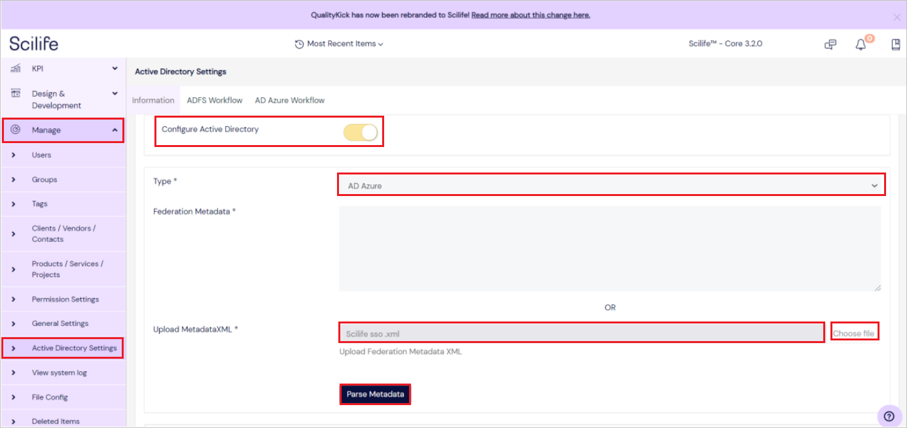
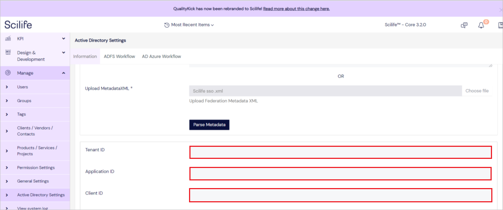
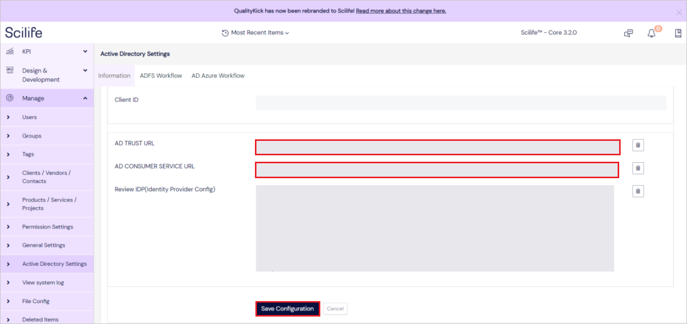

# Azure Active Directory SSO integration with Scilife Azure AD SSO

In this article, you'll learn how to integrate Scilife Azure AD SSO with Azure Active Directory (Azure AD). With the help of this application SSO integration is made simple and hassle free as most of the configuration will take place on its own with minimalist efforts. When you integrate Scilife Azure AD SSO with Azure AD, you can:

* Control in Azure AD who has access to Scilife Azure AD SSO.
* Enable your users to be automatically signed-in to Scilife Azure AD SSO with their Azure AD accounts.
* Manage your accounts in one central location - the Azure portal.

You'll configure and test Azure AD single sign-on for Scilife Azure AD SSO in a test environment. Scilife Azure AD SSO supports **SP** initiated single sign-on and **Just In Time** user provisioning.

## Prerequisites

To integrate Azure Active Directory with Scilife Azure AD SSO, you need:

* An Azure AD user account. If you don't already have one, you can [Create an account for free](https://azure.microsoft.com/free/?WT.mc_id=A261C142F).
* One of the following roles: Global Administrator, Cloud Application Administrator, Application Administrator, or owner of the service principal.
* An Azure AD subscription. If you don't have a subscription, you can get a [free account](https://azure.microsoft.com/free/).
* Scilife Azure AD SSO single sign-on (SSO) enabled subscription.

## Add application and assign a test user

Before you begin the process of configuring single sign-on, you need to add the Scilife Azure AD SSO application from the Azure AD gallery. You need a test user account to assign to the application and test the single sign-on configuration.

### Add Scilife Azure AD SSO from the Azure AD gallery

Add Scilife Azure AD SSO from the Azure AD application gallery to configure single sign-on with Scilife Azure AD SSO. For more information on how to add application from the gallery, see the [Quickstart: Add application from the gallery](../manage-apps/add-application-portal.md).

### Create and assign Azure AD test user

Follow the guidelines in the [create and assign a user account](../manage-apps/add-application-portal-assign-users.md) article to create a test user account in the Azure portal called B.Simon.

Alternatively, you can also use the [Enterprise App Configuration Wizard](https://portal.office.com/AdminPortal/home?Q=Docs#/azureadappintegration). In this wizard, you can add an application to your tenant, add users/groups to the app, and assign roles. The wizard also provides a link to the single sign-on configuration pane in the Azure portal. [Learn more about Microsoft 365 wizards.](/microsoft-365/admin/misc/azure-ad-setup-guides). 

## Configure Azure AD SSO

Complete the following steps to enable Azure AD single sign-on in the Azure portal.

1. In the Azure portal, on the **Scilife Azure AD SSO** application integration page, find the **Manage** section and select **single sign-on**.
1. On the **Select a single sign-on method** page, select **SAML**.
1. On the **Set up single sign-on with SAML** page, select the pencil icon for **Basic SAML Configuration** to edit the settings.

   

1. On the **Basic SAML Configuration** section, perform the following steps:

	a. In the **Identifier** textbox, type a URL using one of the following patterns:

	| **Identifier** |
	|--------------|
	| `https://ldap-Environment.scilife.io/simplesaml/module.php/saml/sp/metadata.php/<CustomerUrlPrefix>-<Environment>-sp` |
	| `https://ldap.scilife.io/simplesaml/module.php/saml/sp/metadata.php/<CustomerUrlPrefix>-sp` |

	b. In the **Reply URL** textbox, type a URL using one of the following patterns:

	| **Reply URL** |
	|---------|
	| `https://<CustomerUrlPrefix>.scilife.io/<languageCode>/login` |
	| `https://ldap.scilife.io/simplesaml/module.php/saml/sp/metadata.php/<CustomerUrlPrefix>-sp` |
	| `https://ldap.scilife.io/simplesaml/module.php/saml/sp/saml2-acs.php/<CustomerUrlPrefix>-sp` |
	| `https://<CustomerUrlPrefix>-<Environment>.scilife.io/<languageCode>/login` |
	| `https://ldap-<Environment>.scilife.io/simplesaml/module.php/saml/sp/metadata.php/<CustomerUrlPrefix>-<Environment>-sp` |
	| `https://ldap-<Environment>.scilife.io/simplesaml/module.php/saml/sp/saml2-acs.php/<CustomerUrlPrefix>-<Environment>-sp` |

	c. In the **Sign on URL** textbox, type a URL using one of the following patterns:

	| **Sign on URL** |
	|-----------|
	| `https://<CustomerUrlPrefix>.scilife.io/<languageCode>/login` |
	| `https://<CustomerUrlPrefix>-<Environment>.scilife.io/<languageCode>/login` |

	> [!Note]
	> These values are not real. Update these values with the actual Identifier, Reply URL and Sign on URL. Contact [Scilife Azure AD SSO support team](mailto:support@scilife.io) to get these values. You can also refer to the patterns shown in the **Basic SAML Configuration** section in the Azure portal.

1. Scilife Azure AD SSO application expects the SAML assertions in a specific format, which requires you to add custom attribute mappings to your SAML token attributes configuration. The following screenshot shows the list of default attributes.

	

1. In addition to above, Scilife Azure AD SSO application expects few more attributes to be passed back in SAML response, which are shown below. These attributes are also pre populated but you can review them as per your requirements.

	| Name |  Source Attribute|
	| ---------------|  --------- |
    | email | user.mail |
	| firstname | user.givenname |
	| lastname | user.surname |
	| ldap_user_id | user.userprincipalname |
	| mobile | user.mobilephone |

1. On the **Set-up single sign-on with SAML** page, in the **SAML Signing Certificate** section, find **Federation Metadata XML** and select **Download** to download the certificate and save it on your computer.

    

1. On the **Set up Scilife Azure AD SSO** section, copy the appropriate URL(s) based on your requirement.

	

## Configure Scilife Azure AD SSO

1. Log in to your Scilife Azure AD SSO company site as an administrator.

1. Go to **Manage** > **Active Directory Settings** and perform the following steps:

	

	1. Enable **Configure Active Directory**.

	1. Select **AD Azure** type from the drop-down.

	1. Download the **Federation Metadata XML file** from the Azure portal and **Upload MetadataXML** file by clicking on **Choose file**.

	1. Click **Parse Metadata**.

1. Enter **Tenant ID**, **Application ID** and **Client ID** in the following fields.
		
	

1. Copy **AD TRUST URL**, paste this value into the **Identifier (Entity ID)** text box in the **Basic SAML Configuration** section in the Azure portal.

1. Copy **AD CONSUMER SERVICE URL**, paste this value into the **Reply URL (Assertion Consumer Service URL)** text box in the **Basic SAML Configuration** section in the Azure portal.

	

1. Click **Save Configuration**.

### Create Scilife Azure AD SSO test user

In this section, a user called B.Simon is created in Scilife Azure AD SSO. Scilife Azure AD SSO supports just-in-time user provisioning, which is enabled by default. There's no action item for you in this section. If a user doesn't already exist in Scilife Azure AD SSO, a new one is commonly created after authentication.

## Test SSO 

In this section, you test your Azure AD single sign-on configuration with following options. 

* Click on **Test this application** in Azure portal. This will redirect to Scilife Azure AD SSO Sign-on URL where you can initiate the login flow. 

* Go to Scilife Azure AD SSO Sign-on URL directly and initiate the login flow from there.

* You can use Microsoft My Apps. When you click the Scilife Azure AD SSO tile in the My Apps, this will redirect to Scilife Azure AD SSO Sign-on URL. For more information about the My Apps, see [Introduction to the My Apps](../user-help/my-apps-portal-end-user-access.md).

## Additional resources

* [What is single sign-on with Azure Active Directory?](../manage-apps/what-is-single-sign-on.md)
* [Plan a single sign-on deployment](../manage-apps/plan-sso-deployment.md).

## Next steps

Once you configure Scilife Azure AD SSO you can enforce session control, which protects exfiltration and infiltration of your organization’s sensitive data in real time. Session control extends from Conditional Access. [Learn how to enforce session control with Microsoft Cloud App Security](/cloud-app-security/proxy-deployment-aad).