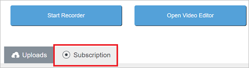
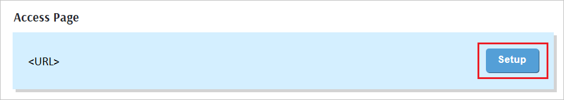
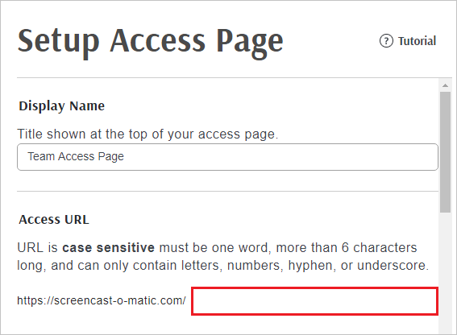
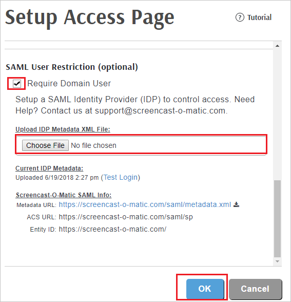

# Tutorial: Azure Active Directory single sign-on (SSO) integration with Screencast-O-Matic

In this tutorial, you'll learn how to integrate Screencast-O-Matic with Azure Active Directory (Azure AD). When you integrate Screencast-O-Matic with Azure AD, you can:

* Control in Azure AD who has access to Screencast-O-Matic.
* Enable your users to be automatically signed-in to Screencast-O-Matic with their Azure AD accounts.
* Manage your accounts in one central location - the Azure portal.

## Prerequisites

To get started, you need the following items:

* An Azure AD subscription. If you don't have a subscription, you can get a [free account](https://azure.microsoft.com/free/).
* Screencast-O-Matic single sign-on (SSO) enabled subscription.

## Scenario description

In this tutorial, you configure and test Azure AD SSO in a test environment.

* Screencast-O-Matic supports **SP** initiated SSO.
* Screencast-O-Matic supports **Just In Time** user provisioning.

> [!NOTE]
> Identifier of this application is a fixed string value so only one instance can be configured in one tenant.

## Add Screencast-O-Matic from the gallery

To configure the integration of Screencast-O-Matic into Azure AD, you need to add Screencast-O-Matic from the gallery to your list of managed SaaS apps.

1. Sign in to the Azure portal using either a work or school account, or a personal Microsoft account.
1. On the left navigation pane, select the **Azure Active Directory** service.
1. Navigate to **Enterprise Applications** and then select **All Applications**.
1. To add new application, select **New application**.
1. In the **Add from the gallery** section, type **Screencast-O-Matic** in the search box.
1. Select **Screencast-O-Matic** from results panel and then add the app. Wait a few seconds while the app is added to your tenant.

 Alternatively, you can also use the [Enterprise App Configuration Wizard](https://portal.office.com/AdminPortal/home?Q=Docs#/azureadappintegration). In this wizard, you can add an application to your tenant, add users/groups to the app, assign roles, as well as walk through the SSO configuration as well. [Learn more about Microsoft 365 wizards.](/microsoft-365/admin/misc/azure-ad-setup-guides)

## Configure and test Azure AD SSO for Screencast-O-Matic

Configure and test Azure AD SSO with Screencast-O-Matic using a test user called **B.Simon**. For SSO to work, you need to establish a link relationship between an Azure AD user and the related user in Screencast-O-Matic.

To configure and test Azure AD SSO with Screencast-O-Matic, perform the following steps:

1. **[Configure Azure AD SSO](#configure-azure-ad-sso)** - to enable your users to use this feature.
    1. **[Create an Azure AD test user](#create-an-azure-ad-test-user)** - to test Azure AD single sign-on with B.Simon.
    1. **[Assign the Azure AD test user](#assign-the-azure-ad-test-user)** - to enable B.Simon to use Azure AD single sign-on.
1. **[Configure Screencast-O-Matic SSO](#configure-screencast-o-matic-sso)** - to configure the single sign-on settings on application side.
    1. **[Create Screencast-O-Matic test user](#create-screencast-o-matic-test-user)** - to have a counterpart of B.Simon in Screencast-O-Matic that is linked to the Azure AD representation of user.
1. **[Test SSO](#test-sso)** - to verify whether the configuration works.

## Configure Azure AD SSO

Follow these steps to enable Azure AD SSO in the Azure portal.

1. In the Azure portal, on the **Screencast-O-Matic** application integration page, find the **Manage** section and select **single sign-on**.
1. On the **Select a single sign-on method** page, select **SAML**.
1. On the **Set up single sign-on with SAML** page, click the pencil icon for **Basic SAML Configuration** to edit the settings.

   

1. On the **Basic SAML Configuration** section, perform the following step:

    In the **Sign-on URL** text box, type a URL using the following pattern:
    `https://screencast-o-matic.com/<InstanceName>`

	> [!NOTE]
	> The value is not real. Update the value with the actual Sign-On URL. Contact [Screencast-O-Matic Client support team](mailto:support@screencast-o-matic.com) to get the value. You can also refer to the patterns shown in the **Basic SAML Configuration** section in the Azure portal.

1. On the **Set up single sign-on with SAML** page, in the **SAML Signing Certificate** section,  find **Federation Metadata XML** and select **Download** to download the certificate and save it on your computer.

	

1. On the **Set up Screencast-O-Matic** section, copy the appropriate URL(s) based on your requirement.

	

### Create an Azure AD test user

In this section, you'll create a test user in the Azure portal called B.Simon.

1. From the left pane in the Azure portal, select **Azure Active Directory**, select **Users**, and then select **All users**.
1. Select **New user** at the top of the screen.
1. In the **User** properties, follow these steps:
   1. In the **Name** field, enter `B.Simon`.  
   1. In the **User name** field, enter the username@companydomain.extension. For example, `B.Simon@contoso.com`.
   1. Select the **Show password** check box, and then write down the value that's displayed in the **Password** box.
   1. Click **Create**.

### Assign the Azure AD test user

In this section, you'll enable B.Simon to use Azure single sign-on by granting access to Screencast-O-Matic.

1. In the Azure portal, select **Enterprise Applications**, and then select **All applications**.
1. In the applications list, select **Screencast-O-Matic**.
1. In the app's overview page, find the **Manage** section and select **Users and groups**.
1. Select **Add user**, then select **Users and groups** in the **Add Assignment** dialog.
1. In the **Users and groups** dialog, select **B.Simon** from the Users list, then click the **Select** button at the bottom of the screen.
1. If you're expecting any role value in the SAML assertion, in the **Select Role** dialog, select the appropriate role for the user from the list and then click the **Select** button at the bottom of the screen.
1. In the **Add Assignment** dialog, click the **Assign** button.

## Configure Screencast-O-Matic SSO

1. To automate the configuration within Screencast-O-Matic, you need to install **My Apps Secure Sign-in browser extension** by clicking **Install the extension**.

	

1. After adding extension to the browser, click on **Set up Screencast-O-Matic** will direct you to the Screencast-O-Matic application. From there, provide the admin credentials to sign into Screencast-O-Matic. The browser extension will automatically configure the application for you and automate steps 3-10.

	

1. If you want to setup Screencast-O-Matic manually, open a new web browser window and sign into your Screencast-O-Matic company site as an administrator and perform the following steps:

1. Click on **Subscription**.

	

1. Under the **Access page** section, click **Setup**.

	

1. On the **Setup Access Page**, perform the following steps.

1. Under the **Access URL** section, type your instancename in the specified textbox.

    

1. Select **Require Domain User** under **SAML User Restriction (optional)** section.

1. Under **Upload IDP Metadata XML File**, Click **Choose File** to upload the metadata which you have downloaded from Azure portal.

1. Click **OK**.

    

### Create Screencast-O-Matic test user

In this section, a user called Britta Simon is created in Screencast-O-Matic. Screencast-O-Matic supports just-in-time user provisioning, which is enabled by default. There is no action item for you in this section. If a user doesn't already exist in Screencast-O-Matic, a new one is created after authentication. If you need to create a user manually, contact [Screencast-O-Matic Client support team](mailto:support@screencast-o-matic.com).

## Test SSO

In this section, you test your Azure AD single sign-on configuration with following options. 

* Click on **Test this application** in Azure portal. This will redirect to Screencast-O-Matic Sign-on URL where you can initiate the login flow. 

* Go to Screencast-O-Matic Sign-on URL directly and initiate the login flow from there.

* You can use Microsoft My Apps. When you click the Screencast-O-Matic tile in the My Apps, this will redirect to Screencast-O-Matic Sign-on URL. For more information about the My Apps, see [Introduction to the My Apps](../user-help/my-apps-portal-end-user-access.md).

## Next steps

Once you configure Screencast-O-Matic you can enforce session control, which protects exfiltration and infiltration of your organization’s sensitive data in real time. Session control extends from Conditional Access. [Learn how to enforce session control with Microsoft Defender for Cloud Apps](/cloud-app-security/proxy-deployment-aad).
