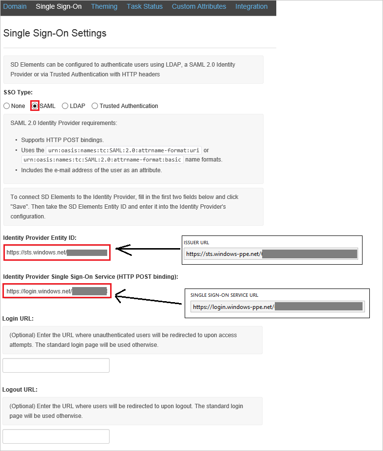
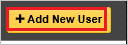

# Tutorial: Azure Active Directory single sign-on (SSO) integration with SD Elements

In this tutorial, you'll learn how to integrate SD Elements with Azure Active Directory (Azure AD). When you integrate SD Elements with Azure AD, you can:

* Control in Azure AD who has access to SD Elements.
* Enable your users to be automatically signed-in to SD Elements with their Azure AD accounts.
* Manage your accounts in one central location - the Azure portal.

To learn more about SaaS app integration with Azure AD, see [What is application access and single sign-on with Azure Active Directory](https://docs.microsoft.com/azure/active-directory/active-directory-appssoaccess-whatis).

## Prerequisites

To get started, you need the following items:

* An Azure AD subscription. If you don't have a subscription, you can get a [free account](https://azure.microsoft.com/free/).
* SD Elements single sign-on (SSO) enabled subscription.

## Scenario description

In this tutorial, you configure and test Azure AD SSO in a test environment.

* SD Elements supports **IDP** initiated SSO

## Adding SD Elements from the gallery

To configure the integration of SD Elements into Azure AD, you need to add SD Elements from the gallery to your list of managed SaaS apps.

1. Sign in to the [Azure portal](https://portal.azure.com) using either a work or school account, or a personal Microsoft account.
1. On the left navigation pane, select the **Azure Active Directory** service.
1. Navigate to **Enterprise Applications** and then select **All Applications**.
1. To add new application, select **New application**.
1. In the **Add from the gallery** section, type **SD Elements** in the search box.
1. Select **SD Elements** from results panel and then add the app. Wait a few seconds while the app is added to your tenant.

## Configure and test Azure AD single sign-on for SD Elements

Configure and test Azure AD SSO with SD Elements using a test user called **B.Simon**. For SSO to work, you need to establish a link relationship between an Azure AD user and the related user in SD Elements.

To configure and test Azure AD SSO with SD Elements, complete the following building blocks:

1. **[Configure Azure AD SSO](#configure-azure-ad-sso)** - to enable your users to use this feature.
    * **[Create an Azure AD test user](#create-an-azure-ad-test-user)** - to test Azure AD single sign-on with B.Simon.
    * **[Assign the Azure AD test user](#assign-the-azure-ad-test-user)** - to enable B.Simon to use Azure AD single sign-on.
1. **[Configure SD Elements SSO](#configure-sd-elements-sso)** - to configure the single sign-on settings on application side.
    * **[Create SD Elements test user](#create-sd-elements-test-user)** - to have a counterpart of B.Simon in SD Elements that is linked to the Azure AD representation of user.
1. **[Test SSO](#test-sso)** - to verify whether the configuration works.

## Configure Azure AD SSO

Follow these steps to enable Azure AD SSO in the Azure portal.

1. In the [Azure portal](https://portal.azure.com/), on the **SD Elements** application integration page, find the **Manage** section and select **single sign-on**.
1. On the **Select a single sign-on method** page, select **SAML**.
1. On the **Set up single sign-on with SAML** page, click the edit/pen icon for **Basic SAML Configuration** to edit the settings.

   

1. On the **Set up single sign-on with SAML** page, enter the values for the following fields:

    a. In the **Identifier** text box, type a URL using the following pattern:
    `https://<tenantname>.sdelements.com/sso/saml2/metadata`

    b. In the **Reply URL** text box, type a URL using the following pattern:
    `https://<tenantname>.sdelements.com/sso/saml2/acs/`

	> [!NOTE]
	> These values are not real. Update these values with the actual Identifier and Reply URL. Contact [SD Elements Client support team](mailto:support@sdelements.com) to get these values. You can also refer to the patterns shown in the **Basic SAML Configuration** section in the Azure portal.

1. SD Elements application expects the SAML assertions in a specific format, which requires you to add custom attribute mappings to your SAML token attributes configuration. The following screenshot shows the list of default attributes.

	

1. In addition to above, SD Elements application expects few more attributes to be passed back in SAML response which are shown below. These attributes are also pre populated but you can review them as per your requirements.

	| Name |  Source Attribute|
    | --- | --- |
	| email |user.mail |
	| firstname |user.givenname |
	| lastname |user.surname |

1. On the **Set up single sign-on with SAML** page, in the **SAML Signing Certificate** section,  find **Certificate (Base64)** and select **Download** to download the certificate and save it on your computer.

	

1. On the **Set up SD Elements** section, copy the appropriate URL(s) based on your requirement.

	

### Create an Azure AD test user

In this section, you'll create a test user in the Azure portal called B.Simon.

1. From the left pane in the Azure portal, select **Azure Active Directory**, select **Users**, and then select **All users**.
1. Select **New user** at the top of the screen.
1. In the **User** properties, follow these steps:
   1. In the **Name** field, enter `B.Simon`.  
   1. In the **User name** field, enter the username@companydomain.extension. For example, `B.Simon@contoso.com`.
   1. Select the **Show password** check box, and then write down the value that's displayed in the **Password** box.
   1. Click **Create**.

### Assign the Azure AD test user

In this section, you'll enable B.Simon to use Azure single sign-on by granting access to SD Elements.

1. In the Azure portal, select **Enterprise Applications**, and then select **All applications**.
1. In the applications list, select **SD Elements**.
1. In the app's overview page, find the **Manage** section and select **Users and groups**.

   

1. Select **Add user**, then select **Users and groups** in the **Add Assignment** dialog.

	

1. In the **Users and groups** dialog, select **B.Simon** from the Users list, then click the **Select** button at the bottom of the screen.
1. If you're expecting any role value in the SAML assertion, in the **Select Role** dialog, select the appropriate role for the user from the list and then click the **Select** button at the bottom of the screen.
1. In the **Add Assignment** dialog, click the **Assign** button.

## Configure SD Elements SSO

1. To get single sign-on enabled, contact your [SD Elements support team](mailto:support@sdelements.com) and provide them with the downloaded certificate file.

1. In a different browser window, sign-on to your SD Elements tenant as an administrator.

1. In the menu on the top, click **System**, and then **Single Sign-on**.

    

1. On the **Single Sign-On Settings** dialog, perform the following steps:

    

    a. As **SSO Type**, select **SAML**.

    b. In the **Identity Provider Entity ID** textbox, paste the value of **Azure AD Identifier**, which you have copied from Azure portal.

    c. In the **Identity Provider Single Sign-On Service** textbox, paste the value of **Login URL**, which you have copied from Azure portal.

    d. Click **Save**.

### Create SD Elements test user

The objective of this section is to create a user called B.Simon in SD Elements. In the case of SD Elements, creating SD Elements users is a manual task.

**To create B.Simon in SD Elements, perform the following steps:**

1. In a web browser window, sign-on to your SD Elements company site as an administrator.

1. In the menu on the top, click **User Management**, and then **Users**.

     

1. Click **Add New User**.

    

1. On the **Add New User** dialog, perform the following steps:

     

    a. In the **E-mail** textbox, enter the email of user like **b.simon@contoso.com**.

    b. In the **First Name** textbox, enter the first name of user like **B.**.

    c. In the **Last Name** textbox, enter the last name of user like **Simon**.

    d. As **Role**, select **User**.

    e. Click **Create User**.

## Test SSO 

In this section, you test your Azure AD single sign-on configuration using the Access Panel.

When you click the SD Elements tile in the Access Panel, you should be automatically signed in to the SD Elements for which you set up SSO. For more information about the Access Panel, see [Introduction to the Access Panel](https://docs.microsoft.com/azure/active-directory/active-directory-saas-access-panel-introduction).

## Additional resources

- [ List of Tutorials on How to Integrate SaaS Apps with Azure Active Directory ](https://docs.microsoft.com/azure/active-directory/active-directory-saas-tutorial-list)

- [What is application access and single sign-on with Azure Active Directory? ](https://docs.microsoft.com/azure/active-directory/active-directory-appssoaccess-whatis)

- [What is conditional access in Azure Active Directory?](https://docs.microsoft.com/azure/active-directory/conditional-access/overview)

- [Try SD Elements with Azure AD](https://aad.portal.azure.com/)