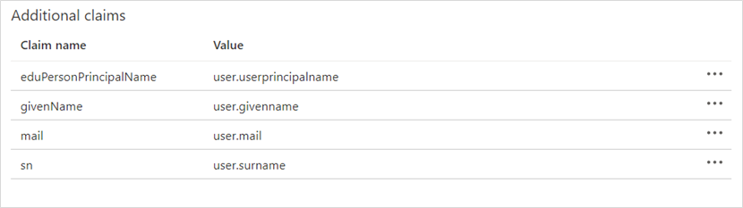

# Tutorial: Microsoft Entra integration with Sectigo Certificate Manager

In this tutorial, you'll learn how to integrate Sectigo Certificate Manager with Microsoft Entra ID. When you integrate Sectigo Certificate Manager with Microsoft Entra ID, you can:

* Control in Microsoft Entra ID who has access to Sectigo Certificate Manager.
* Enable your users to be automatically signed-in to Sectigo Certificate Manager with their Microsoft Entra accounts.
* Manage your accounts in one central location.

## Prerequisites

To configure Microsoft Entra integration with Sectigo Certificate Manager, you need the following items:

* A Microsoft Entra subscription. If you don't have a Microsoft Entra subscription, create a [free account](https://azure.microsoft.com/free/) before you begin.
* Sectigo Certificate Manager account.

> [!NOTE]
> Sectigo runs multiple instances of Sectigo Certificate Manager. The main instance of Sectigo Certificate Manager is  **https:\//cert-manager.com**, and this URL is used in this tutorial.  If your account is on a different instance, you must adjust the URLs accordingly.

## Scenario description

In this tutorial, you configure and test Microsoft Entra single sign-on in a test environment and integrate Sectigo Certificate Manager with Microsoft Entra ID.

Sectigo Certificate Manager supports the following features:

* **SP-initiated single sign-on**.
* **IDP-initiated single sign-on**.

> [!NOTE]
> Identifier of this application is a fixed string value so only one instance can be configured in one tenant.

## Add Sectigo Certificate Manager in the Azure portal

To configure the integration of Sectigo Certificate Manager into Microsoft Entra ID, you need to add Sectigo Certificate Manager from the gallery to your list of managed SaaS apps.

1. Sign in to the [Microsoft Entra admin center](https://entra.microsoft.com) as at least a [Cloud Application Administrator](../roles/permissions-reference.md#cloud-application-administrator).
1. Browse to **Identity** > **Applications** > **Enterprise applications** > **New application**.
1. In the **Add from the gallery** section, type **Sectigo Certificate Manager** in the search box.
1. Select **Sectigo Certificate Manager** from results panel and then add the app. Wait a few seconds while the app is added to your tenant.

 Alternatively, you can also use the [Enterprise App Configuration Wizard](https://portal.office.com/AdminPortal/home?Q=Docs#/azureadappintegration). In this wizard, you can add an application to your tenant, add users/groups to the app, assign roles, as well as walk through the SSO configuration as well. [Learn more about Microsoft 365 wizards.](/microsoft-365/admin/misc/azure-ad-setup-guides)

## Configure and test Microsoft Entra SSO for Sectigo Certificate Manager

Configure and test Microsoft Entra SSO with Sectigo Certificate Manager using a test user called **B.Simon**. For SSO to work, you need to establish a link relationship between a Microsoft Entra user and the related user in Sectigo Certificate Manager.

To configure and test Microsoft Entra SSO with Sectigo Certificate Manager, perform the following steps:

1. **[Configure Microsoft Entra SSO](#configure-azure-ad-sso)** - to enable your users to use this feature.
    1. **[Create a Microsoft Entra test user](#create-an-azure-ad-test-user)** - to test Microsoft Entra single sign-on with B.Simon.
    1. **[Assign the Microsoft Entra test user](#assign-the-azure-ad-test-user)** - to enable B.Simon to use Microsoft Entra single sign-on.
1. **[Configure Sectigo Certificate Manager SSO](#configure-sectigo-certificate-manager-sso)** - to configure the single sign-on settings on application side.
    1. **[Create Sectigo Certificate Manager test user](#create-sectigo-certificate-manager-test-user)** - to have a counterpart of B.Simon in Sectigo Certificate Manager that is linked to the Microsoft Entra representation of user.
1. **[Test SSO](#test-sso)** - to verify whether the configuration works.

## Configure Microsoft Entra SSO

Follow these steps to enable Microsoft Entra SSO.

1. Sign in to the [Microsoft Entra admin center](https://entra.microsoft.com) as at least a [Cloud Application Administrator](../roles/permissions-reference.md#cloud-application-administrator).
1. Browse to **Identity** > **Applications** > **Enterprise applications** > **Sectigo Certificate Manager** > **Single sign-on**.
1. On the **Select a single sign-on method** page, select **SAML**.
1. On the **Set up single sign-on with SAML** page, click the pencil icon for **Basic SAML Configuration** to edit the settings.

   

1. In the **Basic SAML Configuration** section perform the following steps:

    1. In the **Identifier (Entity ID)** box, for the main Sectigo Certificate Manager instance, enter **https:\//cert-manager.com/shibboleth**.

    1. In the **Reply URL** box, for the main Sectigo Certificate Manager instance, enter **https:\//cert-manager.com/Shibboleth.sso/SAML2/POST**.
        
    > [!NOTE]
    > Although in general, the **Sign-on URL** is mandatory for **SP-initiated mode**, it isn't needed to log in from Sectigo Certificate Manager.        

1. Optionally, in the **Basic SAML Configuration** section, to configure **IDP-initiated mode** and to allow **Test** to work, perform the following steps:

	1. Select **Set additional URLs**.

	1. In the **Relay State** box, enter your Sectigo Certificate Manager customer-specific URL. For the main Sectigo Certificate Manager instance, enter **https:\//cert-manager.com/customer/\<customerURI\>/idp**.

1. In the **User Attributes & Claims** section, perform the following steps:

	1. Delete all **Additional claims**.
	
	1. Select **Add new claim** and add the following four claims:
	
        | Name | Namespace | Source | Source attribute | Description |
        | --- | --- | --- | --- | --- |
        | eduPersonPrincipalName | empty | Attribute | user.userprincipalname | Must match the **IdP Person ID** field in Sectigo Certificate Manager for Admins. |
        | mail | empty | Attribute | user.mail | Required |
        | givenName | empty | Attribute | user.givenname | Optional |
        | sn | empty | Attribute | user.surname | Optional |

       

1. In the **SAML Signing Certificate** section, select **Download** next to **Federation Metadata XML**. Save the XML file on your computer.

	

### Create a Microsoft Entra test user 

In this section, you'll create a test user called B.Simon.

1. Sign in to the [Microsoft Entra admin center](https://entra.microsoft.com) as at least a [User Administrator](../roles/permissions-reference.md#user-administrator).
1. Browse to **Identity** > **Users** > **All users**.
1. Select **New user** > **Create new user**, at the top of the screen.
1. In the **User** properties, follow these steps:
   1. In the **Display name** field, enter `B.Simon`.  
   1. In the **User principal name** field, enter the username@companydomain.extension. For example, `B.Simon@contoso.com`.
   1. Select the **Show password** check box, and then write down the value that's displayed in the **Password** box.
   1. Select **Review + create**.
1. Select **Create**.

### Assign the Microsoft Entra test user

In this section, you'll enable B.Simon to use single sign-on by granting access to Sectigo Certificate Manager.

1. Sign in to the [Microsoft Entra admin center](https://entra.microsoft.com) as at least a [Cloud Application Administrator](../roles/permissions-reference.md#cloud-application-administrator).
1. Browse to **Identity** > **Applications** > **Enterprise applications** > **Sectigo Certificate Manager**.
1. In the app's overview page, select **Users and groups**.
1. Select **Add user/group**, then select **Users and groups** in the **Add Assignment** dialog.
   1. In the **Users and groups** dialog, select **B.Simon** from the Users list, then click the **Select** button at the bottom of the screen.
   1. If you are expecting a role to be assigned to the users, you can select it from the **Select a role** dropdown. If no role has been set up for this app, you see "Default Access" role selected.
   1. In the **Add Assignment** dialog, click the **Assign** button.

## Configure Sectigo Certificate Manager SSO

To configure single sign-on on the Sectigo Certificate Manager side, send the downloaded Federation Metadata XML file to the [Sectigo Certificate Manager support team](https://sectigo.com/support). The Sectigo Certificate Manager support team uses the information you send them to ensure that the SAML single sign-on connection is set properly on both sides.

### Create Sectigo Certificate Manager test user

In this section, you create a user named Britta Simon in Sectigo Certificate Manager. Work with the [Sectigo Certificate Manager support team](https://sectigo.com/support) to add the user in the Sectigo Certificate Manager platform. Users must be created and activated before you use single sign-on.

## Test SSO

In this section, you test your Microsoft Entra single sign-on configuration.

#### Test from Sectigo Certificate Manager (SP-initiated single sign-on)

Browse to your customer-specific URL (for the main Sectigo Certificate Manager instance, https:\//cert-manager.com/customer/\<customerURI\>/, and select the button below **Or Sign In With**.  If configured correctly, you will be automatically signed in to Sectigo Certificate Manager.

#### Test from Azure single sign-on configuration (IDP-initiated single sign-on)

In the **Sectigo Certificate Manager** application integration pane, select **Single sign-on** and select the **Test** button.  If configured correctly, you will be automatically signed in to Sectigo Certificate Manager.

#### Test by using the My Apps portal (IDP-initiated single sign-on)

Select **Sectigo Certificate Manager** in the My Apps portal.  If configured correctly you will be automatically signed in to Sectigo Certificate Manager. For more information about the My Apps portal, see [Access and use apps in the My Apps portal](https://support.microsoft.com/account-billing/sign-in-and-start-apps-from-the-my-apps-portal-2f3b1bae-0e5a-4a86-a33e-876fbd2a4510).

## Next steps

Once you configure Sectigo Certificate Manager you can enforce session control, which protects exfiltration and infiltration of your organization’s sensitive data in real time. Session control extends from Conditional Access. [Learn how to enforce session control with Microsoft Defender for Cloud Apps](/cloud-app-security/proxy-deployment-any-app).
