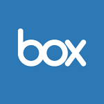

# Box and Azure Active Directory

Accelerate adoption of Box across your organization and increase user adoption with our pre-built integration. Enable users to collaborate quickly by connecting Box to Azure Active Directory (Azure AD).

> [!div class="nextstepaction"]
> [Try Box with Azure AD >](https://portal.azure.com/#blade/Microsoft_AAD_IAM/AppGalleryApplicationsBlade/category/topapps)

## What can you do with Box and Azure AD?

- **Easy single sign-on** - Eliminate multiple usernames and passwords and simplify access by allowing users to sign in to Box using their Azure AD accounts.
- **Automate user provisioning** - Automate the creation, maintenance, and removal of user accounts into Box when users join, move, or leave your organization.
- **Secure, govern, and monitor access** - Secure access to Box by applying conditional access policies, govern access through access reviews, and monitor access with sign-in logs.

## Get started

Set up [user provisioning](https://docs.microsoft.com/azure/active-directory/saas-apps/Box-provisioning-tutorial) and [single sign-on](https://docs.microsoft.com/azure/active-directory/saas-apps/box-tutorial) for Box with our easy configuration guides.

