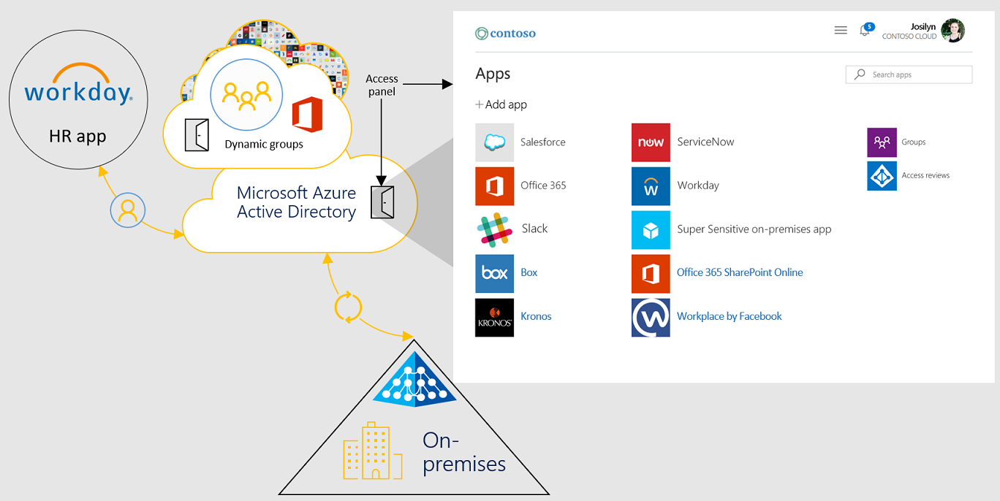

# ServiceNow and Azure Active Directory

Accelerate adoption of ServiceNow across your organization and increase user adoption with our pre-built integration. Streamline your IT service management by connecting ServiceNow to Azure Active Directory (Azure AD).

> [!div class="nextstepaction"]
> [Try ServiceNow with Azure AD >](https://portal.azure.com/#blade/Microsoft_AAD_IAM/AppGalleryApplicationsBlade/category/topapps)

## What can you do with Azure AD + ServiceNow?

- **Easy single sign-on** - Eliminate multiple usernames and passwords and simplify access by allowing users to sign-in to ServiceNow using their Azure AD accounts.
- **Automate user provisioning** - Automate the creation, maintenance, and removal of user accounts into ServiceNow when users join, move, or leave your organization.
- **Secure, govern, and monitor access** - Secure access to ServiceNow by applying conditional access policies, govern access through access reviews, and monitor access with sign-in logs.

## Get started

Set up [user provisioning](https://docs.microsoft.com/azure/active-directory/saas-apps/servicenow-provisioning-tutorial) and [single sign-on](https://docs.microsoft.com/azure/active-directory/saas-apps/servicenow-tutorial) for ServiceNow with our easy configuration guides.

