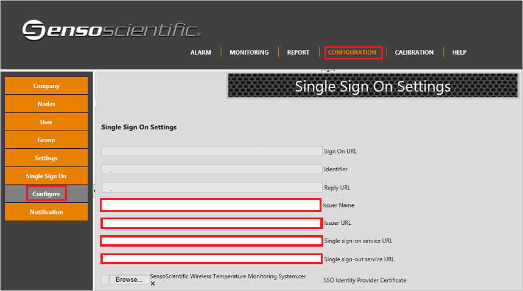

# Tutorial: Azure AD SSO integration with SensoScientific Wireless Temperature Monitoring System

In this tutorial, you'll learn how to integrate SensoScientific Wireless Temperature Monitoring System with Azure Active Directory (Azure AD). When you integrate SensoScientific Wireless Temperature Monitoring System with Azure AD, you can:

* Control in Azure AD who has access to SensoScientific Wireless Temperature Monitoring System.
* Enable your users to be automatically signed-in to SensoScientific Wireless Temperature Monitoring System with their Azure AD accounts.
* Manage your accounts in one central location - the Azure portal.

## Prerequisites

To configure Azure AD integration with SensoScientific Wireless Temperature Monitoring System, you need the following items:

* An Azure AD subscription. If you don't have an Azure AD environment, you can get a [free account](https://azure.microsoft.com/free/).
* SensoScientific Wireless Temperature Monitoring System single sign-on enabled subscription.
* Along with Cloud Application Administrator, Application Administrator can also add or manage applications in Azure AD.
For more information, see [Azure built-in roles](../roles/permissions-reference.md).

## Scenario description

In this tutorial, you configure and test Azure AD single sign-on in a test environment.

* SensoScientific Wireless Temperature Monitoring System supports **IDP** initiated SSO.

## Add SensoScientific Wireless Temperature Monitoring System from the gallery

To configure the integration of SensoScientific Wireless Temperature Monitoring System into Azure AD, you need to add SensoScientific Wireless Temperature Monitoring System from the gallery to your list of managed SaaS apps.

1. Sign in to the Azure portal using either a work or school account, or a personal Microsoft account.
1. On the left navigation pane, select the **Azure Active Directory** service.
1. Navigate to **Enterprise Applications** and then select **All Applications**.
1. To add new application, select **New application**.
1. In the **Add from the gallery** section, type **SensoScientific Wireless Temperature Monitoring System** in the search box.
1. Select **SensoScientific Wireless Temperature Monitoring System** from results panel and then add the app. Wait a few seconds while the app is added to your tenant.

 Alternatively, you can also use the [Enterprise App Configuration Wizard](https://portal.office.com/AdminPortal/home?Q=Docs#/azureadappintegration). In this wizard, you can add an application to your tenant, add users/groups to the app, assign roles, as well as walk through the SSO configuration as well. [Learn more about Microsoft 365 wizards.](/microsoft-365/admin/misc/azure-ad-setup-guides)

## Configure and test Azure AD SSO for SensoScientific Wireless Temperature Monitoring System

Configure and test Azure AD SSO with SensoScientific Wireless Temperature Monitoring System using a test user called **B.Simon**. For SSO to work, you need to establish a link relationship between an Azure AD user and the related user in SensoScientific Wireless Temperature Monitoring System.

To configure and test Azure AD SSO with SensoScientific Wireless Temperature Monitoring System, perform the following steps:

1. **[Configure Azure AD SSO](#configure-azure-ad-sso)** - to enable your users to use this feature.
    1. **[Create an Azure AD test user](#create-an-azure-ad-test-user)** - to test Azure AD single sign-on with B.Simon.
    1. **[Assign the Azure AD test user](#assign-the-azure-ad-test-user)** - to enable B.Simon to use Azure AD single sign-on.
1. **[Configure SensoScientific Wireless Temperature Monitoring System SSO](#configure-sensoscientific-wireless-temperature-monitoring-system-sso)** - to configure the single sign-on settings on application side.
    1. **[Create SensoScientific Wireless Temperature Monitoring System test user](#create-sensoscientific-wireless-temperature-monitoring-system-test-user)** - to have a counterpart of B.Simon in SensoScientific Wireless Temperature Monitoring System that is linked to the Azure AD representation of user.
1. **[Test SSO](#test-sso)** - to verify whether the configuration works.

## Configure Azure AD SSO

Follow these steps to enable Azure AD SSO in the Azure portal.

1. In the Azure portal, on the **SensoScientific Wireless Temperature Monitoring System** application integration page, find the **Manage** section and select **single sign-on**.
1. On the **Select a single sign-on method** page, select **SAML**.
1. On the **Set up single sign-on with SAML** page, click the pencil icon for **Basic SAML Configuration** to edit the settings.

   

1. On the **Basic SAML Configuration** section, the user does not have to perform any step as the app is already pre-integrated with Azure.

1. On the **Set up Single Sign-On with SAML** page, in the **SAML Signing Certificate** section, click **Download** to download the **Certificate (Base64)** from the given options as per your requirement and save it on your computer.

	

1. On the **Set up SensoScientific Wireless Temperature Monitoring System** section, copy the appropriate URL(s) as per your requirement.

	

### Create an Azure AD test user

In this section, you'll create a test user in the Azure portal called B.Simon.

1. From the left pane in the Azure portal, select **Azure Active Directory**, select **Users**, and then select **All users**.
1. Select **New user** at the top of the screen.
1. In the **User** properties, follow these steps:
   1. In the **Name** field, enter `B.Simon`.  
   1. In the **User name** field, enter the username@companydomain.extension. For example, `B.Simon@contoso.com`.
   1. Select the **Show password** check box, and then write down the value that's displayed in the **Password** box.
   1. Click **Create**.

### Assign the Azure AD test user

In this section, you'll enable B.Simon to use Azure single sign-on by granting access to SensoScientific Wireless Temperature Monitoring System.

1. In the Azure portal, select **Enterprise Applications**, and then select **All applications**.
1. In the applications list, select **SensoScientific Wireless Temperature Monitoring System**.
1. In the app's overview page, find the **Manage** section and select **Users and groups**.
1. Select **Add user**, then select **Users and groups** in the **Add Assignment** dialog.
1. In the **Users and groups** dialog, select **B.Simon** from the Users list, then click the **Select** button at the bottom of the screen.
1. If you're expecting any role value in the SAML assertion, in the **Select Role** dialog, select the appropriate role for the user from the list and then click the **Select** button at the bottom of the screen.
1. In the **Add Assignment** dialog, click the **Assign** button.

## Configure SensoScientific Wireless Temperature Monitoring System SSO

1. Sign on to your SensoScientific Wireless Temperature Monitoring System application as an administrator.

1. In the navigation menu on the top, click **Configuration** and goto **Configure** under **Single Sign On** to open the Single Sign On Settings and perform the following steps:

	

    a. Select **Issuer Name** as Azure AD.

	b. In the **Issuer URL** textbox, paste the **Azure AD Identifier** which you have copied from Azure portal.

	c. In the **Single Sign-On Service URL** textbox, paste the **Login URL** which you have copied from Azure portal.

	d. In the **Single Sign-Out Service URL** textbox, paste the **Logout URL** which you have copied from Azure portal.

	e. Browse the certificate which you have downloaded from Azure portal and upload here.

	f. Click **Save**.

### Create SensoScientific Wireless Temperature Monitoring System test user

To enable Azure AD users to sign in to SensoScientific Wireless Temperature Monitoring System, they must be provisioned into SensoScientific Wireless Temperature Monitoring System. Work with [SensoScientific Wireless Temperature Monitoring System support team](https://www.sensoscientific.com/contact-us/) to add the users in the SensoScientific Wireless Temperature Monitoring System platform. Users must be created and activated before you use single sign-on.

## Test SSO

In this section, you test your Azure AD single sign-on configuration with following options.

* Click on Test this application in Azure portal and you should be automatically signed in to the SensoScientific Wireless Temperature Monitoring System for which you set up the SSO.

* You can use Microsoft My Apps. When you click the SensoScientific Wireless Temperature Monitoring System tile in the My Apps, you should be automatically signed in to the SensoScientific Wireless Temperature Monitoring System for which you set up the SSO. For more information about the My Apps, see [Introduction to the My Apps](../user-help/my-apps-portal-end-user-access.md).

## Next steps

Once you configure SensoScientific Wireless Temperature Monitoring System you can enforce session control, which protects exfiltration and infiltration of your organization’s sensitive data in real time. Session control extends from Conditional Access. [Learn how to enforce session control with Microsoft Cloud App Security](/cloud-app-security/proxy-deployment-aad).