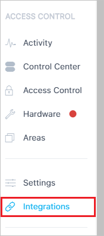
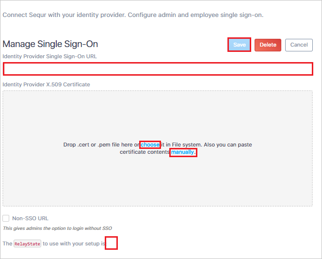

# Tutorial: Azure Active Directory integration with Genea Access Control

In this tutorial, you'll learn how to integrate Genea Access Control with Azure Active Directory (Azure AD). When you integrate Genea Access Control with Azure AD, you can:

* Control in Azure AD who has access to Genea Access Control.
* Enable your users to be automatically signed-in to Genea Access Control with their Azure AD accounts.
* Manage your accounts in one central location - the Azure portal.

## Prerequisites

To configure Azure AD integration with Genea Access Control, you need the following items:

* An Azure AD subscription. If you don't have an Azure AD environment, you can get a [free account](https://azure.microsoft.com/free/)
* Genea Access Control single sign-on enabled subscription

## Scenario description

In this tutorial, you configure and test Azure AD SSO in a test environment.

* Genea Access Control supports **SP and IDP** initiated SSO.
> [!NOTE]
> Identifier of this application is a fixed string value so only one instance can be configured in one tenant.

## Adding Genea Access Control from the gallery

To configure the integration of Genea Access Control into Azure AD, you need to add Genea Access Control from the gallery to your list of managed SaaS apps.

1. Sign in to the Azure portal using either a work or school account, or a personal Microsoft account.
1. On the left navigation pane, select the **Azure Active Directory** service.
1. Navigate to **Enterprise Applications** and then select **All Applications**.
1. To add new application, select **New application**.
1. In the **Add from the gallery** section, type **Genea Access Control** in the search box.
1. Select **Genea Access Control** from results panel and then add the app. Wait a few seconds while the app is added to your tenant.

## Configure and test Azure AD SSO for Genea Access Control

Configure and test Azure AD SSO with Genea Access Control using a test user called **B.Simon**. For SSO to work, you need to establish a link relationship between an Azure AD user and the related user in Genea Access Control.

To configure and test Azure AD SSO with Genea Access Control, perform the following steps:

1. **[Configure Azure AD SSO](#configure-azure-ad-sso)** - to enable your users to use this feature.
    1. **[Create an Azure AD test user](#create-an-azure-ad-test-user)** - to test Azure AD single sign-on with B.Simon.
    1. **[Assign the Azure AD test user](#assign-the-azure-ad-test-user)** - to enable B.Simon to use Azure AD single sign-on.
1. **[Configure Genea Access Control SSO](#configure-genea-access-control-sso)** - to configure the single sign-on settings on application side.
    1. **[Create Genea Access Control test user](#create-genea-access-control-test-user)** - to have a counterpart of B.Simon in Genea Access Control that is linked to the Azure AD representation of user.
1. **[Test SSO](#test-sso)** - to verify whether the configuration works.

## Configure Azure AD SSO

Follow these steps to enable Azure AD SSO in the Azure portal.

1. In the Azure portal, on the **Genea Access Control** application integration page, find the **Manage** section and select **single sign-on**.
1. On the **Select a single sign-on method** page, select **SAML**.
1. On the **Set up single sign-on with SAML** page, click the pencil icon for **Basic SAML Configuration** to edit the settings.

   

4. On the **Basic SAML Configuration** section, if you wish to configure the application in **IDP** initiated mode, perform the following step:

    In the **Identifier** text box, type the URL:
    `https://login.sequr.io`

5. Click **Set additional URLs** and perform the following step if you wish to configure the application in **SP** initiated mode:

    a. In the **Sign-on URL** text box, type the URL: `https://login.sequr.io`

	b. In the **Relay State** textbox, you will get this value, which is explained later in the tutorial.

6. On the **Set up Single Sign-On with SAML** page, in the **SAML Signing Certificate** section, click **Download** to download the **Certificate (Base64)** from the given options as per your requirement and save it on your computer.

	

7. On the **Set up Genea Access Control** section, copy the appropriate URL(s) as per your requirement.

	

### Create an Azure AD test user

In this section, you'll create a test user in the Azure portal called B.Simon.

1. From the left pane in the Azure portal, select **Azure Active Directory**, select **Users**, and then select **All users**.
1. Select **New user** at the top of the screen.
1. In the **User** properties, follow these steps:
   1. In the **Name** field, enter `B.Simon`.  
   1. In the **User name** field, enter the username@companydomain.extension. For example, `B.Simon@contoso.com`.
   1. Select the **Show password** check box, and then write down the value that's displayed in the **Password** box.
   1. Click **Create**.

### Assign the Azure AD test user

In this section, you'll enable B.Simon to use Azure single sign-on by granting access to Genea Access Control.

1. In the Azure portal, select **Enterprise Applications**, and then select **All applications**.
1. In the applications list, select **Genea Access Control**.
1. In the app's overview page, find the **Manage** section and select **Users and groups**.
1. Select **Add user**, then select **Users and groups** in the **Add Assignment** dialog.
1. In the **Users and groups** dialog, select **B.Simon** from the Users list, then click the **Select** button at the bottom of the screen.
1. If you are expecting a role to be assigned to the users, you can select it from the **Select a role** dropdown. If no role has been set up for this app, you see "Default Access" role selected.
1. In the **Add Assignment** dialog, click the **Assign** button.
## Configure Genea Access Control SSO

1. In a different web browser window, sign in to your Genea Access Control company site as an administrator.

1. Click on the **Integrations** from the left navigation panel.

	

1. Scroll down to the **Single Sign-On** section and click **Manage**.

	

1. In the **Manage Single Sign-On** section, perform the following steps:

	

	a. In the **Identity Provider Single Sign-On URL** textbox, paste the **Login URL** value, which you have copied from the Azure portal.

	b. Drag and drop the **Certificate** file, which you have downloaded from the Azure portal or manually enter the content of the certificate.

	c. After saving the configuration, the relay state value will be generated. Copy the **relay state** value and paste it in the **Relay State** textbox of **Basic SAML Configuration** section in the Azure portal.

	d. Click **Save**.

### Create Genea Access Control test user

In this section, you create a user called Britta Simon in Genea Access Control. Work with [Genea Access Control Client support team](mailto:support@sequr.io) to add the users in the Genea Access Control platform. Users must be created and activated before you use single sign-on.

## Test SSO 

In this section, you test your Azure AD single sign-on configuration with following options. 

#### SP initiated:

* Click on **Test this application** in Azure portal. This will redirect to Genea Access Control Sign on URL where you can initiate the login flow.  

* Go to Genea Access Control Sign-on URL directly and initiate the login flow from there.

#### IDP initiated:

* Click on **Test this application** in Azure portal and you should be automatically signed in to the Genea Access Control for which you set up the SSO 

You can also use Microsoft My Apps to test the application in any mode. When you click the Genea Access Control tile in the My Apps, if configured in SP mode you would be redirected to the application sign on page for initiating the login flow and if configured in IDP mode, you should be automatically signed in to the Genea Access Control for which you set up the SSO. For more information about the My Apps, see [Introduction to the My Apps](https://docs.microsoft.com/azure/active-directory/active-directory-saas-access-panel-introduction).

## Next steps

Once you configure Genea Access Control you can enforce session control, which protects exfiltration and infiltration of your organization’s sensitive data in real time. Session control extends from Conditional Access. [Learn how to enforce session control with Microsoft Cloud App Security](https://docs.microsoft.com/cloud-app-security/proxy-deployment-any-app).