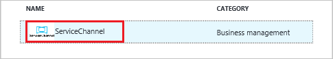
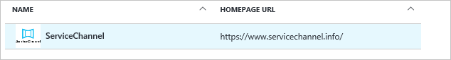

# Tutorial: Azure Active Directory integration with ServiceChannel

In this tutorial, you learn how to integrate ServiceChannel with Azure Active Directory (Azure AD).

Integrating ServiceChannel with Azure AD provides you with the following benefits:

- You can control in Azure AD who has access to ServiceChannel
- You can enable your users to automatically get signed-on to ServiceChannel (Single Sign-On) with their Azure AD accounts
- You can manage your accounts in one central location - the Azure Management portal

If you want to know more details about SaaS app integration with Azure AD, see [What is application access and single sign-on with Azure Active Directory](../manage-apps/what-is-single-sign-on.md).

## Prerequisites

To configure Azure AD integration with ServiceChannel, you need the following items:

- An Azure AD subscription
- A ServiceChannel single-sign on enabled subscription

> [!NOTE]
> To test the steps in this tutorial, we do not recommend using a production environment.

To test the steps in this tutorial, you should follow these recommendations:

- You should not use your production environment, unless this is necessary.
- If you don't have an Azure AD trial environment, you can get a one-month trial [here](https://azure.microsoft.com/pricing/free-trial/).

## Scenario description
In this tutorial, you test Azure AD single sign-on in a test environment. 
The scenario outlined in this tutorial consists of two main building blocks:

1. Adding ServiceChannel from the gallery
1. Configuring and testing Azure AD single sign-on

## Adding ServiceChannel from the gallery
To configure the integration of ServiceChannel into Azure AD, you need to add ServiceChannel from the gallery to your list of managed SaaS apps.

**To add ServiceChannel from the gallery, perform the following steps:**

1. In the **[Azure Management Portal](https://portal.azure.com)**, on the left navigation panel, click **Azure Active Directory** icon. 

	![Active Directory][1]

1. Navigate to **Enterprise applications**. Then go to **All applications**.

	![Applications][2]
	
1. Click **Add** button on the top of the dialog.

	![Applications][3]

1. In the search box, type **ServiceChannel**.

	

1. In the results panel, select **ServiceChannel**, and then click **Add** button to add the application.

	

##  Configuring and testing Azure AD single sign-on
In this section, you configure and test Azure AD single sign-on with ServiceChannel based on a test user called "Britta Simon".

For single sign-on to work, Azure AD needs to know what the counterpart user in ServiceChannel is to a user in Azure AD. In other words, a link relationship between an Azure AD user and the related user in ServiceChannel needs to be established.

This link relationship is established by assigning the value of the **user name** in Azure AD as the value of the **Username** in ServiceChannel.

To configure and test Azure AD single sign-on with ServiceChannel, you need to complete the following building blocks:

1. **[Configuring Azure AD Single Sign-On](#configuring-azure-ad-single-sign-on)** - to enable your users to use this feature.
1. **[Creating an Azure AD test user](#creating-an-azure-ad-test-user)** - to test Azure AD single sign-on with Britta Simon.
1. **[Creating a ServiceChannel test user](#creating-a-servicechannel-test-user)** - to test Azure AD single sign-on with Britta Simon.
1. **[Assigning the Azure AD test user](#assigning-the-azure-ad-test-user)** - to enable Britta Simon to use Azure AD single sign-on.
1. **[Testing Single Sign-On](#testing-single-sign-on)** - to verify whether the configuration works.

### Configuring Azure AD single sign-on

In this section, you enable Azure AD single sign-on in the Azure Management portal and configure single sign-on in your ServiceChannel application.

**To configure Azure AD single sign-on with ServiceChannel, perform the following steps:**

1. In the Azure Management portal, on the **ServiceChannel** application integration page, click **Single sign-on**.

	![Configure Single Sign-On][4]

1. On the **Single sign-on** dialog, as **Mode** select **SAML-based Sign-on** to enable single sign on.
 
	

1. On the **ServiceChannel Domain and URLs** section, perform the following steps:

	

    a. In the **Identifier** textbox, type the value as: `http://adfs.<domain>.com/adfs/service/trust`

	b. In the **Reply URL** textbox, type a URL using the following pattern: `https://<customer domain>.servicechannel.com/saml/acs`

	> [!NOTE] 
	> Please note that these are not the real values. You have to update these values with the actual Identifier and Reply URL. Here we suggest you to use the unique value of string in the Identifier. Contact [ServiceChannel support team](https://servicechannel.zendesk.com/hc/en-us) to get these values.

1. Your ServiceChannel application expects the SAML assertions in a specific format, which requires you to add custom attribute mappings to your SAML token attributes configuration. The following screenshot shows an example for this. **NameIdentifier(User Identifier)** is the only mandatory claim and the default value is **user.userprincipalname** but ServiceChannel expects this to be mapped with **user.mail**. If you are planning to enable Just In Time user provisioning, then you should add the following claims as shown below. **Role** claim needs to be mapped to **user.assignedroles** which contains the role of the user.  

	You can refer ServiceChannel guide [here](https://servicechannel.zendesk.com/hc/en-us/articles/217514326-Azure-AD-Configuration-Example) for more guidance on claims.
  	
	

	> [!NOTE] 
	> See [Manage access using RBAC and the Azure portal](../../role-based-access-control/role-assignments-portal.md) to learn how to configure **Role** in Azure AD.

1. In **User Attributes** section, click **View and edit all other user attributes** and set the attributes.

	| Attribute Name | Attribute Value |
	| --- | --- |    
	| Role| user.assignedroles |

	a. Click **Add attribute** to open the **Add Attribute** dialog.

	

	
	
	b. In the **Name** textbox, type the attribute name shown for that row.
	
	c. From the **Value** list, type the attribute value shown for that row.
	
	d. Click **Ok**
	
1. On the **SAML Signing Certificate** section, click **Certificate (Base64)** and then save the certificate file on your computer.

	 

1. Click **Save**.

	

1. On the **ServiceChannel Configuration** section, click **Configure ServiceChannel** to open **Configure sign-on** window. Please note the **SAML Enitity ID** from the **Quick Reference** section.

1. To configure single sign-on on **ServiceChannel** side, you need to send the downloaded **certificate (Base64)** and **SAML Entity ID** to [ServiceChannel support team](https://servicechannel.zendesk.com/hc/en-us). They will set this up in order to have the SAML SSO connection set properly on both sides.

### Creating an Azure AD test user
The objective of this section is to create a test user in the Azure Management portal called Britta Simon.

![Create Azure AD User][100]

**To create a test user in Azure AD, perform the following steps:**

1. In the **Azure Management portal**, on the left navigation pane, click **Azure Active Directory** icon.

	 

1. Go to **Users and groups** and click **All users** to display the list of users.
	
	 

1. At the top of the dialog click **Add** to open the **User** dialog.
 
	 

1. On the **User** dialog page, perform the following steps:
 
	 

    a. In the **Name** textbox, type **BrittaSimon**.

    b. In the **User name** textbox, type the **email address** of BrittaSimon.

	c. Select **Show Password** and write down the value of the **Password**.

    d. Click **Create**. 

### Creating a ServiceChannel test user

Application supports Just in time user provisioning and after authentication users will be created in the application automatically. For full user provisioning, please contact [ServiceChannel support team](https://servicechannel.zendesk.com/hc/en-us)

### Assigning the Azure AD test user

In this section, you enable Britta Simon to use Azure single sign-on by granting her access to ServiceChannel.

![Assign User][200] 

**To assign Britta Simon to ServiceChannel, perform the following steps:**

1. In the Azure Management portal, open the applications view, and then navigate to the directory view and go to **Enterprise applications** then click **All applications**.

	![Assign User][201] 

1. In the applications list, select **ServiceChannel**.

	 

1. In the menu on the left, click **Users and groups**.

	![Assign User][202] 

1. Click **Add** button. Then select **Users and groups** on **Add Assignment** dialog.

	![Assign User][203]

1. On **Users and groups** dialog, select **Britta Simon** in the Users list.

1. Click **Select** button on **Users and groups** dialog.

1. Click **Assign** button on **Add Assignment** dialog.
	
### Testing single sign-on

In this section, you test your Azure AD single sign-on configuration using the Access Panel.

When you click the ServiceChannel tile in the Access Panel, you should get automatically signed-on to your ServiceChannel application.

## Additional resources

* [List of Tutorials on How to Integrate SaaS Apps with Azure Active Directory](tutorial-list.md)
* [What is application access and single sign-on with Azure Active Directory?](../manage-apps/what-is-single-sign-on.md)

<!--Image references-->

[1]: ./media/servicechannel-tutorial/tutorial_general_01.png
[2]: ./media/servicechannel-tutorial/tutorial_general_02.png
[3]: ./media/servicechannel-tutorial/tutorial_general_03.png
[4]: ./media/servicechannel-tutorial/tutorial_general_04.png

[100]: ./media/servicechannel-tutorial/tutorial_general_100.png

[200]: ./media/servicechannel-tutorial/tutorial_general_200.png
[201]: ./media/servicechannel-tutorial/tutorial_general_201.png
[202]: ./media/servicechannel-tutorial/tutorial_general_202.png
[203]: ./media/servicechannel-tutorial/tutorial_general_203.png