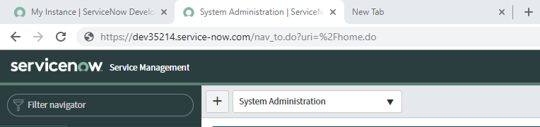
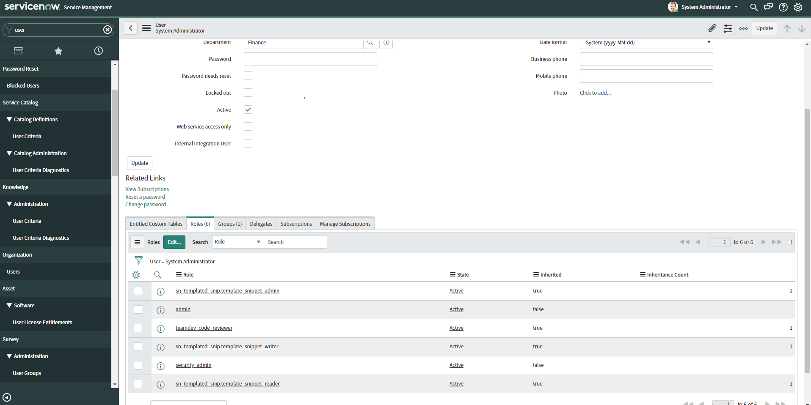

# Tutorial: Configure ServiceNow for automatic user provisioning

This tutorial describes the steps you need to perform in both ServiceNow and Azure Active Directory (Azure AD) to configure automatic user provisioning. When configured, Azure AD automatically provisions and de-provisions users and groups to [ServiceNow](https://www.servicenow.com/) using the Azure AD Provisioning service. For important details on what this service does, how it works, and frequently asked questions, see [Automate user provisioning and deprovisioning to SaaS applications with Azure Active Directory](../app-provisioning/user-provisioning.md). 

## Capabilities Supported
> [!div class="checklist"]
> * Create users in ServiceNow
> * Remove users in ServiceNow when they do not require access anymore
> * Keep user attributes synchronized between Azure AD and ServiceNow
> * Provision groups and group memberships in ServiceNow
> * [Single sign-on](servicenow-tutorial.md) to ServiceNow (recommended)

## Prerequisites

The scenario outlined in this tutorial assumes that you already have the following prerequisites:

* [An Azure AD tenant](https://docs.microsoft.com/azure/active-directory/develop/quickstart-create-new-tenant) 
* A user account in Azure AD with [permission](https://docs.microsoft.com/azure/active-directory/users-groups-roles/directory-assign-admin-roles) to configure provisioning (e.g. Application Administrator, Cloud Application administrator, Application Owner, or Global Administrator). 
* A [ServiceNow instance](https://www.servicenow.com/) of Calgary or higher
* A [ServiceNow Express instance](https://www.servicenow.com/) of Helsinki or higher
* A user account in ServiceNow with the admin role

## Step 1. Plan your provisioning deployment
1. Learn about [how the provisioning service works](https://docs.microsoft.com/azure/active-directory/manage-apps/user-provisioning).
2. Determine who will be in [scope for provisioning](https://docs.microsoft.com/azure/active-directory/manage-apps/define-conditional-rules-for-provisioning-user-accounts).
3. Determine what data to [map between Azure AD and ServiceNow](https://docs.microsoft.com/azure/active-directory/manage-apps/customize-application-attributes). 

## Step 2. Configure ServiceNow to support provisioning with Azure AD

1. Identify your ServiceNow instance name. You can find the instance name in the URL that you use to access ServiceNow. In the example below, the instance name is dev35214.

   

2. Obtain credentials for an admin in ServiceNow. Navigate to the user profile in ServiceNow and verify that the user has the admin role. 

   

3. Check to make sure that the following settings are **disabled** in ServiceNow:

   1. Select **System Security** > **High security settings** > **Require basic authentication for incoming SCHEMA requests**.
   2. Select **System Properties** > **Web Services** > **Require basic authorization for incoming SOAP requests**.
     
   > [!IMPORTANT]
   > If these setting are *enabled*, the provisioning engine will fail to communicate with ServiceNow.

## Step 3. Add ServiceNow from the Azure AD application gallery

Add ServiceNow from the Azure AD application gallery to start managing provisioning to ServiceNow. If you have previously setup ServiceNow for SSO you can use the same application. However it is recommended that you create a separate app when testing out the integration initially. Learn more about adding an application from the gallery [here](https://docs.microsoft.com/azure/active-directory/manage-apps/add-gallery-app). 

## Step 4. Define who will be in scope for provisioning 

The Azure AD provisioning service allows you to scope who will be provisioned based on assignment to the application and or based on attributes of the user / group. If you choose to scope who will be provisioned to your app based on assignment, you can use the following [steps](../manage-apps/assign-user-or-group-access-portal.md) to assign users and groups to the application. If you choose to scope who will be provisioned based solely on attributes of the user or group, you can use a scoping filter as described [here](https://docs.microsoft.com/azure/active-directory/manage-apps/define-conditional-rules-for-provisioning-user-accounts). 

* When assigning users and groups to ServiceNow, you must select a role other than **Default Access**. Users with the Default Access role are excluded from provisioning and will be marked as not effectively entitled in the provisioning logs. If the only role available on the application is the default access role, you can [update the application manifest](https://docs.microsoft.com/azure/active-directory/develop/howto-add-app-roles-in-azure-ad-apps) to add additional roles. 

* Start small. Test with a small set of users and groups before rolling out to everyone. When scope for provisioning is set to assigned users and groups, you can control this by assigning one or two users or groups to the app. When scope is set to all users and groups, you can specify an [attribute based scoping filter](https://docs.microsoft.com/azure/active-directory/manage-apps/define-conditional-rules-for-provisioning-user-accounts). 

## Step 5. Configure automatic user provisioning to ServiceNow 

This section guides you through the steps to configure the Azure AD provisioning service to create, update, and disable users and/or groups in TestApp based on user and/or group assignments in Azure AD.

### To configure automatic user provisioning for ServiceNow in Azure AD:

1. Sign in to the [Azure portal](https://portal.azure.com). Select **Enterprise Applications**, then select **All applications**.

	

2. In the applications list, select **ServiceNow**.

	

3. Select the **Provisioning** tab.

	

4. Set the **Provisioning Mode** to **Automatic**.

	

5. Under the **Admin Credentials** section, input your ServiceNow admin credentials and username. Click **Test Connection** to ensure Azure AD can connect to ServiceNow. If the connection fails, ensure your ServiceNow account has Admin permissions and try again.

 	

6. In the **Notification Email** field, enter the email address of a person or group who should receive the provisioning error notifications and select the **Send an email notification when a failure occurs** check box.

	

7. Select **Save**.

8. Under the **Mappings** section, select **Synchronize Azure Active Directory Users to ServiceNow**.

9. Review the user attributes that are synchronized from Azure AD to ServiceNow in the **Attribute-Mapping** section. The attributes selected as **Matching** properties are used to match the user accounts in ServiceNow for update operations. If you choose to change the [matching target attribute](https://docs.microsoft.com/azure/active-directory/manage-apps/customize-application-attributes), you will need to ensure that the ServiceNow API supports filtering users based on that attribute. Select the **Save** button to commit any changes.

10. Under the **Mappings** section, select **Synchronize Azure Active Directory Groups to ServiceNow**.

11. Review the group attributes that are synchronized from Azure AD to ServiceNow in the **Attribute-Mapping** section. The attributes selected as **Matching** properties are used to match the groups in ServiceNow for update operations. Select the **Save** button to commit any changes.

12. To configure scoping filters, refer to the following instructions provided in the [Scoping filter tutorial](../app-provisioning/define-conditional-rules-for-provisioning-user-accounts.md).

13. To enable the Azure AD provisioning service for ServiceNow, change the **Provisioning Status** to **On** in the **Settings** section.

	

14. Define the users and/or groups that you would like to provision to ServiceNow by choosing the desired values in **Scope** in the **Settings** section.

	

15. When you are ready to provision, click **Save**.

	

This operation starts the initial synchronization cycle of all users and groups defined in **Scope** in the **Settings** section. The initial cycle takes longer to perform than subsequent cycles, which occur approximately every 40 minutes as long as the Azure AD provisioning service is running. 

## Step 6. Monitor your deployment
Once you've configured provisioning, use the following resources to monitor your deployment:

1. Use the [provisioning logs](https://docs.microsoft.com/azure/active-directory/reports-monitoring/concept-provisioning-logs) to determine which users have been provisioned successfully or unsuccessfully
2. Check the [progress bar](https://docs.microsoft.com/azure/active-directory/manage-apps/application-provisioning-when-will-provisioning-finish-specific-user) to see the status of the provisioning cycle and how close it is to completion
3. If the provisioning configuration seems to be in an unhealthy state, the application will go into quarantine. Learn more about quarantine states [here](https://docs.microsoft.com/azure/active-directory/manage-apps/application-provisioning-quarantine-status).  

## Troubleshooting Tips
* **InvalidLookupReference:** When provisioning certain attributes such as Department and Location in ServiceNow, the values must already exist in a reference table in ServiceNow. For example, you may have two locations (Seattle, Los Angeles) and three departments (Sales, Finance, Marketing) in the **insert table name** table in ServiceNow. If you attempt to provision a user where his department is "Sales" and location is "Seattle" he will be provisioned successfully. If you attempt to provision a user with department "Sales" and location "LA" the user won't be provisioned. The location LA must either be added to the reference table in ServiceNow or the user attribute in Azure AD must be updated to match the format in ServiceNow. 
* **EntryJoiningPropertyValueIsMissing:** Review your [attribute mappings](https://docs.microsoft.com/azure/active-directory/manage-apps/customize-application-attributes) to identify the matching attribute. This value must be present on the user or group you're attempting to provision. 
* Review the [ServiceNow SOAP API](https://docs.servicenow.com/bundle/newyork-application-development/page/integrate/web-services-apis/reference/r_DirectWebServiceAPIFunctions.html) to understand any requirements or limitations (for example, format to specify country code for a user)
* Provisioning requests are sent by default to https://{your-instance-name}.service-now.com/{table-name} . If you require a custom tenant URL, you can provide the entire URL in the instance name field.
* **ServiceNowInstanceInvalid** 
  
  `Details: Your ServiceNow instance name appears to be invalid.  Please provide a current ServiceNow administrative user name and          password along with the name of a valid ServiceNow instance.`                                                              

   This error indicates an issue communicating with the ServiceNow instance. Double-check to make sure that the following settings are *disabled* in ServiceNow:
   
   1. Select **System Security** > **High security settings** > **Require basic authentication for incoming SCHEMA requests**.
   2. Select **System Properties** > **Web Services** > **Require basic authorization for incoming SOAP requests**.

## Additional resources

* [Managing user account provisioning for Enterprise Apps](../app-provisioning/configure-automatic-user-provisioning-portal.md)
* [What is application access and single sign-on with Azure Active Directory?](../manage-apps/what-is-single-sign-on.md)

## Next steps

* [Learn how to review logs and get reports on provisioning activity](../app-provisioning/check-status-user-account-provisioning.md)
