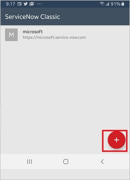
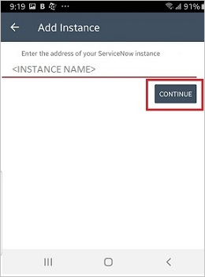
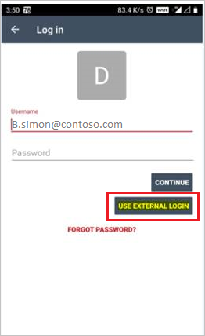

# Tutorial: Integrate ServiceNow with Azure Active Directory

In this tutorial, you'll learn how to integrate ServiceNow with Azure Active Directory (Azure AD). When you integrate ServiceNow with Azure AD, you can:

* Control in Azure AD who has access to ServiceNow.
* Enable your users to be automatically signed-in to ServiceNow with their Azure AD accounts.
* Manage your accounts in one central location - the Azure portal.

To learn more about SaaS app integration with Azure AD, see [What is application access and Single Sign-On with Azure Active Directory](https://docs.microsoft.com/azure/active-directory/active-directory-appssoaccess-whatis).

## Prerequisites

To get started, you need the following items:

* An Azure AD subscription. If you don't have a subscription, you can get a [free account](https://azure.microsoft.com/free/).
* ServiceNow Single Sign-On (SSO) enabled subscription.
* For ServiceNow, an instance or tenant of ServiceNow, Calgary version or higher
* For ServiceNow Express, an instance of ServiceNow Express, Helsinki version or higher
* The ServiceNow tenant must have the [Multiple Provider Single Sign On Plugin](https://wiki.servicenow.com/index.php?title=Multiple_Provider_Single_Sign-On#gsc.tab=0) enabled. This can be done by [submitting a service request](https://hi.service-now.com).
* For automatic configuration, enable the multi-provider plugin for ServiceNow.
* To install the ServiceNow Classic (Mobile) application you need to go to the appropriate store and search for the ServiceNow Classic application and click Download.

## Scenario description

In this tutorial, you configure and test Azure AD SSO in a test environment. ServiceNow supports **SP** initiated SSO and supports [**Automated** user provisioning](servicenow-provisioning-tutorial.md).

ServiceNow Classic (Mobile) application can now be configured with Azure AD for enabling SSO and it supports both **Android** and **IOS** users. In this tutorial, you configure and test Azure AD SSO in a test environment.

## Adding ServiceNow from the gallery

To configure the integration of ServiceNow into Azure AD, you need to add ServiceNow from the gallery to your list of managed SaaS apps.

1. Sign in to the [Azure portal](https://portal.azure.com) using either a work or school account, or a personal Microsoft account.
1. On the left navigation pane, select the **Azure Active Directory** service.
1. Navigate to **Enterprise Applications** and then select **All Applications**.
1. To add new application, select **New application**.
1. In the **Add from the gallery** section, type **ServiceNow** in the search box.
1. Select **ServiceNow** from results panel and then add the app. Wait a few seconds while the app is added to your tenant.

## Configure and test Azure AD Single Sign-On

Configure and test Azure AD SSO with ServiceNow using a test user called **B.Simon**. For SSO to work, you need to establish a link relationship between an Azure AD user and the related user in ServiceNow.

To configure and test Azure AD SSO with ServiceNow, complete the following building blocks:

1. **[Configure Azure AD SSO](#configure-azure-ad-sso)** to enable your users to use this feature.
2. **[Configure ServiceNow](#configure-servicenow)** to configure the SSO settings on application side.
3. **[Configure Azure AD SSO for ServiceNow Express](#configure-azure-ad-sso-for-servicenow-express)** - to enable your users to use this feature.
4. **[Configure ServiceNow Express SSO](#configure-servicenow-express-sso)** - to configure the Single Sign-On settings on application side.
5. **[Create an Azure AD test user](#create-an-azure-ad-test-user)** to test Azure AD Single Sign-On with B.Simon.
6. **[Assign the Azure AD test user](#assign-the-azure-ad-test-user)** to enable B.Simon to use Azure AD Single Sign-On.
7. **[Create ServiceNow test user](#create-servicenow-test-user)** to have a counterpart of B.Simon in ServiceNow that is linked to the Azure AD representation of user.
8. **[Test SSO](#test-sso)** to verify whether the configuration works.
9. **[Test SSO for ServiceNow Classic (Mobile)](#test-sso-for-servicenow-classic-mobile)** to verify whether the configuration works.

### Configure Azure AD SSO

Follow these steps to enable Azure AD SSO in the Azure portal.

1. In the [Azure portal](https://portal.azure.com/), on the **ServiceNow** application integration page, find the **Manage** section and select **Single Sign-On**.
1. On the **Select a Single Sign-On method** page, select **SAML**.
1. On the **Set up Single Sign-On with SAML** page, click the edit/pen icon for **Basic SAML Configuration** to edit the settings.

   

4. On the **Basic SAML Configuration** section, perform the following steps:

	a. In the **Sign on URL** text box, type a URL using the following pattern:
    `https://<instance-name>.service-now.com/navpage.do`

    b. In the **Identifier (Entity ID)** text box, type a URL using the following pattern:
    `https://<instance-name>.service-now.com`

	> [!NOTE]
	> These values are not real. You need to update these values with the actual Sign-on URL and Identifier which is explained later in the tutorial. You can also refer to the patterns shown in the **Basic SAML Configuration** section in the Azure portal.

1. On the **Set up Single Sign-On with SAML** page, in the **SAML Signing Certificate** section, find **Certificate (Base64)** and select **Download** to download the certificate and save it on your computer.

   

   a. Click the copy button to copy **App Federation Metadata Url** and paste it into notepad, as this App Federation Metadata Url will be used later in the tutorial.

	b. Click on **Download** to download **Certificate(Base64)** and then save the certificate file on your computer.

1. On the **Set up ServiceNow** section, copy the appropriate URL(s) based on your requirement.

   

### Configure ServiceNow

1. Sign on to your ServiceNow application as an administrator.

2. Activate the **Integration - Multiple Provider Single Sign-On Installer** plugin by following the next steps:

	a. In the navigation pane on the left side, search **System Definition** section from the search bar and then click **Plugins**.

	

	b. Search for **Integration - Multiple Provider Single Sign-On Installer**.

	 

	c. Select the plugin. Right click and select **Activate/Upgrade**.

	 

	d. Click the **Activate** button.

	 

3. In the navigation pane on the left side, search **Multi-Provider SSO** section from the search bar and then click **Properties**.

	

4. On the **Multiple Provider SSO Properties** dialog, perform the following steps:

	

	* As **Enable multiple provider SSO**, select **Yes**.
  
	* As **Enable Auto Importing of users from all identity providers into the user table**, select **Yes**.

	* As **Enable debug logging for the multiple provider SSO integration**, select **Yes**.

	* In **The field on the user table that...** textbox, type **user_name**.
  
	* Click **Save**.

5. There are two ways in which **ServiceNow** can be configured - Automatic and Manual.

6. For configuring **ServiceNow** automatically, follow the below steps:

	* Return to the **ServiceNow** Single-Sign on page in the Azure portal.

	* One click configure service is provided for ServiceNow that is, to have Azure AD automatically configure ServiceNow for SAML-based authentication. To enable this service go to **ServiceNow Configuration** section, click **Configure ServiceNow** to open Configure sign-on window.

		

	* Enter your ServiceNow instance name, admin username, and admin password in the **Configure sign-on** form and click **Configure Now**. Note that the admin username provided must have the **security_admin** role assigned in ServiceNow for this to work. Otherwise, to manually configure ServiceNow to use Azure AD as a SAML Identity Provider, click **Manually configure Single Sign-On** and copy the **Sign-Out URL, SAML Entity ID, and SAML Single Sign-On Service URL** from the Quick Reference section.

		

	* Sign on to your ServiceNow application as an administrator.

	* In the automatic configuration all the necessary settings are configured on the **ServiceNow** side but the **X.509 Certificate** is not enabled by default. You have to map it manually to your Identity Provider in ServiceNow. Follow the below steps for the same:

	* In the navigation pane on the left side, search **Multi-Provider SSO** section from the search bar and then click **Identity Providers**.

		

	* Click on the automatically generated Identity Provider

		

	*  On the **Identity Provider** section, perform the following steps:

		

		* In the **Name** textbox, type a name for your configuration (for example, **Microsoft Azure Federated Single Sign-On**).

		* Please remove the populated **Identity Provider's SingleLogoutRequest** value from the textbox.

		* Copy **ServiceNow Homepage** value, paste it in the **Sign-on URL** textbox in **ServiceNow Basic SAML Configuration** section on Azure portal.

			> [!NOTE]
			> The ServiceNow instance homepage is a concatenation of your **ServiceNow tenant URL** and **/navpage.do** (for example:`https://fabrikam.service-now.com/navpage.do`).

		* Copy **Entity ID / Issuer** value, paste it in **Identifier** textbox in **ServiceNow Basic SAML Configuration** section on Azure portal.

		* Please make sure that **NameID Policy** is set to `urn:oasis:names:tc:SAML:1.1:nameid-format:unspecified` value. 

	* Scroll down to the **X.509 Certificate** section, select **Edit**.

		

	* Select on the certificate and click right arrow icon to add the certificate

		

	* Click **Save**.

	* Click on **Test Connection** at the top right corner of the page.

		

	* After clicking on the **Test Connection**, you will get the popup window where you need to enter credentials and the below page with results is shown. The **SSO Logout Test Results** error is expected please ignore the error and click **Activate** button.

		
  
7. For configuring **ServiceNow** manually, follow the below steps:

	* Sign on to your ServiceNow application as an administrator.

	* In the navigation pane on the left side, click **Identity Providers**.

		

	* On the **Identity Providers** dialog, click **New**.

		

	* On the **Identity Providers** dialog, click **SAML**.

		

	* On the **Import Identity Provider Metadata** popup, perform the following steps:

		

		* Enter the **App Federation Metadata Url** which you have copied from Azure portal.

		* Click **Import**.

	* It reads the IdP metadata URL and populates all the fields information.

		

		* In the **Name** textbox, type a name for your configuration (for example, **Microsoft Azure Federated Single Sign-On**).

		* Please remove the populated **Identity Provider's SingleLogoutRequest** value from the textbox.

		* Copy **ServiceNow Homepage** value, paste it in the **Sign-on URL** textbox in **ServiceNow Basic SAML Configuration** section on Azure portal.

			> [!NOTE]
			> The ServiceNow instance homepage is a concatenation of your **ServiceNow tenant URL** and **/navpage.do** (for example:`https://fabrikam.service-now.com/navpage.do`).

		* Copy **Entity ID / Issuer** value, paste it in **Identifier** textbox in **ServiceNow Basic SAML Configuration** section on Azure portal.

		* Please make sure that **NameID Policy** is set to `urn:oasis:names:tc:SAML:1.1:nameid-format:unspecified` value.

		* Click **Advanced**. In the **User Field** textbox, type **email** or **user_name**, depending on which field is used to uniquely identify users in your ServiceNow deployment.

			> [!NOTE]
			> You can configure Azure AD to emit either the Azure AD user ID (user principal name) or the email address as the unique identifier in the SAML token by going to the **ServiceNow > Attributes > Single Sign-On** section of the Azure portal and mapping the desired field to the **nameidentifier** attribute. The value stored for the selected attribute in Azure AD (for example, user principal name) must match the value stored in ServiceNow for the entered field (for example, user_name)

		* Click on **Test Connection** at the top right corner of the page.

		* After clicking on the **Test Connection**, you will get the popup window where you need to enter credentials and the below page with results is shown. The **SSO Logout Test Results** error is expected please ignore the error and click **Activate** button.

		  

### Configure Azure AD SSO for ServiceNow Express

1. In the [Azure portal](https://portal.azure.com/), on the **ServiceNow** application integration page, select **Single Sign-On**.

    

2. On the **Select a Single Sign-On method** dialog, select **SAML/WS-Fed** mode to enable Single Sign-On.

    

3. On the **Set up Single Sign-On with SAML** page, click **Edit** icon to open **Basic SAML Configuration** dialog.

	

4. On the **Basic SAML Configuration** section, perform the following steps:

	a. In the **Sign on URL** text box, type a URL using the following pattern:
    `https://<instance-name>.service-now.com/navpage.do`

    b. In the **Identifier (Entity ID)** text box, type a URL using the following pattern:
    `https://<instance-name>.service-now.com`

	> [!NOTE]
	> These values are not real. You need to update these values with the  actual Sign-on URL and Identifier which is explained later in the tutorial. You can also refer to the patterns shown in the **Basic SAML Configuration** section in the Azure portal.

5. On the **Set up Single Sign-On with SAML** page, in the **SAML Signing Certificate** section, click **Download** to download the **Certificate (Base64)** from the given options as per your requirement and save it on your computer.

	

6. One click configure service is provided for ServiceNow that is, to have Azure AD automatically configure ServiceNow for SAML-based authentication. To enable this service go to **Set up ServiceNow** section, click **View step-by-step instructions** to open Configure sign-on window.

	

7. Enter your ServiceNow instance name, admin username, and admin password in the **Configure sign-on** form and click **Configure Now**. Note that the admin username provided must have the **security_admin** role assigned in ServiceNow for this to work. Otherwise, to manually configure ServiceNow to use Azure AD as a SAML Identity Provider, click **Manually configure Single Sign-On** and copy the **Logout URL, Azure AD Identifier, and Login URL** from the Quick Reference section.

	

### Configure ServiceNow Express SSO

1. Sign on to your ServiceNow Express application as an administrator.

2. In the navigation pane on the left side, click **Single Sign-On**.

	

3. On the **Single Sign-On** dialog, click the configuration icon on the upper right and set the following properties:

	

	a. Toggle **Enable multiple provider SSO** to the right.

	b. Toggle **Enable debug logging for the multiple provider SSO integration** to the right.

	c. In **The field on the user table that...** textbox, type **user_name**.

4. On the **Single Sign-On** dialog, click **Add New Certificate**.

	

5. On the **X.509 Certificates** dialog, perform the following steps:

	

	a. In the **Name** textbox, type a name for your configuration (for example: **TestSAML2.0**).

	b. Select **Active**.

	c. As **Format**, select **PEM**.

	d. As **Type**, select **Trust Store Cert**.

	e. Open your Base64 encoded certificate downloaded from Azure portal in notepad, copy the content of it into your clipboard, and then paste it to the **PEM Certificate** textbox.

	f. Click **Update**

6. On the **Single Sign-On** dialog, click **Add New IdP**.

	

7. On the **Add New Identity Provider** dialog, under **Configure Identity Provider**, perform the following steps:

	

	a. In the **Name** textbox, type a name for your configuration (for example: **SAML 2.0**).

	b. In the **Identity Provider URL** field, paste the value of **Identity Provider ID**, which you have copied from Azure portal.

	c. In the **Identity Provider's AuthnRequest** field, paste the value of **Authentication Request URL**, which you have copied from Azure portal.

	d. In the **Identity Provider's SingleLogoutRequest** field, paste the value of **Logout URL**, which you have copied from Azure portal

	e. As **Identity Provider Certificate**, select the certificate you have created in the previous step.

8. Click **Advanced Settings**, and under **Additional Identity Provider Properties**, perform the following steps:

	

	a. In the **Protocol Binding for the IDP's SingleLogoutRequest** textbox, type **urn:oasis:names:tc:SAML:2.0:bindings:HTTP-Redirect**.

	b. In the **NameID Policy** textbox, type **urn:oasis:names:tc:SAML:1.1:nameid-format:unspecified**.

	c. In the **AuthnContextClassRef Method**, type `http://schemas.microsoft.com/ws/2008/06/identity/authenticationmethod/password`.

	d. Deselect **Create an AuthnContextClass**.

9. Under **Additional Service Provider Properties**, perform the following steps:

	

	a. In the **ServiceNow Homepage** textbox, type the URL of your ServiceNow instance homepage.

	> [!NOTE]
	> The ServiceNow instance homepage is a concatenation of your **ServiceNow tenant URL** and **/navpage.do** (for example: `https://fabrikam.service-now.com/navpage.do`).

	b. In the **Entity ID / Issuer** textbox, type the URL of your ServiceNow tenant.

	c. In the **Audience URI** textbox, type the URL of your ServiceNow tenant.

	d. In **Clock Skew** textbox, type **60**.

	e. In the **User Field** textbox, type **email** or **user_name**, depending on which field is used to uniquely identify users in your ServiceNow deployment.

	> [!NOTE]
	> You can configure Azure AD to emit either the Azure AD user ID (user principal name) or the email address as the unique identifier in the SAML token by going to the **ServiceNow > Attributes > Single Sign-On** section of the Azure portal and mapping the desired field to the **nameidentifier** attribute. The value stored for the selected attribute in Azure AD (for example, user principal name) must match the value stored in ServiceNow for the entered field (for example, user_name)

	f. Click **Save**.

### Create an Azure AD test user

In this section, you'll create a test user in the Azure portal called B.Simon.

1. From the left pane in the Azure portal, select **Azure Active Directory**, select **Users**, and then select **All users**.
1. Select **New user** at the top of the screen.
1. In the **User** properties, follow these steps:
   1. In the **Name** field, enter `B.Simon`.  
   1. In the **User name** field, enter the username@companydomain.extension. For example, `B.Simon@contoso.com`.
   1. Select the **Show password** check box, and then write down the value that's displayed in the **Password** box.
   1. Click **Create**.

### Assign the Azure AD test user

In this section, you'll enable B.Simon to use Azure Single Sign-On by granting access to ServiceNow.

1. In the Azure portal, select **Enterprise Applications**, and then select **All applications**.
1. In the applications list, select **ServiceNow**.
1. In the app's overview page, find the **Manage** section and select **Users and groups**.

   

1. Select **Add user**, then select **Users and groups** in the **Add Assignment** dialog.

	

1. In the **Users and groups** dialog, select **B.Simon** from the Users list, then click the **Select** button at the bottom of the screen.
1. If you're expecting any role value in the SAML assertion, in the **Select Role** dialog, select the appropriate role for the user from the list and then click the **Select** button at the bottom of the screen.
1. In the **Add Assignment** dialog, click the **Assign** button.

### Create ServiceNow test user

The objective of this section is to create a user called Britta Simon in ServiceNow. ServiceNow supports automatic user provisioning, which is by default enabled. You can find more details [here](servicenow-provisioning-tutorial.md) on how to configure automatic user provisioning.

> [!NOTE]
> If you need to create a user manually, you need to contact [ServiceNow Client support team](https://www.servicenow.com/support/contact-support.html)

### Test SSO

When you select the ServiceNow tile in the Access Panel, you should be automatically signed in to the ServiceNow for which you set up SSO. For more information about the Access Panel, see [Introduction to the Access Panel](https://docs.microsoft.com/azure/active-directory/active-directory-saas-access-panel-introduction).

## Test SSO for ServiceNow Classic (Mobile)

1. Open your **ServiceNow Classic (Mobile)** application and perform the following steps:

	a. Click on the **ADD** symbol below the screen.

	

	b. Type your ServiceNow Instance Name and click **Continue**.

	

	c. On the **Log in** screen, perform the following steps:

	

	*  Type **Username** like B.simon@contoso.com.

	*  Click on **USE EXTERNAL LOGIN** and you will be redirected to Azure AD page for sign in.
    
	*  Enter your credentials and if there is any Third-party authentication or any other security feature enabled then the user will have to respond accordingly and the application **Home page** will be displayed as shown below:

		

## Additional Resources

- [List of Tutorials on How to Integrate SaaS Apps with Azure Active Directory](https://docs.microsoft.com/azure/active-directory/active-directory-saas-tutorial-list)

- [What is application access and Single Sign-On with Azure Active Directory?](https://docs.microsoft.com/azure/active-directory/active-directory-appssoaccess-whatis)

- [What is conditional access in Azure Active Directory?](https://docs.microsoft.com/azure/active-directory/conditional-access/overview)

- [Configure User Provisioning](servicenow-provisioning-tutorial.md)