# Tutorial: Azure Active Directory integration with ServiceNow

In this tutorial, you learn how to integrate ServiceNow with Azure Active Directory (Azure AD).

Integrating ServiceNow with Azure AD provides you with the following benefits:

- You can control in Azure AD who has access to ServiceNow.
- You can enable your users to automatically get signed-on to ServiceNow (Single Sign-On) with their Azure AD accounts.
- You can manage your accounts in one central location - the Azure portal.

If you want to know more details about SaaS app integration with Azure AD, see [what is application access and single sign-on with Azure Active Directory](../manage-apps/what-is-single-sign-on.md).

## Prerequisites

To configure Azure AD integration with ServiceNow, you need the following items:

- An Azure AD subscription
- For ServiceNow, an instance or tenant of ServiceNow, Calgary version or higher
- For ServiceNow Express, an instance of ServiceNow Express, Helsinki version or higher
- The ServiceNow tenant must have the [Multiple Provider Single Sign On Plugin](http://wiki.servicenow.com/index.php?title=Multiple_Provider_Single_Sign-On#gsc.tab=0) enabled. This can be done by [submitting a service request](https://hi.service-now.com).
- For automatic configuration, enable the multi-provider plugin for ServiceNow.

> [!NOTE]
> To test the steps in this tutorial, we do not recommend using a production environment.

To test the steps in this tutorial, you should follow these recommendations:

- Do not use your production environment, unless it is necessary.
- If you don't have an Azure AD trial environment, you can [get a one-month trial](https://azure.microsoft.com/pricing/free-trial/).

## Scenario description

In this tutorial, you test Azure AD single sign-on in a test environment.
The scenario outlined in this tutorial consists of two main building blocks:

1. Adding ServiceNow from the gallery
2. Configuring and testing Azure AD single sign-on

## Adding ServiceNow from the gallery

To configure the integration of ServiceNow into Azure AD, you need to add ServiceNow from the gallery to your list of managed SaaS apps.

**To add ServiceNow from the gallery, perform the following steps:**

1. In the **[Azure portal](https://portal.azure.com)**, on the left navigation panel, click **Azure Active Directory** icon. 

	![The Azure Active Directory button][1]

2. Navigate to **Enterprise applications**. Then go to **All applications**.

	![The Enterprise applications blade][2]

3. To add new application, click **New application** button on the top of dialog.

	![The New application button][3]

4. In the search box, type **ServiceNow**, select **ServiceNow** from result panel then click **Add** button to add the application.

	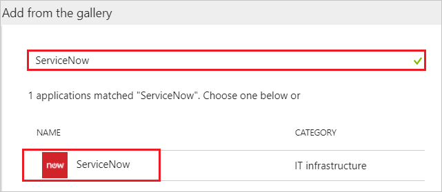

## Configure and test Azure AD single sign-on

In this section, you configure and test Azure AD single sign-on with ServiceNow based on a test user called "Britta Simon".

For single sign-on to work, Azure AD needs to know what the counterpart user in ServiceNow is to a user in Azure AD. In other words, a link relationship between an Azure AD user and the related user in ServiceNow needs to be established.

In ServiceNow, assign the value of the **user name** in Azure AD as the value of the **Username** to establish the link relationship.

To configure and test Azure AD single sign-on with ServiceNow, you need to complete the following building blocks:

1. **[Configure Azure AD Single Sign-On for ServiceNow](#configure-azure-ad-single-sign-on-for-servicenow)** - to enable your users to use this feature.
2. **[Configure Azure AD Single Sign-On for ServiceNow Express](#configure-azure-ad-single-sign-on-for-servicenow-express)** - to enable your users to use this feature.
3. **[Create an Azure AD test user](#create-an-azure-ad-test-user)** - to test Azure AD single sign-on with Britta Simon.
4. **[Create a ServiceNow test user](#create-a-servicenow-test-user)** - to have a counterpart of Britta Simon in ServiceNow that is linked to the Azure AD representation of user.
5. **[Assign the Azure AD test user](#assign-the-azure-ad-test-user)** - to enable Britta Simon to use Azure AD single sign-on.
6. **[Test single sign-on](#test-single-sign-on)** - to verify whether the configuration works.

### Configure Azure AD Single Sign-On for ServiceNow

In this section, you enable Azure AD single sign-on in the Azure portal and configure single sign-on in your ServiceNow application.

**To configure Azure AD single sign-on with ServiceNow, perform the following steps:**

1. In the Azure portal, on the **ServiceNow** application integration page, click **Single sign-on**.

	![Configure single sign-on link][4]

2. Click **Change Single sign-on mode** on top of the screen to select the **SAML** mode.

	

3. On the **Select a Single sign-on method** dialog, Click **Select** for **SAML** mode to enable single sign-on.

    

4. On the **Set up Single Sign-On with SAML** page, click **Edit** button to open **Basic SAML Configuration** dialog.

	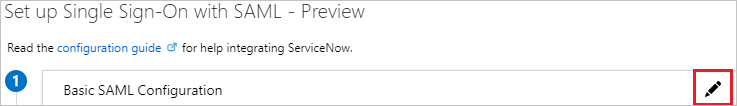

5. On the **Basic SAML Configuration** section, perform the following steps:

	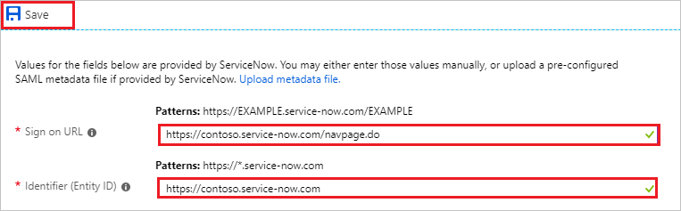

    a. In the **Sign-on URL** textbox, type a URL using the following pattern: `https://<instance-name>.service-now.com/navpage.do`

	b. In the **Identifier** textbox, type a URL using the following pattern: `https://<instance-name>.service-now.com`

	> [!NOTE]
	> These values are not real. You'll need to update these values from actual Sign-on URL and Identifier which is explained later in the tutorial.

6. On the **SAML Signing Certificate** section, perform the following steps:

	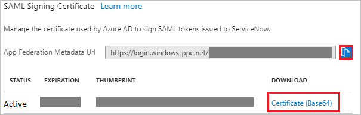

	a. Click the copy button to copy **App Federation Metadata Url** and paste it into notepad, as this App Federation Metadata Url will be used later in the tutorial.

	b. Click on **Download** to download **Certificate(Base64)** and then save the certificate file on your computer.

7. Sign on to your ServiceNow application as an administrator.

8. Activate the **Integration - Multiple Provider Single Sign-On Installer** plugin by following the next steps:

	a. In the navigation pane on the left side, search **System Definition** section from the search bar and then click **Plugins**.

	

	 b. Search for **Integration - Multiple Provider Single Sign-On Installer**.

	 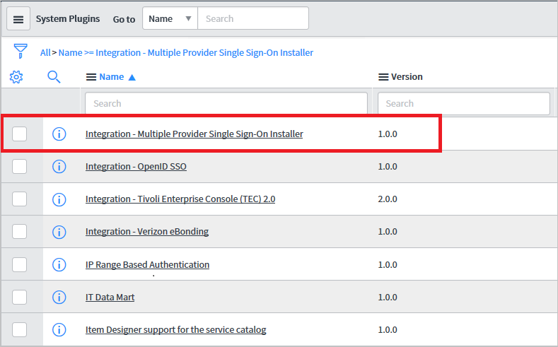

	c. Select the plugin. Right click and select **Activate/Upgrade**.

	 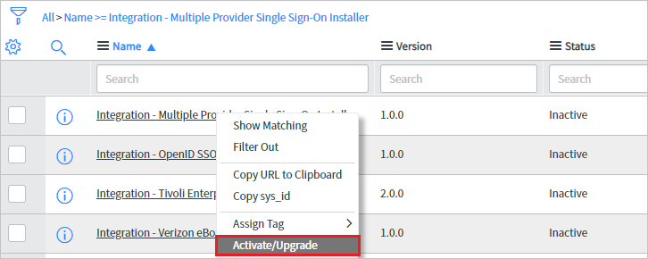

	d. Click the **Activate** button.

	 

9. In the navigation pane on the left side, search **Multi-Provider SSO** section from the search bar and then click **Properties**.

	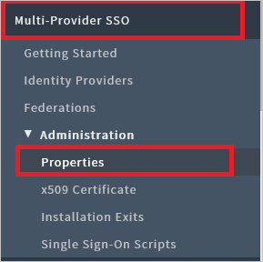

10. On the **Multiple Provider SSO Properties** dialog, perform the following steps:

	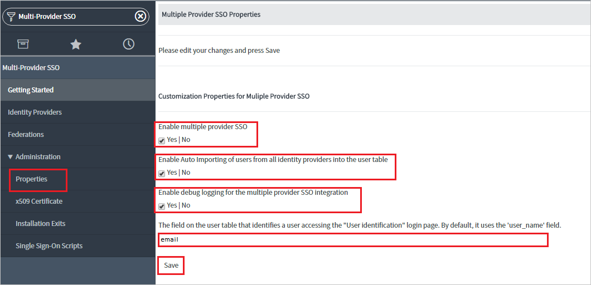

	* As **Enable multiple provider SSO**, select **Yes**.
  
	* As **Enable Auto Importing of users from all identity providers into the user table**, select **Yes**.

	* As **Enable debug logging for the multiple provider SSO integration**, select **Yes**.

	* In **The field on the user table that...** textbox, type **user_name**.
  
	* Click **Save**.

11. There are two ways in which **ServiceNow** can be configured - Automatic and Manual.

12. For configuring **ServiceNow** automatically, follow the below steps:

	* Return to the **ServiceNow** Single-Sign on page in the Azure portal.

	* One click configure service is provided for ServiceNow that is, to have Azure AD automatically configure ServiceNow for SAML-based authentication. To enable this service go to **ServiceNow Configuration** section, click **Configure ServiceNow** to open Configure sign-on window.

		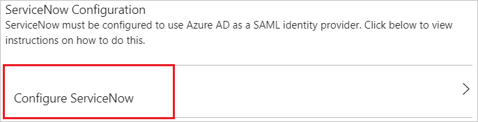

	* Enter your ServiceNow instance name, admin username, and admin password in the **Configure sign-on** form and click **Configure Now**. Note that the admin username provided must have the **security_admin** role assigned in ServiceNow for this to work. Otherwise, to manually configure ServiceNow to use Azure AD as a SAML Identity Provider, click **Manually configure single sign-on** and copy the **Sign-Out URL, SAML Entity ID, and SAML Single Sign-On Service URL** from the Quick Reference section.

		

	* Sign on to your ServiceNow application as an administrator.

	* In the automatic configuration all the necessary settings are configured on the **ServiceNow** side but the **X.509 Certificate** is not enabled by default. You have to map it manually to your Identity Provider in ServiceNow. Follow the below steps for the same:

	* In the navigation pane on the left side, search **Multi-Provider SSO** section from the search bar and then click **Identity Providers**.

		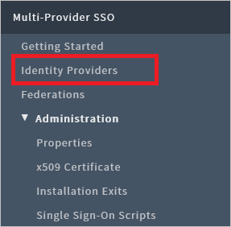

	* Click on the automatically generated Identity Provider

		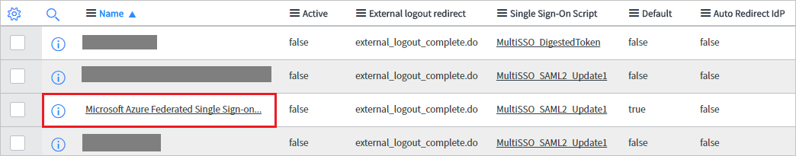

	*  On the **Identity Provider** section, perform the following steps:

		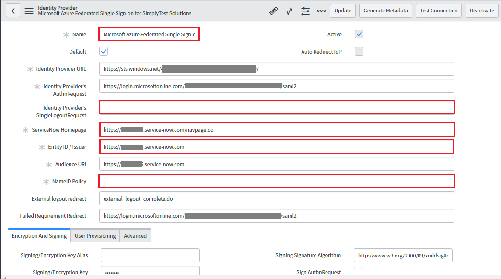

		* In the **Name** textbox, type a name for your configuration (for example, **Microsoft Azure Federated Single Sign-on**).

		* Please remove the populated **Identity Provider's SingleLogoutRequest** value from the textbox.

		* Copy **ServiceNow Homepage** value, paste it in the **Sign-on URL** textbox in **ServiceNow Domain and URLs** section on Azure portal.

			> [!NOTE]
			> The ServiceNow instance homepage is a concatenation of your **ServieNow tenant URL** and **/navpage.do** (for example:`https://fabrikam.service-now.com/navpage.do`).

		* Copy **Entity ID / Issuer** value, paste it in **Identifier** textbox in **ServiceNow Domain and URLs** section on Azure portal.

		* Please make sure that **NameID Policy** is set to `urn:oasis:names:tc:SAML:1.1:nameid-format:unspecified` value. 

	* Scroll down to the **X.509 Certificate** section, select **Edit**.

		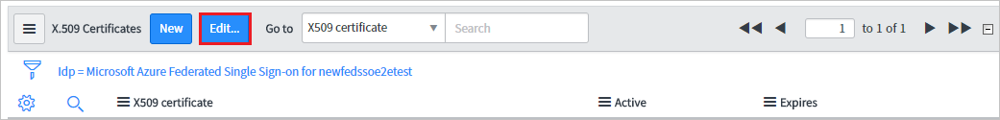

	* Select on the certificate and click right arrow icon to add the certificate

		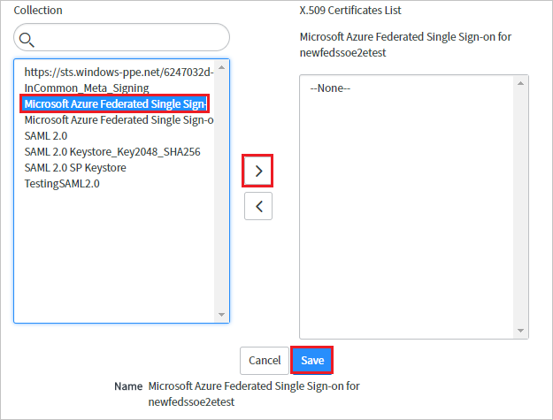

	* Click **Save**.

	* Click on **Test Connection** at the top right corner of the page.

		

	* After clicking on the **Test Connection**, you will get the popup window where you need to enter credentials and the below page with results is shown. The **SSO Logout Test Results** error is expected please ignore the error and click **Activate** button.

		
  
13. For configuring **ServiceNow** manually, follow the below steps:

	* Sign on to your ServiceNow application as an administrator.

	* In the navigation pane on the left side, click **Identity Providers**.

		

	* On the **Identity Providers** dialog, click **New**.

		

	* On the **Identity Providers** dialog, click **SAML**.

		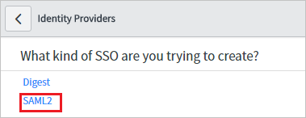

	* On the **Import Identity Provider Metadata** popup, perform the following steps:

		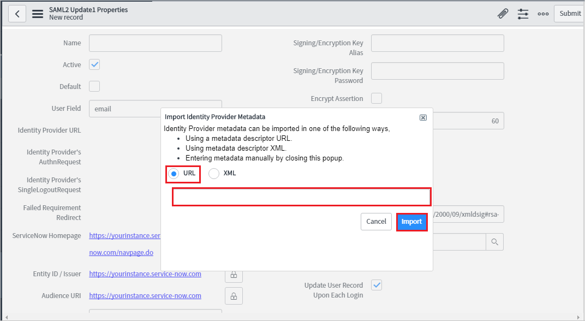

		* Enter the **App Federation Metadata Url** which you have copied from Azure portal.

		* Click **Import**.

	* It reads the IdP metadata URL and populates all the fields information.

		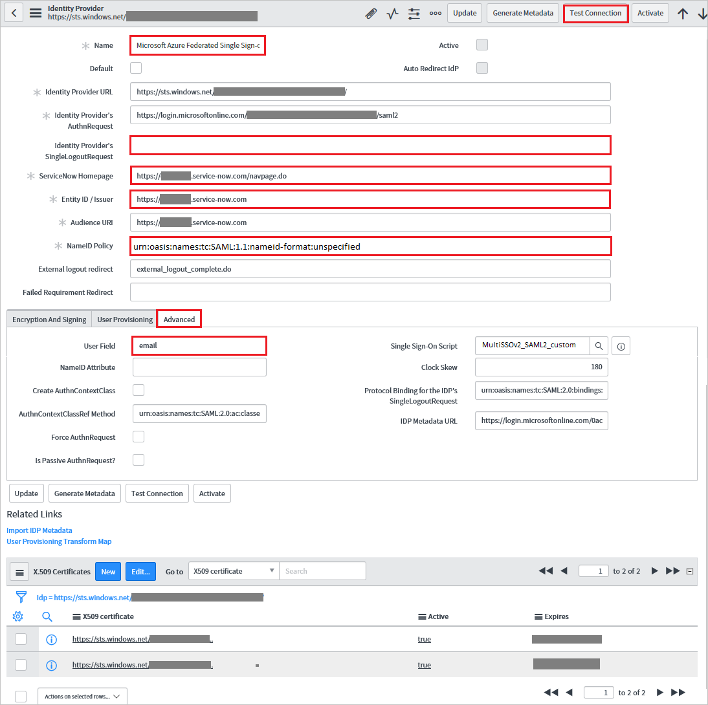

		* In the **Name** textbox, type a name for your configuration (for example, **Microsoft Azure Federated Single Sign-on**).

		* Please remove the populated **Identity Provider's SingleLogoutRequest** value from the textbox.

		* Copy **ServiceNow Homepage** value, paste it in the **Sign-on URL** textbox in **ServiceNow Domain and URLs** section on Azure portal.

			> [!NOTE]
			> The ServiceNow instance homepage is a concatenation of your **ServiceNow tenant URL** and **/navpage.do** (for example:`https://fabrikam.service-now.com/navpage.do`).

		* Copy **Entity ID / Issuer** value, paste it in **Identifier** textbox in **ServiceNow Domain and URLs** section on Azure portal.

		* Please make sure that **NameID Policy** is set to `urn:oasis:names:tc:SAML:1.1:nameid-format:unspecified` value.

		* Click **Advanced**. In the **User Field** textbox, type **email** or **user_name**, depending on which field is used to uniquely identify users in your ServiceNow deployment.

			> [!NOTE]
			> You can configure Azure AD to emit either the Azure AD user ID (user principal name) or the email address as the unique identifier in the SAML token by going to the **ServiceNow > Attributes > Single Sign-On** section of the Azure portal and mapping the desired field to the **nameidentifier** attribute. The value stored for the selected attribute in Azure AD (for example, user principal name) must match the value stored in ServiceNow for the entered field (for example, user_name)

		* Click on **Test Connection** at the top right corner of the page.

		* After clicking on the **Test Connection**, you will get the popup window where you need to enter credentials and the below page with results is shown. The **SSO Logout Test Results** error is expected please ignore the error and click **Activate** button.

		  

### Configure Azure AD Single Sign-On for ServiceNow Express

1. In the Azure portal, on the **ServiceNow** application integration page, click **Single sign-on**.

	![Configure Single Sign-On][4]

2. Click **Change Single sign-on mode** on top of the screen to select the **SAML** mode.

	

3. On the **Select a Single sign-on method** dialog, Click **Select** for **SAML** mode to enable single sign-on.

    

4. On the **Set up Single Sign-On with SAML** page, click **Edit** button to open **Basic SAML Configuration** dialog.

	

5. On the **Basic SAML Configuration** section, perform the following steps:

	

	a. In the **Sign-on URL** textbox, type the value using the following pattern: `https://<instance-name>.service-now.com/navpage.do`

	b. In the **Identifier** textbox, type a URL using the following pattern: `https://<instance-name>.service-now.com`

	> [!NOTE]
	> These values are not real. Update these values with the actual Sign-on URL and Identifier. Contact [ServiceNow Client support team](https://www.servicenow.com/support/contact-support.html) to get these values.

6. On the **SAML Signing Certificate** section, Click on **Download** to download **Certificate(Base64)** and then save the certificate file on your computer.

	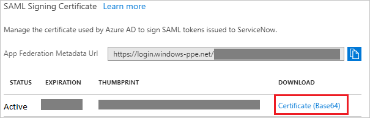

7. One click configure service is provided for ServiceNow that is, to have Azure AD automatically configure ServiceNow for SAML-based authentication. To enable this service go to **Set up ServiceNow** section, click **View step-by-step instructions** to open Configure sign-on window.

	

8. Enter your ServiceNow instance name, admin username, and admin password in the **Configure sign-on** form and click **Configure Now**. Note that the admin username provided must have the **security_admin** role assigned in ServiceNow for this to work. Otherwise, to manually configure ServiceNow to use Azure AD as a SAML Identity Provider, click **Manually configure single sign-on** and copy the **Sign-Out URL, SAML Entity ID, and SAML Single Sign-On Service URL** from the Quick Reference section.

	

9. Sign on to your ServiceNow Express application as an administrator.

10. In the navigation pane on the left side, click **Single Sign-On**.

	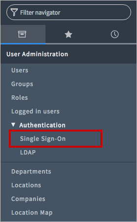

11. On the **Single Sign-On** dialog, click the configuration icon on the upper right and set the following properties:

	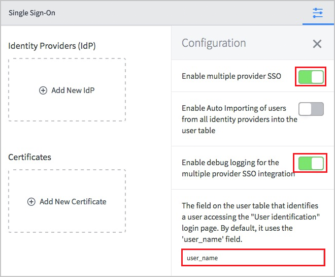

	a. Toggle **Enable multiple provider SSO** to the right.

	b. Toggle **Enable debug logging for the multiple provider SSO integration** to the right.

	c. In **The field on the user table that...** textbox, type **user_name**.

12. On the **Single Sign-On** dialog, click **Add New Certificate**.

	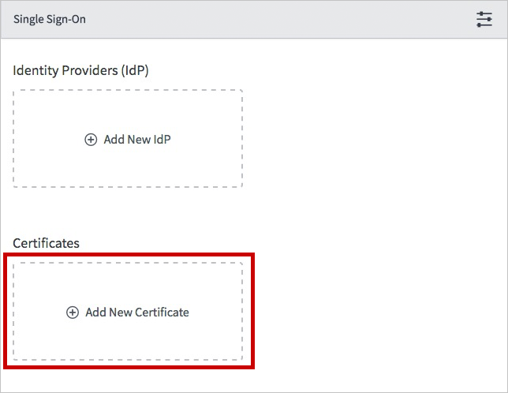

13. On the **X.509 Certificates** dialog, perform the following steps:

	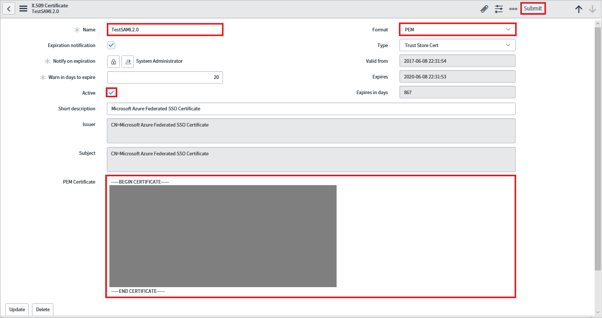

	a. In the **Name** textbox, type a name for your configuration (for example: **TestSAML2.0**).

	b. Select **Active**.

	c. As **Format**, select **PEM**.

	d. As **Type**, select **Trust Store Cert**.

	e. Open your Base64 encoded certificate downloaded from Azure portal in notepad, copy the content of it into your clipboard, and then paste it to the **PEM Certificate** textbox.

	f. Click **Update**

14. On the **Single Sign-On** dialog, click **Add New IdP**.

	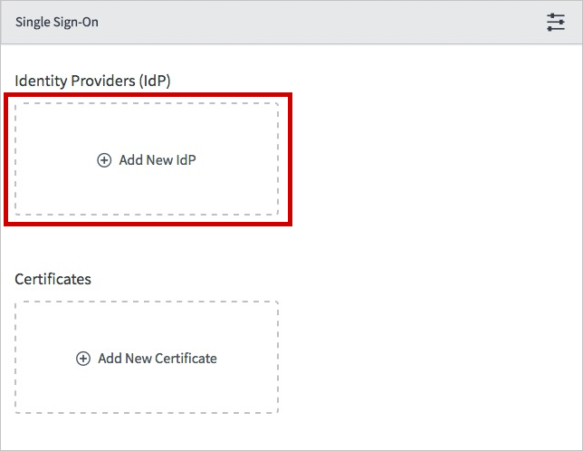

15. On the **Add New Identity Provider** dialog, under **Configure Identity Provider**, perform the following steps:

	

	a. In the **Name** textbox, type a name for your configuration (for example: **SAML 2.0**).

	b. In the **Identity Provider URL** field, paste the value of **Identity Provider ID**, which you have copied from Azure portal.

	c. In the **Identity Provider's AuthnRequest** field, paste the value of **Authentication Request URL**, which you have copied from Azure portal.

	d. In the **Identity Provider's SingleLogoutRequest** field, paste the value of **Single Sign-Out Service URL**, which you have copied from Azure portal

	e. As **Identity Provider Certificate**, select the certificate you have created in the previous step.

16. Click **Advanced Settings**, and under **Additional Identity Provider Properties**, perform the following steps:

	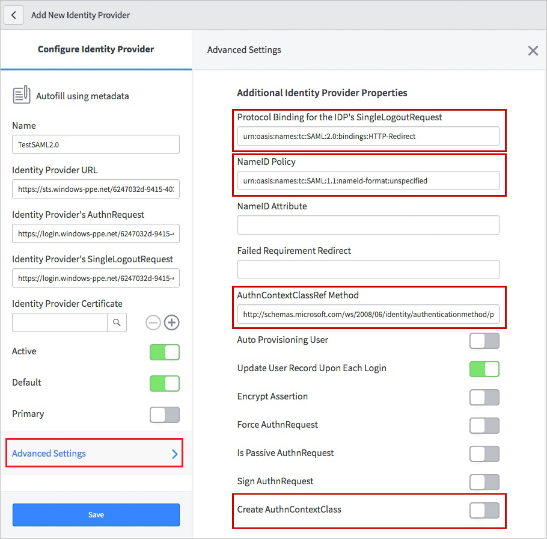

	a. In the **Protocol Binding for the IDP's SingleLogoutRequest** textbox, type **urn:oasis:names:tc:SAML:2.0:bindings:HTTP-Redirect**.

	b. In the **NameID Policy** textbox, type **urn:oasis:names:tc:SAML:1.1:nameid-format:unspecified**.

	c. In the **AuthnContextClassRef Method**, type `http://schemas.microsoft.com/ws/2008/06/identity/authenticationmethod/password`.

	d. Deselect **Create an AuthnContextClass**.

17. Under **Additional Service Provider Properties**, perform the following steps:

	

	a. In the **ServiceNow Homepage** textbox, type the URL of your ServiceNow instance homepage.

	> [!NOTE]
	> The ServiceNow instance homepage is a concatenation of your **ServiceNow tenant URL** and **/navpage.do** (for example: `https://fabrikam.service-now.com/navpage.do`).

	b. In the **Entity ID / Issuer** textbox, type the URL of your ServiceNow tenant.

	c. In the **Audience URI** textbox, type the URL of your ServiceNow tenant.

	d. In **Clock Skew** textbox, type **60**.

	e. In the **User Field** textbox, type **email** or **user_name**, depending on which field is used to uniquely identify users in your ServiceNow deployment.

	> [!NOTE]
	> You can configure Azure AD to emit either the Azure AD user ID (user principal name) or the email address as the unique identifier in the SAML token by going to the **ServiceNow > Attributes > Single Sign-On** section of the Azure portal and mapping the desired field to the **nameidentifier** attribute. The value stored for the selected attribute in Azure AD (for example, user principal name) must match the value stored in ServiceNow for the entered field (for example, user_name)

	f. Click **Save**.

### Create an Azure AD test user

The objective of this section is to create a test user in the Azure portal called Britta Simon.

1. In the Azure portal, in the left pane, select **Azure Active Directory**, select **Users**, and then select **All users**.

	![Create Azure AD User][100]

2. Select **New user** at the top of the screen.

	 

3. In the User properties, perform the following steps.

	

	a. In the **Name** field enter **BrittaSimon**.
  
    b. In the **User name** field type **brittasimon@yourcompanydomain.extension**  
    For example, BrittaSimon@contoso.com

    c. Select **Properties**, select the **Show password** check box, and then write down the value that's displayed in the Password box.

    d. Select **Create**.

### Create a ServiceNow test user

The objective of this section is to create a user called Britta Simon in ServiceNow. ServiceNow supports automatic user provisioning, which is by default enabled. You can find more details [here](servicenow-provisioning-tutorial.md) on how to configure automatic user provisioning.

> [!NOTE]
> If you need to create a user manually, you need to contact [ServiceNow Client support team](https://www.servicenow.com/support/contact-support.html)

### Assign the Azure AD test user

In this section, you enable Britta Simon to use Azure single sign-on by granting access to ServiceNow.

1. In the Azure portal, open the applications view, and then navigate to the directory view and go to **Enterprise applications** then click **All applications**.

	![Assign User][201]

2. In the applications list, select **ServiceNow**.

	  

3. In the menu on the left, click **Users and groups**.

	![The "Users and groups" link][202]

4. Click **Add** button. Then select **Users and groups** on **Add Assignment** dialog.

	![The Add Assignment pane][203]

5. In the **Users and groups** dialog select **Britta Simon** in the Users list, then click the **Select** button at the bottom of the screen.

6. In the **Add Assignment** dialog select the **Assign** button.

### Test single sign-on

In this section, you test your Azure AD single sign-on configuration using the Access Panel.

When you click the ServiceNow tile in the Access Panel, you should get automatically signed-on to your ServiceNow application.
For more information about the Access Panel, see [Introduction to the Access Panel](../user-help/active-directory-saas-access-panel-introduction.md).

## Additional resources

* [List of Tutorials on How to Integrate SaaS Apps with Azure Active Directory](tutorial-list.md)
* [What is application access and single sign-on with Azure Active Directory?](../manage-apps/what-is-single-sign-on.md)
* [Configure User Provisioning](servicenow-provisioning-tutorial.md)

<!--Image references-->

[1]: ./media/servicenow-tutorial/tutorial_general_01.png
[2]: ./media/servicenow-tutorial/tutorial_general_02.png
[3]: ./media/servicenow-tutorial/tutorial_general_03.png
[4]: ./media/servicenow-tutorial/tutorial_general_04.png

[100]: ./media/servicenow-tutorial/tutorial_general_100.png

[200]: ./media/servicenow-tutorial/tutorial_general_200.png
[201]: ./media/servicenow-tutorial/tutorial_general_201.png
[202]: ./media/servicenow-tutorial/tutorial_general_202.png
[203]: ./media/servicenow-tutorial/tutorial_general_203.png
