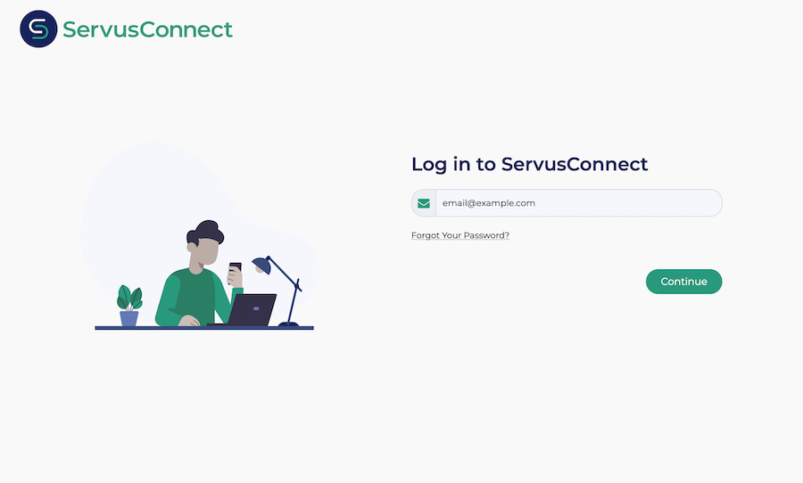
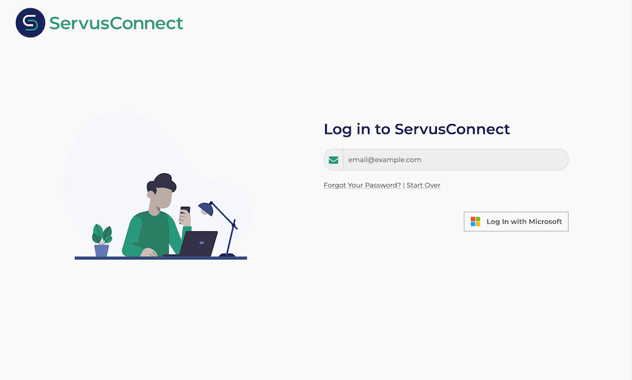
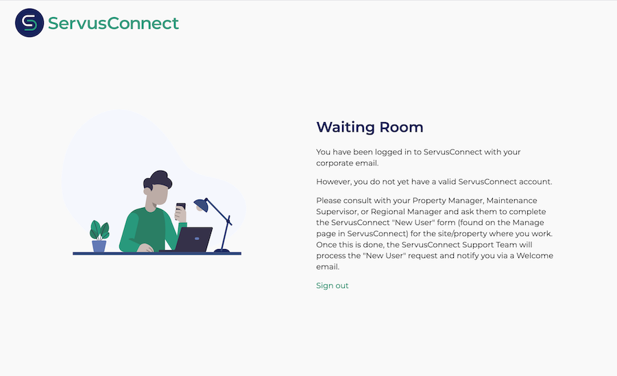

# Microsoft Entra SSO integration with ServusConnect

In this article, you'll learn how to integrate ServusConnect with Microsoft Entra ID. ServusConnect uses Microsoft Entra ID to manage user access and enable single sign-on with the ServusConnect maintenance operations platform. An existing ServusConnect subscription is required.

When you integrate ServusConnect with Microsoft Entra ID, you can:

* Control in Microsoft Entra ID who has access to ServusConnect.
* Enable your users to be automatically signed-in to ServusConnect with their Microsoft Entra accounts.
* Manage your accounts in one central location.

You'll configure and test Microsoft Entra single sign-on for ServusConnect in your own Azure environment. ServusConnect supports **SP** initiated SSO and **Just In Time** user provisioning.

## Prerequisites

To integrate Microsoft Entra ID with ServusConnect, you need:

* A Microsoft Entra user account. If you don't already have one, you can [Create an account for free](https://azure.microsoft.com/free/?WT.mc_id=A261C142F).
* One of the following roles: Global Administrator, Cloud Application Administrator, Application Administrator, or owner of the service principal.
* A Microsoft Entra subscription. If you don't have a subscription, you can get a [free account](https://azure.microsoft.com/free/).
* ServusConnect single sign-on (SSO) enabled subscription. If you don't have ServusConnect, you can [learn more and request a demo](https://www.netvendor.com/servusconnect/).

## Add application and assign users

Before you begin the process of configuring single sign-on, you must add the ServusConnect application from the Microsoft Entra gallery. You will also need a user account to assign to the application. Prior to beginning rollout to your organization, consider creating and assigning a test user first.

### Add ServusConnect from the Microsoft Entra gallery

Add ServusConnect from the Microsoft Entra application gallery to configure single sign-on with ServusConnect. For more information on how to add application from the gallery, see the [Quickstart: Add application from the gallery](../manage-apps/add-application-portal.md).

### Create and/or assign a Microsoft Entra user

Follow the guidelines in the [create and assign a user account](../manage-apps/add-application-portal-assign-users.md) article to create a user (if required) and assign one or more users to the ServusConnect enterprise application. Only those users that you assign to the application will be able to access ServusConnect via single sign-on. Note that you can assign individual users or entire groups.

Alternatively, you can also use the [Enterprise App Configuration Wizard](https://portal.office.com/AdminPortal/home?Q=Docs#/azureadappintegration). In this wizard, you can add an application to your tenant, add users/groups to the app, and assign roles. The wizard also provides a link to the single sign-on configuration pane. [Learn more about Microsoft 365 wizards.](/microsoft-365/admin/misc/azure-ad-setup-guides).

## Configure Microsoft Entra SSO

Complete the following steps to enable Microsoft Entra single sign-on.

1. Sign in to the [Microsoft Entra admin center](https://entra.microsoft.com) as at least a [Cloud Application Administrator](../roles/permissions-reference.md#cloud-application-administrator).
1. Browse to **Identity** > **Applications** > **Enterprise applications** > **ServusConnect** > **Single sign-on**.
1. On the **Select a single sign-on method** page, select **SAML**.
1. On the **Set up single sign-on with SAML** page, select the pencil icon for **Basic SAML Configuration** to edit the settings.

   

1. On the **Basic SAML Configuration** section, perform the following steps:

	a. In the **Identifier** textbox, enter the value:
	`urn:amazon:cognito:sp:us-east-1_rlgU6e3y5`

	b. In the **Reply URL** textbox, enter the URL:
	`https://login.servusconnect.com/saml2/idpresponse`

	c. In the **Sign on URL** textbox, enter the URL:
	`https://app.servusconnect.com`

1. On the **Set-up single sign-on with SAML** page, in the **SAML Signing Certificate** section, find **Federation Metadata XML** and select **Download** to download the certificate and save it on your computer.

    

## Configure ServusConnect SSO

To configure single sign-on with the **ServusConnect** application, you must send the **Federation Metadata XML** file downloaded from Azure portal to the [ServusConnect support team](mailto:support@servusconnect.com). When emailing the ServusConnect support team, please provide the following:

1. The Federation Metadata XML file.
2. A list of all email domains, which connect via SSO from your Microsoft Entra account.

The ServusConnect support team completes the SAML SSO connection and notifies you when it is ready.

## ServusConnect user accounts

ServusConnect user accounts may be provisioned before the user's first SSO attempt, or "just-in-time" as a result of the SSO attempt. However, the two methods differ in terms of what the user is able to access.

### Pre-provisioned users

Users who exist in ServusConnect with an email address that matches the SSO login will be automatically given access to ServusConnect after the SSO operation.

### Just-in-time users and the Waiting Room

Users who do not yet exist in ServusConnect has a user account created with an email that matches the SSO login. However, these users are placed into a "Waiting Room" instead of being given direct access to ServusConnect. These users must be provisioned with the correct access levels and property-level access before SSO will allow them past the Waiting Room.

An existing ServusConnect user with appropriate access may complete the ServusConnect "New User" form found on the "Manage" page in ServusConnect for the site/property where they work. Once this is done, the ServusConnect support team processes the request and notifies the user via email. Then, the user may use SSO to sign in and access ServusConnect.

## Testing SSO

You may test your Microsoft Entra single sign-on configuration using one of the following methods:

* Click on **Test this application**, this will redirect to ServusConnect Sign-on URL where you can initiate the login flow.

* Go to [ServusConnect Sign-on URL](https://app.servusconnect.com/) directly and initiate the login flow from there. See **[Sign-on with SSO](#sign-on-with-sso)**, below.

* You can use Microsoft My Apps. When you click the ServusConnect tile in the My Apps, this will redirect to ServusConnect Sign-on URL. For more information, see [Microsoft Entra My Apps](/azure/active-directory/manage-apps/end-user-experiences#azure-ad-my-apps).

## Sign-on with SSO

In order to sign on, perform the following steps:

1. Visit the [ServusConnect Sign-on URL](https://app.servusconnect.com/).

1. Enter your email address and press **Continue**. Note that your email domain must match one you shared with ServusConnect during configuration. (See screenshot below.)

	

1. If your domain is properly configured for SSO with Microsoft Entra ID, you will see a **Log In with Microsoft** button. (See screenshot below.)

	

1. After clicking the **Log In with Microsoft** button, you will be directed to the standard Microsoft login screen. After successful login, you will be redirected back to ServusConnect.

1. If there is an existing ServusConnect user matching the SSO authentication, you will be immediately logged in. Otherwise, you will enter the **Waiting Room** as pictured below.

	

## Additional resources

* [What is single sign-on with Microsoft Entra ID?](../manage-apps/what-is-single-sign-on.md)
* [Plan a single sign-on deployment](../manage-apps/plan-sso-deployment.md).

## Next steps

Once you configure ServusConnect you can enforce session control, which protects exfiltration and infiltration of your organization’s sensitive data in real time. Session control extends from Conditional Access. [Learn how to enforce session control with Microsoft Cloud App Security](/cloud-app-security/proxy-deployment-aad).
