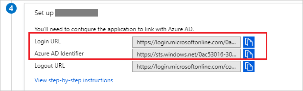
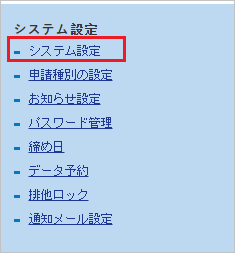
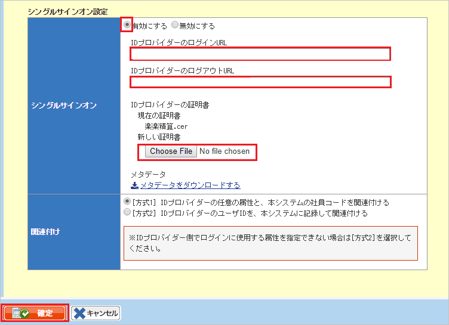

# Tutorial: Microsoft Entra SSO integration with Settling music

In this tutorial, you'll learn how to integrate Settling music with Microsoft Entra ID. When you integrate Settling music with Microsoft Entra ID, you can:

* Control in Microsoft Entra ID who has access to Settling music.
* Enable your users to be automatically signed-in to Settling music with their Microsoft Entra accounts.
* Manage your accounts in one central location.

## Prerequisites

To configure Microsoft Entra integration with Settling music, you need the following items:

* A Microsoft Entra subscription. If you don't have a Microsoft Entra environment, you can get a [free account](https://azure.microsoft.com/free/).
* Settling music single sign-on enabled subscription.

## Scenario description

In this tutorial, you configure and test Microsoft Entra single sign-on in a test environment.

* Settling music supports **SP** initiated SSO.

## Add Settling music from the gallery

To configure the integration of Settling music into Microsoft Entra ID, you need to add Settling music from the gallery to your list of managed SaaS apps.

1. Sign in to the [Microsoft Entra admin center](https://entra.microsoft.com) as at least a [Cloud Application Administrator](../roles/permissions-reference.md#cloud-application-administrator).
1. Browse to **Identity** > **Applications** > **Enterprise applications** > **New application**.
1. In the **Add from the gallery** section, type **Settling music** in the search box.
1. Select **Settling music** from results panel and then add the app. Wait a few seconds while the app is added to your tenant.

 Alternatively, you can also use the [Enterprise App Configuration Wizard](https://portal.office.com/AdminPortal/home?Q=Docs#/azureadappintegration). In this wizard, you can add an application to your tenant, add users/groups to the app, assign roles, as well as walk through the SSO configuration as well. [Learn more about Microsoft 365 wizards.](/microsoft-365/admin/misc/azure-ad-setup-guides)

<a name='configure-and-test-azure-ad-sso-for-settling-music'></a>

## Configure and test Microsoft Entra SSO for Settling music

Configure and test Microsoft Entra SSO with Settling music using a test user called **B.Simon**. For SSO to work, you need to establish a link relationship between a Microsoft Entra user and the related user in Settling music.

To configure and test Microsoft Entra SSO with Settling music, perform the following steps:

1. **[Configure Microsoft Entra SSO](#configure-azure-ad-sso)** - to enable your users to use this feature.
    1. **[Create a Microsoft Entra test user](#create-an-azure-ad-test-user)** - to test Microsoft Entra single sign-on with B.Simon.
    1. **[Assign the Microsoft Entra test user](#assign-the-azure-ad-test-user)** - to enable B.Simon to use Microsoft Entra single sign-on.
1. **[Configure Settling music SSO](#configure-settling-music-sso)** - to configure the single sign-on settings on application side.
    1. **[Create Settling music test user](#create-settling-music-test-user)** - to have a counterpart of B.Simon in Settling music that is linked to the Microsoft Entra representation of user.
1. **[Test SSO](#test-sso)** - to verify whether the configuration works.

<a name='configure-azure-ad-sso'></a>

## Configure Microsoft Entra SSO

Follow these steps to enable Microsoft Entra SSO.

1. Sign in to the [Microsoft Entra admin center](https://entra.microsoft.com) as at least a [Cloud Application Administrator](../roles/permissions-reference.md#cloud-application-administrator).
1. Browse to **Identity** > **Applications** > **Enterprise applications** > **Settling music** > **Single sign-on**.
1. On the **Select a single sign-on method** page, select **SAML**.
1. On the **Set up single sign-on with SAML** page, click the pencil icon for **Basic SAML Configuration** to edit the settings.

   

1. On the **Basic SAML Configuration** section, perform the following steps:

    a. In the **Identifier (Entity ID)** text box, type a URL using the following pattern:
    `https://<SUBDOMAIN>.rakurakuseisan.jp/<USERACCOUNT>/`

	b. In the **Sign on URL** text box, type a URL using the following pattern:
    `https://<SUBDOMAIN>.rakurakuseisan.jp/<USERACCOUNT>/`

	> [!NOTE]
	> These values are not real. Update these values with the actual Identifier and Sign on URL. Contact [Settling music Client support team](https://rakurakuseisan.jp/) to get these values. You can also refer to the patterns shown in the **Basic SAML Configuration** section.

1. On the **Set up Single Sign-On with SAML** page, in the **SAML Signing Certificate** section, click **Download** to download the **Certificate (Base64)** from the given options as per your requirement and save it on your computer.

	

1. On the **Set up Settling music** section, copy the appropriate URL(s) as per your requirement.

	

	> [!NOTE]
	> Please use the below URL for the Logout URL.
	```Logout URL
    https://login.microsoftonline.com/common/wsfederation?wa=wsignout1.0
    ```

<a name='create-an-azure-ad-test-user'></a>

### Create a Microsoft Entra test user

In this section, you'll create a test user called B.Simon.

1. Sign in to the [Microsoft Entra admin center](https://entra.microsoft.com) as at least a [User Administrator](../roles/permissions-reference.md#user-administrator).
1. Browse to **Identity** > **Users** > **All users**.
1. Select **New user** > **Create new user**, at the top of the screen.
1. In the **User** properties, follow these steps:
   1. In the **Display name** field, enter `B.Simon`.  
   1. In the **User principal name** field, enter the username@companydomain.extension. For example, `B.Simon@contoso.com`.
   1. Select the **Show password** check box, and then write down the value that's displayed in the **Password** box.
   1. Select **Review + create**.
1. Select **Create**.

<a name='assign-the-azure-ad-test-user'></a>

### Assign the Microsoft Entra test user

In this section, you'll enable B.Simon to use single sign-on by granting access to Settling music.

1. Sign in to the [Microsoft Entra admin center](https://entra.microsoft.com) as at least a [Cloud Application Administrator](../roles/permissions-reference.md#cloud-application-administrator).
1. Browse to **Identity** > **Applications** > **Enterprise applications** > **Settling music**.
1. In the app's overview page, select **Users and groups**.
1. Select **Add user/group**, then select **Users and groups** in the **Add Assignment** dialog.
   1. In the **Users and groups** dialog, select **B.Simon** from the Users list, then click the **Select** button at the bottom of the screen.
   1. If you are expecting a role to be assigned to the users, you can select it from the **Select a role** dropdown. If no role has been set up for this app, you see "Default Access" role selected.
   1. In the **Add Assignment** dialog, click the **Assign** button.

## Configure Settling music SSO

1. In a different web browser window, sign in to Settling music as a Security Administrator.

1. On top of the page, click **management** tab.

	

1. Click on  **System setting** tab.

	

1. Switch to **Security** tab.

	

1. On the **Single sign-on setting** section, perform the following steps:

	

	a. Click **To enable**.

	b. In the **Login URL of the ID provider** textbox, paste the value of **Login URL**..

	c. In the **ID provider logout URL** textbox, paste the value of **Logout URL** which is explained in [Configure Microsoft Entra SSO](#configure-azure-ad-sso) section.

	d. Click **Choose File** to upload the **Certificate (Base64)** which you have downloaded form Azure portal.

	e. Click the **Save** button.

### Create Settling music test user

In this section, you create a user called Britta Simon in Settling music. Work with [Settling music Client support team](https://rakurakuseisan.jp/) to add the users in the Settling music platform. Users must be created and activated before you use single sign-on.

## Test SSO

In this section, you test your Microsoft Entra single sign-on configuration with following options. 

* Click on **Test this application**, this will redirect to Settling music Sign-on URL where you can initiate the login flow. 

* Go to Settling music Sign-on URL directly and initiate the login flow from there.

* You can use Microsoft My Apps. When you click the Settling music tile in the My Apps, this will redirect to Settling music Sign-on URL. For more information, see [Microsoft Entra My Apps](/azure/active-directory/manage-apps/end-user-experiences#azure-ad-my-apps).

## Next steps

Once you configure Settling music you can enforce session control, which protects exfiltration and infiltration of your organization’s sensitive data in real time. Session control extends from Conditional Access. [Learn how to enforce session control with Microsoft Cloud App Security](/cloud-app-security/proxy-deployment-aad).
