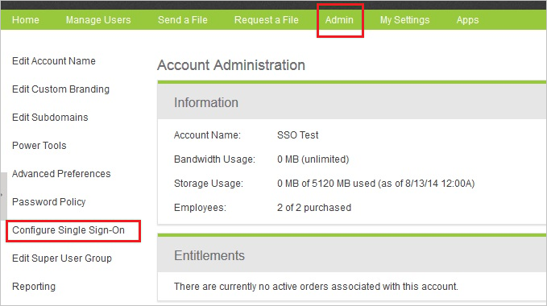
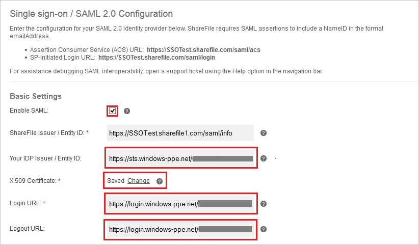

# Tutorial: Azure Active Directory integration with Citrix ShareFile

In this tutorial, you learn how to integrate Citrix ShareFile with Azure Active Directory (Azure AD).
Integrating Citrix ShareFile with Azure AD provides you with the following benefits:

* You can control in Azure AD who has access to Citrix ShareFile.
* You can enable your users to be automatically signed-in to Citrix ShareFile (Single Sign-On) with their Azure AD accounts.
* You can manage your accounts in one central location - the Azure portal.

If you want to know more details about SaaS app integration with Azure AD, see [What is application access and single sign-on with Azure Active Directory](https://docs.microsoft.com/azure/active-directory/active-directory-appssoaccess-whatis).
If you don't have an Azure subscription, [create a free account](https://azure.microsoft.com/free/) before you begin.

## Prerequisites

To configure Azure AD integration with Citrix ShareFile, you need the following items:

* An Azure AD subscription. If you don't have an Azure AD environment, you can get one-month trial [here](https://azure.microsoft.com/pricing/free-trial/)
* Citrix ShareFile single sign-on enabled subscription

## Scenario description

In this tutorial, you configure and test Azure AD single sign-on in a test environment.

* Citrix ShareFile supports **SP** initiated SSO

## Adding Citrix ShareFile from the gallery

To configure the integration of Citrix ShareFile into Azure AD, you need to add Citrix ShareFile from the gallery to your list of managed SaaS apps.

**To add Citrix ShareFile from the gallery, perform the following steps:**

1. In the **[Azure portal](https://portal.azure.com)**, on the left navigation panel, click **Azure Active Directory** icon.

	

2. Navigate to **Enterprise Applications** and then select the **All Applications** option.

	

3. To add new application, click **New application** button on the top of dialog.

	

4. In the search box, type **Citrix ShareFile**, select **Citrix ShareFile** from result panel then click **Add** button to add the application.

	 

## Configure and test Azure AD single sign-on

In this section, you configure and test Azure AD single sign-on with Citrix ShareFile based on a test user called **Britta Simon**.
For single sign-on to work, a link relationship between an Azure AD user and the related user in Citrix ShareFile needs to be established.

To configure and test Azure AD single sign-on with Citrix ShareFile, you need to complete the following building blocks:

1. **[Configure Azure AD Single Sign-On](#configure-azure-ad-single-sign-on)** - to enable your users to use this feature.
2. **[Configure Citrix ShareFile Single Sign-On](#configure-citrix-sharefile-single-sign-on)** - to configure the Single Sign-On settings on application side.
3. **[Create an Azure AD test user](#create-an-azure-ad-test-user)** - to test Azure AD single sign-on with Britta Simon.
4. **[Assign the Azure AD test user](#assign-the-azure-ad-test-user)** - to enable Britta Simon to use Azure AD single sign-on.
5. **[Create Citrix ShareFile test user](#create-citrix-sharefile-test-user)** - to have a counterpart of Britta Simon in Citrix ShareFile that is linked to the Azure AD representation of user.
6. **[Test single sign-on](#test-single-sign-on)** - to verify whether the configuration works.

### Configure Azure AD single sign-on

In this section, you enable Azure AD single sign-on in the Azure portal.

To configure Azure AD single sign-on with Citrix ShareFile, perform the following steps:

1. In the [Azure portal](https://portal.azure.com/), on the **Citrix ShareFile** application integration page, select **Single sign-on**.

    

2. On the **Select a Single sign-on method** dialog, select **SAML/WS-Fed** mode to enable single sign-on.

    

3. On the **Set up Single Sign-On with SAML** page, click **Edit** icon to open **Basic SAML Configuration** dialog.

	

4. On the **Basic SAML Configuration** section, perform the following steps:

    

    a. In the **Sign-on URL** text box, type a URL using the following pattern:
    `https://<tenant-name>.sharefile.com/saml/login`

    b. In the **Identifier (Entity ID)** textbox, type a URL using the following pattern:

	| |
	|---|
	| `https://<tenant-name>.sharefile.com`|
	| `https://<tenant-name>.sharefile.com/saml/info`|
	| `https://<tenant-name>.sharefile1.com/saml/info`|
	| `https://<tenant-name>.sharefile1.eu/saml/info`|
	| `https://<tenant-name>.sharefile.eu/saml/info`|
	| |
	
	c. In the **Reply URL** textbox, type a URL using the following pattern:
	
	| |
	|---|
	| `https://<tenant-name>.sharefile.com/saml/acs`|
	| `https://<tenant-name>.sharefile.eu/saml/<URL path>`|
	| `https://<tenant-name>.sharefile.com/saml/<URL path>`|

	> [!NOTE]
	> These values are not real. Update these values with the actual Sign-On URL, Identifier and Reply URL. Contact [Citrix ShareFile Client support team](https://www.citrix.co.in/products/citrix-content-collaboration/support.html) to get these values. You can also refer to the patterns shown in the **Basic SAML Configuration** section in the Azure portal.

4. On the **Set up Single Sign-On with SAML** page, in the **SAML Signing Certificate** section, click **Download** to download the **Certificate (Base64)** from the given options as per your requirement and save it on your computer.

	

6. On the **Set up Citrix ShareFile** section, copy the appropriate URL(s) as per your requirement.

	

	a. Login URL

	b. Azure Ad Identifier

	c. Logout URL

### Configure Citrix ShareFile Single Sign-On

1. In a different web browser window, log into your **Citrix ShareFile** company site as an administrator.

2. In the toolbar on the top, click **Admin**.

3. In the left navigation pane, select **Configure Single Sign-On**.
   
    

4. On the **Single Sign-On/ SAML 2.0 Configuration** dialog page under **Basic Settings**, perform the following steps:
   
    
   
	a. Click **Enable SAML**.
	
	b. In **Your IDP Issuer/ Entity ID** textbox, paste the value of **Azure Ad Identifier** which you have copied from Azure portal.

	c. Click **Change** next to the **X.509 Certificate** field and then upload the certificate you downloaded from the Azure portal.
	
	d. In **Login URL** textbox, paste the value of **Login URL** which you have copied from Azure portal.
	
	e. In **Logout URL** textbox, paste the value of **Logout URL** which you have copied from Azure portal.

5. Click **Save** on the Citrix ShareFile management portal.

### Create an Azure AD test user 

The objective of this section is to create a test user in the Azure portal called Britta Simon.

1. In the Azure portal, in the left pane, select **Azure Active Directory**, select **Users**, and then select **All users**.

    

2. Select **New user** at the top of the screen.

    

3. In the User properties, perform the following steps.

    

    a. In the **Name** field enter **BrittaSimon**.
  
    b. In the **User name** field type **brittasimon\@yourcompanydomain.extension**  
    For example, BrittaSimon@contoso.com

    c. Select **Show password** check box, and then write down the value that's displayed in the Password box.

    d. Click **Create**.

### Assign the Azure AD test user

In this section, you enable Britta Simon to use Azure single sign-on by granting access to Citrix ShareFile.

1. In the Azure portal, select **Enterprise Applications**, select **All applications**, then select **Citrix ShareFile**.

	

2. In the applications list, type and select **Citrix ShareFile**.

	

3. In the menu on the left, select **Users and groups**.

    

4. Click the **Add user** button, then select **Users and groups** in the **Add Assignment** dialog.

    

5. In the **Users and groups** dialog select **Britta Simon** in the Users list, then click the **Select** button at the bottom of the screen.

6. If you are expecting any role value in the SAML assertion then in the **Select Role** dialog select the appropriate role for the user from the list, then click the **Select** button at the bottom of the screen.

7. In the **Add Assignment** dialog click the **Assign** button.

### Create Citrix ShareFile test user

In order to enable Azure AD users to log into Citrix ShareFile, they must be provisioned into Citrix ShareFile. In the case of Citrix ShareFile, provisioning is a manual task.

**To provision a user account, perform the following steps:**

1. Log in to your **Citrix ShareFile** tenant.

2. Click **Manage Users \> Manage Users Home \> + Create Employee**.
   
	

3. On the **Basic Information** section, perform below steps:
   
	
   
	a. In the **Email Address** textbox, type the email address of Britta Simon as **brittasimon\@contoso.com**.
   
	b. In the **First Name** textbox, type **first name** of user as **Britta**.
   
	c. In the **Last Name** textbox, type **last name** of user as **Simon**.

4. Click **Add User**.
  
	>[!NOTE]
	>The Azure AD account holder will receive an email and follow a link to confirm their account before it becomes active.You can use any other Citrix ShareFile user account creation tools or APIs provided by Citrix ShareFile to provision Azure AD user accounts.

### Test single sign-on 

In this section, you test your Azure AD single sign-on configuration using the Access Panel.

When you click the Citrix ShareFile tile in the Access Panel, you should be automatically signed in to the Citrix ShareFile for which you set up SSO. For more information about the Access Panel, see [Introduction to the Access Panel](https://docs.microsoft.com/azure/active-directory/active-directory-saas-access-panel-introduction).

## Additional Resources

- [List of Tutorials on How to Integrate SaaS Apps with Azure Active Directory](https://docs.microsoft.com/azure/active-directory/active-directory-saas-tutorial-list)

- [What is application access and single sign-on with Azure Active Directory?](https://docs.microsoft.com/azure/active-directory/active-directory-appssoaccess-whatis)

- [What is Conditional Access in Azure Active Directory?](https://docs.microsoft.com/azure/active-directory/conditional-access/overview)

