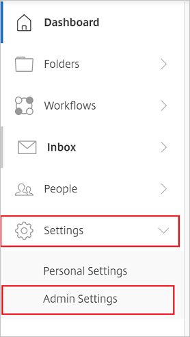
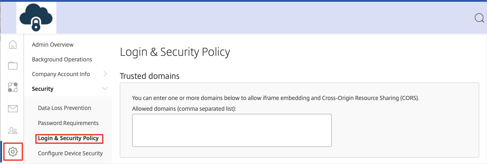
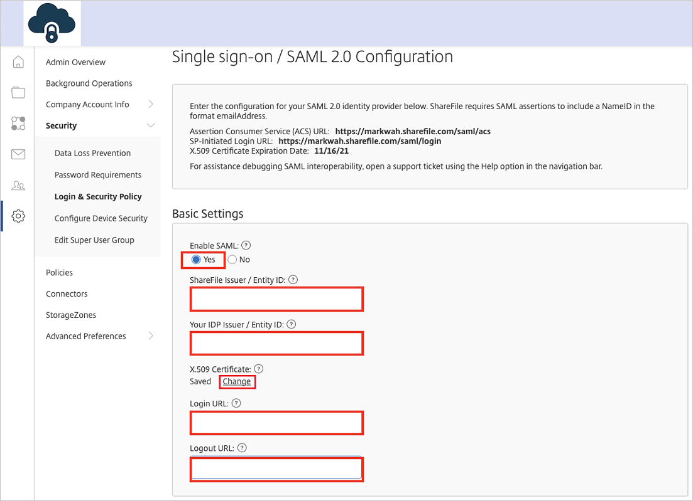
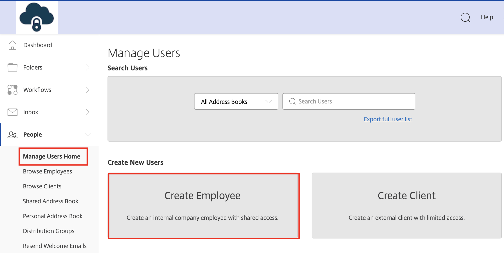
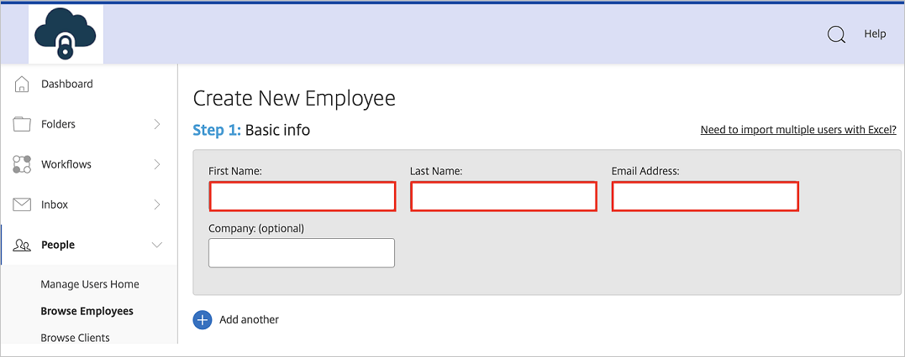

# Tutorial: Microsoft Entra SSO integration with Citrix ShareFile

In this tutorial, you'll learn how to integrate Citrix ShareFile with Microsoft Entra ID. When you integrate Citrix ShareFile with Microsoft Entra ID, you can:

* Control in Microsoft Entra ID who has access to Citrix ShareFile.
* Enable your users to be automatically signed-in to Citrix ShareFile with their Microsoft Entra accounts.
* Manage your accounts in one central location.

## Prerequisites

To get started, you need the following items:

* A Microsoft Entra subscription. If you don't have a subscription, you can get a [free account](https://azure.microsoft.com/free/).
* Citrix ShareFile single sign-on (SSO) enabled subscription.

> [!NOTE]
> This integration is also available to use from Microsoft Entra US Government Cloud environment. You can find this application in the Microsoft Entra US Government Cloud Application Gallery and configure it in the same way as you do from public cloud.

## Scenario description

In this tutorial, you configure and test Microsoft Entra single sign-on in a test environment.

* Citrix ShareFile supports **SP** initiated SSO.

## Add Citrix ShareFile from the gallery

To configure the integration of Citrix ShareFile into Microsoft Entra ID, you need to add Citrix ShareFile from the gallery to your list of managed SaaS apps.

1. Sign in to the [Microsoft Entra admin center](https://entra.microsoft.com) as at least a [Cloud Application Administrator](../roles/permissions-reference.md#cloud-application-administrator).
1. Browse to **Identity** > **Applications** > **Enterprise applications** > **New application**.
1. In the **Add from the gallery** section, type **Citrix ShareFile** in the search box.
1. Select **Citrix ShareFile** from results panel and then add the app. Wait a few seconds while the app is added to your tenant.

 Alternatively, you can also use the [Enterprise App Configuration Wizard](https://portal.office.com/AdminPortal/home?Q=Docs#/azureadappintegration). In this wizard, you can add an application to your tenant, add users/groups to the app, assign roles, as well as walk through the SSO configuration as well. [Learn more about Microsoft 365 wizards.](/microsoft-365/admin/misc/azure-ad-setup-guides)

## Configure and test Microsoft Entra SSO for Citrix ShareFile

In this section, you configure and test Microsoft Entra single sign-on with Citrix ShareFile based on a test user called **Britta Simon**.
For single sign-on to work, a link relationship between a Microsoft Entra user and the related user in Citrix ShareFile needs to be established.

To configure and test Microsoft Entra single sign-on with Citrix ShareFile, perform the following steps:

1. **[Configure Microsoft Entra SSO](#configure-azure-ad-sso)** - to enable your users to use this feature.
	
	1. **[Create a Microsoft Entra test user](#create-an-azure-ad-test-user)** - to test Microsoft Entra single sign-on with Britta Simon.
	1. **[Assign the Microsoft Entra test user](#assign-the-azure-ad-test-user)** - to enable Britta Simon to use Microsoft Entra single sign-on.
2. **[Configure Citrix ShareFile SSO](#configure-citrix-sharefile-sso)** - to configure the Single Sign-On settings on application side.
	1. **[Create Citrix ShareFile test user](#create-citrix-sharefile-test-user)** - to have a counterpart of Britta Simon in Citrix ShareFile that is linked to the Microsoft Entra representation of user.
3. **[Test SSO](#test-sso)** - to verify whether the configuration works.

## Configure Microsoft Entra SSO

Follow these steps to enable Microsoft Entra SSO.

1. Sign in to the [Microsoft Entra admin center](https://entra.microsoft.com) as at least a [Cloud Application Administrator](../roles/permissions-reference.md#cloud-application-administrator).
1. Browse to **Identity** > **Applications** > **Enterprise applications** > **Citrix ShareFile** > **Single sign-on**.
1. On the **Select a single sign-on method** page, select **SAML**.
1. On the **Set up single sign-on with SAML** page, click the pencil icon for **Basic SAML Configuration** to edit the settings.

   

1. On the **Basic SAML Configuration** section, perform the following steps: 

    a. In the **Identifier (Entity ID)** textbox, type a URL using one of the following patterns:

	| **Identifier** |
	|--------|
    | `https://<tenant-name>.sharefile.com` |
	| `https://<tenant-name>.sharefile.com/saml/info` |
	| `https://<tenant-name>.sharefile1.com/saml/info` |
	| `https://<tenant-name>.sharefile1.eu/saml/info` |
	| `https://<tenant-name>.sharefile.eu/saml/info` |

	b. In the **Reply URL** textbox, type a URL using one of the following patterns:
	
	| **Reply URL** |
	|-------|
	| `https://<tenant-name>.sharefile.com/saml/acs` |
	| `https://<tenant-name>.sharefile.eu/saml/<URL path>` |
	| `https://<tenant-name>.sharefile.com/saml/<URL path>` |

	c. In the **Sign-on URL** text box, type a URL using the following pattern:
    `https://<tenant-name>.sharefile.com/saml/login`

	> [!NOTE]
	> These values are not real. Update these values with the actual Identifier,Reply URL and Sign on URL. Contact [Citrix ShareFile Client support team](https://www.citrix.co.in/products/citrix-content-collaboration/support.html) to get these values. You can also refer to the patterns shown in the **Basic SAML Configuration** section.

4. On the **Set up Single Sign-On with SAML** page, in the **SAML Signing Certificate** section, click **Download** to download the **Certificate (Base64)** from the given options as per your requirement and save it on your computer.

	

1. On the **Set up Citrix ShareFile** section, copy the appropriate URL(s) as per your requirement.

	

### Create a Microsoft Entra test user 

In this section, you'll create a test user called B.Simon.

1. Sign in to the [Microsoft Entra admin center](https://entra.microsoft.com) as at least a [User Administrator](../roles/permissions-reference.md#user-administrator).
1. Browse to **Identity** > **Users** > **All users**.
1. Select **New user** > **Create new user**, at the top of the screen.
1. In the **User** properties, follow these steps:
   1. In the **Display name** field, enter `B.Simon`.  
   1. In the **User principal name** field, enter the username@companydomain.extension. For example, `B.Simon@contoso.com`.
   1. Select the **Show password** check box, and then write down the value that's displayed in the **Password** box.
   1. Select **Review + create**.
1. Select **Create**.

### Assign the Microsoft Entra test user

In this section, you'll enable B.Simon to use single sign-on by granting access to Citrix ShareFile.

1. Sign in to the [Microsoft Entra admin center](https://entra.microsoft.com) as at least a [Cloud Application Administrator](../roles/permissions-reference.md#cloud-application-administrator).
1. Browse to **Identity** > **Applications** > **Enterprise applications** > **Citrix ShareFile**.
1. In the app's overview page, select **Users and groups**.
1. Select **Add user/group**, then select **Users and groups** in the **Add Assignment** dialog.
   1. In the **Users and groups** dialog, select **B.Simon** from the Users list, then click the **Select** button at the bottom of the screen.
   1. If you are expecting a role to be assigned to the users, you can select it from the **Select a role** dropdown. If no role has been set up for this app, you see "Default Access" role selected.
   1. In the **Add Assignment** dialog, click the **Assign** button.

## Configure Citrix ShareFile SSO

1. In a different web browser window, sign in to your Citrix ShareFile company site as an administrator

1. In the **Dashboard**, click on **Settings** and select **Admin Settings**.

	

1. In the Admin Settings, go to the **Security** -> **Login & Security Policy**.
   
    

1. On the **Single Sign-On/ SAML 2.0 Configuration** dialog page under **Basic Settings**, perform the following steps:
   
    
   
	a. Select **YES** in the **Enable SAML**.

	b. Copy the **ShareFile Issuer/ Entity ID** value and paste it into the **Identifier URL** box in the **Basic SAML Configuration** dialog box.
	
	c. In **Your IDP Issuer/ Entity ID** textbox, paste the value of **Microsoft Entra Identifier**..

	d. Click **Change** next to the **X.509 Certificate** field and then upload the certificate you downloaded.
	
	e. In **Login URL** textbox, paste the value of **Login URL**..
	
	f. In **Logout URL** textbox, paste the value of **Logout URL**..

	g. In the **Optional Settings**, choose **SP-Initiated Auth Context** as **User Name and Password** and **Exact**.

5. Click **Save**.

## Create Citrix ShareFile test user

1. Log in to your **Citrix ShareFile** tenant.

2. Click **People** -> **Manage Users Home** -> **Create New Users** -> **Create Employee**.
   
	

3. On the **Basic Information** section, perform below steps:
   
	
   
	a. In the **First Name** textbox, type **first name** of user as **Britta**.
   
	b.  In the **Last Name** textbox, type **last name** of user as **Simon**.
   
	c. In the **Email Address** textbox, type the email address of Britta Simon as **brittasimon\@contoso.com**.

4. Click **Add User**.
  
	>[!NOTE]
	>The Microsoft Entra account holder will receive an email and follow a link to confirm their account before it becomes active.You can use any other Citrix ShareFile user account creation tools or APIs provided by Citrix ShareFile to provision Microsoft Entra user accounts.

## Test SSO 

In this section, you test your Microsoft Entra single sign-on configuration with following options.

* Click on **Test this application**, this will redirect to Citrix ShareFile Sign-on URL where you can initiate the login flow.

* Go to Citrix ShareFile Sign-on URL directly and initiate the login flow from there.

* You can use Microsoft My Apps. When you click the Citrix ShareFile tile in the My Apps, this will redirect to Citrix ShareFile Sign-on URL. For more information, see [Microsoft Entra My Apps](/azure/active-directory/manage-apps/end-user-experiences#azure-ad-my-apps).

## Next steps

Once you configure Citrix ShareFile you can enforce session control, which protects exfiltration and infiltration of your organization’s sensitive data in real time. Session control extends from Conditional Access. [Learn how to enforce session control with Microsoft Defender for Cloud Apps](/cloud-app-security/proxy-deployment-any-app).
