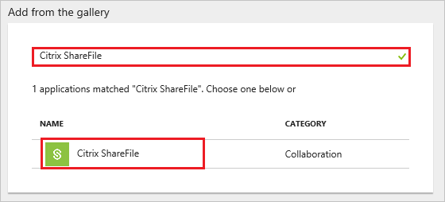
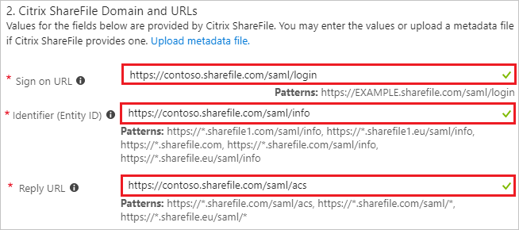
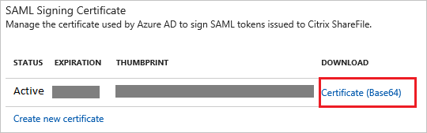
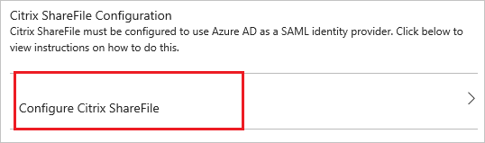

# Tutorial: Azure Active Directory integration with Citrix ShareFile

In this tutorial, you learn how to integrate Citrix ShareFile with Azure Active Directory (Azure AD).

Integrating Citrix ShareFile with Azure AD provides you with the following benefits:

- You can control in Azure AD who has access to Citrix ShareFile.
- You can enable your users to automatically get signed-on to Citrix ShareFile (Single Sign-On) with their Azure AD accounts.
- You can manage your accounts in one central location - the Azure portal.

If you want to know more details about SaaS app integration with Azure AD, see [what is application access and single sign-on with Azure Active Directory](../manage-apps/what-is-single-sign-on.md).

## Prerequisites

To configure Azure AD integration with Citrix ShareFile, you need the following items:

- An Azure AD subscription
- A Citrix ShareFile single sign-on enabled subscription

> [!NOTE]
> To test the steps in this tutorial, we do not recommend using a production environment.

To test the steps in this tutorial, you should follow these recommendations:

- Do not use your production environment, unless it is necessary.
- If you don't have an Azure AD trial environment, you can [get a one-month trial](https://azure.microsoft.com/pricing/free-trial/).

## Scenario description
In this tutorial, you test Azure AD single sign-on in a test environment. 
The scenario outlined in this tutorial consists of two main building blocks:

1. Add Citrix ShareFile from the gallery
1. Configure and test Azure AD single sign-on

## Add Citrix ShareFile from the gallery
To configure the integration of Citrix ShareFile into Azure AD, you need to add Citrix ShareFile from the gallery to your list of managed SaaS apps.

**To add Citrix ShareFile from the gallery, perform the following steps:**

1. In the **[Azure portal](https://portal.azure.com)**, on the left navigation panel, click **Azure Active Directory** icon. 

	![The Azure Active Directory button][1]

1. Navigate to **Enterprise applications**. Then go to **All applications**.

	![The Enterprise applications blade][2]
	
1. To add new application, click **New application** button on the top of dialog.

	![The New application button][3]

1. In the search box, type **Citrix ShareFile**, select **Citrix ShareFile** from result panel then click **Add** button to add the application.

	

## Configure and test Azure AD single sign-on

In this section, you configure and test Azure AD single sign-on with Citrix ShareFile based on a test user called "Britta Simon".

For single sign-on to work, Azure AD needs to know what the counterpart user in Citrix ShareFile is to a user in Azure AD. In other words, a link relationship between an Azure AD user and the related user in Citrix ShareFile needs to be established.

In Citrix ShareFile, assign the value of the **user name** in Azure AD as the value of the **Username** to establish the link relationship.

To configure and test Azure AD single sign-on with Citrix ShareFile, you need to complete the following building blocks:

1. **[Configure Azure AD Single Sign-On](#configure-azure-ad-single-sign-on)** - to enable your users to use this feature.
1. **[Create an Azure AD test user](#create-an-azure-ad-test-user)** - to test Azure AD single sign-on with Britta Simon.
1. **[Create a Citrix ShareFile test user](#create-a-citrix-sharefile-test-user)** - to have a counterpart of Britta Simon in Citrix ShareFile that is linked to the Azure AD representation of user.
1. **[Assign the Azure AD test user](#assign-the-azure-ad-test-user)** - to enable Britta Simon to use Azure AD single sign-on.
1. **[Test single sign-on](#test-single-sign-on)** - to verify whether the configuration works.

### Configure Azure AD single sign-on

In this section, you enable Azure AD single sign-on in the Azure portal and configure single sign-on in your Citrix ShareFile application.

**To configure Azure AD single sign-on with Citrix ShareFile, perform the following steps:**

1. In the Azure portal, on the **Citrix ShareFile** application integration page, click **Single sign-on**.

	![Configure single sign-on link][4]

1. On the **Single sign-on** dialog, select **Mode** as	**SAML-based Sign-on** to enable single sign-on.
 
	

1. On the **Citrix ShareFile Domain and URLs** section, perform the following steps:

	
	
	a. In the **Sign-on URL** textbox, type a URL using the following pattern: `https://<tenant-name>.sharefile.com/saml/login`

	b. In the **Identifier (Entity ID)** textbox, type a URL using the following pattern:

	| |
	|---|
	| `https://<tenant-name>.sharefile.com`|
	| `https://<tenant-name>.sharefile.com/saml/info`|
	| `https://<tenant-name>.sharefile1.com/saml/info`|
	| `https://<tenant-name>.sharefile1.eu/saml/info`|
	| `https://<tenant-name>.sharefile.eu/saml/info`|
	| |
	
	c. In the **Reply URL** textbox, type a URL using the following pattern:
	| |
	|---|
	| `https://<tenant-name>.sharefile.com/saml/acs`|
	| `https://<tenant-name>.sharefile.eu/saml/<URL path>`|
	| `https://<tenant-name>.sharefile.com/saml/<URL path>`|
	| |

	> [!NOTE]
	> These values are not real. Update these values with the actual Sign-On URL, Identifier and Reply URL. Contact [Citrix ShareFile Client support team](https://www.citrix.co.in/products/sharefile/support.html) to get these values.

1. On the **SAML Signing Certificate** section, click **Certificate (Base64)** and then save the certificate file on your computer.

	

1. Click **Save** button.

	

1. On the **Citrix ShareFile Configuration** section, click **Configure Citrix ShareFile** to open **Configure sign-on** window. Copy the **Sign-Out URL, SAML Entity ID, and SAML Single Sign-On Service URL** from the **Quick Reference section.**

	

1. In a different web browser window, log into your **Citrix ShareFile** company site as an administrator.

1. In the toolbar on the top, click **Admin**.

1. In the left navigation pane, select **Configure Single Sign-On**.
   
    

1. On the **Single Sign-On/ SAML 2.0 Configuration** dialog page under **Basic Settings**, perform the following steps:
   
    
   
	a. Click **Enable SAML**.
	
	b. In **Your IDP Issuer/ Entity ID** textbox, paste the value of **SAML Entity ID** which you have copied from Azure portal.

	c. Click **Change** next to the **X.509 Certificate** field and then upload the certificate you downloaded from the Azure portal.
	
	d. In **Login URL** textbox, paste the value of **SAML Single Sign-On Service URL** which you have copied from Azure portal.
	
	e. In **Logout URL** textbox, paste the value of **Sign-Out URL** which you have copied from Azure portal.

1. Click **Save** on the Citrix ShareFile management portal.

### Create an Azure AD test user

The objective of this section is to create a test user in the Azure portal called Britta Simon.

   ![Create an Azure AD test user][100]

**To create a test user in Azure AD, perform the following steps:**

1. In the Azure portal, in the left pane, click the **Azure Active Directory** button.

    

1. To display the list of users, go to **Users and groups**, and then click **All users**.

    

1. To open the **User** dialog box, click **Add** at the top of the **All Users** dialog box.

    

1. In the **User** dialog box, perform the following steps:

    

    a. In the **Name** box, type **BrittaSimon**.

    b. In the **User name** box, type the email address of user Britta Simon.

    c. Select the **Show Password** check box, and then write down the value that's displayed in the **Password** box.

    d. Click **Create**.
 
### Create a Citrix ShareFile test user

In order to enable Azure AD users to log into Citrix ShareFile, they must be provisioned into Citrix ShareFile. In the case of Citrix ShareFile, provisioning is a manual task.

**To provision a user account, perform the following steps:**

1. Log in to your **Citrix ShareFile** tenant.

1. Click **Manage Users \> Manage Users Home \> + Create Employee**.
   
   

1. On the **Basic Information** section, perform below steps:
   
   
   
   a. In the **Email Address** textbox, type the email address of Britta Simon as **brittasimon@contoso.com**.
   
   b. In the **First Name** textbox, type **first name** of user as **Britta**.
   
   c. In the **Last Name** textbox, type **last name** of user as **Simon**.

1. Click **Add User**.
  
   >[!NOTE]
   >The Azure AD account holder will receive an email and follow a link to confirm their account before it becomes active.You can use any other Citrix ShareFile user account creation tools or APIs provided by Citrix ShareFile to provision Azure AD user accounts.

### Assign the Azure AD test user

In this section, you enable Britta Simon to use Azure single sign-on by granting access to Citrix ShareFile.

![Assign the user role][200] 

**To assign Britta Simon to Citrix ShareFile, perform the following steps:**

1. In the Azure portal, open the applications view, and then navigate to the directory view and go to **Enterprise applications** then click **All applications**.

	![Assign User][201] 

1. In the applications list, select **Citrix ShareFile**.

	  

1. In the menu on the left, click **Users and groups**.

	![The "Users and groups" link][202]

1. Click **Add** button. Then select **Users and groups** on **Add Assignment** dialog.

	![The Add Assignment pane][203]

1. On **Users and groups** dialog, select **Britta Simon** in the Users list.

1. Click **Select** button on **Users and groups** dialog.

1. Click **Assign** button on **Add Assignment** dialog.
	
### Test single sign-on

In this section, you test your Azure AD single sign-on configuration using the Access Panel.

When you click the Citrix ShareFile tile in the Access Panel, you should get automatically signed-on to your Citrix ShareFile application.
For more information about the Access Panel, see [Introduction to the Access Panel](../user-help/active-directory-saas-access-panel-introduction.md). 

## Additional resources

* [List of Tutorials on How to Integrate SaaS Apps with Azure Active Directory](tutorial-list.md)
* [What is application access and single sign-on with Azure Active Directory?](../manage-apps/what-is-single-sign-on.md)

<!--Image references-->

[1]: ./media/sharefile-tutorial/tutorial_general_01.png
[2]: ./media/sharefile-tutorial/tutorial_general_02.png
[3]: ./media/sharefile-tutorial/tutorial_general_03.png
[4]: ./media/sharefile-tutorial/tutorial_general_04.png

[100]: ./media/sharefile-tutorial/tutorial_general_100.png

[200]: ./media/sharefile-tutorial/tutorial_general_200.png
[201]: ./media/sharefile-tutorial/tutorial_general_201.png
[202]: ./media/sharefile-tutorial/tutorial_general_202.png
[203]: ./media/sharefile-tutorial/tutorial_general_203.png
