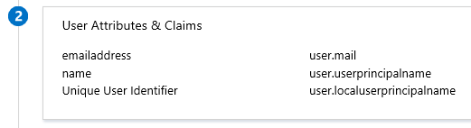
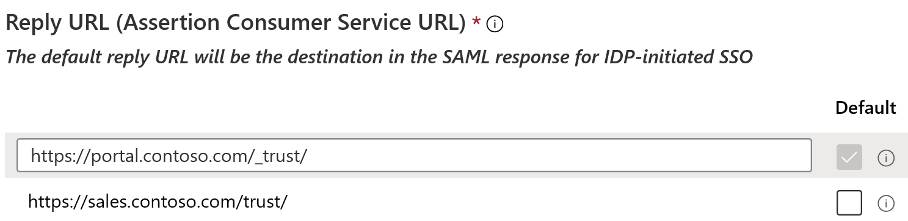

# Tutorial: Azure Active Directory single sign-on (SSO) integration with SharePoint on-premises

In this tutorial, you'll learn how to integrate SharePoint on-premises with Azure Active Directory (Azure AD). When you integrate SharePoint on-premises with Azure AD, you can:

* Control in Azure AD who has access to SharePoint on-premises.
* Enable your users to be automatically signed-in to SharePoint on-premises with their Azure AD accounts.
* Manage your accounts in one central location - the Azure portal.

To learn more about SaaS app integration with Azure AD, see [What is application access and single sign-on with Azure Active Directory](https://docs.microsoft.com/azure/active-directory/manage-apps/what-is-single-sign-on).

## Prerequisites

To configure Azure Active Directory integration with SharePoint on-premises, you need the following items:

* An Azure Active Directory subscription. If you don't have an Azure AD environment, you can get a [free account](https://azure.microsoft.com/free/)
* A SharePoint 2013 farm or newer.

## Scenario description

In this tutorial, you configure and test Azure Active Directory single sign-on in a test environment. Users frlom Azure Active Directory would be able to access your Sharepoint On-Premises.

## Create the Enterprise Applications in Azure Portal for SharePoint On-Premises

To configure the integration of SharePoint on-premises into Azure AD, you need to add SharePoint on-premises from the gallery to your list of managed SaaS apps.

To add SharePoint on-premises from the gallery, perform the following steps:

1. In the **[Azure portal](https://portal.azure.com)**, on the left navigation panel, click **Azure Active Directory** icon.

	> [!NOTE]	
	> If the element should not be available, it can also be opened through the fixed **All services** link at the top of the left navigation panel. In the following overview, the **Azure Active Directory** link is located in the **Identity** section or it can be searched for by using the filter text box.

2. Navigate to **Enterprise Applications** and then select the **All Applications** option.

3. To add new application, click **New application** button on the top of dialog.

4. In the search box, type **SharePoint on-premises**, select **SharePoint on-premises** from result panel.

    

1. Specify a name for your SharePoint OnPrem and click the  **Add** button to add the application.

1. In the new Enterprise Application click on Properties and check the value for **User assignment required**

      
in our scenario this value is set to **No**.


## Configure and test Azure AD with SharePoint on-premises

In this section, you configure Azure AD single sign-on with SharePoint on-premises.
For single sign-on to work, a link relationship between an Azure AD user and the related user in SharePoint on-premises needs to be established.

To configure and test Azure Active Directory single sign-on with SharePoint on-premises, you need to complete the following building blocks:

1. **[Configure Azure AD Single Sign-On](#configure-azure-ad-single-sign-on)** - to enable your users to use this feature.
1. **[Configure SharePoint on-premises](#configure-sharepoint-on-premises)** - to configure the Single Sign-On settings on application side.
1. **[Create an Azure AD test user in the Azure portal](#create-an-azure-ad-test-user-in-the-azure-portal)** - create new user in Azure AD for single sign-on.
1. **[Create an Azure AD Security Group in the Azure portal](#create-an-azure-ad-security-group-in-the-azure-portal)** - create new security group in Azure AD for single sign-on.
1. **[Grant permissions to Azure Active Directory Account in SharePoint on-premises](#grant-permissions-to-azure-active-directory-account-in-sharepoint-on-premises)** - give permissions to Azure AD user.
1. **[Grant permissions to Azure AD group in SharePoint on-premises](#grant-permissions-to-azure-ad-group-in-sharepoint-on-premises)** - give permissions to Azure AD group.
1. **[Grant access to a Guest Account to SharePoint on-premises in the Azure portal](#grant-access-to-a-guest-account-to-sharepoint-on-premises-in-the-azure-portal)** - give permissions to Guest account in Azure AD for SharePoint on-premises.
1. **[Configuring the trusted identity provider for multiple web applications](#configuring-the-trusted-identity-provider-for-multiple-web-applications)** - how to use the same trusted identity provider for multiple web applications

### Configure Azure AD single sign-on

In this section, you enable Azure AD single sign-on in the Azure portal.

To configure Azure AD single sign-on with SharePoint on-premises, perform the following steps:

1. In the [Azure portal](https://portal.azure.com/), open the Azure AD directory, click on **Enterprise applications**, click on the **previously created Enterprise Application name** and click on **Single sign-on**.

2. On the **Select a Single sign-on method** dialog, click on **SAML** mode to enable single sign-on.
 
3. On **Set up Single Sign-On with SAML** page, click the **Edit** icon to open **Basic SAML Configuration** dialog.

4. On the **Basic SAML Configuration** section, perform the following steps:

    

    1. In the **Identifier** box, type a URL using the following pattern:
    `urn:<sharepointFarmName>:<federationName>`

    1. In the **Reply URL** text box, type a URL using the following pattern:
    `https://<YourSharePointSiteURL>/_trust/`

    1. In the **Sign-on URL** text box, type a URL using the following pattern:
    `https://<YourSharePointSiteURL>/`
	1. click on save.

	> [!NOTE]
	> These values are not real. Update these values with the actual Sign-On URL, Identifier and Reply URL.

5. On the **Set up Single Sign-On with SAML** page, in the **SAML Signing Certificate** section, click **Download** to download the **Certificate (Base64)** from the given options as per your requirement and save it on your computer.

	

6. On the **Set up SharePoint on-premises** section, copy the appropriate URL(s) as per your requirement.
    
	1. **Login URL**
	
	    Copy login URL  replace **/saml2** at the end  with **/wsfed**, it would look like **https://login.microsoftonline.com/2c4f1a9f-be5f-10ee-327d-a95dac567e4f/wsfed** (this url is not accurate)

    1. **Azure AD Identifier**
	1. **Logout URL**
    > [!NOTE]
    > This URL cannot be used as is in SharePoint: you must replace **/saml2** with **/wsfed**. Sharepoint On-Premises application uses SAML 1.1 token, so Azure AD expects WS Fed request from SharePoint server and after authentication, it issues the SAML 1.1. token.

### Configure SharePoint on-premises

1. **Create a new trusted identity provider in SharePoint Server 2016**

    Sign in to  SharePoint server and open the SharePoint management Shell. Fill in the values:
    1. **$realm** (Identifier value from the SharePoint on-premises Domain and URLs section in the Azure portal).
    1. **$wsfedurl** (Single Sign-On Service URL).
   1. **$filepath** (file path to which you have downloaded the certificate file) from Azure portal.

    Run the following commands to configure a new trusted identity provider.

    > [!TIP]
    > If you're new to using PowerShell or want to learn more about how PowerShell works, see [SharePoint PowerShell](https://docs.microsoft.com/powershell/sharepoint/overview?view=sharepoint-ps).


    ```
    $realm = "urn:sharepoint:sps201x"
    $wsfedurl="https://login.microsoftonline.com/2c4f1a9f-be5f-10ee-327d-a95dac567e4f/wsfed"
    $filepath="C:\temp\SharePoint 2019 OnPrem.cer"
    $cert = New-Object System.Security.Cryptography.X509Certificates.X509Certificate2($filepath)
    New-SPTrustedRootAuthority -Name "AzureAD" -Certificate $cert
    $map1 = New-SPClaimTypeMapping -IncomingClaimType "http://schemas.xmlsoap.org/ws/2005/05/identity/claims/name" -IncomingClaimTypeDisplayName "name" -LocalClaimType "http://schemas.xmlsoap.org/ws/2005/05/identity/claims/upn"
    $map2 = New-SPClaimTypeMapping -IncomingClaimType "http://schemas.microsoft.com/ws/2008/06/identity/claims/role" -IncomingClaimTypeDisplayName "Role" -SameAsIncoming
    $ap = New-SPTrustedIdentityTokenIssuer -Name "AzureAD" -Description "AAD SharePoint server 201x" -realm $realm -ImportTrustCertificate $cert -ClaimsMappings $map1,$map2 -SignInUrl $wsfedurl -IdentifierClaim $map1.InputClaimType
	```
1. **Enable the trusted identity provider for your application**
    
	a. In Central Administration, navigate to **Manage Web Application** and select the web application that you wish to secure with Azure AD.

	b. In the ribbon, click **Authentication Providers** and choose the zone that you wish to use.

	c. Select **Trusted Identity provider** and select the identify provider you just registered named *AzureAD*.

	d. Click **OK**.

	

### Create an Azure AD test user in the Azure portal

The objective of this section is to create a test user in the Azure Portal.

1. In the Azure portal, in the left pane, select **Azure Active Directory**, in **Manage** pan select **Users**.

2. Then select **All users** followed by **New user** at the top of the screen.

3. Select the option **Create User** and in the User properties, perform the following steps.  
   You might be able to create users in your AAD using your tenant suffixe or any verified domain. 

    a. In the **Name** field enter the user name , we used **TestUser**.
  
    b. In the **User name** field type `TestUser@yourcompanydomain.extension`  
    For example, TestUser@contoso.com

    

    c. Select **Show password** check box, and then write down the value that's displayed in the Password box.

    d. Click **Create**.

    e. You can now share the site with TestUser@contoso.com and permit this user to access it.

### Create an Azure AD Security Group in the Azure portal

1. Click on **Azure Active Directory > Groups**.

2. Click **New group**:

3. Fill in **Group type**, **Group name**, **Group description**, **Membership type**. Click on the arrow to select members, then search for or click on the member you will like to add to the group. Click on **Select** to add the selected members, then click on **Create**.

	

### Grant permissions to Azure Active Directory account in SharePoint on-premises

To Grant access to the Azure Active Directory User in the on-premise SharePoint you need to share the site collection or add the Azure Active Directory User to one of the site collection's group.Users can now sign into SharePoint 201x using identities from Azure AD, but there are still opportunities for improvement to the user experience. For instance, searching for a user presents multiple search results in the people picker. There is a search result for each of the claims types that are created in the claim mapping. To choose a user using the people picker, you must type their user name exactly and choose the **name** claim result.

  

There is no validation on the values you search for, which can lead to misspellings or users accidentally choosing the wrong claim type. This can prevent users from successfully accessing resources.

**To fix the people picker** with this scenario, there is an open-source solution called [

](https://yvand.github.io/AzureCP/) that provides a custom claims provider for SharePoint 2013, 2016 and 2019. It will use the Microsoft Graph API to resolve what users enter and perform validation. Learn more at [AzureCP](https://yvand.github.io/AzureCP/).

  > [!NOTE]
  > without AzureCP you can add Groups by adding the Azure AD group's ID but this is not user's friendly and reliable. There is how it looks.
  
  
### Grant permissions to Azure AD group in SharePoint on-premises

In order to assign Azure Active Directory Security Groups to SharePoint on-premise, it will be necessary to use an custom claims provider for SharePoint Server. In our example, we have used AzureCP.

> [!NOTE]
	> Please note that AzureCP is not a Microsoft product or supported by Microsoft Technical Support. Download, install and configure AzureCP on the on-premises SharePoint farm per https://yvand.github.io/AzureCP/ 

1. Configure the AzureCP on the SharePoint on-premises farm or an alternative custom claims provider solution. the AzureCP configuration's steps are available at https://yvand.github.io/AzureCP/Register-App-In-AAD.html

1. In the Azure portal, open the Azure AD directory. Click on **Enterprise applications**, click on the **previously created Enterprise Application name** and click on **Single sign-on**.

1. In the page **Set up Single Sign-On with SAM**, edit the **User Attributes & Claims** section.

1. Click on **Add a group claim**.

1. Select which groups associated with the user should be returned in the claim, in our case select **All groups** and in the Source attribute section select **Group ID** and click on **Save**.

To grant access to the Azure Active Directory Security Group in the on-premise SharePoint you need to share the site collection or add the Azure Active Directory Security Group to one of the site collection's group.

1. Browse to the SharePoint Site Collection, under Site Settings for the Site Collection, click on "People and groups". Select the SharePoint group then click on New, "Add Users to this Group" and start to type the name of your group the People Picker will display the Azure Active Directory Security Group.
    

### Grant access to a Guest account to SharePoint on-premises in the Azure portal

it's now possible to grant access to your SharePoint Site  to a Guest Account in a consistent way. It happens that the the UPN gets modified for something like **MYEMAIL_outlook.com#ext#@TENANT.onmicrosoft.com**. To get a seamless experience while sharing your site with external users, it would be necessary to add some modifications in your **User Attributes & Claims** section in the Azure Portal.

1. In the Azure portal, open the Azure AD directory. Click on **Enterprise applications**, click on the **previously created Enterprise Application name** and click on **Single sign-on**.

1. In the page **Set up Single Sign-On with SAM**, edit the **User Attributes & Claims** section.

1. in the **Required claim** zone click on **Unique User Identifier (Name ID)**.

1. Change the **Source Attribute** Property to the value **user.localuserprincipalname** and **save**.

    

1. Using ribbon go back to **SAML-based Sign-on** now the **User Attributes & Claims** section would look like this : 
    
      

    > [!NOTE]
	> Surname and Given name are not required in this setup.

1. In the Azure portal, in the left pane, select **Azure Active Directory**, select **Users**.

1. click on **New Guest User**

1. Select the option **Invite User** and fill up the User's properties and click on **Invite**.
 
1. You can now share the site with MyGuestAccount@outlook.com and permit this user to access it.
    
    

### Configuring the trusted identity provider for multiple web applications

The configuration works for a single web application, but needs additional configuration if you intend to use the same trusted identity provider for multiple web applications. For example, assume we had extended a web application to use the URL `https://sales.contoso.com` and now want to authenticate the users to `https://marketing.contoso.com` as well. To do this, we need to update the identity provider to honor the WReply parameter and update the application registration in Azure AD to add a reply URL.

1. In the Azure portal, open the Azure AD directory. Click on **Enterprise applications**, click on the **previously created Enterprise Application name** and click on **Single sign-on**.

2. In the page **Set up Single Sign-On with SAM**, edit the **Basic SAML Configuration**.

    

3. In **Reply URL (Assertion Consumer Service URL)** add  the URL for the additional web applications  and click **Save**.

    

4. On the SharePoint server, open the **SharePoint 201x Management Shell** and execute the following commands, using the name of the trusted identity token issuer that you used previously.
	```
	$t = Get-SPTrustedIdentityTokenIssuer "AzureAD"
	$t.UseWReplyParameter=$true
	$t.Update()
	```
5. In Central Administration, go to the web application and enable the existing trusted identity provider.

You might have other scenario where you want to give access to your On-Premise Sharepoint for your internal users, for this scenario you would have to deploy Microsoft Azure Active Directory Connect that will permits to sync your On-Premise users with Azure Active Directory, this setup would be part of another article. 

## Additional resources

- [List of Tutorials on How to Integrate SaaS Apps with Azure Active Directory](https://docs.microsoft.com/azure/active-directory/active-directory-saas-tutorial-list)

- [What is application access and single sign-on with Azure Active Directory?](https://docs.microsoft.com/azure/active-directory/manage-apps/what-is-single-sign-on)

- [What is Conditional Access in Azure Active Directory?](https://docs.microsoft.com/azure/active-directory/conditional-access/overview)

- [What is hybrid identity with Azure Active Directory?](https://docs.microsoft.com/azure/active-directory/hybrid/whatis-hybrid-identity)