# Tutorial: Implement federated authentication between Azure Active Directory and SharePoint on-premises

## Scenario description

In this tutorial, you configure a federated authentication between Azure Active Directory and SharePoint on-premises. The goal is to allow users to sign in on Azure Active Directory and use their identity to access the SharePoint on-premises sites.

## Prerequisites

To perform the configuration, you need the following resources:
* An Azure Active Directory tenant. If you don't have one, you can create a [free account](https://azure.microsoft.com/free/).
* A SharePoint 2013 farm or newer.

This article uses the following values:
- Enterprise application name (in Azure AD): `SharePoint corporate farm`
- Trust identifier (in Azure AD) / realm (in SharePoint): `urn:sharepoint:federation`
- loginUrl (to Azure AD): `https://login.microsoftonline.com/dc38a67a-f981-4e24-ba16-4443ada44484/wsfed`
- SharePoint site URL: `https://spsites.contoso.local/`
- SharePoint site reply URL: `https://spsites.contoso.local/_trust/`
- SharePoint trust configuration name: `AzureADTrust`
- UserPrincipalName of the Azure AD test user: `AzureUser1@demo1984.onmicrosoft.com`

## Configure an enterprise application in Azure Active Directory

To configure the federation in Azure AD, you need to create a dedicated Enterprise application. Its configuration is simplified using the pre-configured template `SharePoint on-premises` that can be found in the application gallery.

### Create the enterprise application

1. Sign in to the [Azure portal](https://portal.azure.com).
1. Browse to **Azure Active Directory** > **Enterprise applications**, and then select **All applications**.
1. To add a new application, select **New application** at the top of the dialog box.
1. In the search box, enter **SharePoint on-premises**. Select **SharePoint on-premises** from the result pane.
1. Specify a name for your application (in this tutorial, it is `SharePoint corporate farm`), and click **Create** to add the application.
1. In the new enterprise application, select **Properties**, and check the value for **User assignment required?**. For this scenario, set its value to **No** and click **Save**.

### Configure the enterprise application

In this section, you configure the SAML authentication and define the claims that will be sent to SharePoint upon successful authentication.

1. In the Overview of the Enterprise application `SharePoint corporate farm`, select **2. Set up single sign-on** and choose the **SAML** in the next dialog.
 
1. On the **Set up Single Sign-On with SAML** page, select the **Edit** icon in the **Basic SAML Configuration** pane.

1. In the **Basic SAML Configuration** section, follow these steps:

    1. In the **Identifier** box, ensure that this value is present:
    `urn:sharepoint:federation`.

    1. In the **Reply URL** box, enter a URL by using this pattern:
    `https://spsites.contoso.local/_trust/`.

    1. In the **Sign on URL** box, enter a URL by using this pattern:
    `https://spsites.contoso.local/`.
	
    1. Select **Save**.

1. In the **User Attributes & Claims** section, delete the following claim types, which are useless since they won't be used by SharePoint to grant permissions:
    - `http://schemas.xmlsoap.org/ws/2005/05/identity/claims/emailaddress`
    - `http://schemas.xmlsoap.org/ws/2005/05/identity/claims/givenname`
    - `http://schemas.xmlsoap.org/ws/2005/05/identity/claims/surname`

1. The settings should now look like this:

    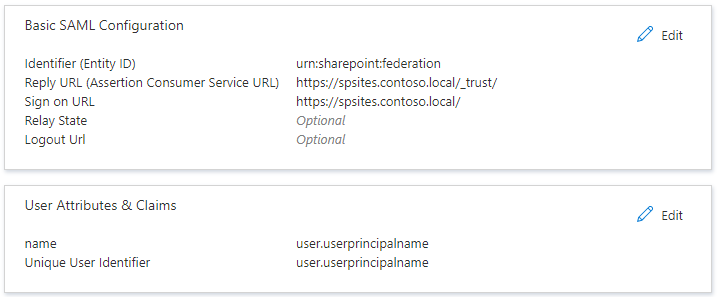

1. Copy the information that you'll need later in SharePoint:

	- In the **SAML Signing Certificate** section, **Download** the **Certificate (Base64)**. This is the public key of the signing certificate used by Azure AD to sign the SAML token. SharePoint will need it to verify the integrity of the incoming SAML tokens.

	- In the **Set up SharePoint corporate farm** section, copy the **Login URL** in a notepad and replace the trailing string **/saml2** with **/wsfed**.
	 
	> [!IMPORTANT]
    > Make sure to replace **/saml2** with **/wsfed** to ensure that Azure AD issues a SAML 1.1 token, as required by SharePoint.

    - In the **Set up SharePoint corporate farm** section, copy the **Logout URL**

## Configure SharePoint to trust Azure Active Directory

### Create the trust in SharePoint

In this step, you create a SPTrustedLoginProvider to store the configuration that SharePoint needs to trust Azure AD. For that, you need the information from Azure AD that you copied above. Start the SharePoint Management Shell and run the following script to create it:

```powershell
# Path to the public key of the Azure AD SAML signing certificate (self-signed), downloaded from the Enterprise application in the Azure portal
$signingCert = New-Object System.Security.Cryptography.X509Certificates.X509Certificate2("C:\AAD app\SharePoint corporate farm.cer")
# Unique realm (corresponds to the "Identifier (Entity ID)" in the Azure AD Enterprise application)
$realm = "urn:sharepoint:federation"
# Login URL copied from the Azure AD enterprise application. Make sure to replace "saml2" with "wsfed" at the end of the URL:
$loginUrl = "https://login.microsoftonline.com/dc38a67a-f981-4e24-ba16-4443ada44484/wsfed"

# Define the claim types used for the authorization
$userIdentifier = New-SPClaimTypeMapping -IncomingClaimType "http://schemas.xmlsoap.org/ws/2005/05/identity/claims/name" -IncomingClaimTypeDisplayName "name" -LocalClaimType "http://schemas.xmlsoap.org/ws/2005/05/identity/claims/upn"
$role = New-SPClaimTypeMapping "http://schemas.microsoft.com/ws/2008/06/identity/claims/role" -IncomingClaimTypeDisplayName "Role" -SameAsIncoming

# Let SharePoint trust the Azure AD signing certificate
New-SPTrustedRootAuthority -Name "Azure AD signing certificate" -Certificate $signingCert

# Create a new SPTrustedIdentityTokenIssuer in SharePoint
$trust = New-SPTrustedIdentityTokenIssuer -Name "AzureADTrust" -Description "Azure AD" -Realm $realm -ImportTrustCertificate $signingCert -ClaimsMappings $userIdentifier, $role -SignInUrl $loginUrl -IdentifierClaim $userIdentifier.InputClaimType
```

### Configure the SharePoint web application

In this step, you configure a web application in SharePoint to trust the Azure AD Enterprise application created above. There are important rules to have in mind:
- The default zone of the SharePoint web application must have Windows authentication enabled. This is required for the Search crawler.
- The SharePoint URL that will use Azure AD authentication must be set with HTTPS.

1. Create or extend the web application. This article describes two possible configurations:

	- If you create a new web application that uses both Windows and Azure AD authentication in the Default zone:

        1. Start the **SharePoint Management Shell** and run the following script:
            ```powershell
            # This script creates a new web application and sets Windows and Azure AD authentication on the Default zone
            # URL of the SharePoint site federated with Azure AD
            $trustedSharePointSiteUrl = "https://spsites.contoso.local/"
            $applicationPoolManagedAccount = "Contoso\spapppool"

            $winAp = New-SPAuthenticationProvider -UseWindowsIntegratedAuthentication -DisableKerberos:$true
            $sptrust = Get-SPTrustedIdentityTokenIssuer "AzureADTrust"
            $trustedAp = New-SPAuthenticationProvider -TrustedIdentityTokenIssuer $sptrust    
            
            New-SPWebApplication -Name "SharePoint - Azure AD" -Port 443 -SecureSocketsLayer -URL $trustedSharePointSiteUrl -ApplicationPool "SharePoint - Azure AD" -ApplicationPoolAccount (Get-SPManagedAccount $applicationPoolManagedAccount) -AuthenticationProvider $winAp, $trustedAp
            ```
        1. Open the **SharePoint Central Administration** site.
        1. Under **System Settings**, select **Configure Alternate Access Mappings**. The **Alternate Access Mapping Collection** box opens.
        1. Filter the display with the new web application and confirm that you see something like this:
    
           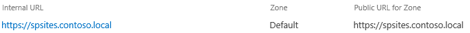

    - If you extend an existing web application to use Azure AD authentication on a new zone:

        1. Start the SharePoint Management Shell and run the following script:

            ```powershell
            # This script extends an existing web application to set Azure AD authentication on a new zone
            # URL of the default zone of the web application
            $webAppDefaultZoneUrl = "http://spsites/"
            # URL of the SharePoint site federated with ADFS
            $trustedSharePointSiteUrl = "https://spsites.contoso.local/"
            $sptrust = Get-SPTrustedIdentityTokenIssuer "AzureADTrust"
            $ap = New-SPAuthenticationProvider -TrustedIdentityTokenIssuer $sptrust
            $wa = Get-SPWebApplication $webAppDefaultZoneUrl
            
            New-SPWebApplicationExtension -Name "SharePoint - Azure AD" -Identity $wa -SecureSocketsLayer -Zone Internet -Url $trustedSharePointSiteUrl -AuthenticationProvider $ap
            ```
        
        1. Open the **SharePoint Central Administration** site.
        1. Under **System Settings**, select **Configure Alternate Access Mappings**. The **Alternate Access Mapping Collection** box opens.
        1. Filter the display with the web application that was extended and confirm that you see something like this:
    
            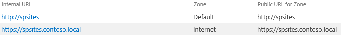

Once the web application is created, you can create a root site collection and add you Windows account as the primary site collection administrator.

1. Create a certificate for the SharePoint site

    Since SharePoint URL uses HTTPS protocol (`https://spsites.contoso.local/`), a certificate must be set on the corresponding Internet Information Services (IIS) site. Follow those steps to generate a self-signed certificate:
    
    > [!IMPORTANT]
    > Self-signed certificates are suitable only for test purposes. In production environments, we strongly recommend that you use certificates issued by a certificate authority instead.
    
    1. Open the Windows PowerShell console.
    1. Run the following script to generate a self-signed certificate and add it to the computer's MY store:
    
        ```powershell
        New-SelfSignedCertificate -DnsName "spsites.contoso.local" -CertStoreLocation "cert:\LocalMachine\My"
        ```
    
1. Set the certificate in the IIS site
    1. Open the Internet Information Services Manager console.
    1. Expand the server in the tree view, expand **Sites**, select the site **SharePoint - Azure AD**, and select **Bindings**.
    1. Select **https binding** and then select **Edit**.
    1. In the TLS/SSL certificate field, choose the certificate to use (for example, **spsites.contoso.local** created above) and select **OK**.
    
    > [!NOTE]
    > If you have multiple Web Front End servers, you need to repeat this operation on each.

The basic configuration of the trust between SharePoint and Azure AD is now finished. Let's see how to sign in to the SharePoint site as an Azure Active Directory user.

## Sign in as a member user

Azure Active Directory has [two type of users](../external-identities/user-properties.md): Guest users and Member users. Let's start with a member user, which is merely a user that is homed in your organization.

### Create a member user in Azure Active Directory

1. In the Azure portal, on the leftmost pane, select **Azure Active Directory**. In the **Manage** pane, select **Users**.

1. Select **All users** > **New user** at the top of the screen.

1. Select **Create User**, and in the user properties, follow these steps.

    1. In the **Name** box, enter the user name. We used **TestUser**.
  
    1. In the **User name** box, enter `AzureUser1@<yourcompanytenant>.onmicrosoft.com`. This example shows `AzureUser1@demo1984.onmicrosoft.com`:

       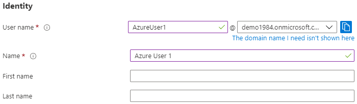

    1. Select the **Show password** check box, and then write down the value that appears in the **Password** box.

    1. Select **Create**.

    1. You can now share the site with `AzureUser1@demo1984.onmicrosoft.com` and permit this user to access it.

### Grant permissions to the Azure Active Directory user in SharePoint

Sign in to the SharePoint root site collection as your Windows account (site collection administrator) and click **Share**.  
In the dialog, you need to type the exact value of the userprincipalname, for example `AzureUser1@demo1984.onmicrosoft.com`, and be careful to select the **name** claim result (move your mouse on a result to see its claim type)

> [!IMPORTANT]
> Be careful to type the exact value of the user you want to invite, and choose the appropriate claim type in the list, otherwise the sharing will not work.

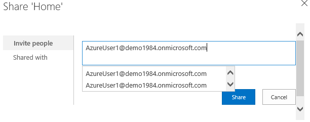

This limitation is because SharePoint does not validate the input from the people picker, which can be confusing and lead to misspellings or users accidentally choosing the wrong claim type.  
To fix this scenario, an open-source solution called [AzureCP](https://yvand.github.io/AzureCP/) can be used to connect SharePoint 2019 / 2016 / 2013 with Azure Active Directory and resolve the input against your Azure Active Directory tenant. For more information, see [AzureCP](https://yvand.github.io/AzureCP/).

Below is the same search with AzureCP configured: SharePoint returns actual users based on the input:

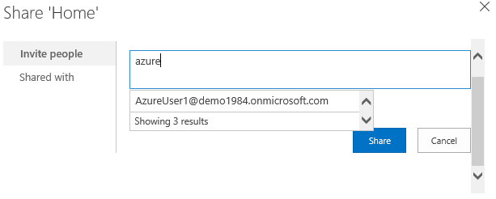

> [!IMPORTANT]
> AzureCP isn't a Microsoft product and isn't supported by Microsoft Support. To download, install, and configure AzureCP on the on-premises SharePoint farm, see the [AzureCP](https://yvand.github.io/AzureCP/) website. 

Azure Active Directory user `AzureUser1@demo1984.onmicrosoft.com` can now use his/her identity to sign in to the SharePoint site `https://spsites.contoso.local/`.

## Grant permissions to a security group

### Add the group claim type to the enterprise application

1. In the Overview of the Enterprise application `SharePoint corporate farm`, select **2. Set up single sign-on**. 

1. In the **User Attributes & Claims** section, follow these steps if there is no group claim present:

    1. Select **Add a group claim**, select **Security groups**, make sure that **Source Attribute** is set to **Group ID**
    1. Check **Customize the name of the group claim**, then check **Emit groups as role claims** and click **Save**.
    1. The **User Attributes & Claims** should look like this:

    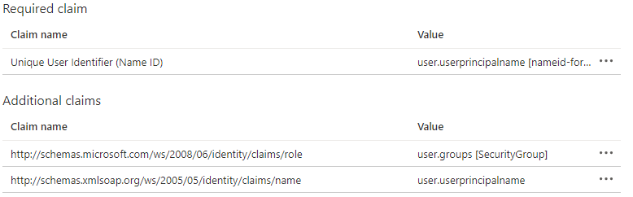

### Create a security group in Azure Active Directory

Let's create a security group in Azure Active Directory:

1. Select **Azure Active Directory** > **Groups**.

1. Select **New group**.

1. Fill in the **Group type** (Security), **Group name** (for example, `AzureGroup1`), and **Membership type**. Add the user you created above as a member and click select **Create**:

    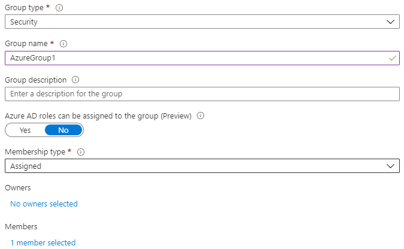
  
### Grant permissions to the security group in SharePoint

Azure AD security groups are identified with their attribute `Id`, which is a GUID (for example, `E89EF0A3-46CC-45BF-93A4-E078FCEBFC45`).  
Without a custom claims provider, users need to type the exact value (`Id`) of the group in the people picker, and select the corresponding claim type. This is not user-friendly nor reliable.  
To avoid this, this article uses third-party claims provider [AzureCP](https://yvand.github.io/AzureCP/) to find the group in a friendly way in SharePoint:


## Manage Guest users access

There are two types of guest accounts:

- B2B guest accounts: Those users are homed in an external Azure Active Directory tenant
- MSA guest accounts: Those users are homed in a Microsoft identify provider (Hotmail, Outlook) or a social account provider (Google or similar)

By default, Azure Active Directory sets both the "Unique User Identifier" and the claim "name" to the attribute `user.userprincipalname`.  
Unfortunately, this attribute is ambiguous for guest accounts, as the table below shows:

| Source attribute set in Azure AD | Actual property used by Azure AD for B2B guests | Actual property used by Azure AD for MSA guests | Property that SharePoint can rely on to validate the identity |
|--|--|--|--|
| `user.userprincipalname` | `mail`, for example: `guest@PARTNERTENANT` | `userprincipalname`, for example: `guest_outlook.com#EXT#@TENANT.onmicrosoft.com` | ambiguous |
| `user.localuserprincipalname` | `userprincipalname`, for example: `guest_PARTNERTENANT#EXT#@TENANT.onmicrosoft.com` | `userprincipalname`, for example: `guest_outlook.com#EXT#@TENANT.onmicrosoft.com` | `userprincipalname` |

As a conclusion, to ensure that guest accounts are all identified with the same attribute, the identifier claims of the enterprise application should be updated to use the attribute `user.localuserprincipalname` instead of `user.userprincipalname`.

### Update the application to use a consistent attribute for all guest users

1. In the Overview of the Enterprise application `SharePoint corporate farm`, select **2. Set up single sign-on**.
 
1. On the **Set up Single Sign-On with SAML** page, select the **Edit** icon in the **User Attributes & Claims** pane.

1. In the **User Attributes & Claims** section, follow these steps:

    1. Select **Unique User Identifier (Name ID)**, change its **Source Attribute** property to **user.localuserprincipalname**, and click **Save**.
    
    1. Select `http://schemas.xmlsoap.org/ws/2005/05/identity/claims/name`, change its **Source Attribute** property to **user.localuserprincipalname**, and click **Save**.
    
    1. The **User Attributes & Claims** should look like this:
    
    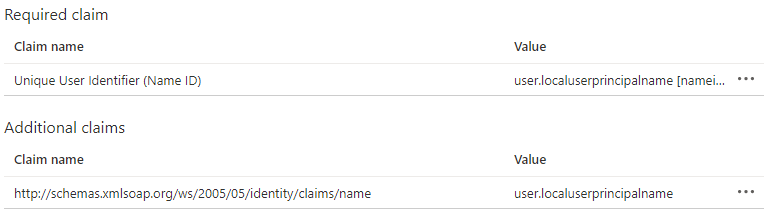

### Invite guest users in SharePoint

> [!NOTE]
> This section assumes that claims provider AzureCP is used

In the section above, you updated the enterprise application to use a consistent attribute for all guest accounts.  
Now, the configuration of AzureCP needs to be updated to reflect that change and use the attribute `userprincipalname` for guest accounts:

1. Open the **SharePoint Central Administration** site.
1. Under **Security**, select **AzureCP global configuration**.
1. In the section **User identifier property**: Set the **User identifier for 'Guest' users:** to **UserPrincipalName**.
1. Click Ok

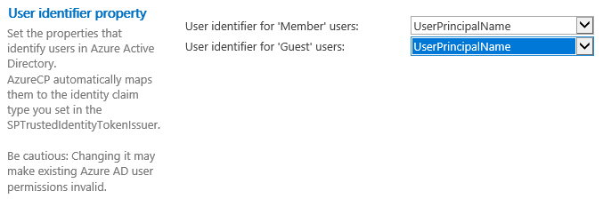

You can now invite any guest user in the SharePoint sites.

## Configure the federation for multiple web applications

The configuration works for a single web application, but additional configuration is needed if you intend to use the same trusted identity provider for multiple web applications. For example, assume you have a separate web application `https://otherwebapp.contoso.local/` and you now want to enable Azure Active Directory authentication on it. To do this, configure SharePoint to pass the SAML WReply parameter, and add the URLs in the enterprise application.

### Configure SharePoint to pass the SAML WReply parameter

1. On the SharePoint server, open the SharePoint 201x Management Shell and run the following commands. Use the same name for the trusted identity token issuer as you used previously.

```powershell
$t = Get-SPTrustedIdentityTokenIssuer "AzureADTrust"
$t.UseWReplyParameter = $true
$t.Update()
```

### Add the URLs in the enterprise application

1. In the Azure portal, select **Azure Active Directory** > **Enterprise applications**. Select the previously created enterprise application name, and select **Single sign-on**.

1. On the **Set up Single Sign-On with SAML** page, edit **Basic SAML Configuration**.

1. In the section **Reply URL (Assertion Consumer Service URL)**, add the URL (for example, `https://otherwebapp.contoso.local/`) of all additional web applications that need to sign in users with Azure Active Directory and click **Save**.

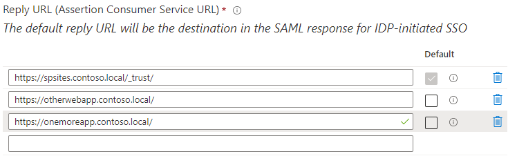

### Configure the lifetime of the security token

By default, Azure AD creates a SAML token that is valid for 1 hour.  
This lifetime cannot be customized in the Azure portal, or using a Conditional Access policy, but it can be done by creating a [custom token lifetime policy](../develop/configurable-token-lifetimes.md) and apply it to the enterprise application created for SharePoint.  
To do this, complete the steps below using Windows PowerShell (at the time of this writing, AzureADPreview v2.0.2.149 does not work with PowerShell Core):

1. Install the module [AzureADPreview](https://www.powershellgallery.com/packages/AzureADPreview/):

    ```powershell
    Install-Module -Name AzureADPreview -Scope CurrentUser
    ```

1. Run `Connect-AzureAD` to sign-in as a tenant administrator.

1. Run the sample script below to update the application `SharePoint corporate farm` to issue a SAML token valid for 6h (value `06:00:00` of property `AccessTokenLifetime`):

    ```powershell
    $appDisplayName = "SharePoint corporate farm"
    
    $sp = Get-AzureADServicePrincipal -Filter "DisplayName eq '$appDisplayName'"
    $oldPolicy = Get-AzureADServicePrincipalPolicy -Id $sp.ObjectId | ?{$_.Type -eq "TokenLifetimePolicy"}
    if ($null -ne $oldPolicy) {
        # There can be only 1 TokenLifetimePolicy associated to the service principal (or 0, as by default)
        Remove-AzureADServicePrincipalPolicy -Id $sp.ObjectId -PolicyId $oldPolicy.Id
    }
    
    # Create a custom TokenLifetimePolicy in Azure AD and add it to the service principal
    $policy = New-AzureADPolicy -Definition @('{"TokenLifetimePolicy":{"Version":1,"AccessTokenLifetime":"06:00:00"}}') -DisplayName "Custom token lifetime policy" -IsOrganizationDefault $false -Type "TokenLifetimePolicy"
    Add-AzureADServicePrincipalPolicy -Id $sp.ObjectId -RefObjectId $policy.Id
    ```

After the script completed, all users who successfully sign-in to the enterprise application will get a SAML 1.1 token valid for 6h in SharePoint.  
To revert the change, simply remove the custom `TokenLifetimePolicy` object from the service principal, as done at the beginning of the script.
