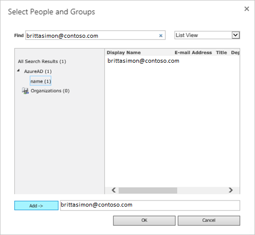

# Tutorial: Azure Active Directory integration with SharePoint on-premises

In this tutorial, you learn how to integrate SharePoint on-premises with Azure Active Directory (Azure AD).
Integrating SharePoint on-premises with Azure AD provides you with the following benefits:

* You can control in Azure AD who has access to SharePoint on-premises.
* You can enable your users to be automatically signed-in to SharePoint on-premises (Single Sign-On) with their Azure AD accounts.
* You can manage your accounts in one central location - the Azure portal.

If you want to know more details about SaaS app integration with Azure AD, see [What is application access and single sign-on with Azure Active Directory](https://docs.microsoft.com/azure/active-directory/active-directory-appssoaccess-whatis).
If you don't have an Azure subscription, [create a free account](https://azure.microsoft.com/free/) before you begin.

## Prerequisites

To configure Azure AD integration with SharePoint on-premises, you need the following items:

* An Azure AD subscription. If you don't have an Azure AD environment, you can get one-month trial [here](https://azure.microsoft.com/pricing/free-trial/)
* SharePoint on-premises single sign-on enabled subscription

## Scenario description

In this tutorial, you configure and test Azure AD single sign-on in a test environment.

* SharePoint on-premises supports **SP** initiated SSO

## Adding SharePoint on-premises from the gallery

To configure the integration of SharePoint on-premises into Azure AD, you need to add SharePoint on-premises from the gallery to your list of managed SaaS apps.

**To add SharePoint on-premises from the gallery, perform the following steps:**

1. In the **[Azure portal](https://portal.azure.com)**, on the left navigation panel, click **Azure Active Directory** icon.

	

2. Navigate to **Enterprise Applications** and then select the **All Applications** option.

	

3. To add new application, click **New application** button on the top of dialog.

	

4. In the search box, type **SharePoint on-premises**, select **SharePoint on-premises** from result panel then click **Add** button to add the application.

	 

## Configure and test Azure AD single sign-on

In this section, you configure and test Azure AD single sign-on with SharePoint on-premises based on a test user called **Britta Simon**.
For single sign-on to work, a link relationship between an Azure AD user and the related user in SharePoint on-premises needs to be established.

To configure and test Azure AD single sign-on with SharePoint on-premises, you need to complete the following building blocks:

1. **[Configure Azure AD Single Sign-On](#configure-azure-ad-single-sign-on)** - to enable your users to use this feature.
2. **[Configure SharePoint on-premises Single Sign-On](#configure-sharepoint-on-premises-single-sign-on)** - to configure the Single Sign-On settings on application side.
3. **[Create an Azure AD test user](#create-an-azure-ad-test-user)** - to test Azure AD single sign-on with Britta Simon.
4. **[Assign the Azure AD test user](#assign-the-azure-ad-test-user)** - to enable Britta Simon to use Azure AD single sign-on.
5. **[Grant access to SharePoint on-premises test user](#grant-access-to-sharepoint-on-premises-test-user)** - to have a counterpart of Britta Simon in SharePoint on-premises that is linked to the Azure AD representation of user.
6. **[Test single sign-on](#test-single-sign-on)** - to verify whether the configuration works.

### Configure Azure AD single sign-on

In this section, you enable Azure AD single sign-on in the Azure portal.

To configure Azure AD single sign-on with SharePoint on-premises, perform the following steps:

1. In the [Azure portal](https://portal.azure.com/), on the **SharePoint on-premises** application integration page, select **Single sign-on**.

    

2. On the **Select a Single sign-on method** dialog, select **SAML/WS-Fed** mode to enable single sign-on.

    

3. On the **Set up Single Sign-On with SAML** page, click **Edit** icon to open **Basic SAML Configuration** dialog.

	

4. On the **Basic SAML Configuration** section, perform the following steps:

    

    a. In the **Sign-on URL** text box, type a URL using the following pattern:
    `https://<YourSharePointServerURL>/_trust/default.aspx`

    b. In the **Identifier** box, type a URL using the following pattern:
    `urn:sharepoint:federation`

    c. In the **Reply URL** text box, type a URL using the following pattern:
    `https://<YourSharePointServerURL>/_trust/default.aspx`

	> [!NOTE]
	> These values are not real. Update these values with the actual Sign-On URL, Identifier, and Reply URL. Contact [SharePoint on-premises Client support team](https://support.office.com/) to get these values. You can also refer to the patterns shown in the **Basic SAML Configuration** section in the Azure portal.

5. On the **Set up Single Sign-On with SAML** page, in the **SAML Signing Certificate** section, click **Download** to download the **Certificate (Base64)** from the given options as per your requirement and save it on your computer.

	

    > [!Note]
    > Note the file path where you downloaded the certificate file. You need the file later in the PowerShell script for the configuration.

6. On the **Set up SharePoint on-premises** section, copy the appropriate URL(s) as per your requirement. For **Single Sign-On Service URL**, use a value of the following pattern: `https://login.microsoftonline.com/_my_directory_id_/wsfed` 

    > [!Note]
    > _my_directory_id_ is the tenant id of Azure Ad subscription.

	

	a. Login URL

	b. Azure Ad Identifier

	c. Logout URL

    > [!NOTE]
	> SharePoint On-Premises application uses SAML 1.1 token, so Azure AD expects WS Fed request from SharePoint server and after authentication, it issues the SAML 1.1. token.

### Configure SharePoint on-premises Single Sign-On

1. In a different web browser window, log in to your SharePoint on-premises company site as an administrator.

2. **Configure a new trusted identity provider in SharePoint Server 2016**

	Sign into the SharePoint Server 2016 server and open the SharePoint 2016 Management Shell. Fill in the values of $realm (Identifier value from the SharePoint on-premises Domain and URLs section in the Azure portal), $wsfedurl (Single Sign-On Service URL), and $filepath (file path to which you have downloaded the certificate file) from Azure portal and run the following commands to configure a new trusted identity provider.

	> [!TIP]
	> If you're new to using PowerShell or want to learn more about how PowerShell works, see [SharePoint PowerShell](https://docs.microsoft.com/powershell/sharepoint/overview?view=sharepoint-ps). 

	```
	$realm = "<Identifier value from the SharePoint on-premises Domain and URLs section in the Azure portal>"
	$wsfedurl="<SAML single sign-on service URL value which you have copied from the Azure portal>"
	$filepath="<Full path to SAML signing certificate file which you have downloaded from the Azure portal>"
	$cert = New-Object System.Security.Cryptography.X509Certificates.X509Certificate2($filepath)
	New-SPTrustedRootAuthority -Name "AzureAD" -Certificate $cert
	$map = New-SPClaimTypeMapping -IncomingClaimType "http://schemas.xmlsoap.org/ws/2005/05/identity/claims/name" -IncomingClaimTypeDisplayName "name" -LocalClaimType "http://schemas.xmlsoap.org/ws/2005/05/identity/claims/upn"
	$map2 = New-SPClaimTypeMapping -IncomingClaimType "http://schemas.xmlsoap.org/ws/2005/05/identity/claims/givenname" -IncomingClaimTypeDisplayName "GivenName" -SameAsIncoming
	$map3 = New-SPClaimTypeMapping -IncomingClaimType "http://schemas.xmlsoap.org/ws/2005/05/identity/claims/surname" -IncomingClaimTypeDisplayName "SurName" -SameAsIncoming
	$map4 = New-SPClaimTypeMapping -IncomingClaimType "http://schemas.xmlsoap.org/ws/2005/05/identity/claims/emailaddress" -IncomingClaimTypeDisplayName "Email" -SameAsIncoming
	$ap = New-SPTrustedIdentityTokenIssuer -Name "AzureAD" -Description "SharePoint secured by Azure AD" -realm $realm -ImportTrustCertificate $cert -ClaimsMappings $map,$map2,$map3,$map4 -SignInUrl $wsfedurl -IdentifierClaim "http://schemas.xmlsoap.org/ws/2005/05/identity/claims/name"
	```

	Next, follow these steps to enable the trusted identity provider for your application:

	a. In Central Administration, navigate to **Manage Web Application** and select the web application that you wish to secure with Azure AD.

	b. In the ribbon, click **Authentication Providers** and choose the zone that you wish to use.

	c. Select **Trusted Identity provider** and select the identify provider you just registered named *AzureAD*.

	d. On the sign-in page URL setting, select **Custom sign in page** and provide the value “/_trust/”.

	e. Click **OK**.

	

	> [!NOTE]
	> Some external users won't be able to use this single sign-on integration as their UPN will have a mangled value like `MYEMAIL_outlook.com#ext#@TENANT.onmicrosoft.com`. Soon we will allow custom app configuration to handle the UPN depending on the user type. After that all your guest users should be able to use SSO seamlessly as the organization employees.

### Create an Azure AD test user

The objective of this section is to create a test user in the Azure portal called Britta Simon.

1. In the Azure portal, in the left pane, select **Azure Active Directory**, select **Users**, and then select **All users**.

    

2. Select **New user** at the top of the screen.

    

3. In the User properties, perform the following steps.

    

    a. In the **Name** field enter **BrittaSimon**.
  
    b. In the **User name** field type **brittasimon@yourcompanydomain.extension**  
    For example, BrittaSimon@contoso.com

    c. Select **Show password** check box, and then write down the value that's displayed in the Password box.

    d. Click **Create**.

### Grant access to SharePoint on-premises test user

The users who will log into Azure AD and access SharePoint must be granted access to the application  Use the following steps to set the permissions to access the web application.

1. In Central Administration, click **Application Management**.

2. On the **Application Management** page, in the **Web Applications** section, click **Manage web applications**.

3. Click the appropriate web application, and then click **User Policy**.

4. In Policy for Web Application, click **Add Users**.

	

5. In the **Add Users** dialog box, click the appropriate zone in **Zones**, and then click **Next**.

6. In the **Policy for Web Application** dialog box, in the **Choose Users** section, click the **Browse** icon.

7. In the **Find** textbox, type the **user principal name(UPN)** value for which you have configured the SharePoint on-premises application in the Azure AD and click **Search**. </br>Example: *brittasimon@contoso.com*.

8. Under the AzureAD heading in the list view, select the name property and click **Add** then click **OK** to close the dialog.

9. In Permissions, click **Full Control**.

	

10. Click **Finish**, and then click **OK**.

### Configuring one trusted identity provider for multiple web applications

The configuration works for a single web application, but needs additional configuration if you intend to use the same trusted identity provider for multiple web applications. For example, assume we had extended a web application to use the URL `https://portal.contoso.local` and now want to authenticate the users to `https://sales.contoso.local` as well. To do this, we need to update the identity provider to honor the WReply parameter and update the application registration in Azure AD to add a reply URL.

1. In the Azure Portal, open the Azure AD directory. Click **App registrations**, then click **View all applications**. Click the application that you created previously (SharePoint SAML Integration).

2. Click **Settings**.

3. In the settings blade, click **Reply URLs**. 

4. Add the URL for the additional web application with `/_trust/default.aspx` appended to the URL (such as `https://sales.contoso.local/_trust/default.aspx`) and click **Save**.

5. On the SharePoint server, open the **SharePoint 2016 Management Shell** and execute the following commands, using the name of the trusted identity token issuer that you used previously.

	```
	$t = Get-SPTrustedIdentityTokenIssuer "AzureAD"
	$t.UseWReplyParameter=$true
	$t.Update()
	```
6. In Central Administration, go to the web application and enable the existing trusted identity provider. Remember to also configure the sign-in page URL as a custom sign in page `/_trust/`.

7. In Central Administration, click the web application and choose **User Policy**. Add a user with the appropriate permissions as demonstrated previously in this article.

### Fixing People Picker

Users can now log into SharePoint 2016 using identities from Azure AD, but there are still opportunities for improvement to the user experience. For instance, searching for a user presents multiple search results in the people picker. There is a search result for each of the 3 claim types that were created in the claim mapping. To choose a user using the people picker, you must type their user name exactly and choose the **name** claim result.


There is no validation on the values you search for, which can lead to misspellings or users accidentally choosing the wrong claim type to assign such as the **SurName** claim. This can prevent users from successfully accessing resources.

To assist with this scenario, there is an open-source solution called [AzureCP](https://yvand.github.io/AzureCP/) that provides a custom claims provider for SharePoint 2016. It will use the Azure AD Graph to resolve what users enter and perform validation. Learn more at [AzureCP](https://yvand.github.io/AzureCP/).

### Assign the Azure AD test user

In this section, you enable Britta Simon to use Azure single sign-on by granting access to SharePoint on-premises.

1. In the Azure portal, select **Enterprise Applications**, select **All applications**, then select **SharePoint on-premises**.

	

2. In the applications list, type and select **SharePoint on-premises**.

	

3. In the menu on the left, select **Users and groups**.

    

4. Click the **Add user** button, then select **Users and groups** in the **Add Assignment** dialog.

    

5. In the **Users and groups** dialog select **Britta Simon** in the Users list, then click the **Select** button at the bottom of the screen.

6. If you are expecting any role value in the SAML assertion then in the **Select Role** dialog select the appropriate role for the user from the list, then click the **Select** button at the bottom of the screen.

7. In the **Add Assignment** dialog click the **Assign** button.

### Create SharePoint on-premises test user

In this section, you create a user called Britta Simon in SharePoint on-premises. Work with [SharePoint on-premises support team](https://support.office.com/) to add the users in the SharePoint on-premises platform. Users must be created and activated before you use single sign-on.

### Test single sign-on 

In this section, you test your Azure AD single sign-on configuration using the Access Panel.

When you click the SharePoint on-premises tile in the Access Panel, you should be automatically signed in to the SharePoint on-premises for which you set up SSO. For more information about the Access Panel, see [Introduction to the Access Panel](https://docs.microsoft.com/azure/active-directory/active-directory-saas-access-panel-introduction).

## Additional Resources

- [List of Tutorials on How to Integrate SaaS Apps with Azure Active Directory](https://docs.microsoft.com/azure/active-directory/active-directory-saas-tutorial-list)

- [What is application access and single sign-on with Azure Active Directory?](https://docs.microsoft.com/azure/active-directory/active-directory-appssoaccess-whatis)

- [What is conditional access in Azure Active Directory?](https://docs.microsoft.com/azure/active-directory/conditional-access/overview)
