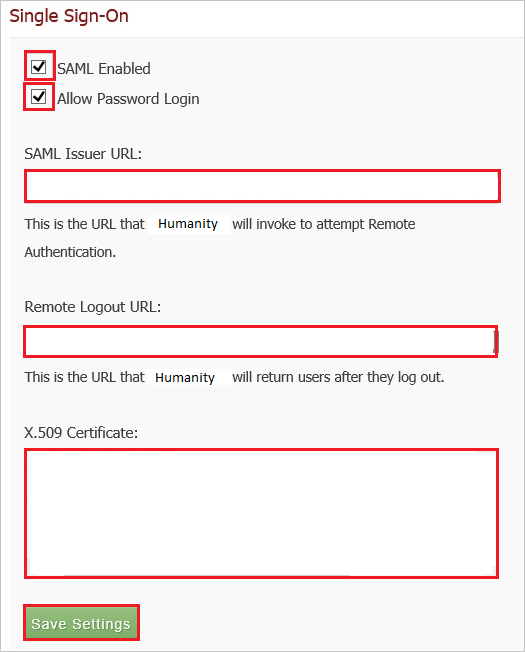

# Tutorial: Microsoft Entra SSO integration with Humanity

In this tutorial, you'll learn how to integrate Humanity with Microsoft Entra ID. When you integrate Humanity with Microsoft Entra ID, you can:

* Control in Microsoft Entra ID who has access to Humanity.
* Enable your users to be automatically signed-in to Humanity with their Microsoft Entra accounts.
* Manage your accounts in one central location.

## Prerequisites

To get started, you need the following items:

* A Microsoft Entra subscription. If you don't have a subscription, you can get a [free account](https://azure.microsoft.com/free/).
* Humanity single sign-on (SSO) enabled subscription.

## Scenario description

In this tutorial, you configure and test Microsoft Entra single sign-on in a test environment.

* Humanity supports **SP** initiated SSO.

> [!NOTE]
> Identifier of this application is a fixed string value so only one instance can be configured in one tenant.

## Add Humanity from the gallery

To configure the integration of Humanity into Microsoft Entra ID, you need to add Humanity from the gallery to your list of managed SaaS apps.

1. Sign in to the [Microsoft Entra admin center](https://entra.microsoft.com) as at least a [Cloud Application Administrator](../roles/permissions-reference.md#cloud-application-administrator).
1. Browse to **Identity** > **Applications** > **Enterprise applications** > **New application**.
1. In the **Add from the gallery** section, type **Humanity** in the search box.
1. Select **Humanity** from results panel and then add the app. Wait a few seconds while the app is added to your tenant.

 Alternatively, you can also use the [Enterprise App Configuration Wizard](https://portal.office.com/AdminPortal/home?Q=Docs#/azureadappintegration). In this wizard, you can add an application to your tenant, add users/groups to the app, assign roles, as well as walk through the SSO configuration as well. [Learn more about Microsoft 365 wizards.](/microsoft-365/admin/misc/azure-ad-setup-guides)

## Configure and test Microsoft Entra SSO for Humanity

Configure and test Microsoft Entra SSO with Humanity using a test user called **B.Simon**. For SSO to work, you need to establish a link relationship between a Microsoft Entra user and the related user in Humanity.

To configure and test Microsoft Entra SSO with Humanity, perform the following steps:

1. **[Configure Microsoft Entra SSO](#configure-azure-ad-sso)** - to enable your users to use this feature.
    1. **[Create a Microsoft Entra test user](#create-an-azure-ad-test-user)** - to test Microsoft Entra single sign-on with B.Simon.
    1. **[Assign the Microsoft Entra test user](#assign-the-azure-ad-test-user)** - to enable B.Simon to use Microsoft Entra single sign-on.
1. **[Configure Humanity SSO](#configure-humanity-sso)** - to configure the single sign-on settings on application side.
    1. **[Create Humanity test user](#create-humanity-test-user)** - to have a counterpart of B.Simon in Humanity that is linked to the Microsoft Entra representation of user.
1. **[Test SSO](#test-sso)** - to verify whether the configuration works.

## Configure Microsoft Entra SSO

Follow these steps to enable Microsoft Entra SSO.

1. Sign in to the [Microsoft Entra admin center](https://entra.microsoft.com) as at least a [Cloud Application Administrator](../roles/permissions-reference.md#cloud-application-administrator).
1. Browse to **Identity** > **Applications** > **Enterprise applications** > **Humanity** > **Single sign-on**.
1. On the **Select a single sign-on method** page, select **SAML**.
1. On the **Set up single sign-on with SAML** page, click the pencil icon for **Basic SAML Configuration** to edit the settings.

   

1. On the **Basic SAML Configuration** section, perform the following steps:

    a. In the **Identifier (Entity ID)** text box, type the URL: 
    `https://company.humanity.com/app/`

	b. In the **Sign on URL** text box, type the URL:
    `https://company.humanity.com/includes/saml/`

	> [!NOTE]
	> These values are not real. Update these values with the actual Identifier and Sign on URL. Contact [Humanity Client support team](https://www.humanity.com/contact) to get these values. You can also refer to the patterns shown in the **Basic SAML Configuration** section.

4. On the **Set up Single Sign-On with SAML** page, in the **SAML Signing Certificate** section, click **Download** to download the **Certificate (Base64)** from the given options as per your requirement and save it on your computer.

	

1. On the **Set up Humanity** section, copy the appropriate URL(s) as per your requirement.

	

### Create a Microsoft Entra test user

In this section, you'll create a test user called B.Simon.

1. Sign in to the [Microsoft Entra admin center](https://entra.microsoft.com) as at least a [User Administrator](../roles/permissions-reference.md#user-administrator).
1. Browse to **Identity** > **Users** > **All users**.
1. Select **New user** > **Create new user**, at the top of the screen.
1. In the **User** properties, follow these steps:
   1. In the **Display name** field, enter `B.Simon`.  
   1. In the **User principal name** field, enter the username@companydomain.extension. For example, `B.Simon@contoso.com`.
   1. Select the **Show password** check box, and then write down the value that's displayed in the **Password** box.
   1. Select **Review + create**.
1. Select **Create**.

### Assign the Microsoft Entra test user

In this section, you'll enable B.Simon to use single sign-on by granting access to Humanity.

1. Sign in to the [Microsoft Entra admin center](https://entra.microsoft.com) as at least a [Cloud Application Administrator](../roles/permissions-reference.md#cloud-application-administrator).
1. Browse to **Identity** > **Applications** > **Enterprise applications** > **Humanity**.
1. In the app's overview page, select **Users and groups**.
1. Select **Add user/group**, then select **Users and groups** in the **Add Assignment** dialog.
   1. In the **Users and groups** dialog, select **B.Simon** from the Users list, then click the **Select** button at the bottom of the screen.
   1. If you are expecting a role to be assigned to the users, you can select it from the **Select a role** dropdown. If no role has been set up for this app, you see "Default Access" role selected.
   1. In the **Add Assignment** dialog, click the **Assign** button.

## Configure Humanity SSO

1. In a different web browser window, log in to your **Humanity** company site as an administrator.

2. In the menu on the top, click **Admin**.

    

3. Under **Integration**, click **Single Sign-On**.

    

4. In the **Single Sign-On** section, perform the following steps:

    

    a. Select **SAML Enabled**.

    b. Select **Allow Password Login**.

    c. In the **SAML Issuer URL** textbox, paste the **Login URL** value.

    d. In the **Remote Logout URL** textbox, paste the **Logout URL** value.

    e. Open your base-64 encoded certificate in notepad, copy the content of it into your clipboard, and then paste it to the **X.509 Certificate** textbox.

    f. Click **Save Settings**.

### Create Humanity test user

In order to enable Microsoft Entra users to log in to Humanity, they must be provisioned into Humanity. In the case of Humanity, provisioning is a manual task.

**To provision a user account, perform the following steps:**

1. Log in to your **Humanity** company site as an administrator.

2. Click **Admin**.

    

3. Click **Staff**.

    

4. Under **Actions**, click **Add Employees**.

    

5. In the **Add Employees** section, perform the following steps:

    

    a. Type the **First Name**, **Last Name**, and **Email** of a valid Microsoft Entra account you want to provision into the related textboxes.

    b. Click **Save Employees**.

> [!NOTE]
> You can use any other Humanity user account creation tools or APIs provided by Humanity to provision Microsoft Entra user accounts.

## Test SSO

In this section, you test your Microsoft Entra single sign-on configuration with following options. 

* Click on **Test this application**, this will redirect to Humanity Sign-on URL where you can initiate the login flow. 

* Go to Humanity Sign-on URL directly and initiate the login flow from there.

* You can use Microsoft My Apps. When you click the Humanity tile in the My Apps, this will redirect to Humanity Sign-on URL. For more information, see [Microsoft Entra My Apps](/azure/active-directory/manage-apps/end-user-experiences#azure-ad-my-apps).

## Next steps

Once you configure Humanity you can enforce session control, which protects exfiltration and infiltration of your organization’s sensitive data in real time. Session control extends from Conditional Access. [Learn how to enforce session control with Microsoft Defender for Cloud Apps](/cloud-app-security/proxy-deployment-aad).
